最近写了一个很适合练习Linux文件系统和Linux I/O的项目，可以稍做参考：

::github{repo="Furry-Monster/kilokilo"}

暂时只完成了文件预览部分，后面会把文件编辑部分也整出来。

今天我们回头看当初Unix的设计哲学：**一切都是文件**，都可以用 “打开open –> 读写write/read –> 关闭close” 模式来操作，真的是一个很了不起的决策，历久弥新！

## 文件系统抽象

Linux 最经典的一句话是：一切皆文件。

不仅普通的文件和目录，就连块设备、管道、socket 等，也都是统一交给文件系统管理的。

文件系统是一种在存储设备（如硬盘、固态硬盘或闪存）上**组织文件和目录的方式**。有许多类型的**文件系统**（例如FAT、ext4、btrfs、ntfs），在单个运行的系统上，我们可以同时使用同一种文件系统的多个实例。

尽管不同文件系统用来组织存储设备上的文件、目录、用户数据和元数据（内部数据）的数据结构不一致，但几乎所有文件系统都使用了一些常见的抽象：

* 超级块（superblock）
* 文件（file）
* 索引节点（inode）
* 目录项（dentry）

其中一些抽象同时存在于磁盘和内存中，而另一些只存在于内存中。

*超级块* 抽象包含有关文件系统实例的信息，如块大小、根索引节点、文件系统大小。它既存在于存储中，也存在于内存中（用于缓存目的）。

*文件* 抽象包含有关已打开文件的信息，如指向当前文件的指针。它只存在于内存中。

*索引节点* 用于标识磁盘上的文件。它既存在于存储中，也存在于内存中（用于缓存目的）。每个索引节点全系统唯一，用于标识文件，并具有各种属性，如文件大小、访问权限、文件类型等。

*目录项* 将名称与索引节点关联起来。它既存在于存储中，也存在于内存中（用于缓存目的）。

下图显示了各种文件系统抽象在内存中的关系：

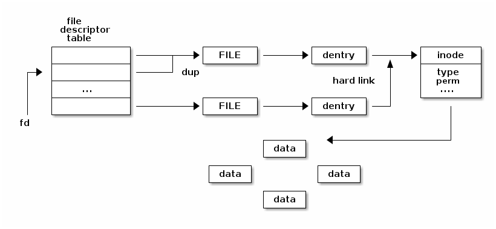

并非所有抽象之间的一对多关系都在图示中表示出来。多个文件描述符可以指向同一个  *file* ，因为我们可以使用 `dup()` 系统调用来复制文件描述符。

如果我们多次打开相同的路径，多个 *file* 抽象可以指向同一个  *dentry* 。如果使用硬链接的话，多个 *dentry* 可以指向同一个  *inode* 。

下图显示了存储中文件系统抽象之间的关系：

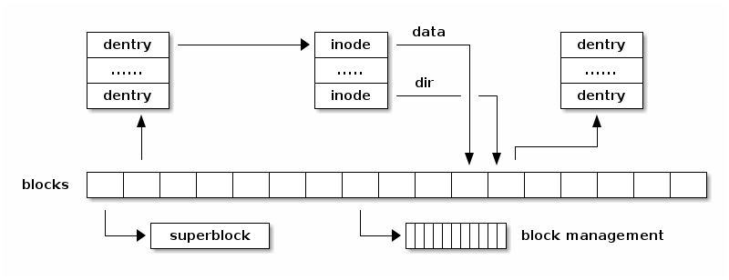

该图示显示, *超级块* 通常存储在文件系统的开头，各种块用于不同的目的：一些用于存储  *dentry* ，一些用于存储  *inode* ，还有一些用于存储用户数据块。还有用于管理可用空闲块的块（例如简单文件系统的位图）。

下图显示了一个非常简单的文件系统，其中块按功能分组：

* 超级块包含有关块大小以及 IMAP、DMAP、IZONE 和 DZONE 区域的信息。
* IMAP 区域由多个块组成，其中包含用于 inode 分配的位图；它维护 IZONE 区域中所有 inode 的已分配/空闲状态。
* DMAP 区域由多个块组成，其中包含用于数据块的位图；它维护 DZONE 区域中所有块的已分配/空闲状态。


### superblock

superblock 由 `super_block` 结构体存储，所有的 superblock 都通过一个双向链表链接在一起，这个链表的头是 `super_blocks` 。通过 `sget` 或者 `sget_fc` 向这个链表中添加 superblock。

对于 superblock 的方法存放在 `super_operations` 数据结构中。这其中包含了对这种文件类型的各种的基础操作，比如 `write_inode` & `read_inode`。`s_dirt` 标志用于指示 superblock 是否与磁盘中的 superblock 一致，如果不一致，则需要进行同步。

### inode

文件系统中用于操作文件的所有信息都存储在 inode 这样一个数据结构中。对于一个文件而言，它的文件名只是一个标签，是可以改变的，但是 inode 是不变的，**它对应着一个真正的文件**。inode 中的 `i_state` 用于指示当前 inode 的状态，有下面一些比较常见的标志：

* I_DIRTY：与磁盘中的内容不一致，需要同步
* I_LOCK：在进行 IO 操作
* I_FREEING：这个 inode 已经被 free 了
* I_CLEAR：inode 中的内容已经没有意义了
* I_NEW：这个 inode 是新建的，里面还没有与磁盘中的数据进行同步

每个 inode 会被链接进下面三个链表中（通过 inode 中的 i_list 进行链接）：

* unused inodes：i_count 为0，也就是没有被引用，并且它是 no dirty 的。链表头是 `inode_unused`
* in-use inodes：i_count > 0 并且是 no dirty 的，链表头是 `inode_in_use`
* dirty inodes：链表头是 superblock 中的 `s_dirty`

同时，属于同一个文件系统的 inode 会通过 `i_sb_list` 字段链接到一个链表中，这个链表的头存放在 superblock 中 `s_inodes` 字段。为了加快查找速度，inode 存放在一个 `inode_hashtable` 的 hash 表中，其中的 `i_hash` 则用于 hash 查找冲突时的链表。inode 的方法则存放在 `inode_operations` 结构数据中。

### file

file 是用于**进程与文件之间进行交互**的一个数据结构，它是一个纯软件的对象，没有关联的磁盘内容，所以它没有 dirty 的概念。

file 中最重要的内容是**文件指针**，也就是当前文件的操作位置。同一个文件可能被不同的进程打开，它们都是对同一个 inode 进行操作，不过由于文件指针的不同，它们操作的位置也就不一样。file 结构体通过一个 `flip` 的 slab cache 进行分配。所以 file 的数目存在一个限制，它通过 `files_stat` 中 `max_files` 指示最大的可分配的 file 的数量。in-use file 被链接在属于各自文件系统的 superblock 中，链表的头是 `s_files` 。`f_count` 字段则记录着文件被引用的计数。

VFS 在操作文件时候，类似面向对象中多态概念，不同的文件系统会关联不同的 file operations 。这样 VFS 统一的文件操作接口存放在 file 中的 `f_op` 中。当打开一个文件的时候，VFS 会根据 inode 中的 `i_fop` 对 f_op 进行初始化，而在之后的操作中，VFS 可能会更改 f_op 中的值，也就是改变文件操作的行为。

### dentry

在 VFS 的统一文件模型中，**目录也是被当作文件的**，它有着对应的 inode 。每当一个目录项被读入内存的时候，就会通过一个 dentry 的结构数据存放，它通过 `dentry_cache` 的 slab cache 进行分配。

每个 dentry 可能存在下面4种状态：

* free：VFS没有在使用，只是一个空的空间
* unused：d_count = 0，不过里面的数据还是有效的，这样的 dentry 会按顺序被回收
* in-use：d_count > 0，数据有效，正在被系统所使用
* negative：d_count > 0，d_inode = NULL，也就是这个 dentry 没有关联的 inode，不过它依旧在路径查找中被使用

unused dentry 会被链接到一个 LRU 链表中，当 dentry cache 需要 shrink 的时候，就会从这个链表的尾部回收空间。这个 LRU 链表的头是 `dentry_unused` ，通过 dentry 中的 d_lru 字段进行链接。in-use dentry 则会被链接到 inode 中的 `i_dentry` 链表，这是因为同一个 inode 可能存在好几个硬链接。同时为了加快目录的查找，dentry 也会被加入到名为 `dentry_hashtable` 的 hash 表中。

每一个进程，都有一个 `fs_struct` 结构数据，用于存放 root 目录、当前目录等文件相关的信息。还有一个 `file_struct` 的数据结构用于存放进程打开的文件相关信息。`file_struct` 中的 fd 字段是一个指向当前进程打开的文件的一个数组，这个数据的大小由 `max_fds` 字段指示。这个数组的默认大小是 32，如果打开的文件多于这个数，那么就会重新开辟一个大的数组进行扩展。我们在用户态的文件描述符就是这个数组的序号，通常0号文件是标准输入，1号文件是标准输出，2号文件是错误输出。通过 `dup()`、`fcnt()` 这样的系统调用，我们可以让这个数组不同的序号指向同一个文件。一个进程能打开的文件数是有限制的，在运行过程中，这个最大值由 `signal->rlim[RLIMIT_NOFILE]` 指示，它可以在运行时动态的修改，默认值是 1024。而在代码中，`NR_OPEN` 这个宏指示着进程所能支持的最大的文件打开数。在 `file_struct` 中 `open_fds` 是一个用来标志打开文件序号的数组，这个数组中的每个 bit 表示对应序号的文件是否被打开，`max_fdset` 指示着这个数组的长度，它的默认值是 1024 个 bit。如果打开的文件数超过这个值，那么就需要动态扩展这个数组的大小。

内核中通过 `fget` 函数来引用文件，它将返回 `current->files->fd[fd]`，同时增加 `f_count `的计数，释放文件则通过 `fput` 函数，它将减少 `f_count` 计数，如果减少到0，内核将调用 `release` 方法做真正的释放动作。

### 结构总览

数据块的位图是放在磁盘块里的，假设是放在一个块里，一个块 4K，每位表示一个数据块，共可以表示 4 * 1024 * 8 = 2^15 个空闲块，由于 1 个数据块是 4K 大小，那么最大可以表示的空间为 2^15 * 4 * 1024 = 2^27 个 byte，也就是 128M。 

也就是说按照上面的结构，如果采用**一个块的位图 + 一系列的块**，外加**一个块的 inode 的位图 + 一系列的 inode 的结构**能表示的最大空间也就 128M，这太少了，现在很多文件都比这个大。

在 Linux 文件系统，把这个结构称为一个**块组**，那么有 N 多的块组，就能够表示 N 大的文件。 

下图给出了 Linux Ext2 整个文件系统的结构和块组的内容，文件系统都由大量块组组成，在硬盘上相继排布：

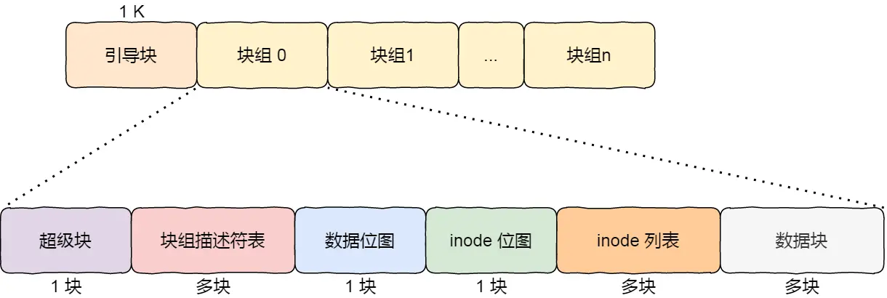

最前面的第一个块是引导块，在系统启动时用于启用引导，接着后面就是一个一个连续的块组了。

你可以发现每个块组里有很多**重复的信息**，比如超级块和块组描述符表，这两个都是全局信息，而且非常的重要，这么做是有两个原因：

- 如果系统崩溃破坏了超级块或块组描述符，有关文件系统结构和内容的所有信息都会丢失。如果有冗余的副本，该信息是可能恢复的。

- 通过使文件和管理数据尽可能接近，减少了磁头寻道和旋转，这可以提高文件系统的性能。

不过，Ext2 的后续版本采用了**稀疏技术**。也就是，超级块和块组描述符表不再存储到文件系统的每个块组中，而是只写入到块组 0、块组 1 和其他 ID 可以表示为 3、 5、7 的幂的块组中。

## 文件系统操作

下图显示了文件系统驱动程序与文件系统“堆栈”的其他部分之间交互的高级概述。为了支持多种文件系统类型和实例，Linux 实现了一个庞大而复杂的子系统来处理文件系统管理。这被称为**虚拟文件系统**（有时也称为虚拟文件切换），英文简称为 **VFS**。

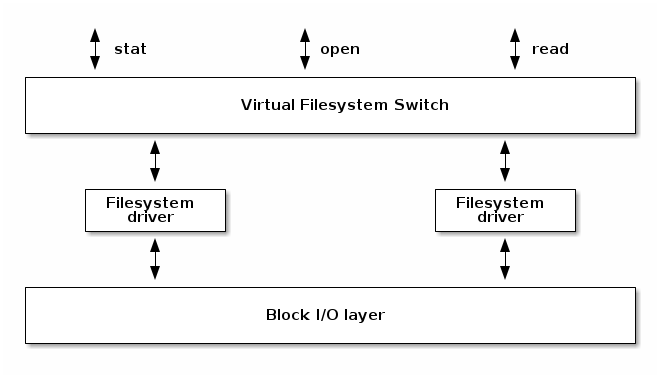

VFS 将与复杂的文件管理相关的系统调用转换为由设备驱动程序实现的简化操作。文件系统必须实现以下一些操作：

* 挂载
* 打开文件
* 查询文件属性
* 从文件读取数据
* 将数据写入文件
* 创建文件
* 删除文件

## Linux虚拟文件系统

Linux 采用 **Virtual Filesystem**（VFS）的概念，通过内核在物理存储介质上的文件系统和用户之间建立起一个虚拟文件系统的软件抽象层，使得 Linux 能够支持目前绝大多数的文件系统，不论它是 windows、unix 还是其他一些系统的文件系统，都可以挂载在 Linux 上供用户使用。

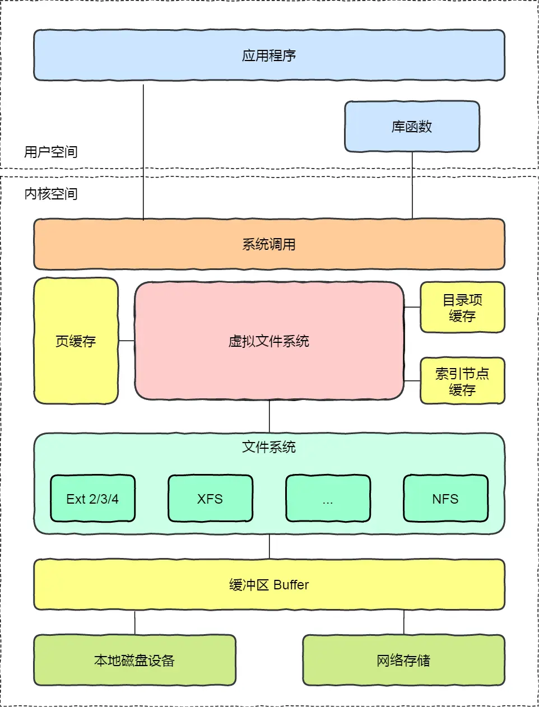

VFS 在 Linux 中是一个处理所有 unix 文件系统调用的软件层，同时给不同类型的文件系统提供一个统一的接口。VFS 支持以下归类的三种类型的文件系统：

* **磁盘文件系统**，存储在本地磁盘、U盘、CD等的文件系统，它包含各种不同的文件系统格式，比如 windows NTFS、VFAT，BSD 的 UFS，CD的 CD-ROM 等
* **网络文件系统**，它们存储在网络中的其他主机上，通过网络进行访问，例如 NFS
* **特殊文件系统**，例如 /proc、sysfs 等

VFS 背后的思想就是建立一个**通用的文件模型**，使得它能兼容所有的文件系统，这个通用的文件模型是以 Linux 的文件系统 **EXT** 系列为模版构建的。

**每个特定的文件系统都需要将它物理结构转换为通用文件模型**。例如，通用文件模型中，所有的目录都是文件，它包含文件和目录；而在其他的文件类型中，比如 FAT，它的目录就不属于文件，这时，内核就会在内存中生成这样的目录文件，以满足通用文件模型的要求。同时，VFS 在处理实际的文件操作时，通过指针指向特定文件的操作函数。可以认为通用文件模型是面向对象的设计，它实现了几个文件通用模型的对象定义，而具体的文件系统就是对这些对象的实例化。通用文件模型包含下面几个对象：

* **superblock** 存储挂载的文件系统的相关信息
* **inode** 存储一个特定文件的相关信息
* **file** 存储进程中一个打开的文件的交互相关的信息
* **dentry** 存储目录和文件的链接信息

这几个通用文件模型中的对象之间的关系如下图所示：

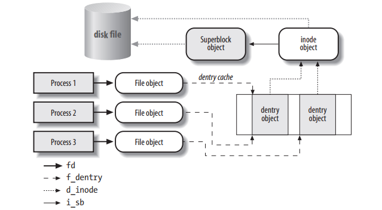

VFS 除了提供一个统一文件系统接口，它还提供了名为 **dentry cache** 的磁盘缓存，用于加速文件路径的查找过程。磁盘缓存将磁盘中文件系统的一些数据存放在系统内存中，这样每次访问这样的数据就不需要操作实际的物理磁盘，可以大大提高访问性能。

这些内容我们在第一部分已经介绍过了。

### 文件系统类型

相对于以网络和磁盘为载体的文件系统，特殊文件系统是一些数据的集合，利用了 VFS 的接口，方便内核或者用户的使用。**常见的特殊文件系统有：rootfs、proc、sysfs、pipefs、tmpfs等**。这些特殊的文件系统**没有物理载体**，不过内核中把它们都统一分配一个虚拟的块设备（编号为0）。这些特殊的文件系统通过调用 `set_anon_super` 函数来初始化 superblock。

file_system_type 是用于存放注册到内核的文件系统类型的信息的数据结构，所有的 file_system_type 链接在一个单向链表中，表头是 `file_systems` 。字段 `fs_supers` 则是这个文件类型下所有的 superblock 的链表。`get_sb` & `kill_sb` 则是用于构建和销毁 superblock 的方法。

文件系统通过调用 `register_filesystem` & `unregister_filessytem` 函数实现文件系统在内核的注册和注销。

rootfs 文件系统是内核在启动阶段注册的，它包含了文件系统初始化的脚本以及一些重要的系统程序。其他的文件系统则可以通过脚本或者命令 mount 到系统的目录节点中。

### namespaces

通常的 unix 系统中，只有**一颗文件系统树**，都是从 **rootfs** 这个根开始，进程通过在这个文件树中特定的路径名访问文件。而在 Linux 中，引入了 namespace 的概念，也就是**每一个进程都可以有自己的一个文件系统树**。通常进程都是共享系统中的 rootfs（也就是 init 进程的 namespace ）。不过如果在 `clone()` 系统调用的时候，设置了 `CLONE_NEWNS` 标志，那么这个进程就会创建一个新的 namespace，通过 `pivot_root()` 系统调用可以修改进程的 namespace。不同 namespace 之间的文件系统 mount & unmount 互不影响。

进程中的文件系统 namespace 信息通过一个 namespace 数据结构进行存储。list 字段是一个链接了所有属于这个 namespace 的文件系统的链表，而 root 字段则是表示这个 namespace 的根文件系统。

在 Linux 中，文件系统的 mount 具有以下一些特性：

* 同一个文件系统可以被多次 mount 到不同的路径点，这样同一个文件系统可以通过不同的路径进行访问，不过代表这个文件系统的 superblock 只会有一个
* mount 的文件系统下的路径可以 mount 其他的文件系统，以此类推，可以形成一个 mount 的等级图
* 同一个路径点，可以被栈式地进行 mount，新的文件系统被 mount 后就会覆盖老的文件系统的路径，而 unmount 之后，路径又会恢复之前一个的文件系统

用于存储这些 mount 的关系信息的数据结构叫做 `vfsmount` ，vfsmount 数据被链接在下面这些链表中：

* 所有的 vfsmount 加入到 `mount_hashtable` hash表中
* 对于每一个 namespace ，通过一个环形链表，链接属于自己的 vfsmount
* 对于每一个文件系统，通过一个环形链表，链接 mount 到自己路径下的子文件系统 vfsmount

### mount 根文件系统

根文件系统的 mount 过程分为2个阶段：

* 内核 mount 一个特殊的文件系统——**rootfs**，它提供了一个空的路径作为初始的挂载点
* 内核 mount 实际的文件系统系统，覆盖之前的空路径

内核之所以搞一个 rootfs 这样一个特殊的文件系统，而不是直接使用实际的文件系统作为根文件系统，其原因是为了方便在系统运行时更换根文件系统。目前用于启动的 Ramdisk 就是这样一个例子，在系统起来后，先加载一个包含最小驱动文件和启动脚本的 Ramdisk 文件系统作为根文件系统，然后将系统中其他的设备加载起来后，再选择一个完整的文件系统替换这个最小系统。

### 文件路径查找

文件路径查找的简单过程：文件路径通过 `/` 划分为一个个的目录项，查找到匹配的目录，然后读取它的 inode ，寻找到符合下一级路径的目录，如此循环，知道最后。dentry cache 的机制可以加快对于目录项的访问速度。然而Linux中下面的这些特性，让这个循环查找的过程变得非常复杂：

* 每一级路径需要匹配用户的访问权限
* 一个文件名可能是任意一个路径的软链接
* 软链接可能存在循环引用的情况，需要发现并打破这样的无限循环
* 一个路径名可以是另一个文件系统的挂载点
* 路径名需要在进程的 namespace 中查找，不能超出这个范围

文件路径的查找通过函数 `path_lookup` 实现，具体的代码过程待续……

### 文件锁

当一个文件可以被**多个进程同时访问**的时候，同步的问题就产生了。POSIX 标准是要求通过 `fcntl()`系统调用实现一个文件锁的机制，这样就能避免竞争关系。这个文件锁可以对整个文件或者文件中的某个区域（小到一个字节）进行锁定，由于可以锁文件的部分内容，所以一个进程可以同时获取同一个文件的多个锁。

POSIX 标准的这种文件锁被称之为 **advisory lock**，就跟用于同步的信号量一样，只有双方约定在访问临界区的时候都先查看一下锁的状态，这种同步机制才能实现，如果某个进程单方面不获取锁的状态就直接操作临界区，那么这个锁是管不住的。与劝告锁相对的就是强制锁。

在 Linux 中可以通过 `fcntl()` & `flock()` 系统调用对文件进行上锁。通常在类 unix 系统中，`flock() `系统调用会无视 MS_MANDLOCK 的挂载标志，只产生劝告锁。

Linux 对于劝告锁和强制锁都有实现。一个进程获取劝告锁的方式有2种：

* 通过 `flock()` 系统调用，这个锁只能对整个文件上锁
* 通过 `fcntl()` 系统调用，可以文件的特定部分进行上锁

一个进程获取强制锁比较麻烦，需要下面几个步骤：

* mount 文件系统的时候，添加强制锁的标志 MS_MANDLOCK，也就是 mount 命令添加 `-o` 选项。mount 的默认情况下是不带这个标志的
* 使能 Set-Group-ID，清除 Group-Execute-Bit ，`chmod g+s,g-x xxx.file`
* 使用 `fcntl()` 系统调用，获得强制锁

`fcntl()` 系统调用还支持一种名为 lease 的强制锁，A进程在访问被B进程上锁的文件时，A进程会被阻塞，同时B进程会收到一个信号，此时B进程应该尽快处理完并主动释放文件锁。如果在一定时间内（/proc/sys/fs/lease-break-time中配置，通常是45s）B进程还没有释放这个锁，那么这个锁就会被内核自动释放掉，此时A进程就能继续访问这个文件了。

`fcntl()` 是 POSIX 标准的用于文件锁的系统调用，而  `flock()` 是许多其他类 unix 系统中实现的系统调用，Linux 对这2者都支持。它们的锁也是互不影响的，也就是通过 `fcntl()` 上的锁对 `flock()`是无效的，反之亦然，之所以这样，是为了防止不同的用户程序使用不同的接口，会导致死锁的情况发生。

由于强制锁会带来一些程序兼容性的问题，所以一般不鼓励使用强制锁，并且 Linux 中的强制锁还存在一些 bug，会导致无法真正地实现全面的强制锁，同时从 4.5版本开始，强制锁已经变成一个可配置的选项，在后面的内核版本中将会移除这个特性。（详情请看man [fcntl 页面](http://man7.org/linux/man-pages/man2/fcntl.2.html#Leases)）

## 文件的存储方式

文件的数据是要存储在硬盘上面的，数据在磁盘上的存放方式，就像程序在内存中存放的方式那样，有以下两种：

- 连续空间存放方式
- 非连续空间存放方式

其中，非连续空间存放方式又可以分为「链表方式」和「索引方式」。

### 连续空间存放方式

连续空间存放方式顾名思义，文件存放在磁盘「连续的」物理空间中。这种模式下，文件的数据都是紧密相连，读写效率很高，因为一次磁盘寻道就可以读出整个文件。 

使用连续存放的方式有一个前提，必须先知道一个文件的大小，这样文件系统才会根据文件的大小在磁盘上找到一块连续的空间分配给文件。 

所以，文件头里需要指定「起始块的位置」和「长度」，有了这两个信息就可以很好的表示文件存放方式是一块连续的磁盘空间。 注意，此处说的文件头，就类似于 Linux 的 inode。

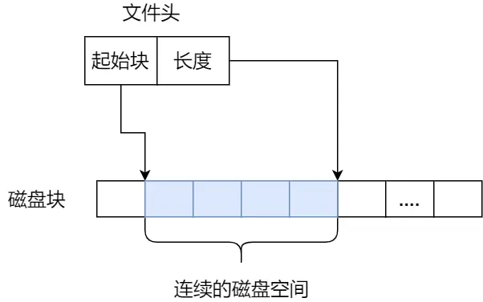

连续空间存放的方式虽然读写效率高，但是有「磁盘空间碎片」和「文件长度不易扩展」的缺陷。

一方面，在删除文件后，磁盘上很容易出现类似内存空间碎片的磁盘碎片。另外一方面，如果文件 A 要想扩大一下，需要更多的磁盘空间，唯一的办法就只能是挪动的方式，刷过Leetcode题的同学应该都知道对连续空间插入数据有多麻烦。

### 非连续空间存放方式

非连续空间存放方式分为「链表方式」和「索引方式」。

#### 链表方式

链表的方式存放是离散的，于是就可以**消除磁盘碎片**，可大大提高磁盘空间的利用率，同时**文件的长度可以动态扩展。**根据实现的方式的不同，链表可分为**隐式链表**和**显式链接**两种形式。

文件要以「隐式链表」的方式存放的话，实现的方式是文件头要包含「第一块」和「最后一块」的位置，并且每个数据块里面**留出一个指针空间**，用来存放下一个数据块的位置，这样一个数据块连着一个数据块，从链头开始就可以顺着指针找到所有的数据块，所以存放的方式可以是不连续的。

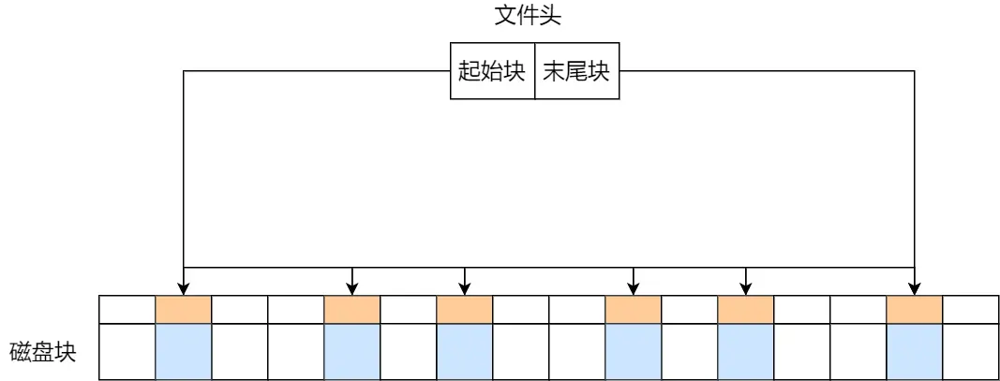

隐式链表的存放方式的缺点在于**无法直接访问数据块**，只能通过指针顺序访问文件，以及数据块指针消耗了一定的存储空间。隐式链接分配的**稳定性较差**，系统在运行过程中由于软件或者硬件错误导致链表中的指针丢失或损坏，会导致文件数据的丢失。 

如果取出每个磁盘块的指针，把它放在内存的一个表中，就可以解决上述隐式链表的两个不足。那么，这种实现方式是「显式链接」，它指把用于链接文件各数据块的指针，显式地存放在内存的一张链接表中，该表在整个磁盘仅设置一张，**每个表项中存放链接指针，指向下一个数据块号**。

对于显式链接的工作方式，我们举个例子，文件 A 依次使用了磁盘块 4、7、2、10 和 12 ，文件 B 依次使用了磁盘块 6、3、11 和 14 。利用下图中的表，可以从第 4 块开始，顺着链走到最后，找到文件 A 的全部磁盘块。同样，从第 6 块开始，顺着链走到最后，也能够找出文件 B 的全部磁盘块。最后，这两个链都以一个不属于有效磁盘编号的特殊标记（如 -1 ）结束。内存中的这样一个表格称为**文件分配表**（File Allocation Table，FAT）。

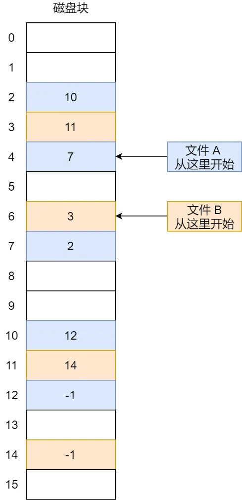

#### 索引方式

索引的实现是为每个文件创建一个「**索引数据块**」，里面存放的是指向文件数据块的指针列表，说白了就像书的目录一样，要找哪个章节的内容，看目录查就可以。 

另外，文件头需要包含指向「索引数据块」的指针，这样就可以通过文件头知道索引数据块的位置，再通过索引数据块里的索引信息找到对应的数据块。 

创建文件时，索引块的所有指针都设为空。当首次写入第 i 块时，先从空闲空间中取得一个块，再将其地址写到索引块的第 i 个条目。

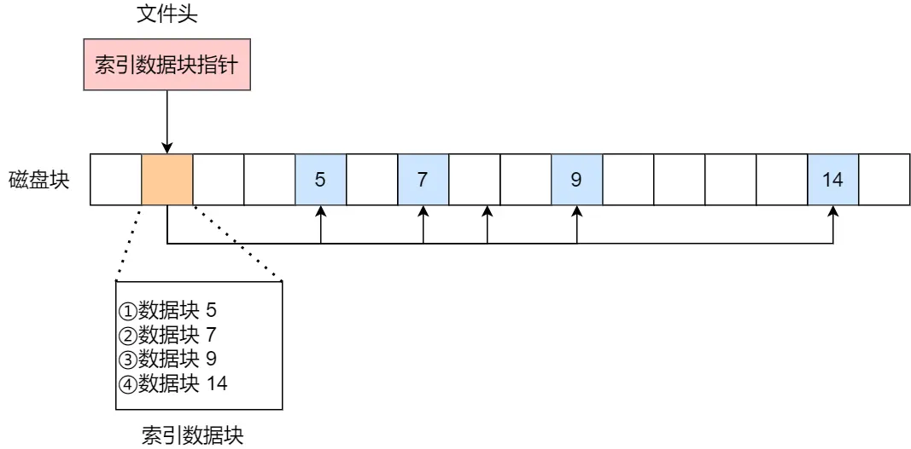

索引的方式优点在于： 

- 文件的创建、增大、缩小很方便；

- 不会有碎片的问题；

- 支持顺序读写和随机读写；

由于索引数据也是存放在磁盘块的，如果文件很小，明明只需一块就可以存放的下，但还是需要额外分配一块来存放索引数据，所以缺陷之一就是存储索引带来的开销。 

如果文件很大，大到一个索引数据块放不下索引信息，这时又要如何处理大文件的存放呢？我们可以通过组合的方式，来处理大文件的存。 

先来看看链表 + 索引的组合，这种组合称为「**链式索引块**」，它的实现方式是在索引数据块留出一个存放下一个索引数据块的指针，于是**当一个索引数据块的索引信息用完了，就可以通过指针的方式，找到下一个索引数据块的信息**。那这种方式也会出现前面提到的链表方式的问题，**万一某个指针损坏了，后面的数据也就会无法读取了**。

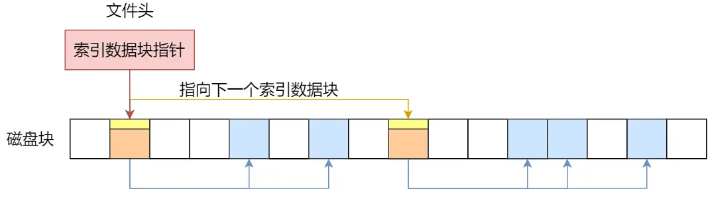

还有另外一种组合方式是索引 + 索引的方式，这种组合称为「**多级索引块**」，实现方式是**通过一个索引块来存放多个索引数据块**

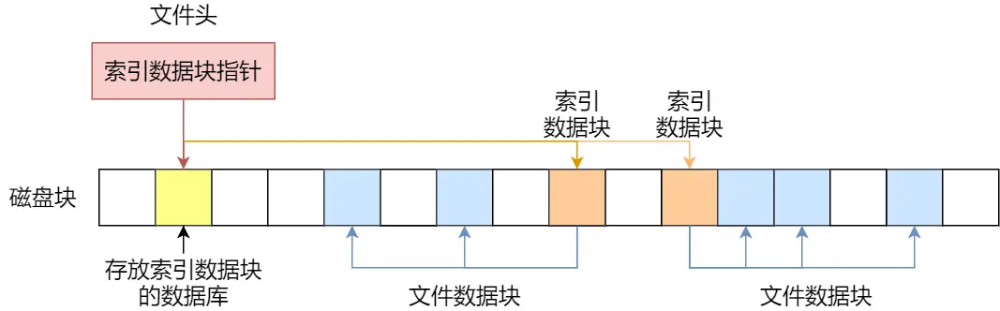

### Unix 文件的实现方式

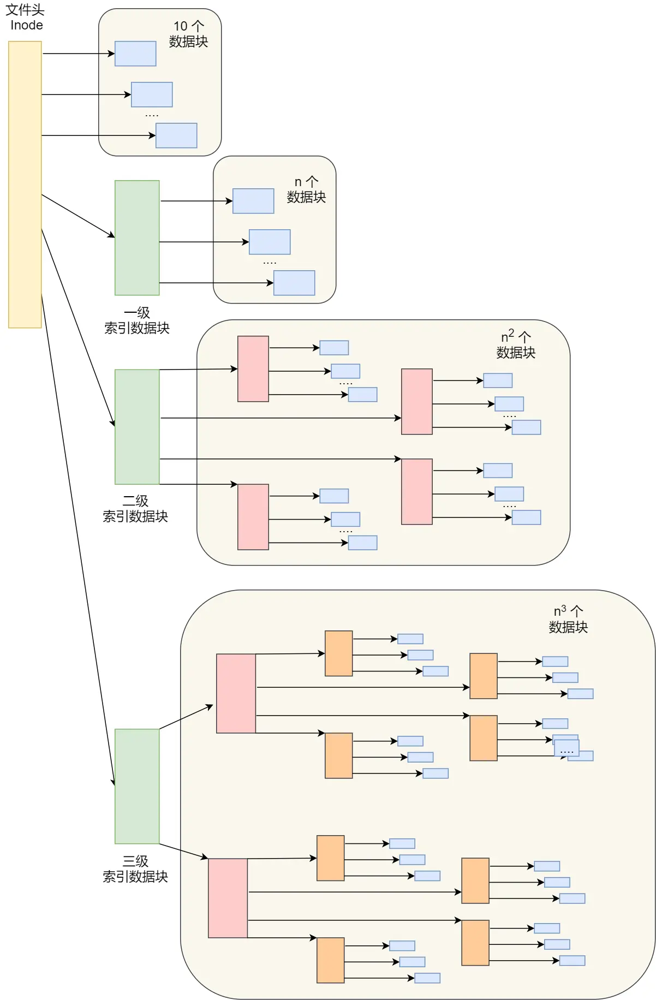

这种方式能很灵活地支持小文件和大文件的存放： 

- 对于小文件使用直接查找的方式可减少索引数据块的开销；

- 对于大文件则以多级索引的方式来支持，所以大文件在访问数据块时需要大量查询；

这个方案就用在了 Linux Ext 2/3 文件系统里，虽然解决大文件的存储，但是对于大文件的访问，需要大量的查询，效率比较低。

## 空闲空间管理

前面说到的文件的存储是针对已经被占用的数据块组织和管理，接下来的问题是，如果我要保存一个数据块，我应该放在硬盘上的哪个位置呢？针对磁盘的空闲空间也是要引入管理的机制，接下来介绍几种常见的方法：

* 空闲表法
* 空闲链表法
* 位图法

### 空闲表法

空闲表法就是为所有空闲空间建立一张表，表内容包括空闲区的第一个块号和该空闲区的块个数，注意，这个方式是连续分配的。如下图：

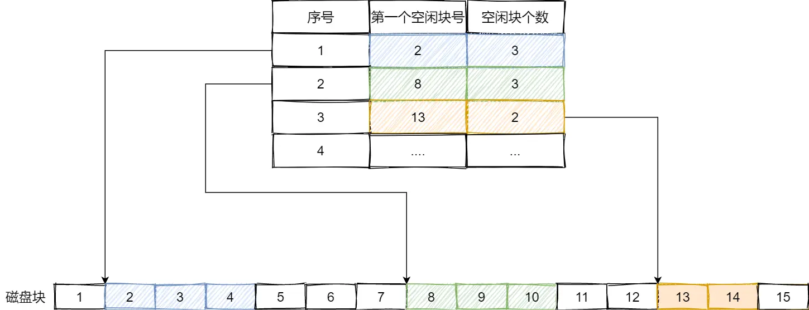

当请求分配磁盘空间时，系统依次扫描空闲表里的内容，直到找到一个合适的空闲区域为止。当用户撤销一个文件时，系统回收文件空间。这时，也需顺序扫描空闲表，寻找一个空闲表条目并将释放空间的第一个物理块号及它占用的块数填到这个条目中。

这种方法**仅当有少量的空闲区时**才有较好的效果。因为，如果存储空间中有着大量的小的空闲区，则空闲表变得很大，这样查询效率会很低。另外，这种分配技术适用于建立连续文件。

### 空闲链表法

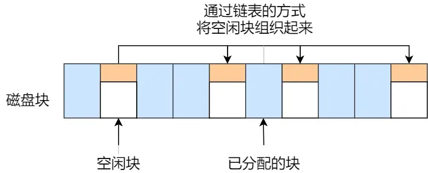

当创建文件需要一块或几块时，就从链头上依次取下一块或几块。反之，当回收空间时，把这些空闲块依次接到链头上。

这种技术只要在主存中保存一个指针，令它指向第一个空闲块。其特点是简单，但不能随机访问，工作效率低，因为每当在链上增加或移动空闲块时需要做很多 I/O 操作，同时数据块的指针消耗了一定的存储空间。

空闲表法和空闲链表法都不适合用于大型文件系统，因为这会使空闲表或空闲链表太大。

### 位图法

使用一个01向量来记录每一个磁盘块的使用情况，当值为 0 时，表示对应的盘块空闲，值为 1 时，表示对应的盘块已分配。例如：

```
010101010001010101111101010
```

在 Linux 文件系统就采用了位图的方式来管理空闲空间，不仅用于数据空闲块的管理，还用于 inode 空闲块的管理，因为 inode 也是存储在磁盘的，自然也要有对其管理。

## 杂项

这一部分我们来从Linux系统可以**见到/用到**的部分来看看文件系统，说说目录和链接。

### 目录

基于 Linux 一切皆文件的设计思想，目录其实也是个文件，你甚至可以通过 vim 打开它，它也有 inode，inode 里面也是指向一些块。

和普通文件不同的是，普通文件的块里面保存的是**文件数据**，而目录文件的块里面保存的是目录里面**一项一项的文件信息。** 

在目录文件的块中，最简单的保存格式就是列表，就是一项一项地将目录下的文件信息（如文件名、文件 inode、文件类型等）列在表里。 

列表中每一项就代表该目录下的文件的文件名和对应的 inode，通过这个 inode，就可以找到真正的文件。

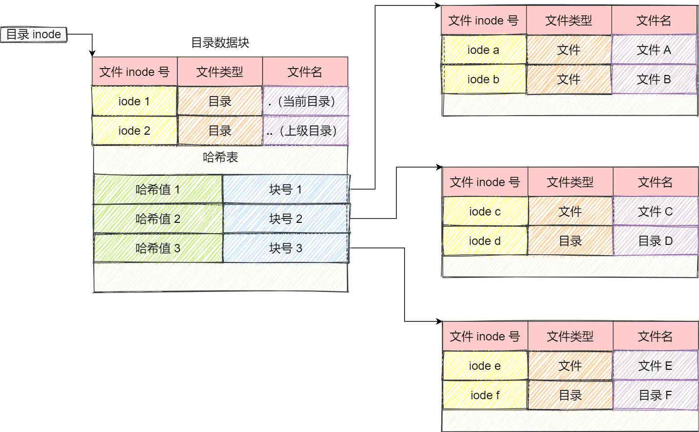

通常，第一项是「.」，表示当前目录，第二项是「..」，表示上一级目录，接下来就是一项一项的文件名和 inode。 

如果一个目录有超级多的文件，我们要想在这个目录下找文件，按照列表一项一项的找，效率就不高了。 

于是，保存目录的格式改成**哈希表**，对文件名进行哈希计算，把哈希值保存起来，如果我们要查找一个目录下面的文件名，可以通过名称取哈希。如果哈希能够匹配上，就说明这个文件的信息在相应的块里面。 

Linux 系统的 ext 文件系统就是采用了哈希表，来保存目录的内容，这种方法的优点是查找非常迅速，插入和删除也较简单，不过需要一些预备措施来避免哈希冲突。 

目录查询是**通过在磁盘上反复搜索**完成，需要不断地进行 I/O 操作，开销较大。所以，为了减少 I/O 操作，把当前使用的文件目录缓存在内存（叫做目录项），以后要使用该文件时只要在内存中操作，从而降低了磁盘操作次数，提高了文件系统的访问速度。

:::important

目录项和目录不是一回事。

:::

### 软链接/硬链接

有时候我们希望给某个文件取个别名，那么在 Linux 中可以通过**硬链接（Hard Link）** 和**软链接（Symbolic Link）** 的方式来实现，它们都是比较特殊的文件，但是实现方式也是不相同的。

 硬链接是多个目录项中的「索引节点」指向一个文件，也就是指向同一个 inode，但是 inode 是不可能跨越文件系统的，每个文件系统都有各自的 inode 数据结构和列表，所以硬链接是不可用于跨文件系统的。由于多个目录项都是指向一个 inode，那么**只有删除文件的所有硬链接以及源文件时，系统才会彻底删除该文件。**

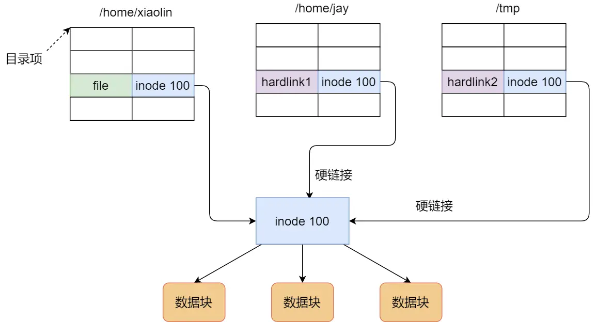

软链接相当于**重新创建一个文件**，这个文件有独立的 inode，但是这个文件的内容是另外一个文件的路径，所以访问软链接的时候，实际上相当于访问到了另外一个文件，所以软链接是可以跨文件系统的，甚至目标文件被删除了，链接文件还是在的，只不过指向的文件找不到了而已。

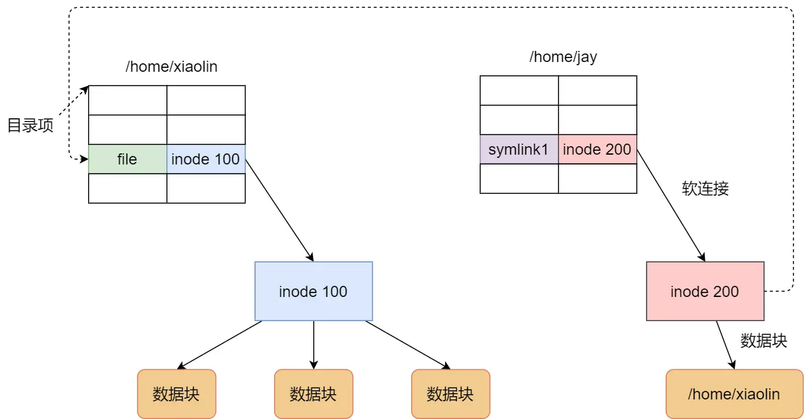

### 文件I/O

常见的文件IO有：

* 缓冲与非缓冲 I/O
* 直接与非直接 I/O
* 阻塞与非阻塞 I/O VS 同步与异步 I/O

### 缓冲与非缓冲 I/O

文件操作的标准库是可以实现数据的缓存，那么**根据「是否利用标准库缓冲」，可以把文件 I/O 分为缓冲 I/O 和非缓冲 I/O**

* 缓冲 I/O，利用的是标准库的缓存实现文件的加速访问，而标准库再通过系统调用访问文件。

* 非缓冲 I/O，直接通过系统调用访问文件，不经过标准库缓存。

这里所说的**缓冲**特指标准库内部实现的缓冲。

比方说，很多程序遇到换行时才真正输出，而换行前的内容，其实就是被标准库暂时缓存了起来，这样做的目的是，减少系统调用的次数，毕竟系统调用是有 CPU 上下文切换的开销的。

### 直接与非直接 I/O

我们都知道磁盘 I/O 是非常慢的，所以 Linux 内核为了减少磁盘 I/O 次数，在系统调用后，会把用户数据拷贝到内核中缓存起来，这个内核缓存空间也就是「页缓存」，只有当缓存满足某些条件的时候，才发起磁盘 I/O 的请求。**根据是「否利用操作系统的缓存」，可以把文件 I/O 分为直接 I/O 与非直接 I/O。**

* 直接 I/O，不会发生内核缓存和用户程序之间数据复制，而是直接经过文件系统访问磁盘。
* 非直接 I/O，读操作时，数据从内核缓存中拷贝给用户程序，写操作时，数据从用户程序拷贝给内核缓存，再由内核决定什么时候写入数据到磁盘。

### 阻塞与非阻塞 I/O VS 同步与异步 I/O

这两者非常容易混淆。

先来看看**阻塞 I/O**，当用户程序执行 read ，线程会被阻塞，一直等到内核数据准备好，并把数据从内核缓冲区拷贝到应用程序的缓冲区中，当拷贝过程完成，read 才会返回。 注意，阻塞等待的是「内核数据准备好」和「数据从内核态拷贝到用户态」这两个过程。过程如下图：

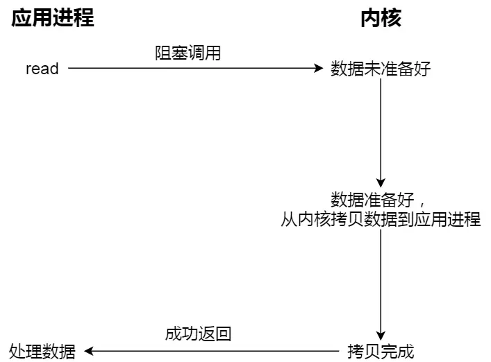

知道了阻塞 I/O ，来看看**非阻塞 I/O**，非阻塞的 read 请求在数据未准备好的情况下立即返回，可以继续往下执行，此时应用程序不断轮询内核，直到数据准备好，内核将数据拷贝到应用程序缓冲区，read 调用才可以获取到结果。过程如下图：

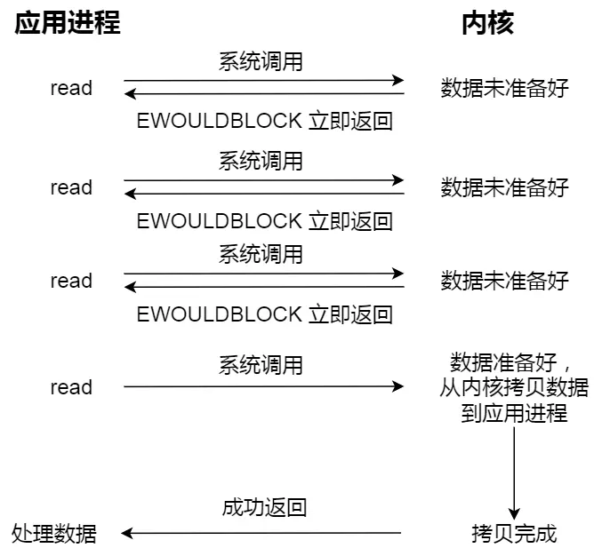

这里最后一次 read 调用，获取数据的过程，是一个同步的过程，是需要等待的过程。这里的同步指的是内核态的数据拷贝到用户程序的缓存区这个过程。

应用程序每次轮询内核的 I/O 是否准备好，感觉有点傻乎乎，因为轮询的过程中，应用程序啥也做不了，只是在循环。

为了解决这种傻乎乎轮询方式，于是 **I/O 多路复用**技术就出来了，如 select、poll，它是通过 I/O 事件分发，当内核数据准备好时，再以事件通知应用程序进行操作。

实际上，无论是阻塞 I/O、非阻塞 I/O，还是基于非阻塞 I/O 的多路复用都是**同步调用**。因为它们在 read 调用时，内核将数据从内核空间拷贝到应用程序空间，过程都是需要等待的，也就是说这个过程是同步的，如果内核实现的拷贝效率不高，read 调用就会在这个同步过程中等待比较长的时间。

真正的**异步 I/O** 是「内核数据准备好」和「数据从内核态拷贝到用户态」这两个过程都不用等待。 当我们发起 aio_read 之后，就立即返回，内核自动将数据从内核空间拷贝到应用程序空间，这个拷贝过程同样是异步的，内核自动完成的，和前面的同步操作不一样，应用程序并不需要主动发起拷贝动作。过程如下图：

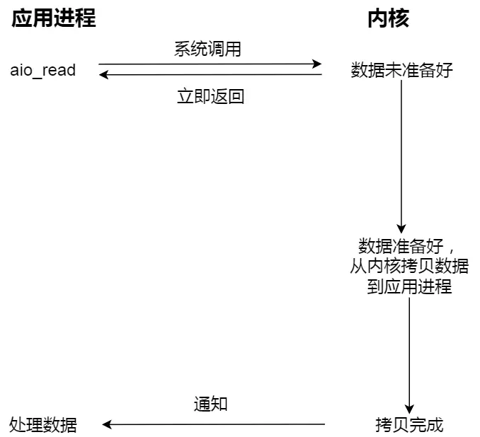


