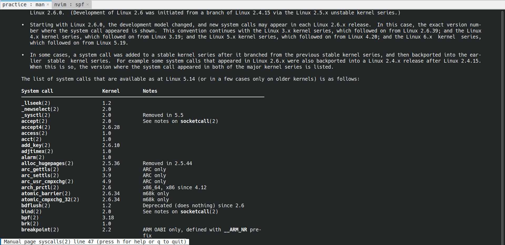
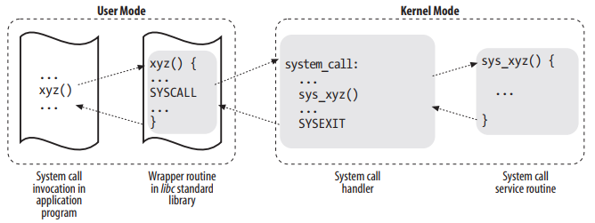

## 引入

从高层视角来看，**系统调用**是内核向用户应用程序提供的“服务”，它们类似于库 API，因为它们被描述为具有名称、参数和返回值的函数调用。

然而，从底层视角看的话，我们会发现系统调用实际上并不是函数调用，而是**特定的汇编指令**（与体系结构和内核相关），其功能如下：

* 用于识别系统调用及其参数的设置信息
* 触发内核模式切换
* 获取系统调用的结果

当用户态进程发起一个系统调用， CPU 将切换到 **内核态** 并开始执行一个 **内核函数** 。 内核函数负责响应应用程序的要求，例如操作文件、进行网络通讯或者申请内存资源等。

我们以一个简单的C实例来说明：

```c
#include <stdio.h>

int main() {
    FILE *file = fopen("output.txt", "w");
    fprintf(file, "Hello, World!\n");
    fclose(file);
    return 0;
}
```

在这个例子中，C程序调用 `fopen`和 `fprintf`时，

1. 通过系统调用（如 `open()`和 `write()`）触发从用户模式到内核模式的转换。
2. CPU暂停用户程序，跳转到内核的系统调用处理程序（入口点）。
3. 内核完成文件操作后返回结果。

这个过程与中断（如键盘输入）或异常（如内存错误）处理类似，因为它们都涉及暂停程序、切换模式、跳转到内核处理程序。在x86_64架构中，系统调用通过 `syscall`指令触发异常，确保安全切换。

:::note

有人可能会有些疑问——输出文本不是用 `printf` 等函数吗？

确实是。 `printf` 是更高层次的库函数，建立在系统调用之上，实现数据格式化等功能。 因此，本质上还是系统调用起决定性作用。

:::

## System Call

操作系统给运行在用户空间的进程提供了一系列用于访问 CPU、磁盘、打印机等硬件的接口。这样一层位于硬件和应用程序之间的接口具有下面的优势：

* 让用户空间的程序开发变得更加**简单**，不用关心硬件层面的底层特性
* 大大增加了系统的**安全**，内核在处理用户空间的接口时，可以做安全性检查
* 更重要的是它使得应用程序的**可移植**性大大提高了

（总结就是 ： 简单、安全、可移植！）

**system call/系统调用** 就是 unix 系统用来实现这样中间接口的功能。

### API  vs.  System Call

前面提到了:

> 从高层视角来看，**系统调用**是内核向用户应用程序提供的“服务”，它们类似于库 API，因为它们被描述为具有名称、参数和返回值的函数调用。

这里处于严谨性考虑，用了**类似**这个词。

事实上，Application Programmer Interface（API）与 system call 相比较而言，前者是获取相关服务的一种函数定义，而后者是通过软件中断向内核发起的请求。

unix 系统包含了一些库，其中 libc 标准C库对 system call 进行了封装，然后以 API 的形式提供给用户。每一个系统调用都对应着一个这样的封装的 API。

而反过来就不是了，因为 libc 中很多的 API 并不需要进行系统调用，而有的 API 是将多个系统调用进行组合使用，还有的 API 使用的是同样的系统调用，比如 `malloc`、`calloc`、`free` 都是用的 brk 系统调用。

**POSIX 标准**是对 API 的定义，并没有对 system call 作出定义，所以只要操作系统能提供符合 POSIX 标准的 API，它就是属于兼容 POSIX 标准的操作系统，而不必在乎 API 与 system call 之间是如何封装实现的。

从应用程序开发者的角度看，我们并不关心系统调用与 API 的关系，最终要的是 API 的函数名称、调用参数和返回值。

而从内核开发者的角度，它也不需要考虑二者之间的关系，因为 libc 是属于用户程序，并不包含在内核中。所以通过 libc 这样的标准C库，用户程序和内核系统的开发就解耦了。

通常这些封装 system call 的 API 返回值都是整数，-1 则表示失败，而具体的错误码则存放在 error 这个全局变量中，为了增加 unix 系统的可移植性，这些错误码都是依照 POSIX 标准，它们的定义在 `/usr/include/errno.h` 文件中可以找到。

```c
/* Copyright (C) 1991-2024 Free Software Foundation, Inc.
   This file is part of the GNU C Library.

   The GNU C Library is free software; you can redistribute it and/or
   modify it under the terms of the GNU Lesser General Public
   License as published by the Free Software Foundation; either
   version 2.1 of the License, or (at your option) any later version.

   The GNU C Library is distributed in the hope that it will be useful,
   but WITHOUT ANY WARRANTY; without even the implied warranty of
   MERCHANTABILITY or FITNESS FOR A PARTICULAR PURPOSE.  See the GNU
   Lesser General Public License for more details.

   You should have received a copy of the GNU Lesser General Public
   License along with the GNU C Library; if not, see
   <https://www.gnu.org/licenses/>.  */

/*
 *	ISO C99 Standard: 7.5 Errors	<errno.h>
 */

#ifndef	_ERRNO_H
#define	_ERRNO_H 1

#include <features.h>

/* The system-specific definitions of the E* constants, as macros.  */
#include <bits/errno.h>

/* When included from assembly language, this header only provides the
   E* constants.  */
#ifndef __ASSEMBLER__

__BEGIN_DECLS

/* The error code set by various library functions.  */
extern int *__errno_location (void) __THROW __attribute_const__;
# define errno (*__errno_location ())

# ifdef __USE_GNU

/* The full and simple forms of the name with which the program was
   invoked.  These variables are set up automatically at startup based on
   the value of argv[0].  */
extern char *program_invocation_name;
extern char *program_invocation_short_name;

#include <bits/types/error_t.h>

# endif /* __USE_GNU */

__END_DECLS

#endif /* !__ASSEMBLER__ */
#endif /* errno.h */

```

### 系统调用与异常处理

当用户到内核模式的转换发生时，执行流程会被中断，并传递到内核的入口点。

这类似于**中断和异常的处理方式**（实际上，在某些架构上(例如我们正在使用的x86_64)，这种转换正是由异常引起的）。

* 中断（interrupts）是由硬件设备触发的异步事件（如定时器中断或I/O设备信号）。
* 异常（exceptions）是由CPU检测到的错误或特殊条件（如除零错误、页面错误）。

用户到内核模式的转换与中断和异常的处理类似，因为它们都涉及暂停当前执行、保存上下文（CPU寄存器等状态），然后跳转到内核的处理程序。

不同之处在于，系统调用是用户程序主动发起的（同步），而中断和异常通常是意外或外部触发的（异步）。

在一些处理器架构（如x86、ARM），系统调用是通过触发一个特定的异常（或称为“软中断”）来实现的。

例如，在x86架构中，系统调用可能通过 `int 0x80`指令或 `syscall`指令触发一个异常，CPU会切换到内核模式并跳转到内核的系统调用处理程序。

这种异常机制确保了用户程序无法直接访问内核代码，而是通过受控的方式（异常处理）进入内核。

```bash
     +-------------+   dup2    +-----------------------------+
     |   应用程序   |-----+     |  libc                       |
     +-------------+     |     |                             |
                         +---->| C7590 dup2:                 |
                               | ...                         |
                               | C7592 movl 0x8(%esp),%ecx   |
                               | C7596 movl 0x4(%esp),%ebx   |
                               | C759a movl $0x3f,%eax       |
+------------------------------+ C759f int $0x80             |
|                              | ...                         +<-----+
|                              +-----------------------------+      |
|                                                                   |
|                                                                   |
|                                                                   |
|                                                                   |
|    +------------------------------------------------------------+ |
|    |                         内核                               | |
|    |                                                            | |
+--->|ENTRY(entry_INT80_32)                                       | |
     | ASM_CLAC                                                   | |
     | pushl   %eax                    # pt_regs->orig_ax         | |
     | SAVE_ALL pt_regs_ax=$-ENOSYS    # save rest                | |
     | ...                                                        | |
     | movl   %esp, %eax                                          | |
     | call   do_int80_syscall_32                                 | |
     | ....                                                       | |
     | RESTORE_REGS 4                  # skip orig_eax/error_code | |
     | ...                                                        | |
     | INTERRUPT_RETURN                                           +-+
     +------------------------------------------------------------+
```

## 系统调用流程

### 系统调用表

用户在进行系统调用时，通过传递一个系统调用编号，来告知内核，它所请求的系统调用，内核通过这个编号进而找到对应的处理系统调用的C函数。这个系统编号，在 x86 架构上，是通过 eax 寄存器传递的。

系统调用的过程跟其他的异常处理流程一样，包含下面几个步骤：

* 将当前的寄存器上下文保存在内核 stack 中（这部分处理都在汇编代码中）
* 调用对应的C函数去处理系统调用
* 从系统调用处理函数返回，恢复之前保存在 stack 中的寄存器，CPU 从内核态切换到用户态

每一个系统调用对应一个系统调用号，在 `/usr/asm-xxx/unistd.h`中可以找到不同架构的系统调用表，如下是kubuntu 24.04（x86-64）下的对应目录 `/usr/asm-generic/unistd.h`

使用 **`man 2 syscalls`** 命令可以查看系统调用的完整列表：



:::tip

除此之外，在 `/usr/asm/unistd.h`下也可以看到系统调用表。

当然，如果直接查看Linux内核源代码，在 `arch/x86/entry/syscalls/syscall_64.tbl` 文件中更为直观。

:::

在内核中用于处理系统调用的C函数入口名称是 `sys_foo()` ，`foo()` 就是对应的系统调用。 在 Linux 内核的代码中，这样的系统调用函数命名则是通过宏定义 `SYSCALL_DEFINEx`来实现的，其中的 x 表示这个系统调用处理函数的输入参数个数。

下图展示了系统调用在用户空间和内核空间跳转的流程：

1. **应用程序** 代码调用系统调用( xyz )，该函数是一个包装系统调用的 **库函数** ；
2. **库函数** ( xyz )负责准备向内核传递的参数，并触发 **软中断** 以切换到内核；
3. CPU 被 **软中断** 打断后，执行 **中断处理函数** ，即 **系统调用处理函数** ( system_call )；
4. **系统调用处理函数** 调用 **系统调用服务例程** ( sys_xyz )，真正开始处理该系统调用；



其中的 SYSCALL & SYSEXIT 就是实际的进行 CPU 运行级别切换的汇编指令，不同的 CPU 架构具有不同的指令。

对于任意的系统调用号，如果对应序号的系统调用不存在，那么就会用 `sys_ni_syscall` 填充，这是一个表示没有实现的系统调用，它直接返回错误码 `-ENOSYS`。

### 系统调用（内核空间）的进入与返回

在 x86 的架构上，支持2种方式进入和退出系统调用：

* 通过 `int $0x80` 触发软件中断进入，`iret` 指令退出
* 通过 `sysenter` 指令进入，`sysexit`指令退出

x86-64架构下**执行态切换** 过程如下：

1. **应用程序** 在 **用户态** 准备好调用参数，执行 int 指令触发 **软中断** ，中断号为 0x80 ；
2. CPU 被软中断打断后，执行对应的 **中断处理函数** ，这时便已进入 **内核态** ；
3. **系统调用处理函数** 准备 **内核执行栈** ，并保存所有 **寄存器** (一般用汇编语言实现)；
4. **系统调用处理函数** 根据 **系统调用号** 调用对应的 C 函数—— **系统调用服务例程** ；
5. **系统调用处理函数** 准备 **返回值** 并从 **内核栈** 中恢复 **寄存器** ；
6. **系统调用处理函数** 执行 ret 指令切换回 **用户态** ；

在Linux源代码目录下 `arch/x86/entry/entry.S`下可以找到的系统调用入口的逻辑：

```
.pushsection .noinstr.text, "ax"

SYM_FUNC_START(entry_ibpb)
	movl	$MSR_IA32_PRED_CMD, %ecx
	movl	$PRED_CMD_IBPB, %eax
	xorl	%edx, %edx
	wrmsr

	/* Make sure IBPB clears return stack preductions too. */
	FILL_RETURN_BUFFER %rax, RSB_CLEAR_LOOPS, X86_BUG_IBPB_NO_RET
	RET
SYM_FUNC_END(entry_ibpb)
/* For KVM */
EXPORT_SYMBOL_GPL(entry_ibpb);

.popsection
```

### 参数处理

处理系统调用参数是棘手的。由于这些值是由用户空间设置的，内核不能假定其正确性，因此必须始终进行彻底的验证。

指针有一些重要的特殊情况需要进行检查：

* 绝不允许指向内核空间的指针
* 检查无效指针

由于系统调用在内核模式下执行，它们可以访问内核空间，如果指针没有正确检查，用户应用程序可能会读取或写入内核空间。

在 X86 架构上，通常函数的参数是通过栈传递。不过由于系统调用，涉及到用户和内核2个栈，为了使参数的处理相对简单一些，系统调用的参数规定通过 CPU 寄存器传递。由于寄存器的数量有限，所以规定系统调用最多传递 6 个参数。如果有多的参数需要传递，那么就通过指针进行传递。

参数传递的实现在内核部分的代码，可以看 `SYSCALL_DEFINEx` 宏的定义：

```c
#ifndef SYSCALL_DEFINE0
#define SYSCALL_DEFINE0(sname)					\
	SYSCALL_METADATA(_##sname, 0);				\
	asmlinkage long sys_##sname(void);			\
	ALLOW_ERROR_INJECTION(sys_##sname, ERRNO);		\
	asmlinkage long sys_##sname(void)
#endif /* SYSCALL_DEFINE0 */

#define SYSCALL_DEFINE1(name, ...) SYSCALL_DEFINEx(1, _##name, __VA_ARGS__)
#define SYSCALL_DEFINE2(name, ...) SYSCALL_DEFINEx(2, _##name, __VA_ARGS__)
#define SYSCALL_DEFINE3(name, ...) SYSCALL_DEFINEx(3, _##name, __VA_ARGS__)
#define SYSCALL_DEFINE4(name, ...) SYSCALL_DEFINEx(4, _##name, __VA_ARGS__)
#define SYSCALL_DEFINE5(name, ...) SYSCALL_DEFINEx(5, _##name, __VA_ARGS__)
#define SYSCALL_DEFINE6(name, ...) SYSCALL_DEFINEx(6, _##name, __VA_ARGS__)

#define SYSCALL_DEFINE_MAXARGS	6

#define SYSCALL_DEFINEx(x, sname, ...)				\
	SYSCALL_METADATA(sname, x, __VA_ARGS__)			\
	__SYSCALL_DEFINEx(x, sname, __VA_ARGS__)

#define __PROTECT(...) asmlinkage_protect(__VA_ARGS__)

/*
 * The asmlinkage stub is aliased to a function named __se_sys_*() which
 * sign-extends 32-bit ints to longs whenever needed. The actual work is
 * done within __do_sys_*().
 */
#ifndef __SYSCALL_DEFINEx
#define __SYSCALL_DEFINEx(x, name, ...)					\
	__diag_push();							\
	__diag_ignore(GCC, 8, "-Wattribute-alias",			\
		      "Type aliasing is used to sanitize syscall arguments");\
	asmlinkage long sys##name(__MAP(x,__SC_DECL,__VA_ARGS__))	\
		__attribute__((alias(__stringify(__se_sys##name))));	\
	ALLOW_ERROR_INJECTION(sys##name, ERRNO);			\
	static inline long __do_sys##name(__MAP(x,__SC_DECL,__VA_ARGS__));\
	asmlinkage long __se_sys##name(__MAP(x,__SC_LONG,__VA_ARGS__));	\
	asmlinkage long __se_sys##name(__MAP(x,__SC_LONG,__VA_ARGS__))	\
	{								\
		long ret = __do_sys##name(__MAP(x,__SC_CAST,__VA_ARGS__));\
		__MAP(x,__SC_TEST,__VA_ARGS__);				\
		__PROTECT(x, ret,__MAP(x,__SC_ARGS,__VA_ARGS__));	\
		return ret;						\
	}								\
	__diag_pop();							\
	static inline long __do_sys##name(__MAP(x,__SC_DECL,__VA_ARGS__))
#endif /* __SYSCALL_DEFINEx */
```

在 X86 架构中，系统调用编号是通过 `%eax` 传递，参数则是由 `%ebx`, `%ecx`, `%edx`, `%esi`, `%edi`, `%ebp` 这6个寄存器实现的。系统调用函数定义的这个宏可以根据不同的架构进行重新定义，如此即可以满足不同架构的系统调用规范要求。

系统调用的参数是用户态传递到内核的，所以对它们都需要进行安全检查。其中非常通用的是对地址的检查，内核通过 `access_ok` 这个函数进行一个简单的校验，这个函数的定义根据CPU架构不同而不同，下面是 x86-64 的定义：

```c
#ifndef __access_ok
/*
 * 'size' is a compile-time constant for most callers, so optimize for
 * this case to turn the check into a single comparison against a constant
 * limit and catch all possible overflows.
 * On architectures with separate user address space (m68k, s390, parisc,
 * sparc64) or those without an MMU, this should always return true.
 *
 * This version was originally contributed by Jonas Bonn for the
 * OpenRISC architecture, and was found to be the most efficient
 * for constant 'size' and 'limit' values.
 */
static inline int __access_ok(const void __user *ptr, unsigned long size)
{
	unsigned long limit = TASK_SIZE_MAX;
	unsigned long addr = (unsigned long)ptr;

	if (IS_ENABLED(CONFIG_ALTERNATE_USER_ADDRESS_SPACE) ||
	    !IS_ENABLED(CONFIG_MMU))
		return true;

	return (size <= limit) && (addr <= (limit - size));
}
#endif

#ifndef access_ok
#define access_ok(addr, size) likely(__access_ok(addr, size))
#endif

#endif

```

从 `return (size <= limit) && (addr <= (limit - size));`一句可以明白，这个方法只是简单地判断了当前需要访问的空间是否有超过limit，这个值通常是用户空间的最大地址。

系统调用传递的参数有限，很多时候，在内核中处理系统调用的时候，需要访问进程的用户空间地址。内核中有许多用于在内核空间访问用户空间数据的宏，在下面的表格中列出它们。其中，带有双下划线的表示访问前不做地址校验。

| Function          | Function            | Action                       |
| ----------------- | ------------------- | ---------------------------- |
| get_user          | __get_user          | 从用户空间读取一个整数       |
| put_user          | __put_user          | 写入一个整数到用户空间       |
| copy_from_user    | __copy_from_user    | 从用户空间拷贝一段数据       |
| copy_to_user      | __copy_to_user      | 拷贝一段数据到用户空间       |
| strncpy_from_user | __strncpy_from_user | 从用户空间拷贝一个字符串     |
| strlen_user       | strlen_user         | 获取一个用户空间字符串的长度 |
| clear_user        | __clear_user        | 将用户空间的一段空间全部写0  |

这些 API 部分会检查指针是否位于用户空间，并在指针无效时处理错误。如果指针无效，它们将返回一个非零值。

### 错误处理

紧接上面所说，如果应用程序传递的指针无效（例如，指针未映射或在需要进行写操作的情况下使用只读的指针），它可能会导致内核"崩溃"。

可以采用两种方法来处理：

* 在使用指针之前对照用户地址空间检查指针。
* 避免检查指针，并依赖于内存管理单元（MMU）来检测指针是否无效，并使用**页面故障处理程序**确定指针是否无效。

**页面故障处理程序**使用故障地址（被访问的地址）、引发故障的地址（执行访问的指令的地址）和用户地址空间的信息来确定原因：

* 写时复制（Copy on Write）、需求分页（demand paging）、交换（swapping）：故障地址和引发故障的地址都在用户空间；故障地址有效（在用户地址空间进行检查）。
* 在系统调用中使用无效指针：引发故障的地址在内核空间；故障地址在用户空间且无效。
* 内核错误（内核访问无效指针）：与上述情况相同。
