## Linux内核网络模块的模型设计

我们熟悉的网络模型是这样的：

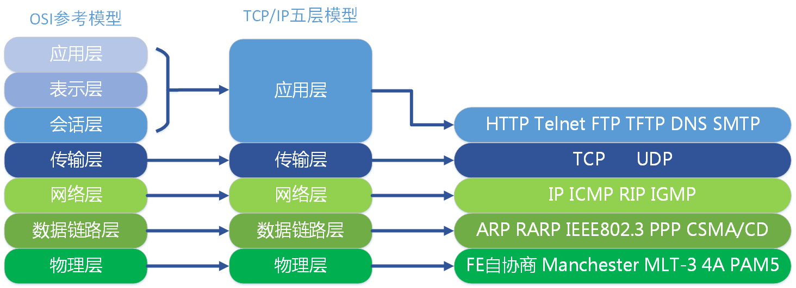

每一层负责的职能都不同，

* 应用层，负责给应用程序提供统一的接口；
* 表示层，负责把数据转换成兼容另一个系统能识别的格式；
* 会话层，负责建立、管理和终止表示层实体之间的通信会话；
* 传输层，负责端到端的数据传输；
* 网络层，负责数据的路由、转发、分片；
* 数据链路层，负责数据的封帧和差错检测，以及 MAC 寻址；
* 物理层，负责在物理网络中传输数据帧；

事实上，我们比较常见，也比较实用的是**四层（五层）模型**，即 TCP/IP 网络模型，Linux 系统正是按照这套网络模型来实现网络协议栈的。

在Linux的网络部分中，这五层是这样设计的：

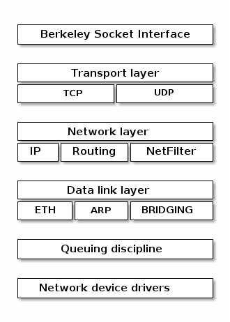

TCP/IP 网络模型相比 OSI 网络模型简化了不少，也更加易记，它们之间的关系如下图：

其中应用层并不是完整的协议设计，而是暴露了Socket网络编程的接口。

同时物理层我们并没有给出具体的形式，只是通过网络设备驱动对不同的网络设备进行了支持，封装了概念。

不过，我们常说的七层和四层负载均衡，是用 OSI 网络模型来描述的，七层对应的是应用层，四层对应的是传输层。这一块主要是后端开发的兄弟们更加熟悉了。

## Linux网络协议栈

你从下面这张图可以看到，应用层数据在每一层的封装格式。

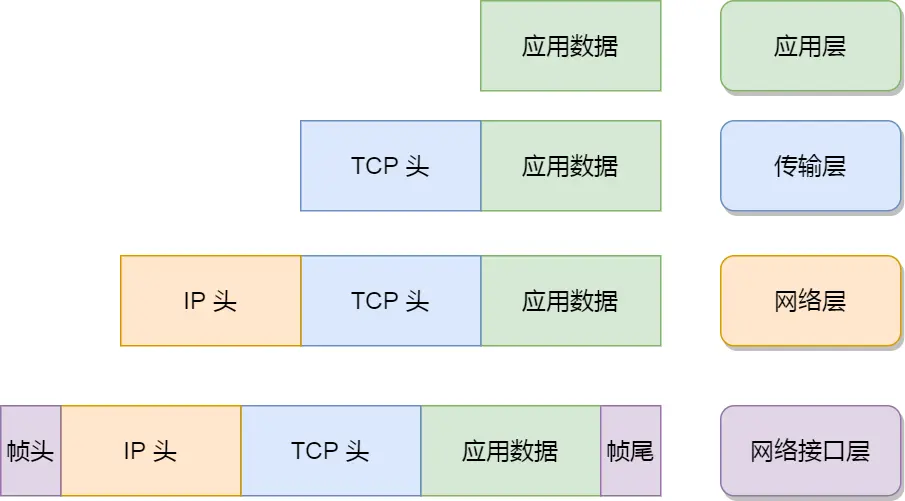

其中：

* 传输层，给应用数据前面增加了 TCP 头；
* 网络层，给 TCP 数据包前面增加了 IP 头；
* 网络接口层，给 IP 数据包前后分别增加了帧头和帧尾；

这些新增的头部和尾部，都有各自的作用，也都是按照特定的协议格式填充，这每一层都增加了各自的协议头，那自然网络包的大小就增大了，但物理链路并不能传输任意大小的数据包，所以在以太网中，规定了最大传输单元（MTU）是**1500**字节，也就是规定了单次传输的最大 IP 包大小。

当网络包超过 MTU 的大小，就会在网络层分片，以确保分片后的 IP 包不会超过 MTU 大小，如果 MTU 越小，需要的分包就越多，那么网络吞吐能力就越差，相反的，如果 MTU 越大，需要的分包就越少，那么网络吞吐能力就越好。

在Linux中，我们的协议栈是这样实现的：

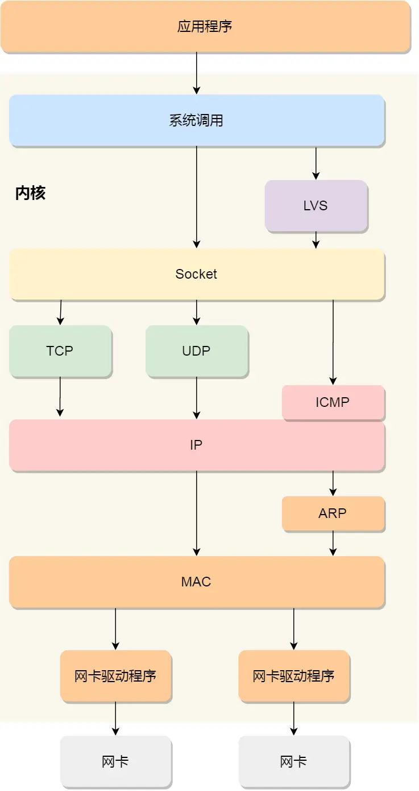

可以看到，我们的网络编程，说到底就是通过Socket和系统调用在进行开发，

- 应用程序需要通过系统调用，来跟 Socket 层进行数据交互；
- Socket 层的下面就是传输层、网络层和网络接口层；
- 最下面的一层，则是网卡驱动程序和硬件网卡设备；

## Socket设计

应用层创建 socket 对象返回整型的文件描述符，代码长这样：

```c
#include <sys/socket.h>
int socket(int domain/family, int type, int protocol);
```

我们最终创建的Socket是这样的设计的：

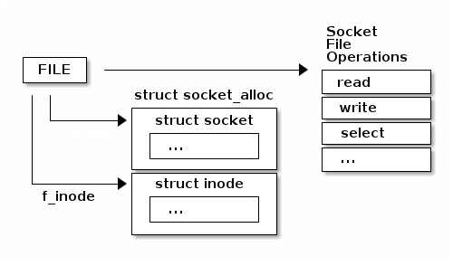

Socket也是通过系统调用，陷入内核运行代码的。

```
# System.map
ffffffff81792870 T __x64_sys_socket

# socket
__do_sys_socket() (/root/linux-5.0.1/net/socket.c:1355)
__se_sys_socket() (/root/linux-5.0.1/net/socket.c:1353)
__x64_sys_socket(const struct pt_regs * regs) (/root/linux-5.0.1/net/socket.c:1353)
do_syscall_64(unsigned long nr, struct pt_regs * regs) (/root/linux-5.0.1/arch/x86/entry/common.c:290)
entry_SYSCALL_64() (/root/linux-5.0.1/arch/x86/entry/entry_64.S:175)
```

同时，socket 结构主要分两部分：与文件系统关系密切的部分，与通信关系密切的部分。

```c
/** include/linux/net.h
 *  struct socket - general BSD socket
 *  @state: socket state (%SS_CONNECTED, etc)
 *  @type: socket type (%SOCK_STREAM, etc)
 *  @flags: socket flags (%SOCK_NOSPACE, etc)
 *  @ops: protocol specific socket operations
 *  @file: File back pointer for gc
 *  @sk: internal networking protocol agnostic socket representation
 *  @wq: wait queue for several uses
 */
struct socket {
    socket_state       state;
    short              type;
    unsigned long      flags;
    struct socket_wq   *wq;
    struct file        *file;
    struct sock        *sk;
    const struct proto_ops  *ops;
};

/* include/linux/net.h */
struct proto_ops {
    ...
}

/* include/net/sock.h */
struct tcp_sock {
    /* inet_connection_sock has to be the first member of tcp_sock */
    struct inet_connection_sock inet_conn;
    ...
}

struct inet_connection_sock {
    struct inet_sock icsk_inet;
    ...
}

/* include/net/inet_sock.h */
struct inet_sock {
    /* sk and pinet6 has to be the first two members of inet_sock */
    struct sock sk;
    ...
}

struct sock {
    struct sock_common __sk_common;
    ...
};
```

下面这张图展示了Sockets的不同系列和协议：

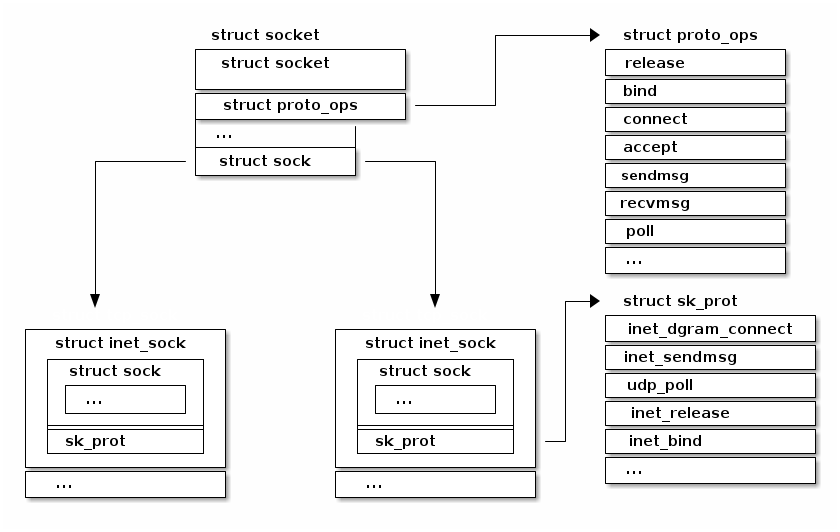

Socket创建操作在Linux源码中的调用关系：

```
#------------------- *用户态* ---------------------------
socket
#------------------- *内核态* ---------------------------
__x64_sys_socket # 内核系统调用。
__sys_socket # net/socket.c
    |-- sock_create # net/socket.c
        |-- __sock_create # net/socket.c
#------------------- 文件部分 ---------------------------
            |-- sock_alloc # net/socket.c
                |-- new_inode_pseudo # fs/inode.c
                    |-- alloc_inode # fs/inode.c
                        |-- sock_alloc_inode # net/socket.c
                            |-- kmem_cache_alloc
#------------------- 网络部分 ---------------------------
            |-- inet_create # pf->create -- af_inet.c
                |-- sk_alloc # net/core/sock.c
                    |-- sk_prot_alloc # net/core/sock.c
                        |-- kmem_cache_alloc
                |-- inet_sk
                |-- sock_init_data # net/core/sock.c
                    |-- sk_init_common # net/core/sock.c
                    |-- timer_setup
                |-- sk->sk_prot->init(sk) # tcp_v4_init_sock  -- net/ipv4/tcp_ipv4.c
                    |-- tcp_init_sock
#------------------- 文件+网络+关联进程 ------------------------
    |-- sock_map_fd # net/socket.c
        |-- get_unused_fd_flags # fs/file.c -- 进程分配空闲 fd。
        |-- sock_alloc_file # net/socket.c
            |-- alloc_file_pseudo # fs/file_table.c
        |-- fd_install # fs/file.c
            |-- __fd_install # fs/file.c
                |-- fdt = rcu_dereference_sched(files->fdt);
                |-- rcu_assign_pointer(fdt->fd[fd], file); # file 关联到进程。
```

下面仅给出关键代码：

```c
int __sys_socket(int family, int type, int protocol) {
    struct socket *sock;
    ...
    retval = sock_create(family, type, protocol, &sock);
    if (retval < 0)
        return retval;

    return sock_map_fd(sock, flags & (O_CLOEXEC | O_NONBLOCK));
}

int sock_create(int family, int type, int protocol, struct socket **res) {
    return __sock_create(current->nsproxy->net_ns, family, type, protocol, res, 0);
}

int __sock_create(struct net *net, int family, int type, int protocol,
             struct socket **res, int kern) {
    int err;
    struct socket *sock;
    const struct net_proto_family *pf;
    ...
    sock = sock_alloc();
    ...
    pf = rcu_dereference(net_families[family]);
    ...
    err = pf->create(net, sock, protocol, kern);
    ...
    *res = sock;
    return 0;
    ...
}
```

### 文件部分

Linux 系统一切皆文件，Linux 通过 vfs（虚拟文件系统）管理文件，内核为 socket 定义了一种特殊的文件类型，形成了一种特殊的文件系统：sockfs，系统初始化时，进行安装。

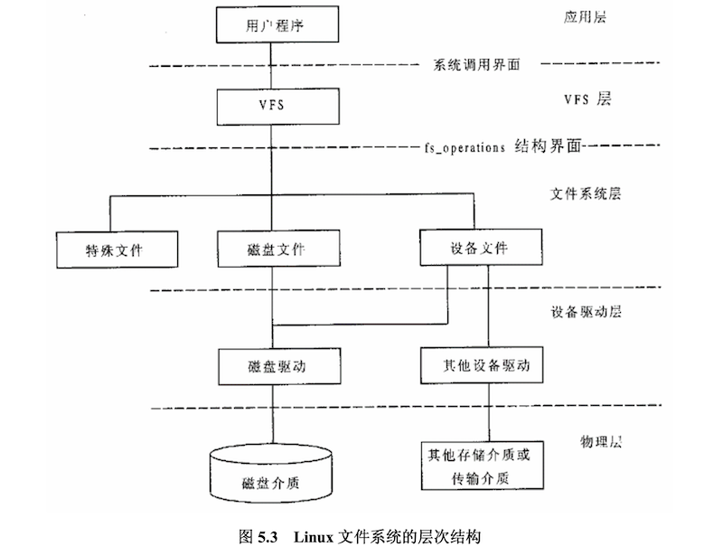

创建一个 socket，要把 socket 关联到一个已打开文件，方便进程进行管理。

```c
/* include/linux/mount.h */
struct vfsmount {
    struct dentry *mnt_root;    /* root of the mounted tree */
    struct super_block *mnt_sb;    /* pointer to superblock */
    int mnt_flags;
} __randomize_layout;

/* net/socket.c */
static struct vfsmount *sock_mnt __read_mostly;

/* sock 文件类型。 */
static struct file_system_type sock_fs_type = {
    .name = "sockfs",
    .mount = sockfs_mount,
    .kill_sb = kill_anon_super,
};

/* sock 文件操作。 */
static const struct super_operations sockfs_ops = {
    .alloc_inode    = sock_alloc_inode,
    .destroy_inode  = sock_destroy_inode,
    .statfs         = simple_statfs,
};

/* include/sock.h 
 * sock 与 inode 文件节点关联结构。*/
struct socket_alloc {
    struct socket socket;
    struct inode vfs_inode;
};

/* include/net/sock.h 
 * 从文件节点结构获得 socket 成员。*/
static inline struct socket *SOCKET_I(struct inode *inode) {
    return &container_of(inode, struct socket_alloc, vfs_inode)->socket;
}

/* include/linux/fs.h */
struct file_operations {
    struct module *owner;
    loff_t (*llseek) (struct file *, loff_t, int);
    ssize_t (*read) (struct file *, char __user *, size_t, loff_t *);
    ssize_t (*write) (struct file *, const char __user *, size_t, loff_t *);
    ...
} __randomize_layout;

/* net/socket.c
 * Socket files have a set of 'special' operations as well as the generic file ones. These don't appear
 * in the operation structures but are done directly via the socketcall() multiplexor.
 */
static const struct file_operations socket_file_ops = {
    .owner      =    THIS_MODULE,
    .llseek     =    no_llseek,
    .read_iter  =    sock_read_iter,
    .write_iter =    sock_write_iter,
    .poll       =    sock_poll,
    .unlocked_ioctl = sock_ioctl,
#ifdef CONFIG_COMPAT
    .compat_ioctl = compat_sock_ioctl,
#endif
    .mmap         = sock_mmap,
    .release      = sock_close,
    .fasync       = sock_fasync,
    .sendpage     = sock_sendpage,
    .splice_write = generic_splice_sendpage,
    .splice_read  = sock_splice_read,
};
```

### 网络部分

协议：socket –> 传输层 –> 网络层。

这里不作详细介绍。

```c
/**
 * sock_register - add a socket protocol handler
 * @ops: description of protocol
 *
 * This function is called by a protocol handler that wants to
 * advertise its address family, and have it linked into the
 * socket interface. The value ops->family corresponds to the
 * socket system call protocol family.
 */
int sock_register(const struct net_proto_family *ops) {
    ...
    rcu_assign_pointer(net_families[ops->family], ops);
    ...
}
EXPORT_SYMBOL(sock_register);
```

## Linux 发送/接收网络包的流程

### 接收数据

**网卡**是计算机里的一个硬件，专门负责接收和发送网络包，当网卡接收到一个网络包后，会通过 DMA 技术，将网络包写入到指定的内存地址，也就是写入到 **Ring Buffer** ，这个是一个环形缓冲区，接着就会告诉操作系统这个网络包已经到达。

为了告诉操作系统这个网络包已经到达，我们可以采用触发**中断**。

但是，这存在一个问题，在高性能网络场景下，网络包的数量会非常多，那么就会触发非常多的中断，要知道当 CPU  收到了中断，就会停下手里的事情，而去处理这些网络包，处理完毕后，才会回去继续其他事情，那么频繁地触发中断，则会导致 CPU 一直没完没了的处理中断，而导致其他任务可能无法继续前进，从而影响系统的整体效率。

所以为了解决频繁中断带来的性能开销，Linux 内核在 2.6 版本中引入了 **NAPI 机制**，它是混合**中断和轮询**的方式来接收网络包，它的核心概念就是不采用中断的方式读取数据，而是首先采用中断唤醒数据接收的服务程序，然后 poll 的方法来轮询数据。

因此，当有网络包到达时，会通过 DMA 技术，将网络包写入到指定的内存地址，接着网卡向 CPU 发起硬件中断，当 CPU 收到硬件中断请求后，根据**中断表**，调用已经注册的中断处理函数。

硬件中断处理函数会做如下的事情：

- 需要先「暂时屏蔽中断」，表示已经知道内存中有数据了，告诉网卡下次再收到数据包直接写内存就可以了，不要再通知 CPU 了，这样可以提高效率，避免 CPU 不停的被中断。
- 接着，发起「软中断」，然后恢复刚才屏蔽的中断。

接下来的任务就全部交给软中断来处理了：

- 内核中的 `ksoftirqd` 线程专门负责软中断的处理，当 ksoftirqd 内核线程收到软中断后，就会来轮询处理数据。
- ksoftirqd 线程会从 Ring Buffer 中获取一个数据帧，用 `sk_buff`表示，从而可以作为一个网络包交给网络协议栈进行逐层处理。

接下来就是网络协议栈的流水线处理：

1. 首先，会先进入到**网络接口层**，在这一层会检查报文的合法性，如果不合法则丢弃，合法则会找出该网络包的上层协议的类型，比如是 IPv4，还是 IPv6，接着再去掉帧头和帧尾，然后交给网络层。
2. 到了**网络层**，则取出 IP 包，判断网络包下一步的走向，比如是交给上层处理还是转发出去。当确认这个网络包要发送给本机后，就会从 IP 头里看看上一层协议的类型是 TCP 还是 UDP，接着去掉 IP 头，然后交给传输层。
3. **传输层**取出 TCP 头或 UDP 头，根据四元组「源 IP、源端口、目的 IP、目的端口」 作为标识，找出对应的 Socket，并把数据放到 Socket 的接收缓冲区。
4. 最后，**应用层**程序调用 Socket 接口，将内核的 Socket 接收缓冲区的数据「拷贝」到应用层的缓冲区，然后唤醒用户进程。

至此，一个网络包的接收过程就已经结束了，你也可以从下图左边部分看到网络包接收的流程，右边部分刚好反过来，它是网络包发送的流程。

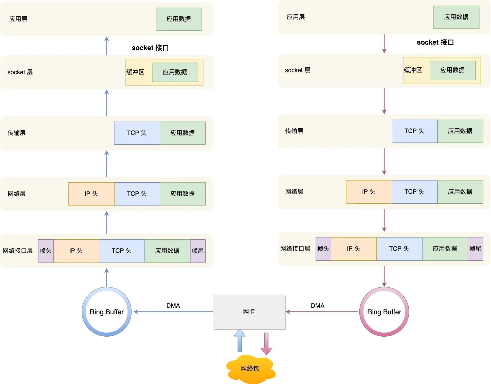

### 发送数据

首先，在**应用层**，应用程序会调用 Socket 发送数据包的接口，由于这个是系统调用，所以会从用户态陷入到内核态中的 Socket 层，内核会申请一个内核态的 `sk_buff` 内存，将用户待发送的数据拷贝到 sk_buff 内存，并将其加入到发送缓冲区。

接下来，在**传输层**，网络协议栈从 Socket 发送缓冲区中取出 sk_buff，并按照 TCP/IP 协议栈从上到下逐层处理。

如果使用的是 TCP 传输协议发送数据，那么先**拷贝一个新的 sk_buff 副本** ，这是因为 sk_buff 后续在调用网络层，最后到达网卡发送完成的时候，这个 sk_buff 会被释放掉。**而 TCP 协议是支持丢失重传的，在收到对方的 ACK 之前，这个 sk_buff 不能被删除**。所以内核的做法就是每次调用网卡发送的时候，实际上传递出去的是 sk_buff 的一个拷贝，等收到 ACK 再真正删除。 

接着，对 sk_buff 填充 TCP 头。这里提一下，sk_buff 可以表示各个层的数据包，在应用层数据包叫 **data**，在 TCP 层我们称为 **segment**，在 IP 层我们叫 **packet**，在数据链路层称为 **frame**。（这里的命名来源于《自顶向下计算机网络》）

为了在层级之间传递数据时，不发生拷贝，只用 sk_buff 一个结构体来描述所有的网络包，那它是如何做到的呢？是通过调整 sk_buff 中 `data` 的指针，比如：

- 当接收报文时，从网卡驱动开始，通过协议栈层层往上传送数据报，通过增加 `skb-` 的值，来逐步剥离协议首部。
- 当要发送报文时，创建 `sk_buff` 结构体，数据缓存区的头部预留足够的空间，用来填充各层首部，在经过各下层协议时，通过减少 `skb->data` 的值来增加协议首部。

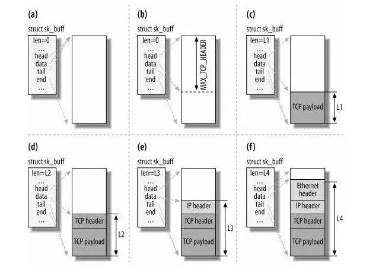

然后交给**网络层**，在网络层里会做这些工作：选取路由（确认下一跳的 IP）、填充 IP 头、netfilter 过滤、对超过 MTU 大小的数据包进行分片。处理完这些工作后会交给**网络接口层**处理。

网络接口层会通过 ARP 协议获得下一跳的 MAC 地址，然后对 sk_buff 填充帧头和帧尾，接着将 sk_buff 放到网卡的发送队列中。

这一些工作准备好后，会触发**软中断**告诉网卡驱动程序，这里有新的网络包需要发送，驱动程序会从发送队列中读取 sk_buff，将这个 sk_buff 挂到 RingBuffer 中，接着将 sk_buff 数据映射到网卡可访问的内存 DMA 区域，最后触发真实的发送。

当数据发送完成以后，其实工作并没有结束，因为内存还没有清理。当发送完成的时候，网卡设备会触发一个**硬中断**来释放内存，主要是释放 sk_buff 内存和清理  RingBuffer 内存。

最后，当收到这个 TCP 报文的 ACK 应答时，传输层就会释放原始的 sk_buff 。

:::important

上面发送网络数据过程中，一共设计了3次内存拷贝

1. 第一次，调用发送数据的系统调用的时候，内核会申请一个内核态的 sk_buff 内存，将用户待发送的数据拷贝到 `sk_buff` 内存，并将其加入到发送缓冲区。
2. 第二次，在使用 TCP 传输协议的情况下，从传输层进入网络层的时候，每一个 `sk_buff` 都会被克隆一个新的副本出来。副本 `sk_buff` 会被送往网络层，等它发送完的时候就会释放掉，然后原始的 `sk_buff` 还保留在传输层，目的是为了实现 TCP 的可靠传输，等收到这个数据包的 ACK 时，才会释放原始的 `sk_buff `。
3. 第三次，当 IP 层发现 `sk_buff` 大于 MTU 时才需要进行。会再申请额外的 `sk_buff`，并将原来的 `sk_buff` 拷贝为多个小的 `sk_buff`

:::

以UDP发送数据包为例，写一个C程序，长这样：

```c
char c;
struct sockaddr_in addr;
int s;

s = socket(AF_INET, SOCK_DGRAM, 0);
connect(s, (struct sockaddr*)&addr, sizeof(addr));
write(s, &c, 1);
close(s);
```

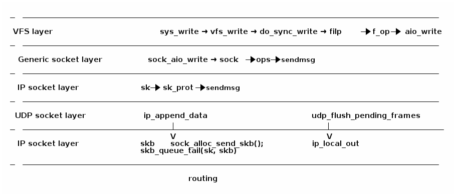

## 杂项

### 数据包路由

网络处理过程中的数据包路由类似下面：

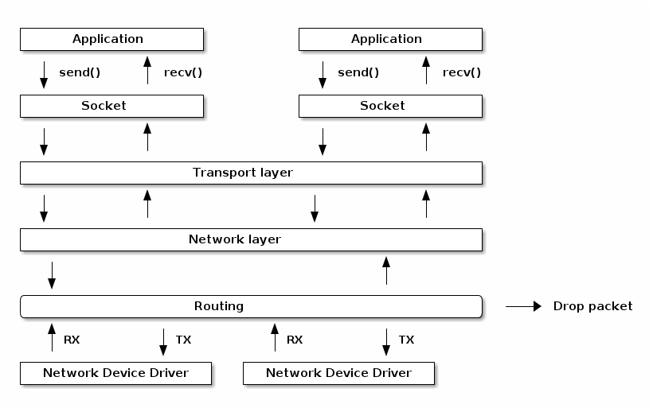

### 路由表

```
tavi@desktop-tavi:~/src/linux$ ip route list table main
default via 172.30.240.1 dev eth0
172.30.240.0/20 dev eth0 proto kernel scope link src 172.30.249.241

tavi@desktop-tavi:~/src/linux$ ip route list table local
broadcast 127.0.0.0 dev lo proto kernel scope link src 127.0.0.1
local 127.0.0.0/8 dev lo proto kernel scope host src 127.0.0.1
local 127.0.0.1 dev lo proto kernel scope host src 127.0.0.1
broadcast 127.255.255.255 dev lo proto kernel scope link src 127.0.0.1
broadcast 172.30.240.0 dev eth0 proto kernel scope link src 172.30.249.241
local 172.30.249.241 dev eth0 proto kernel scope host src 172.30.249.241
broadcast 172.30.255.255 dev eth0 proto kernel scope link src 172.30.249.241

tavi@desktop-tavi:~/src/linux$ ip rule list
0:      from all lookup local
32766:  from all lookup main
32767:  from all lookup default
```

### 网络数据包/sk源码（结构 sk_buff）

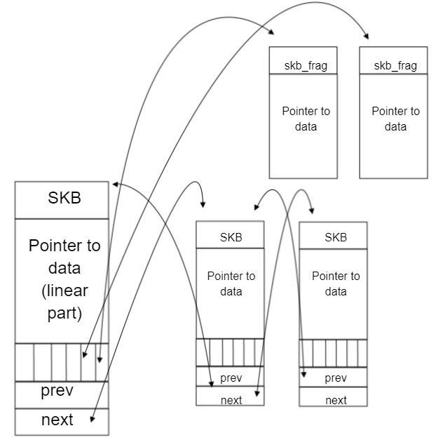

```c
struct sk_buff {
    struct sk_buff *next;
    struct sk_buff *prev;

    struct sock *sk;
    ktime_t tstamp;
    struct net_device *dev;
    char cb[48];

    unsigned int len,
    data_len;
    __u16 mac_len,
    hdr_len;

    void (*destructor)(struct sk_buff *skb);

    sk_buff_data_t transport_header;
    sk_buff_data_t network_header;
    sk_buff_data_t mac_header;
    sk_buff_data_t tail;
    sk_buff_data_t end;

    unsigned char *head,
    *data;
    unsigned int truesize;
    atomic_t users;
```

```c
/* 预留头部空间 */
void skb_reserve(struct sk_buff *skb, int len);

/* 在尾部添加数据 */
unsigned char *skb_put(struct sk_buff *skb, unsigned int len);

/* 在顶部添加数据 */
unsigned char *skb_push(struct sk_buff *skb, unsigned int len);

/* 丢弃顶部的数据 */
unsigned char *skb_pull(struct sk_buff *skb, unsigned int len);

/* 丢弃尾部的数据 */
unsigned char *skb_trim(struct sk_buff *skb, unsigned int len);

unsigned char *skb_transport_header(const struct sk_buff *skb);

void skb_reset_transport_header(struct sk_buff *skb);

void skb_set_transport_header(struct sk_buff *skb, const int offset);

unsigned char *skb_network_header(const struct sk_buff *skb);

void skb_reset_network_header(struct sk_buff *skb);

void skb_set_network_header(struct sk_buff *skb, const int offset);

unsigned char *skb_mac_header(const struct sk_buff *skb);

int skb_mac_header_was_set(const struct sk_buff *skb);

void skb_reset_mac_header(struct sk_buff *skb);

void skb_set_mac_header(struct sk_buff *skb, const int offset);
```

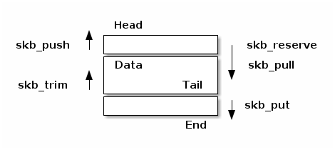

### 网络设备

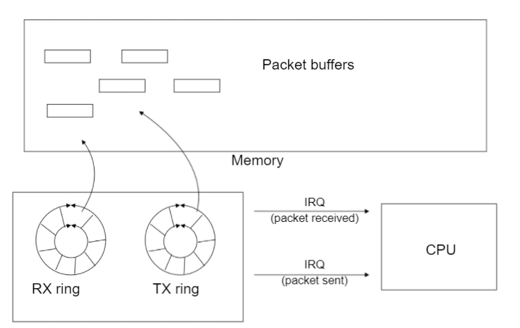

* Scatter-Gather（散列-聚集）
* 校验和外包：以太网、IP、UDP、TCP
* 自适应中断处理（聚合、自适应）

### 硬件和软件加速技术

* 完全外包——在硬件中实现 TCP/IP 协议栈
* 问题：

  * 连接数量的扩展
  * 安全性
  * 一致性
* 性能与要处理的数据包数量成正比
* 例如：如果一个端点可以每秒处理 60K 个数据包

  * 1538 MSS -> 738Mbps
  * 2038 MSS -> 978Mbps
  * 9038 MSS -> 4.3Gbps
  * 20738 MSS -> 9.9Gbps
* 网络堆栈处理大数据包
* 发送路径：硬件将大数据包分割为较小的数据包（TCP 分段外包）
* 接收路径：硬件将小数据包聚合成较大的数据包（大体量接收外包——简称 LRO）

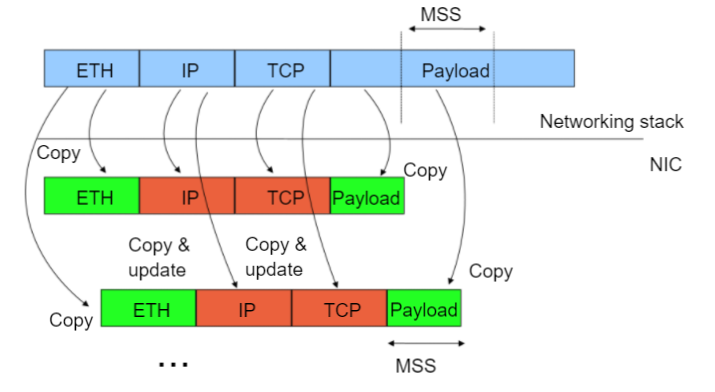


