出于对文章范围的严谨性的限制，本文的讨论范围限定在类Unix系统而非纯粹的GNU/Linux下，主要因为**Unix** 的进程管理基于经典的 `fork()/exec()`模型，调度和 IPC 机制较为简单，适合早期单核系统，当然，也更适合学习。

## 进程基础

进程是操作系统的抽象概念，用于组织多个资源，包括：

* 地址空间
* 共享内存区域
* 一个或多个线程
* 定时器（Timer）
* 打开的文件（文件描述符）
* 信号处理程序（Signal Handler）
* 套接字（Socket）
* 其他资源以及状态信息
* 信号量（semaphore）

所有这些信息都被组织在进程控制块（PCB）中。在 Linux 中，PCB 对应的结构体是 `struct task_struct`，定义在 `/includes/linux/sched.h`中：

```c
struct task_struct {                        
  /* these are hardcoded - don't touch */   
  long state;	/* -1 unrunnable, 0 runnable, >0 stopped */  
  long counter;                             
  long priority;                            
  long signal;                              
  struct sigaction sigaction[32];           
  long blocked;	/* bitmap of masked signals */   
  /* various fields */                      
  int exit_code;                            
  unsigned long start_code,end_code,end_data,brk,start_stack; 
  long pid,father,pgrp,session,leader;      
  unsigned short uid,euid,suid;             
  unsigned short gid,egid,sgid;             
  long alarm;                               
  long utime,stime,cutime,cstime,start_time;  
  unsigned short used_math;                 
  /* file system info */                    
  int tty;		/* -1 if no tty, so it must be signed */  
  unsigned short umask;                     
  struct m_inode * pwd;                     
  struct m_inode * root;                    
  struct m_inode * executable;              
  unsigned long close_on_exec;              
  struct file * filp[NR_OPEN];              
  /* ldt for this task 0 - zero 1 - cs 2 - ds&ss */   
  struct desc_struct ldt[3];                
  /* tss for this task */                   
  struct tss_struct tss;                    
};                                          

```

### 自顶向下，初探UNIX进程

我们可以在 /proc/`<pid>` 目录中获取关于进程资源的摘要信息，其中 `<pid>` 是我们要查看的进程的进程 ID。

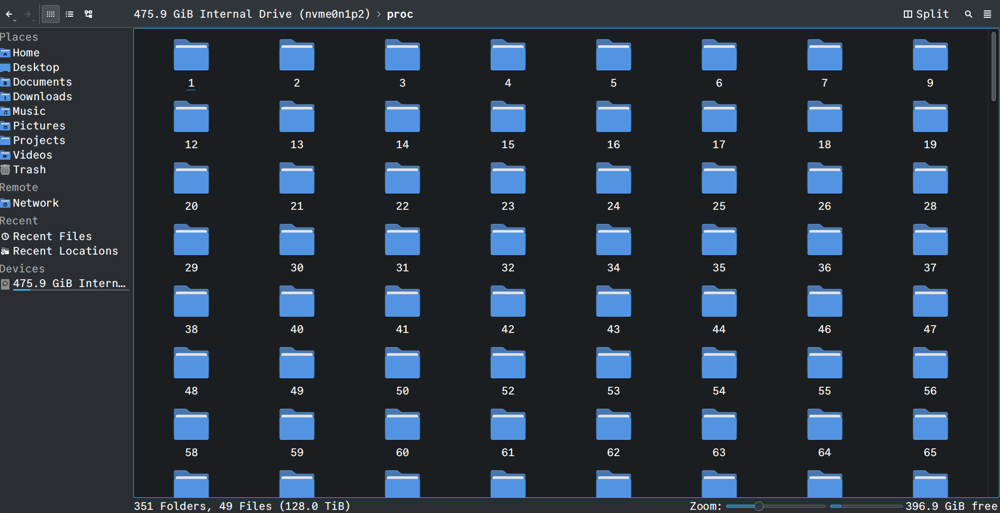

聪明如你，应该发现了一个奇怪的地方：

> 这块硬盘的大小只有475.9GB，但是这个proc文件夹的大小却高达128TB！
>
> 岂不是说内存都快比硬盘还大了？

这里的讨论就超出了本文的进程内容，只用知道，这里的128TB是虚拟内存的大小就行了，并不是真正的内存大小。

我们也可以通过指令的形式来查虚拟进程目录 `/proc`，这里我们来看看一个重要的虚拟进程目录 `/proc/self`

```c
                +-------------------------------------------------------------------+
                | dr-x------    2 tavi tavi 0  2021 03 14 12:34 .                   |
                | dr-xr-xr-x    6 tavi tavi 0  2021 03 14 12:34 ..                  |
                | lrwx------    1 tavi tavi 64 2021 03 14 12:34 0 -> /dev/pts/4     |
           +--->| lrwx------    1 tavi tavi 64 2021 03 14 12:34 1 -> /dev/pts/4     |
           |    | lrwx------    1 tavi tavi 64 2021 03 14 12:34 2 -> /dev/pts/4     |
           |    | lr-x------    1 tavi tavi 64 2021 03 14 12:34 3 -> /proc/18312/fd |
           |    +-------------------------------------------------------------------+
           |                 +----------------------------------------------------------------+
           |                 | 08048000-0804c000 r-xp 00000000 08:02 16875609 /bin/cat        |
$ ls -1 /proc/self/          | 0804c000-0804d000 rw-p 00003000 08:02 16875609 /bin/cat        |
cmdline    |                 | 0804d000-0806e000 rw-p 0804d000 00:00 0 [heap]                 |
cwd        |                 | ...                                                            |
environ    |    +----------->| b7f46000-b7f49000 rw-p b7f46000 00:00 0                        |
exe        |    |            | b7f59000-b7f5b000 rw-p b7f59000 00:00 0                        |
fd --------+    |            | b7f5b000-b7f77000 r-xp 00000000 08:02 11601524 /lib/ld-2.7.so  |
fdinfo          |            | b7f77000-b7f79000 rw-p 0001b000 08:02 11601524 /lib/ld-2.7.so  |
maps -----------+            | bfa05000-bfa1a000 rw-p bffeb000 00:00 0 [stack]                |
mem                          | ffffe000-fffff000 r-xp 00000000 00:00 0 [vdso]                 |
root                         +----------------------------------------------------------------+
stat                 +----------------------------+
statm                |  Name: cat                 |
status ------+       |  State: R (running)        |
task         |       |  Tgid: 18205               |
wchan        +------>|  Pid: 18205                |
                     |  PPid: 18133               |
                     |  Uid: 1000 1000 1000 1000  |
                     |  Gid: 1000 1000 1000 1000  |
                     +----------------------------+
```

**/proc/self/** 目录包含与当前进程相关的各种文件和子目录，这些文件提供了进程的运行时状态、资源使用情况以及其他元数据。

* **cmdline** : 包含进程的完整命令行参数，以 null 字符（**\0**）分隔。
* **comm** : 包含进程的命令名称（可执行文件的名称）。
* **environ** : 包含进程的环境变量列表，以 null 字符分隔。
* **exe** : 一个符号链接，指向进程的可执行文件。
* **fd/** : 一个目录，包含进程打开的文件描述符（file descriptors）的符号链接，每个文件描述符以数字命名。
* **maps** : 显示进程的内存映射信息，包括代码段、数据段、堆、栈以及共享库的地址范围。
* **status** : 提供进程的详细状态信息，如 PID、PPID、内存使用、线程数、用户/组 ID 等。
* **stat** : 提供进程的统计信息，以空格分隔的数字格式，包含 CPU 使用、状态、优先级等。
* **limits** : 显示进程的资源限制，如最大文件描述符数、最大内存等。
* **cwd** : 一个符号链接，指向进程的当前工作目录（current working directory）。
* **root** : 一个符号链接，指向进程的根目录（通常是 **/**，但在 chroot 环境中可能不同）。
* **mounts** : 列出进程可见的挂载点信息。
* **sched** : 提供调度相关的信息，如优先级和调度策略。
* **task/** : 一个目录，包含子目录，每个子目录对应进程的一个线程，内容类似于 **/proc/self/**。
* **fdinfo/** : 包含每个文件描述符的详细信息，如文件位置、标志等。
* **net/** : 包含与网络相关的信息，如网络接口、协议统计等。
* **auxv** : 包含传递给进程的辅助向量（auxiliary vector）信息

值得一提的是，/proc/self其实一个**动态生成的符号链接**， 实际上是指向 **/proc/<当前进程PID>**，因此每次访问时都会解析到正确的进程目录。

除了/self之外，/proc中其他的文件也起到了提供信息的作用。**/proc** 文件系统（包括 **/proc/self/**）的设计理念是将内核和进程信息以文件系统的形式暴露，旨在提供一种简单、灵活且用户友好的方式来访问内核和进程的运行时信息。通过文本文件和层次化结构，它为用户、管理员和开发者提供了一种通用的、低门槛的方式来访问系统状态，同时保持了安全性和高效性。

这种设计在 Linux 的历史中被证明是成功的，尽管随着系统复杂性增加，新的接口也在逐步补充和优化其功能。

:::note

UNIX 的核心哲学之一是“一切皆文件”。

:::

### 自底向上的操作系统进程

#### 什么是进程

所谓进程——

——从理论角度看，是对正在运行的程序过程的抽象；

——从实现角度看，是一种数据结构，目的在于清晰地刻画动态系统的内在规律，有效管理和调度进入计算机系统主存储器运行的程序。

要我说，进程就像写字楼里的工作间，所有的文件和工具都被陈列出来，一个程序可以任意地在工作间里工作，一旦操作系统需要做新的工作，就会给新的工作间招聘一个员工，等他干完活就给开了...

#### 进程 vs. 程序

上面我们展示了task_struct中的进程PCB，未免有些过于复杂。其实简单来说，进程不过三个部分：代码段、数据段、堆栈段。对应到Linux进程中就是：程序、数据、进程控制块PCB。

相比于"程序"本身，"进程"更多的是提供一种对程序的管理方式，提供了一些就像是它们的 “身份标签” 和 “行为准则”的属性。

* 程序是一组指令的集合，它静态存储于诸如磁盘之类的存储器里；
* 当一个程序被操作系统执行时，它就会被载入内存空间，并在逻辑上产生一个独立的实例，这就是进程。

比如，每个进程都有一个唯一的**进程标识符**（PID），这就好比每个人的身份证号码，系统通过 PID 来识别和管理不同的进程。

进程还有自己的**状态**，常见的状态包括运行态（R）、睡眠态（S）、停止态（T）和僵尸态（Z）等 。运行态表示进程正在 CPU 上执行或准备执行；睡眠态则是进程在等待某个事件的完成，比如等待 I/O 操作结束；停止态是进程被暂停，通常是因为接收到了特定的信号；僵尸态比较特殊，当子进程结束运行但父进程没有回收其资源时，子进程就会进入僵尸态。

**进程的优先级**也很重要，它决定了进程获取 CPU 时间的先后顺序。优先级高的进程会优先被调度执行，就像在医院里，急诊病人会比普通病人优先得到救治一样。在 Linux 系统中，进程的优先级可以通过 nice 值来调整，nice 值的范围是 -20 到 19，值越小优先级越高。不过，普通用户只能在一定范围内调整自己进程的 nice 值，而 root 用户则拥有更大的权限。

## 线程基础

### 层次化

计算机科学领域的黄金法则：

> 计算机科学领域的任何问题，都可以通过增加一个间接的中间层来解决。
> Any problem in computer science could be solved by another layer of indirection.

进程也是在这种层次化的思路被发明的。

交给计算机的任务，大致可以分为两类：**I/O 密集型任务**和 **CPU 密集型任务**。

所谓CPU 密集型任务，在执行过程中，需要大量的 CPU 资源。对于这种任务，我们可以大胆地将 CPU 资源交给它来调用——反正总是要占用 CPU 资源的。

相对应的，涉及到磁盘 I/O、网络存取的任务，就都是 I/O 密集型任务；此类任务往往不需要太多 CPU 资源，对于 CPU 来说，大多数时间被空耗在等待 I/O 完成上了。

当人们认识到交给计算机的任务可以分为这两类的时候，人们就开始考虑如何做 CPU 的任务调度。毕竟我们不能让IO密集时，CPU却长久地闲置着。在任务调度上，人们经历了 **多道程序** 、**分时系统**与**多任务系统**等阶段。

前两者超出了我们的讨论范围。在多任务系统中，**操作系统**接管了所有硬件资源并持有对硬件控制的最高权限。在操作系统中执行的程序，都以进程的方式运行在更低的权限中。所有的硬件资源，由操作系统根据进程的优先级以及进程的运行状况进行统一的调配。

然而，随着 CPU 频率增长逐渐停滞，CPU 开始向多核的方向发展。为了让多个 CPU 核心同时为我们工作，并行地执行任务，就需要涉及线程的概念。线程的英文是 Thread，有时也称为轻量级进程 (Lightweight Process)，它是操作系统进行任务调度的**最小单元**。线程存活于进程之中；同一个进程中的线程，共享一个虚拟内存空间，以及其中的资源；线程之间各自持有自己的线程 ID、当前指令的指针（PC）、寄存器集合以及栈。

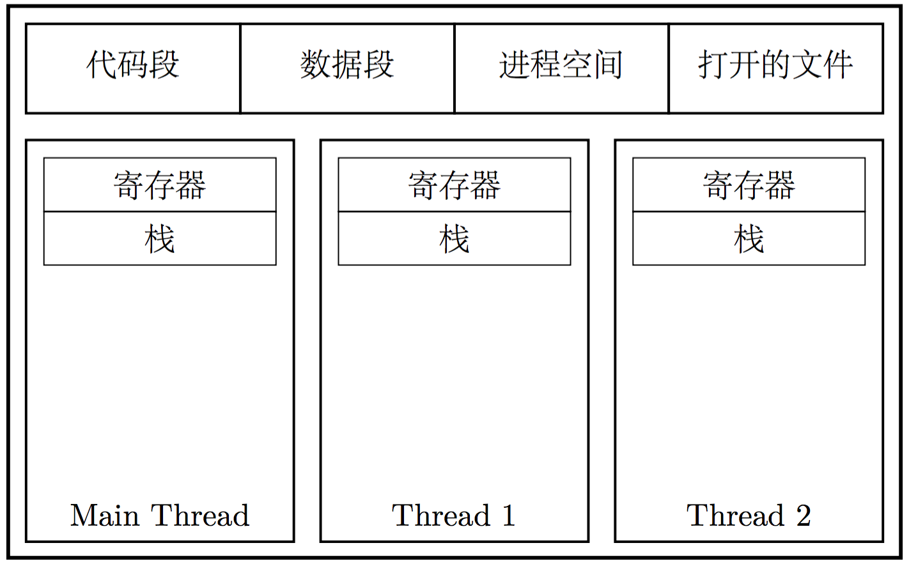

### 3种线程实现机制

**内核态线程实现** ：在内核空间实现的线程，由内核直接管理直接管理线程。

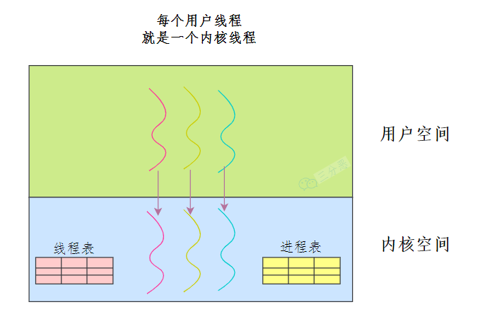

**⽤户态线程实现** ：在⽤户空间实现线程，不需要内核的参与，内核对线程无感知。

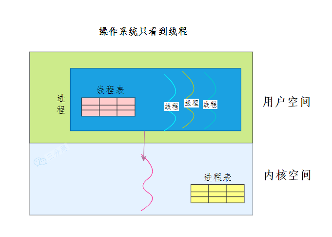

**混合线程实现** ：现代操作系统基本都是将两种方式结合起来使用。

用户态的执行系统负责进程内部线程在非阻塞时的切换；内核态的操作系统负责阻塞线程的切换。即我们同时实现内核态和用户态线程管理。其中内核态线程数量较少，而用户态线程数量较多。每个内核态线程可以服务一个或多个用户态线程。

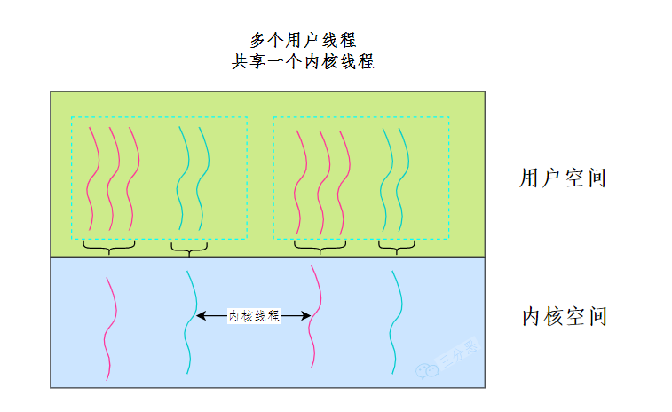

### 进程 vs. 线程

线程具有以下特点：

* 每个线程都拥有独立的堆栈，这个堆栈与线程的寄存器的值共同决定了线程的运行状态
* 线程在进程的上下文中运行，同一进程中的所有线程共享资源
* 内核调度的是线程而不是进程，用户级线程（例如纤程（fiber）、协程（coroutine）等）在内核级别不可见

每个进程在独立的地址空间中运行，不会直接影响其他进程。线程共享同一个进程的内存空间、全局变量和文件描述符。

进程切换需要保存和恢复大量的上下文信息，代价较高。线程切换相对较轻量，因为线程共享进程的地址空间，只需要保存和恢复线程私有的数据。

线程的生命周期由进程控制，进程终止时，其所有线程也会终止。

| 特性       | 进程                         | 线程                             |
| ---------- | ---------------------------- | -------------------------------- |
| 地址空间   | 独立                         | 共享                             |
| 内存开销   | 高                           | 低                               |
| 上下文切换 | 慢，开销大                   | 快，开销小                       |
| 通信       | 需要 IPC 机制，开销较大      | 共享内存，直接通信               |
| 创建销毁   | 开销大，较慢                 | 开销小，较快                     |
| 并发性     | 低                           | 高                               |
| 崩溃影响   | 一个进程崩溃不会影响其他进程 | 一个线程崩溃可能导致整个进程崩溃 |

典型的线程实现是将线程实现为单独的数据结构，然后将其链接到进程数据结构。例如，Windows 内核就使用了这样的实现方式：

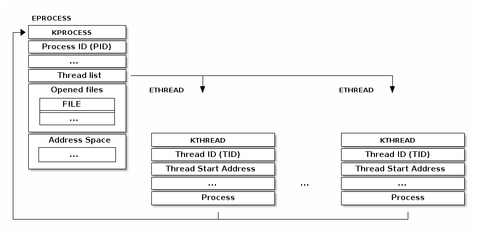

Linux 采用了不同的线程实现方式。其基本单位被称为“任务”（task）（因此其结构类型名为 `struct task_struct`），它既可以用于任务也可以用于进程。与将资源直接嵌入到任务结构体中的典型实现不同，它包含了指向这些资源的指针。

因此，如果两个线程属于同一个进程，它们将指向相同的资源结构体实例。如果两个线程属于不同进程，它们将指向不同的资源结构体实例。

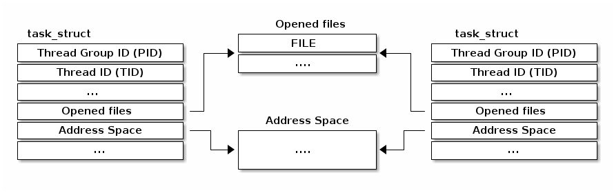

通常来说，使用多线程会带来一下一些优势：

* 将等待 I/O 操作的时间，调度到其他线程执行，提高 CPU 利用率；
* 将计算密集型的操作留给工作线程，预留线程保持与用户的交互；
* 在多 CPU/多核计算机下，有效吃干计算能力；
* 相比多进程的程序，更有效地进行数据共享（在同一个进程空间）。

## Linux 上的特殊进程

### 守护进程

**守护进程**，也被称为**精灵进程**，在后台持续运行，执行着各种重要的系统任务 。与普通进程不同，守护进程脱离于终端运行，这意味着它们不受终端的控制，也不会在终端上显示输出信息，即使终端关闭，守护进程依然能够继续运行 。

守护进程具有一些显著的特点。首先，它们在后台长期运行，通常在系统启动时就被自动启动，并且一直持续运行到系统关闭 。比如，系统日志守护进程syslogd，它负责收集和记录系统中的各种日志信息，从系统启动的那一刻起，它就开始默默地工作，记录着系统运行过程中的点点滴滴，为系统管理员提供了重要的故障排查和系统监控依据 。其次，守护进程没有控制终端，这使得它们能够独立运行，不依赖于用户的交互操作 。例如，网络守护进程sshd，它允许用户通过 SSH 协议远程登录到系统，即使没有用户在本地终端进行操作，sshd依然在后台监听网络端口，等待用户的连接请求，保障了远程管理的便捷性 。另外，守护进程通常以系统权限运行，这赋予了它们访问系统关键资源和执行重要任务的能力 。比如，cron守护进程，它负责执行周期性的任务，如定时备份文件、更新系统软件等，需要具备足够的权限来操作相关的文件和目录 。

在 Linux 系统中，有许多常见的守护进程。除了前面提到的syslogd、sshd和cron，还有httpd（Apache Web 服务器守护进程），它负责处理 Web 服务器的请求，使得我们能够在浏览器中访问网站；mysqld（MySQL 数据库服务器守护进程），它管理着 MySQL 数据库，为各种应用程序提供数据存储和检索服务 。这些守护进程在系统中各司其职，共同维持着系统的稳定运行 。

对于守护进程的管理，我们可以使用不同的工具和方法 。在基于 Systemd 的系统中，使用systemctl命令来管理守护进程非常方便 。比如，要启动httpd守护进程，可以使用 `systemctl start httpd`命令；要停止它，使用 `systemctl stop httpd`命令；要查看其状态，使用 `systemctl status httpd`命令 。如果希望httpd守护进程在系统启动时自动启动，可以使用 `systemctl enable httpd`命令；如果不想让它自动启动，则使用 `systemctl disable httpd`命令 。另外，对于一些简单的守护进程，我们也可以使用nohup命令来启动，它可以让进程在后台运行，并且忽略挂断信号 。例如，`nohup my_daemon &`可以将my_daemon这个守护进程在后台启动，输出信息会被重定向到nohup.out文件中 。还有supervisor，它是一个功能强大的进程管理工具，可以方便地管理和监控守护进程 。通过配置supervisor的配置文件，我们可以定义守护进程的启动命令、自动重启策略、日志输出等 。比如，在 `/etc/supervisor/conf.d/`目录下创建一个守护进程的配置文件，然后使用 `supervisorctl`命令来启动、停止、重启守护进程，还可以查看其状态和日志 。

### 僵尸进程与孤儿进程

在 Linux 进程里，**僵尸进程**和**孤儿进程**是两种比较特殊的进程状态，它们有着独特的产生原因和特点。

僵尸进程是指子进程已经终止运行，但父进程没有调用wait或waitpid函数来获取子进程的退出状态信息，此时子进程就会变成僵尸进程 。从系统的角度看，僵尸进程虽然已经不再占用 CPU 等运行资源，但它的进程描述符仍然保留在系统中，占用着进程表的一个位置 。如果系统中存在大量的僵尸进程，会导致进程号资源被大量占用，因为系统所能使用的进程号是有限的，当进程号耗尽时，系统将无法创建新的进程，这会对系统的正常运行造成严重影响 。

例如，我们来看下面这段 C 代码：

```c
#include <stdio.h>
#include <stdlib.h>
#include <unistd.h>

int main() {
    pid_t pid = fork();
    if (pid < 0) {
        perror("fork");
        exit(1);
    } else if (pid == 0) {
        // 子进程
        printf("Child process, PID: %d\n", getpid());
        exit(0);
    } else {
        // 父进程
        printf("Parent process, PID: %d\n", getpid());
        while (1) {
            sleep(1);
        }
    }
    return 0;
}
```

在这段代码中，父进程创建子进程后，子进程很快退出，但父进程没有调用 `wait`或 `waitpid`来处理子进程的退出，此时子进程就会变成僵尸进程 。我们可以通过 `ps -aux`命令查看进程状态，会发现处于僵尸状态的子进程，其状态字段显示为Z 。

为了避免僵尸进程的产生，我们可以采取一些措施 。一种方法是在父进程中调用 `wait`或 `waitpid`函数来等待子进程的结束，并获取其退出状态信息 。`wait`函数会使父进程阻塞，直到有子进程结束；`waitpid`函数则更加灵活，可以指定等待特定的子进程，并且可以设置非阻塞模式 。例如：

```c
#include <stdio.h>
#include <stdlib.h>
#include <unistd.h>
#include <sys/wait.h>

int main() {
    pid_t pid = fork();
    if (pid < 0) {
        perror("fork");
        exit(1);
    } else if (pid == 0) {
        // 子进程
        printf("Child process, PID: %d\n", getpid());
        exit(0);
    } else {
        // 父进程
        printf("Parent process, PID: %d\n", getpid());
        int status;
        waitpid(pid, &status, 0);
        printf("Child process has exited\n");
    }
    return 0;
}
```

在这个改进的代码中，父进程调用了 `waitpid`函数等待子进程结束，这样就不会产生僵尸进程 。

另一种避免僵尸进程的方法是利用信号机制 。当子进程结束时，会向父进程发送 `SIGCHLD`信号，我们可以在父进程中注册 `SIGCHLD`信号的处理函数，在处理函数中调用 `wait`或 `waitpid`来处理子进程的退出 。例如：

```c
#include <stdio.h>
#include <stdlib.h>
#include <unistd.h>
#include <sys/wait.h>
#include <signal.h>

void sigchld_handler(int signo) {
    pid_t pid;
    int status;
    while ((pid = waitpid(-1, &status, WNOHANG)) > 0) {
        printf("Child process %d has exited\n", pid);
    }
}

int main() {
    struct sigaction sa;
    sa.sa_handler = sigchld_handler;
    sigemptyset(&sa.sa_mask);
    sa.sa_flags = SA_RESTART;
    if (sigaction(SIGCHLD, &sa, NULL) == -1) {
        perror("sigaction");
        exit(1);
    }

    pid_t pid = fork();
    if (pid < 0) {
        perror("fork");
        exit(1);
    } else if (pid == 0) {
        // 子进程
        printf("Child process, PID: %d\n", getpid());
        exit(0);
    } else {
        // 父进程
        printf("Parent process, PID: %d\n", getpid());
        while (1) {
            sleep(1);
        }
    }
    return 0;
}
```

在这段代码中，通过 `sigaction`函数注册了 `SIGCHLD`信号的处理函数 `sigchld_handler`，当子进程结束时，会调用该处理函数来处理子进程的退出，从而避免了僵尸进程的产生 。

孤儿进程则是指父进程在子进程之前退出，导致子进程失去了父进程的管理，此时子进程就成为了孤儿进程 。在 Linux 系统中，孤儿进程会被 `init`进程（在 systemd 系统中通常是systemd进程）收养，init进程会负责回收孤儿进程的资源 。例如，下面这段代码：

```c
#include <stdio.h>
#include <stdlib.h>
#include <unistd.h>

int main() {
    pid_t pid = fork();
    if (pid < 0) {
        perror("fork");
        exit(1);
    } else if (pid == 0) {
        // 子进程
        printf("Child process, PID: %d, PPID: %d\n", getpid(), getppid());
        sleep(5);
        printf("Child process, PID: %d, PPID: %d\n", getpid(), getppid());
    } else {
        // 父进程
        printf("Parent process, PID: %d\n", getpid());
        exit(0);
    }
    return 0;
}
```

在这个例子中，父进程创建子进程后立即退出，子进程在睡眠 5 秒前后查看自己的父进程 ID，会发现父进程 ID 变成了init进程的 ID（通常为 1），说明子进程已经被init进程收养，成为了孤儿进程 。

孤儿进程本身对系统并没有太大的危害，因为init进程会妥善处理它们的资源回收 。但在某些情况下，我们可能需要对孤儿进程进行特殊的处理或监控 。比如，如果我们希望在孤儿进程中执行一些特定的清理操作，可以在子进程中检测父进程是否已经退出，如果发现父进程退出，就执行相应的清理代码 。例如：

```c
#include <stdio.h>
#include <stdlib.h>
#include <unistd.h>
#include <sys/types.h>
#include <sys/wait.h>

int main() {
    pid_t pid = fork();
    if (pid < 0) {
        perror("fork");
        exit(1);
    } else if (pid == 0) {
        // 子进程
        sleep(1);
        if (getppid() == 1) {
            printf("I am an orphan process. Performing clean-up...\n");
            // 执行清理操作
        }
        while (1) {
            sleep(1);
        }
    } else {
        // 父进程
        printf("Parent process, PID: %d\n", getpid());
        exit(0);
    }
    return 0;
}
```

在这段代码中，子进程在睡眠 1 秒后检查自己的父进程 ID，如果发现父进程 ID 为 1，说明自己成为了孤儿进程，然后执行相应的清理操作 。

## 上下文切换

### 进程

以下图表展示了 Linux 内核上下文切换过程的概述：

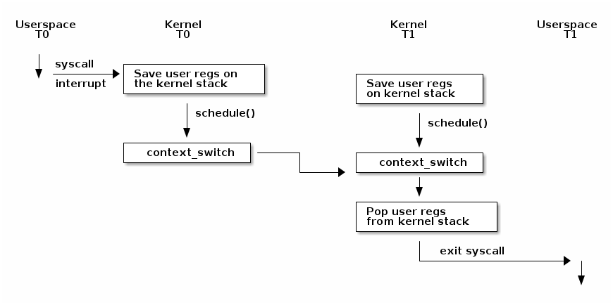

注意，在发生上下文切换之前，我们必须进行内核转换，这可以通过系统调用或中断来实现。此时，用户空间的寄存器会保存在内核堆栈上。在某个时刻，可能会调用 `schedule(`)函数，该函数决定从线程 T0 切换到线程 T1（例如，因为当前线程正在阻塞等待 I/O 操作完成，或者因为它的时间片已经耗尽）。

此时，`context_switch()`函数将执行特定于体系结构的操作，并在需要时切换地址空间：

```c
static __always_inline struct rq *
context_switch(struct rq *rq, struct task_struct *prev,
         struct task_struct *next, struct rq_flags *rf)
{
    prepare_task_switch(rq, prev, next);

    /*
     * paravirt 中，这与 switch_to 中的 exit 配对，
     * 将页表重载和后端切换合并为一个超级调用（hypercall）。
     */
    arch_start_context_switch(prev);

    /*
     * kernel -> kernel   lazy + transfer active
     *   user -> kernel   lazy + mmgrab() active
     *
     * kernel ->   user   switch + mmdrop() active
     *   user ->   user   switch
     */
    if (!next->mm) {                                // 到内核
        enter_lazy_tlb(prev->active_mm, next);

        next->active_mm = prev->active_mm;
        if (prev->mm)                           // 来自用户
            mmgrab(prev->active_mm);
        else
            prev->active_mm = NULL;
    } else {                                        // 到用户
        membarrier_switch_mm(rq, prev->active_mm, next->mm);
        /*
         * sys_membarrier() 在设置 rq->curr / membarrier_switch_mm() 和返回用户空间之间需要一个 smp_mb()。
         *
         * 下面通过 switch_mm() 或者在 'prev->active_mm == next->mm' 的情况下通过 finish_task_switch() 的 mmdrop() 来提供这个功能。
         */
        switch_mm_irqs_off(prev->active_mm, next->mm, next);

        if (!prev->mm) {                        // 来自内核
            /* 在 finish_task_switch() 中进行 mmdrop()。 */
            rq->prev_mm = prev->active_mm;
            prev->active_mm = NULL;
        }
    }

    rq->clock_update_flags &= ~(RQCF_ACT_SKIP|RQCF_REQ_SKIP);

    prepare_lock_switch(rq, next, rf);

    /* 在这里我们只切换寄存器状态和堆栈。 */
    switch_to(prev, next, prev);
    barrier();

    return finish_task_switch(prev);
  }
```

它将调用特定于架构的 `switch_to`宏实现来切换寄存器状态和内核堆栈。请注意，寄存器被保存在堆栈上，并且堆栈指针被保存在 `task_struct`中：

```assemble
#define switch_to(prev, next, last)               \
do {                                              \
    ((last) = __switch_to_asm((prev), (next)));   \
} while (0)


/*
 * %eax: prev task
 * %edx: next task
 */
.pushsection .text, "ax"
SYM_CODE_START(__switch_to_asm)
    /*
     * 保存被调用者保存的寄存器
     * 其必须与 struct inactive_task_frame 中的顺序匹配
     */
    pushl   %ebp
    pushl   %ebx
    pushl   %edi
    pushl   %esi
    /*
     * 保存标志位以防止 AC 泄漏。如果 objtool 支持 32 位，则可以消除此项需求，以验证 STAC/CLAC 的正确性。
     */
    pushfl

    /* 切换堆栈 */
    movl    %esp, TASK_threadsp(%eax)
    movl    TASK_threadsp(%edx), %esp

  #ifdef CONFIG_STACKPROTECTOR
    movl    TASK_stack_canary(%edx), %ebx
    movl    %ebx, PER_CPU_VAR(stack_canary)+stack_canary_offset
  #endif

  #ifdef CONFIG_RETPOLINE
    /*
     * 当从较浅的调用堆栈切换到较深的堆栈时，RSB 可能会下溢或使用填充有用户空间地址的条目。
     * 在存在这些问题的 CPU 上，用捕获推测执行的条目覆盖 RSB，以防止攻击。
     */
    FILL_RETURN_BUFFER %ebx, RSB_CLEAR_LOOPS, X86_FEATURE_RSB_CTXSW
    #endif

    /* 恢复任务的标志位以恢复 AC 状态。 */
    popfl
    /* 恢复被调用者保存的寄存器 */
    popl    %esi
    popl    %edi
    popl    %ebx
    popl    %ebp

    jmp     __switch_to
  SYM_CODE_END(__switch_to_asm)
  .popsection
```

### 线程

对于线程，上下文切换只是对进程上下文切换进行了一个决策优化：

* 当两个线程不是属于同⼀个进程，则切换的过程就跟进程上下⽂切换⼀样；
* **当两个线程是属于同⼀个进程，因为虚拟内存是共享的，所以在切换时，虚拟内存这些资源就保持不动，只需要切换线程的私有数据、寄存器等不共享的数据** ；

所以，线程的上下⽂切换相⽐进程，开销要⼩很多。

## 线程安全

### Task的阻塞与唤醒

以下图表显示了任务（线程）的状态及其之间可能的转换：

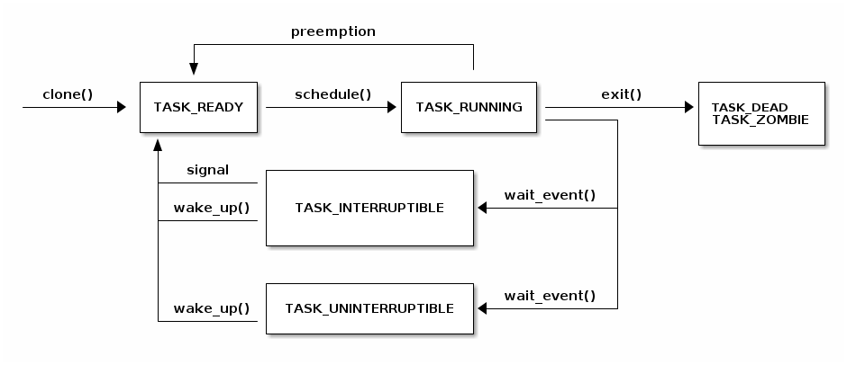

#### 阻塞

阻塞当前线程是一项重要的操作，我们需要执行它来实现高效的任务调度——我们希望在 I/O 操作完成时运行其他线程。

为了实现这一目标，需要执行以下操作：

* 将当前线程状态设置为 TASK_UINTERRUPTIBLE 或 TASK_INTERRUPTIBLE
* 将任务添加到等待队列中
* 调用调度程序，从 READY 队列中选择一个新任务
* 进行上下文切换到新任务

以下是对 `wait_event` 的实现的一些代码片段。请注意，等待队列是一个带有额外信息（如指向任务结构体的指针）的列表。

注意，为了确保在 `wait_event` 和 `wake_up` 之间不会发生死锁，任务会在检查 `condition` 之前被添加到列表中，并且调用 `schedule()` 之前会进行信号（signal）检查。

```c
/**
 * wait_event——在条件为真之前一直保持睡眠状态
 * @wq_head: 等待队列
 * @condition: 用于等待的事件的 C 表达式
 *
 * 进程会进入睡眠状态（TASK_UNINTERRUPTIBLE），直到 @condition 为真为止。
 * 每次唤醒等待队列 @wq_head 时，都会检查 @condition。
 *
 * 在更改任何可能改变等待条件结果的变量后，必须调用 wake_up()。
 */
#define wait_event(wq_head, condition)            \
do {                                              \
  might_sleep();                                  \
  if (condition)                                  \
          break;                                  \
  __wait_event(wq_head, condition);               \
} while (0)

#define __wait_event(wq_head, condition)                                  \
    (void)___wait_event(wq_head, condition, TASK_UNINTERRUPTIBLE, 0, 0,   \
                        schedule())

/*
 * 下面的宏 ___wait_event() 在 wait_event_*() 宏中使用时，有一个显式的 __ret
 * 变量的影子。
 *
 * 这是为了两者都可以使用 ___wait_cond_timeout() 结构来包装条件。
 *
 * wait_event_*() 中 __ret 变量的类型不一致也是有意而为的；我们在可以返回超时值的情况下使用 long，否则使用 int。
 */
#define ___wait_event(wq_head, condition, state, exclusive, ret, cmd)    \
({                                                                       \
    __label__ __out;                                                     \
    struct wait_queue_entry __wq_entry;                                  \
    long __ret = ret;       /* 显式影子变量 */                        \
                                                                         \
    init_wait_entry(&__wq_entry, exclusive ? WQ_FLAG_EXCLUSIVE : 0);     \
    for (;;) {                                                           \
        long __int = prepare_to_wait_event(&wq_head, &__wq_entry, state);\
                                                                         \
        if (condition)                                                   \
            break;                                                       \
                                                                         \
        if (___wait_is_interruptible(state) && __int) {                  \
            __ret = __int;                                               \
            goto __out;                                                  \
        }                                                                \
                                                                         \
        cmd;                                                             \
    }                                                                    \
    finish_wait(&wq_head, &__wq_entry);                                  \
   __out:  __ret;                                                        \
 })

 void init_wait_entry(struct wait_queue_entry *wq_entry, int flags)
 {
    wq_entry->flags = flags;
    wq_entry->private = current;
    wq_entry->func = autoremove_wake_function;
    INIT_LIST_HEAD(&wq_entry->entry);
 }

 long prepare_to_wait_event(struct wait_queue_head *wq_head, struct wait_queue_entry *wq_entry, int state)
 {
     unsigned long flags;
     long ret = 0;

     spin_lock_irqsave(&wq_head->lock, flags);
     if (signal_pending_state(state, current)) {
      /*
      * 如果被唤醒选择的是独占等待者，那么它不能失败，
      * 它应该“消耗”我们等待的条件。
      *
      * 调用者将重新检查条件，并在我们已被唤醒时返回成功，我们不能错过事件，因为唤醒会锁定/解锁相同的 wq_head->lock。
      *
      * 但是我们需要确保在设置条件后+之后的唤醒看不到我们，如果我们失败的话，它应该唤醒另一个独占等待者。
      */
         list_del_init(&wq_entry->entry);
         ret = -ERESTARTSYS;
     } else {
         if (list_empty(&wq_entry->entry)) {
             if (wq_entry->flags & WQ_FLAG_EXCLUSIVE)
                 __add_wait_queue_entry_tail(wq_head, wq_entry);
             else
                 __add_wait_queue(wq_head, wq_entry);
         }
         set_current_state(state);
     }
     spin_unlock_irqrestore(&wq_head->lock, flags);

     return ret;
 }

 static inline void __add_wait_queue(struct wait_queue_head *wq_head, struct wait_queue_entry *wq_entry)
 {
     list_add(&wq_entry->entry, &wq_head->head);
 }

 static inline void __add_wait_queue_entry_tail(struct wait_queue_head *wq_head, struct wait_queue_entry *wq_entry)
 {
     list_add_tail(&wq_entry->entry, &wq_head->head);
 }

/**
* finish_wait - 在队列中等待后进行清理
* @wq_head: 等待的等待队列头
* @wq_entry: 等待描述符
*
* 将当前线程设置回运行状态，并从给定的等待队列中移除等待描述符（如果仍在队列中）。
*/
void finish_wait(struct wait_queue_head *wq_head, struct wait_queue_entry *wq_entry)
{
   unsigned long flags;

   __set_current_state(TASK_RUNNING);
   /*
   * 我们可以在锁之外检查链表是否为空，前提是：
   *  - 我们使用了“careful”检查，验证了 next 和 prev 指针，以确保没有我们还没有看到的其他 CPU 上可能仍在进行的半完成更新（可能仍会更改堆栈区域）。
   * 并且
   *  - 所有其他用户都会获取锁（也就是说，只有一个其他 CPU 可以查看或修改链表）。
   */
   if (!list_empty_careful(&wq_entry->entry)) {
      spin_lock_irqsave(&wq_head->lock, flags);
      list_del_init(&wq_entry->entry);
      spin_unlock_irqrestore(&wq_head->lock, flags);
   }
}
```

#### 唤醒

我们可以使用 `wake_up` 来唤醒任务。唤醒任务需要执行以下高级操作：

* 从等待队列中选择一个任务
* 将任务状态设置为 TASK_READY
* 将任务插入调度器的 READY 队列中
* 在 SMP 系统上，这是一个复杂的操作：每个处理器都有自己的队列，队列需要平衡，需要向 CPU 发送信号

```c
#define wake_up(x)                        __wake_up(x, TASK_NORMAL, 1, NULL)

/**
 * __wake_up - 唤醒在等待队列上阻塞的线程。
 * @wq_head: 等待队列
 * @mode: 哪些线程
 * @nr_exclusive: 要唤醒的线程数（一次唤醒一个或一次唤醒多个）
 * @key: 直接传递给唤醒函数
 *
 * 如果此函数唤醒了一个任务，则在访问任务状态之前执行完全的内存屏障。
 */
void __wake_up(struct wait_queue_head *wq_head, unsigned int mode,
               int nr_exclusive, void *key) {
  __wake_up_common_lock(wq_head, mode, nr_exclusive, 0, key);
}

static void __wake_up_common_lock(struct wait_queue_head *wq_head, unsigned int mode,
                                  int nr_exclusive, int wake_flags, void *key) {
  unsigned long flags;
  wait_queue_entry_t bookmark;

  bookmark.flags = 0;
  bookmark.private = NULL;
  bookmark.func = NULL;
  INIT_LIST_HEAD(&bookmark.entry);

  do {
          spin_lock_irqsave(&wq_head->lock, flags);
          nr_exclusive = __wake_up_common(wq_head, mode, nr_exclusive,
                                          wake_flags, key, &bookmark);
          spin_unlock_irqrestore(&wq_head->lock, flags);
  } while (bookmark.flags & WQ_FLAG_BOOKMARK);
}

/*
 * 核心唤醒函数。非独占唤醒（nr_exclusive == 0）会唤醒所有任务。如果是独占唤醒（nr_exclusive == 一个小正数），则唤醒所有非独占任务和一个独占任务。
 *
 * 在某些情况下，我们可能会尝试唤醒已经开始运行但不处于 TASK_RUNNING 状态的任务。在这种（罕见）情况下，try_to_wake_up() 会返回零，我们通过继续扫描队列来处理它。
 */
static int __wake_up_common(struct wait_queue_head *wq_head, unsigned int mode,
                            int nr_exclusive, int wake_flags, void *key,
                            wait_queue_entry_t *bookmark) {
  wait_queue_entry_t *curr, *next;
  int cnt = 0;

  lockdep_assert_held(&wq_head->lock);

  if (bookmark && (bookmark->flags & WQ_FLAG_BOOKMARK)) {
          curr = list_next_entry(bookmark, entry);

          list_del(&bookmark->entry);
          bookmark->flags = 0;
  } else
          curr = list_first_entry(&wq_head->head, wait_queue_entry_t, entry);

  if (&curr->entry == &wq_head->head)
          return nr_exclusive;

  list_for_each_entry_safe_from(curr, next, &wq_head->head, entry) {
          unsigned flags = curr->flags;
          int ret;

          if (flags & WQ_FLAG_BOOKMARK)
                  continue;

          ret = curr->func(curr, mode, wake_flags, key);
          if (ret < 0)
                  break;
          if (ret && (flags & WQ_FLAG_EXCLUSIVE) && !--nr_exclusive)
                  break;

          if (bookmark && (++cnt > WAITQUEUE_WALK_BREAK_CNT) &&
                  (&next->entry != &wq_head->head)) {
                  bookmark->flags = WQ_FLAG_BOOKMARK;
                  list_add_tail(&bookmark->entry, &next->entry);
                  break;
          }
  }

  return nr_exclusive;
}

int autoremove_wake_function(struct wait_queue_entry *wq_entry, unsigned mode, int sync, void *key) {
  int ret = default_wake_function(wq_entry, mode, sync, key);

  if (ret)
          list_del_init_careful(&wq_entry->entry);

  return ret;
}

int default_wake_function(wait_queue_entry_t *curr, unsigned mode, int wake_flags,
                          void *key) {
  WARN_ON_ONCE(IS_ENABLED(CONFIG_SCHED_DEBUG) && wake_flags & ~WF_SYNC);
  return try_to_wake_up(curr->private, mode, wake_flags);
}

/**
 * try_to_wake_up——唤醒线程
 * @p: 要唤醒的线程
 * @state: 可以被唤醒的任务状态的掩码
 * @wake_flags: 唤醒修改标志 (WF_*)
 *
 * 概念上执行以下操作：
 *
 *   如果 (@state & @p->state)，则 @p->state = TASK_RUNNING。
 *
 * 如果任务没有放进队列/可运行，还将其放回运行队列。
 *
 * 此函数对 schedule() 是原子性的，后者会让该任务出列。
 *
 * 在访问 @p->state 之前，它会触发完整的内存屏障，请参阅 set_current_state() 的注释。
 *
 * 使用 p->pi_lock 来序列化与并发唤醒的操作。
 *
 * 依赖于 p->pi_lock 来稳定下来：
 *  - p->sched_class
 *  - p->cpus_ptr
 *  - p->sched_task_group
 * 以便进行迁移，请参阅 select_task_rq()/set_task_cpu() 的使用。
 *
 * 尽力只获取一个 task_rq(p)->lock 以提高性能。
 * 在以下情况下获取 rq->lock：
 *  - ttwu_runnable()    -- 旧的 rq，不可避免的，参见该处的注释；
 *  - ttwu_queue()       -- 新的 rq，用于任务入队；
 *  - psi_ttwu_dequeue() -- 非常遗憾 :-(，计数将会伤害我们。
 *
 * 因此，我们与几乎所有操作都存在竞争。有关详细信息，请参阅许多内存屏障及其注释。
 *
 * 返回值：如果 @p->state 改变（实际进行了唤醒），则为 %true，否则为 %false。
 */
static int
try_to_wake_up(struct task_struct *p, unsigned int state, int wake_flags)
{
      ...
```

### 抢占/竞争

首先，我们回顾一下线程的特点：

* 每个线程有自己独立的栈；
* 同时多个线程共享进程空间中的数据。

如果每个线程对共享部分数据都是只读的，那么大概不会出现什么问题。但是，如果同时有多个线程尝试对同一份数据进行写入操作，那么最终的结果可能会是不可预期的。考虑这一经典的例子：

* 共享数据 `int i = 0;`；
* 线程 1 试图执行 `++i`；
* 线程 2 试图执行 `--i`。

由于这一句代码会被翻译成多条指令，那么必然存在这样的情况：线程 1 在执行三条指令的过程中被中断，系统调度线程 2 继续执行。这样，在两边线程执行完毕之后，变量 `i` 的值可能是 `0`, `1`, `-1`；而具体取值多少是不可预期的。

这种 **因为多个线程竞争对同一变量进行操作导致不可预期后果的过程，称为线程不安全** 。

> 优秀的程序员不应该对任何不确定的代码做预测，即使一种情况相对另一种发生的概率几乎为0。

除了线程，CSAPP中还提到，Linux中的信号、进程、乃至各种分布式的概念也存在类似的竞争，这种竞争带来了**不确定**的程序运行结果。

这种不确定性的根本原因，是线程中多条指令连续执行的过程可能会被系统调度中断，而现场恢复之后共享变量的值可能已经被修改。因此，如果我们能保证指令的执行不被打断，那么自然就能保证线程安全了。这种特性被称作**原子性**。

显然，单条指令是不可打断的。那么对应单条指令的代码，都是具有原子性的。例如 i386 架构中，有一个 `inc` 指令，可以直接增加内存某个区域的值。这样一来，自增操作就是原子的了。

由单条指令提供的原子性，显然有非常大的局限性——这是因为单条指令能够达成的效果总是有限的。在实际生产中，我们会需要保证连续多条指令的原子性。这就需要引入**同步和锁**的概念。

### 同步与锁机制

同步（Sync）是一种规则，而锁（Lock）则是实现这种规则的具体方法。

所谓同步，指的是多线程程序里，多个线程不得同时对某一共享变量进行访问。锁是实现同步的一种具体方案——准确地说，这是一种非常强的方案。

锁有多种形式，最符合直觉的锁是所谓的 **互斥量（Mutex）** 。具体来说，线程在访问某个共享变量的时候，必须先获取锁；如果获取不到锁，那么就必须等待（或者进行其他操作，总之不许访问这个变量）；在结束对这个变量的访问之后，持有锁的线程应当释放。

值得一提的是，锁作为一种同步手段，是非常强的。但是，这种强，仅限于逻辑层面。在实际情况中，编译器优化（尤其）、CPU 动态调度，都有可能打破锁对于同步的保护。这时候，这些优化就变成了过度优化。

举个例子：

```c
int x = 0;
Thread 1    Thread 2
lock();     lock();
++x;        ++x;
unlock();   unlock();
```

对于共享的变量 `x`，我们在线程 1 和线程 2 中并发地尝试访问它。为了保证线程安全，我们在对它的访问前后加上了锁。

在逻辑上，这已经做到了线程安全，于是在执行完毕之后，`x` 的值应当必然是 2。但是，编译器优化可能会破坏逻辑上的线程安全：如果线程 1 在这之后会多次使用变量 `x`，那么编译器可能会将 `x` 自增后的值存放在寄存器中，暂不写回。于是，在线程 2 中尝试自增 `x` 的时候，获取到的 `x` 的值，可能是尚未从线程 1 的寄存器中更新值的 `x`。整个流程如下：

0. 线程 1：获取锁
1. 线程 1：从 `x` 中读取数据，写入寄存器 `X`
2. 线程 1：`X++`
3. 线程 1：释放锁
4. 线程 2：获取锁
5. 线程 2：从 `x` 中读取数据，写入寄存器 `Y`
6. 线程 2：`Y++`
7. 线程 2：从寄存器 `Y` 中读取数据，写入 `x`
8. 线程 2：释放锁
9. 线程 1：（很久之后）从寄存器 `X` 中读取数据，写入 `x`

显而易见，最终 `x` 的值，取决于寄存器中 `X` 的值；而在这个例子中，它是 `1`。

对于这种情况，我们可以用 C 语言关键字 `volatile`。这个关键字能在两种情况下阻止编译器优化：

* 为了提高速度，将一个变量缓存到寄存器而不写回；
* 调整操作该变量的指令的顺序。

因此，在这个例子里，我们只需要使用 `volatile int x = 0`，就能保证 `x` 变量总是能得到即时的更新了。

#### 线程同步实现

在操作系统层面，保证线程同步的方式有很多，除了锁，还有信号量等机制。

我们先来看看**临界区**的概念：

对共享资源访问的程序片段，我们希望这段代码是 **互斥**的，可以保证在某个时刻只能被一个线程执行，也就是说一个线程在临界区执行时，其它线程应该被阻止进入临界区。

临界区不仅针对线程，同样针对进程。

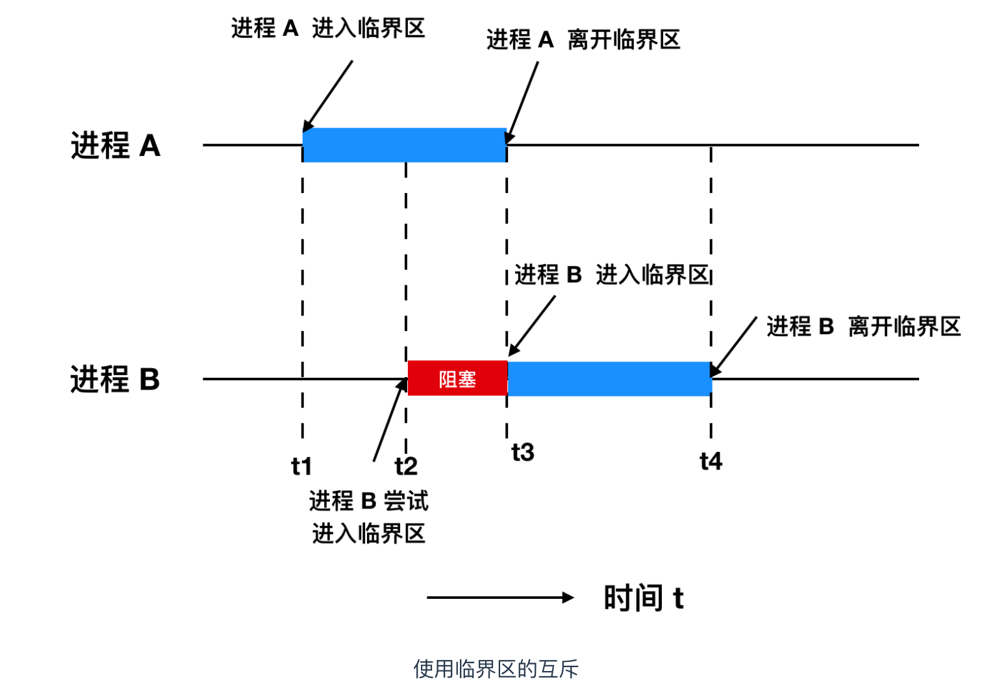

##### 同步锁

任何想进⼊临界区的线程，必须先执⾏加锁操作。若加锁操作顺利通过，则线程可进⼊临界区；在完成对临界资源的访问后再执⾏解锁操作，以释放该临界资源。

加锁和解锁锁住的是什么呢？可以是 临界区对象，也可以只是一个简单的 互斥量，例如互斥量是 `0`无锁，`1`表示加锁。

根据锁的实现不同，可以分为 **忙等待锁**和 **⽆忙等待锁**。

* 忙等待锁（也称为自旋锁，Spinlock）是指当一个线程试图获取锁时，如果该锁已经被其他线程持有，当前线程不会立即进入休眠或阻塞，而是不断地检查锁的状态，直到该锁可用为止。这个过程被称为忙等待（busy waiting），因为线程在等待锁时仍然占用 CPU 资源，处于活跃状态。优点是避免了线程的上下文切换。
* 无忙等待锁是指当一个线程尝试获取锁时，如果锁已经被其他线程持有，当前线程不会忙等待，而是主动让出 CPU，进入阻塞状态或休眠状态，等待锁释放。当锁被释放时，线程被唤醒并重新尝试获取锁。这类锁的主要目的是避免忙等待带来的 CPU 资源浪费。

##### 信号量

信号量是操作系统提供的⼀种协调共享资源访问的⽅法。 **通常表示资源的数量** ，对应的变量是⼀个整型（sem）变量。

另外，还有 **两个原⼦操作的系统调⽤函数来控制信号量** ，分别是：

* *P* 操作：当线程想要进入临界区时，会尝试执行 P 操作。如果信号量的值大于 0，信号量值减 1，线程可以进入临界区；否则，线程会被阻塞，直到信号量大于 0。
* *V* 操作：当线程退出临界区时，执行 V 操作，信号量的值加 1，释放一个被阻塞的线程。

#### 死锁

在两个或者多个并发线程中，如果每个线程持有某种资源，而又等待其它线程释放它或它们现在保持着的资源，在未改变这种状态之前都不能向前推进，称这一组线程产生了死锁。通俗的讲就是两个或多个线程无限期的阻塞、相互等待的一种状态。

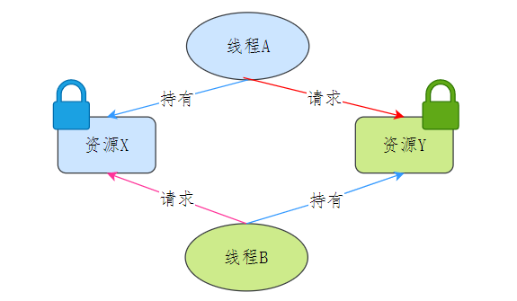

产生死锁需要同时满足四个必要条件：

* **互斥条件** （Mutual Exclusion）：资源不能被多个进程共享，即资源一次只能被一个进程使用。如果一个资源已经被分配给了一个进程，其他进程必须等待，直到该资源被释放。
* **持有并等待条件** （Hold and Wait）：一个进程已经持有了至少一个资源，同时还在等待获取其他被占用的资源。在此期间，该进程不会释放已经持有的资源。
* **不可剥夺条件** （No Preemption）：已分配给进程的资源不能被强制剥夺，只有持有该资源的进程可以主动释放资源。
* **循环等待条件** （Circular Wait）：存在一个进程集合 P1,P2,...,Pn，其中 P1 等待 P2 持有的资源，P2 等待 P3 持有的资源，依此类推，直到 Pn 等待 P1 持有的资源，形成一个进程等待环。

避免死锁，破坏其中的一个就可以。

**1. 消除互斥条件**

无法实现，因为大部分资源只能被一个线程占用，例如锁。

**2. 消除请求并持有条件**

消除这个条件的办法很简单，就是一个线程一次请求其所需要的所有资源。

**3. 消除不可剥夺条件**

占用部分资源的线程进一步申请其他资源时，如果申请不到，可以主动释放它**占有的资源**，这样不可剥夺这个条件就破坏掉了。

**4. 消除环路等待条件**

可以靠按序申请资源来预防。所谓按序申请，是指资源是有**线性顺序**的，申请的时候可以先申请资源序号小的，再申请资源序号大的，这样线性化后就不存在环路了。

#### 其他锁概念

饥饿锁：这个饥饿指的是资源饥饿，某个线程一直等不到它所需要的资源，从而无法向前推进，就像一个人因为饥饿无法成长。

活锁：在活锁状态下，处于活锁线程组里的线程状态可以改变，但是整个活锁组的线程无法推进。活锁可以用两个人过一条很窄的小桥来比喻：为了让对方先过，两个人都往旁边让，但两个人总是让到同一边。这样，虽然两个人的状态一直在变化，但却都无法往前推进。
