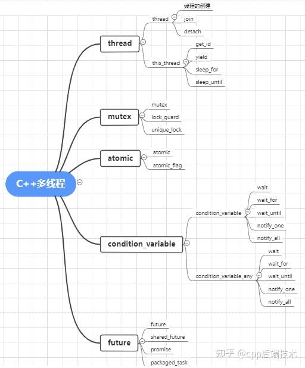
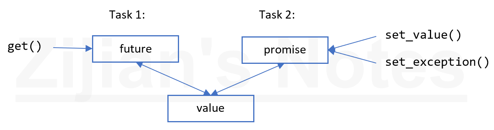

:::note

博客大部分内容引自C++ 之父 Bjarne Stroustrup 的 C++ 之旅（A Tour of C++）一书的第 13 章 Concurrency。中间夹杂了一些我自己的思考。

:::

传统的C++中并没有引入线程这个概念，在C++11出来之前，如果我们想要在C++中实现多线程，需要借助操作系统平台提供的API，比如Linux的 `pthread.h`，或者windows下的 `windows.h` 。

C++11提供了语言层面上的多线程，包含在头文件 `<thread>`中。它解决了跨平台的问题，提供了管理线程、保护共享数据、线程间同步操作、原子操作等类。C++11 新标准中引入了5个头文件来支持多线程编程，如下图所示：



## 介绍

并发，即同时执行多个任务，常用来提高 **吞吐量** （利用多处理器，进行同一个计算）或者改善 **响应性** （等待回复的时候，允许程序的其他部分继续执行）。所有现代语言都支持并发。C++ 标准库提供了可移植、类型安全的并发支持，经过 20 多年的发展，几乎被所有现代硬件所支持。标准库提供的主要是**系统级**的并发支持，而非复杂的、更高层次的并发模型；其他库可以基于标准库，提供更高级别的并发支持。

C++ 提供了适当的内存模型（memory model）和一组原子操作（atomic operation），以支持在同一地址空间内并发执行多个线程。原子操作使得**无锁编程**成为可能。内存模型保证了在避免 **数据竞争** （data races，不受控地同时访问可变数据）的前提下，一切按照预期工作。

`thread`、`mutex`、`lock()`、`packaged_task` 以及 `future`这些特征直接基于操作系统构建，相较于操作系统原生支持，不会带来性能损失，也不保证会有显著的性能提升。

> 那为什么要用标准库而非操作系统的并发？当然是因为可移植性咯。
>
> 当然，
>
> **不要把并发当作灵丹妙药：如果顺序执行可以搞定，通常顺序会比并发更简单、更快速！**

## 任务

这里我们使用类似Linux进程管理中的概念，我们不会去区分什么是多线程，什么是多进程。统一认为，如果一个计算有可能（potentially）和另一个计算并发执行，我们称之为 **任务** （task）。**线程**是任务的系统级表示。任务可以通过构造一个 `std::thread` 来启动，任务作为参数。而进程是更进一步，没有直接共享数据的任务。

**任务是一个函数或者函数对象** 。

```cpp
void f();              // 函数

struct F {             // 函数对象
    void operator()()  // F 的调用操作符
};

void user()
{
    thread t1 {f};     // f() 在另一个线程中执行
    thread t2 {F()};   // F()() 在另一个线程中执行

    t1.join();  // 等待 t1
    t2.join();  // 等待 t2
}
```

`join()` 确保线程完成后才退出 `user()`，“join 线程”的意思是“等待线程结束”。

一个程序的线程共享同一地址空间。线程不同于进程，进程通常不直接共享数据。线程间可以通过共享对象（shared object）通信，这类通信一般用锁或其他机制控制，以避免数据竞争。

编写并发任务可能会非常棘手，假如上述例子中的 `f` 和 `F` 实现如下：

```cpp
void f() {cout << "Hello ";}

struct F {
    void operator()() {cout << "Parallel World!\n";}
};
```

这里有个严重的错误：`f` 和 `F()` 都用到了 `cout` 对象，却没有任何形式的同步。这会导致输出的结果不可预测，多次执行的结果可能会得到不同的结果：因为两个任务的执行顺序是未定义的。程序可能产生诡异的输出，比如：

```bash
PaHerallllel o World!
```

定义一个并发程序中的任务时，我们的目标是保持任务之间完全独立。最简单的方法就是把并发任务看作是一个恰巧可以和调用者同时运行的函数：我们只要传递参数、取回结果，保证该过程中没有使用共享数据（没有数据竞争）即可。

## 传参

一般来说，任务需要处理一些数据。我们可以通过参数传递数据（或者数据的指针或引用）。

```cpp
void f(vector<double>& v); // 处理 v 的函数

struct F {                 // 处理 v 的函数对象
    vector<double>& v;
    F(vector<double>& vv) : v(vv) {}
    void operator()();
};

int main()
{
    vector<double> some_vec{1,2,3,4,5,6,7,8,9};
    vector<double> vec2{10,11,12,13,14};

    thread t1{f,ref(some_vec)}; // f(some_vec) 在另一个线程中执行
    thread t2{F{vec2}};         // F{vec2}() 在另一个线程中执行

    t1.join();
    t2.join();
}
```

`F{vec2}` 在 `F` 中保存了参数 vector 的引用。`F` 现在可以使用这个 vector。但愿在 `F` 执行时，没有其他任务访问 `vec2`。如果通过**值传递** `vec2` 则可以消除这个隐患。

`t1` 通过 `{f,ref(some_vec)}` 初始化，用到了 `thread` 的**可变参数模板**构造，可以接受任意序列的参数。`ref()` 是来自 `<functional>` 的类型函数。为了让可变参数模板把 `some_vec` 当作一个引用而非对象， **`ref()` 不能省略。** 编译器检查第一个参数可以通过其后面的参数调用，并构建必要的函数对象，传递给线程。如果 `F::operator()()` 和 `f()` 执行了相同的算法，两个任务的处理几乎是等同的：两种情况下，都各自构建了一个函数对象，让 `thread` 去执行。

> 可变参数模板需要用 `ref()`、`cref()` 传递引用

## 返回结果

13.3 的例子传了一个非 const 的引用。只有在希望任务修改引用数据时我才这么做。这是一种很常见的获取返回结果的方式，但这么做并不能清晰、明确地向他人传达你的意图。稍好一点的方式是通过 const 引用传递输入数据，通过另外单独的参数传递储存结果的指针。

```cpp
void f(const vector<double>& v, double *res); // 从 v 获取输入; 结果存入 *res

class F {
public:
    F(const vector<double>& vv, double *p) : v(vv), res(p) {}
    void operator()();  // 结果保存到 *res

private:
    const vector<double>& v;  // 输入源
    double *p;                // 输出地址
};

int main()
{
    vector<double> some_vec;
    vector<double> vec2;

    double res1;
    double res2;

    thread t1{f,cref(some_vec),&res1}; // f(some_vec,&res1) 在另一个线程中执行
    thread t2{F{vec2,&res2}};          // F{vec2,&res2}() 在另一个线程中执行

    t1.join();
    t2.join();
}
```

## 共享数据

有时任务需要共享数据，这种情况下，对共享数据的访问需要进行同步，同一时刻只能有一个任务访问数据（但是多任务同时读取不变量是没有问题的）。我们要考虑如何保证在同一时刻最多只有一个任务能够访问一组对象。

解决这个问题需要通过 `mutex`（mutual exclusion object，互斥对象）。`thread` 通过 `lock()` 获取 `mutex`：

```cpp
int shared_data;
mutex m;          // 用于控制 shared_data 的 mutex

void f()
{
    unique_lock<mutex> lck{m};  // 获取 mutex
    shared_data += 7;           // 操作共享数据
}   // 离开 f() 作用域，隐式自动释放 mutex
```

`unique_lock` 的构造函数通过调用 `m.lock()` 获取 mutex。如果另一个线程已经获取这个 mutex，当前线程等待（阻塞）直到另一个线程（通过 `m.unlock()`）释放该 mutex。当 mutex 释放，等待该 mutex 的线程恢复执行（唤醒）。互斥、锁在 `<mutex>` 头文件中。

共享数据和 mutex 之间的关联需要自行约定：程序员需要知道哪个 mutex 对应哪个数据。这样很容易出错，但是我们可以通过一些方式使得他们之间的关联更清晰明确：

```cpp
class Record {
public:
    mutex rm;
};
```

不难猜到，对于一个 `Record` 对象 `rec`，在访问 `rec` 其他数据之前，你应该先获取 `rec.rm`。最好通过注释或者良好的命名让读者清楚地知道 mutex 和数据的关联。

有时执行某些操作需要同时访问多个资源，有可能导致 **死锁** 。例如，`thread1` 已经获取了 `mutex1`，然后尝试获取 `mutex2`；与此同时，`thread2` 已经获取 `mutex2`，尝试获取 `mutex1`。在这种情况下，两个任务都无法进行下去。为解决这一问题，标准库支持同时获取多个锁：

```cpp
void f()
{
    unique_lock<mutex> lck1{m1,defer_lock};  // defer_lock：不立即获取 mutex
    unique_lock<mutex> lck2{m2,defer_lock};
    unique_lock<mutex> lck3{m3,defer_lock};

    lock(lck1,lck2,lck3);                    // 尝试获取所有锁
    // 操作共享数据
}   // 离开 f() 作用域，隐式自动释放所有 mutexes
```

`lock()` 只有在获取参数里所有的 mutex 之后才会继续执行，并且在其持有 mutex 期间，不会阻塞（go to sleep）。每个 `unique_lock` 的析构会确保离开作用域时，自动释放所有的 mutex。

通过共享数据通信是相对底层的操作。编程人员要设计一套机制，弄清楚哪些任务完成了哪些工作，还有哪些未完成。从这个角度看， 使用共享数据不如直接调用函数、返回结果。另一方面，有些人认为共享数据比拷贝参数和返回值效率更高。这个观点可能在涉及大量数据的时候成立，但是 locking 和 unlocking 也是相对耗时的操作。不仅如此，现代计算机很擅长拷贝数据，尤其是像 `vector` 这种元素连续存储的结构。所以，**不要仅仅因为“效率”而选用共享数据进行通信，除非你真正实际测量过。**

`mutex`头文件主要声明了与互斥量(mutex)相关的类。`mutex`提供了4种互斥类型，如下表所示。

| 类型                           | 说明                |
| ------------------------------ | ------------------- |
| `std::mutex`                 | 最基本的 Mutex 类。 |
| `std::recursive_mutex`       | 递归 Mutex 类。     |
| `std::time_mutex`            | 定时 Mutex 类。     |
| `std::recursive_timed_mutex` | 定时递归 Mutex 类。 |

`std::mutex` 是C++11 中最基本的互斥量，`std::mutex` 对象提供了独占所有权的特性——即不支持递归地对  `std::mutex` 对象上锁，而 `std::recursive_lock` 则可以递归地对互斥量对象上锁。

mutex常用操作：

* `lock()`：资源上锁
* `unlock()`：解锁资源
* `trylock()`：查看是否上锁，它有下列3种类情况：

（1）未上锁返回false，并锁住；

（2）其他线程已经上锁，返回true；

（3）同一个线程已经对它上锁，将会产生死锁。

## 等待

有时线程需要等待外部事件，比如另一个线程完成了任务或者经过了一段时间。最简单的事件是时间。借助 `<chrono>`，可以写出：

```cpp
using namespace std::chrono;

auto t0 = high_resolution_clock::now();
this_thread::sleep_for(milliseconds{20});
auto t1 = high_resolution_clock::now();

cout << duration_cast<nanoseconds>(t1-t0).count() << " nanoseconds passed\n";
```

默认情况下，`this_thread` 指当前唯一的线程。我用 `duration_cast` 把时间单位转成了我想要的 nanoseconds。

`condition_variable` 提供了对通过外部事件通信的支持，允许一个线程等待另一个线程，比如等待另一个线程（完成某个工作，然后）触发一个事件/条件。

`condition_variable`头文件有两个variable类，一个是`condition_variable`，另一个是`condition_variable_any`。`condition_variable`必须结合`unique_lock`使用。`condition_variable_any`可以使用任何的锁。下面以`condition_variable`为例进行介绍。

`condition_variable`条件变量可以阻塞（`wait`、`wait_for`、`wait_until`）调用的线程直到使用（`notify_one`或`notify_all`）通知恢复为止。`condition_variable`是一个类，这个类既有构造函数也有析构函数，使用时需要构造对应的`condition_variable`对象，调用对象相应的函数来实现上面的功能。

| 类型               | 说明                                                                                   |
| ------------------ | -------------------------------------------------------------------------------------- |
| condition_variable | 构建对象                                                                               |
| 析构               | 删除                                                                                   |
| wait               | Wait until notified                                                                    |
| wait_for           | Wait for timeout or until notified                                                     |
| wait_until         | Wait until notified or time point                                                      |
| notify_one         | 解锁一个线程，如果有多个，则未知哪个线程执行                                           |
| notify_all         | 解锁所有线程                                                                           |
| cv_status          | 这是一个类，表示variable 的状态<br />`enum class cv_status { no_timeout, timeout };` |

`condition_variable` 支持很多优雅、高效的共享形式，但也可能会很棘手。考虑一个经典的生产者-消费者例子，两个线程通过一个队列传递消息：

```cpp
class Message { /**/ }; // 通信的对象

queue<Message> q;       // 消息队列
condition_variable cv;  // 传递事件的变量
mutex m;                // locking 机制
```

`queue`、`condition_variable` 以及 `mutex` 由标准库提供。

消费者读取并处理 `Message`

```cpp
void consumer()
{
    while(true){
        unique_lock<mutex> lck{m}; // 获取 mutex m
        cv.wait(lck);              // 先释放 lck，等待事件/条件唤醒
                                   // 唤醒时再次重新获得 lck
        auto m = q.front();        // 从队列中取出 Message m
        q.pop();
        lck.unlock();              // 后续处理消息不再操作队列 q，提前释放 lck
        // 处理 m
    }
}
```

这里我显式地用 `unique_lock<mutex>` 保护 `queue` 和 `condition_variable` 上的操作。`condition_variable` 上的 `cv.wait(lck)` 会释放参数中的锁 `lck`，直到等待结束（队列非空），然后再次获取 `lck`。

相应的生产者代码：

```cpp
void producer()
{
    while(true) {
        Message m;
        // 填充 m
        unique_lock<mutex> lck{m}; // 保护操作
        q.push(m);
        cv.notify_one();           // 通知/唤醒等待中的 condition_variable
    } // 作用域结束自动释放锁
}
```

> 到目前为止，不论是 thread、mutex、lock 还是 condition_variable，都还是低层次的抽象。接下来我们马上就能看到 C++ 对并发的高级抽象支持。

## 通信任务

标准库还在头文件 `<future>` 中提供了一些机制，能够让程序员在更高的任务的概念层次上工作，而不是直接使用低层的线程、锁：

1. `future` 和 `promise`：用于从另一个线程中返回一个值
2. `packaged_task`：帮助启动任务，*封装了 `future` 和 `promise`，并且建立两者之间的关联*
3. `async()`：像调用一个函数那样启动一个任务。*形式最简单，但也最强大！*

### future 和 promise

`future` 和 `promise` 可以在两个任务之间传值，而无需显式地使用锁，实现了高效地数据传输。其基本想法很简单：当一个任务向另一个任务传值时，把值放入 `promise`，通过特定的实现，使得值可以通过与之关联的 `future` 读出（一般谁启动了任务，谁从 `future` 中取结果）。



假如有一个 `future<X>` 叫 `fx`，我们可以通过 `get()` 获取类型 `X` 的值：

```cpp
X v = fx.get(); // if necessary, wait for the value to get computed
```

如果值还没有计算出，则调用 `get()` 的线程阻塞，直到有值返回。如果值无法计算出，`get()`可能抛出异常。

`promise` 的主要目的是提供一个简单的“put”的操作（`set_value` 或 `set_exception`），和 `future` 的 `get()` 相呼应。

如果你有一个 `promise`，需要发送一个类型为 `X` 的结果到一个 `future`，你要么传递一个值，要么传递一个异常。举个例子：

```cpp
void f(promise<X>& px) // 一个任务：把结果放入 px
{
    try {
        X res;
        // 计算 res 的值
        px.set_value(res);
    }
    catch(...) { // 如果无法计算 res 的值
        px.set_exception(current_exception()); // 传异常到 future 的线程
    }
}
```

`current_exception()` 即捕获到的异常。

要处理通过 `future` 传递的异常，`get()` 的调用者必须在什么地方捕获，例如：

```cpp
void g(future<X>& fx) // 一个任务；从 fx 提取结果
{
    try {
        X v = fx.get(); // 如有必要，等待值计算完成
        // 使用 v
    }
    catch(...){ // 无法计算 v
        // 错误处理
    }
}
```

如果 `g()` 不需要自己处理错误，代码可以进一步简化：

```cpp
void g(future<X>& fx) // 一个任务；从 fx 提取结果
{
    X v = fx.get(); // 如有必要，等待值计算完成
    // 使用 v
}
```

### packaged_task

如何把 `future` 放入一个需要结果的任务，并且把与之关联的、产生结果的 `promise` 放入线程？ **`packaged_task` 可以简化任务的设置，关联 `future/promise`。`packaged_task` 封装了把返回值或异常放入 `promise` 的操作，并且调用 `packaged_task` 的 `get_future()` 方法，可以得到一个与 `promise` 关联的 `future`** 。举个例子，我们可以设置两个任务，借助标准库的 `accumulate()` 分别累加 `vector<double>` 的前后部分：

```cpp
double accum (double* beg, double* end, double init) // 计算以 init 为初值，[beg,end) 的和
{
    return accumulate(beg,end,init);
}

double comp2(vector<double>& v)
{
    using Task_type = double(double*,double*,double); // 任务的类型

    packaged_task<Task_type> pt0 {accum}; // 打包任务（即 accum）
    packaged_task<Task_type> pt1 {accum};

    future<double> f0 {pt0.get_future()}; // 取得 pt0 的 future
    future<double> f1 {pt1.get_future()}; // 取得 pt1 的 future

    double* first = &v[0];
    thread t1{move(pt0),first,first+v.size()/2,0};          // 为 pt0 启动线程
    thread t2{move(pt1),first+v.size()/2,first+v.size(),0}; // 为 pt1 启动线程

    return f0.get() + f1.get();
}
```

`packaged_task` 模板以任务的类型（`Task_type`，`double(double*,double*,double)` 的别名）作为其模板参数，以任务（`accum`）作为其构造函数的参数。`move()` 操作是必要的，因为 `packaged_task` 不可拷贝（只能移动）。`packaged_task` 不可拷贝是因为它是一个资源处理程序（resource handler），拥有 `promise` 的所有权，并且（间接地）负责与之关联的任务可能拥有的资源。

请注意，这里的代码没有显式地使用锁： **我们能够专注于要完成的任务，而不是来管理它们通信的机制** 。这两个任务在不同的线程中执行，具有了潜在的并发性。

### async()

我在本章所追求的思路，最简单，但也非常强大： **把任务看成是一个恰巧可能和其他任务同时运行的函数** 。这并不是 C++ 标准库所支持的唯一模型，但它能很好地满足各类广泛的需求。其他更微妙、棘手的模型，如依赖于共享内存的编程风格也可以根据实际需要使用。

要启动潜在异步执行的任务，我们可以用 `async()`：

```cpp
double comp4(vector<double>& v) // 如果 v 足够大，派生多个任务
{
    if(v.size()<10000) // 犯得着用并发吗？
        return accum(v.begin(),v.end(),0);
  
    auto v0 = &v[0];
    auto sz = v.size();
  
    auto f0 = async(accum,v0,v0+sz/4,0.0);
    auto f1 = async(accum,v0+sz/4,v0+sz/2,0.0);
    auto f2 = async(accum,v0+sz/2,v0+sz*3/4,0.0);
    auto f3 = async(accum,v0+sz*3/4,v0+sz,0.0);
  
    return f0.get()+f1.get()+f2.get()+f3.get(); // 收集 4 部分的结果，求和
}
```

大体上，`async()` 把“调用部分”和“获取结果部分“分离开来，并且将两者和实际执行的任务分离。使用 `async()` 你不需要考虑线程、锁；你只要从 *任务* （潜在地、异步地计算结果）的角度去考虑就可以了。`async()` 也有明显的限制：使用了共享资源、需要上锁的任务无法使用 `async()`，你甚至不知道会用到多少线程，这完全是由 `async()` 决定的，它会根据调用时系统可用资源的情况，决定使用多少线程。例如，`async()` 在决定使用几个线程前，会检查有多少核心（处理器）空闲。

示例代码中的猜测计算开销和启动线程的相对开销（`v.size()<10000`）只是一个很原始、粗略的性能估计。这里不适合展开讨论怎么去管理线程，但这个估计仅仅是一个简单（可能很烂）的猜测。

请注意，`async()`不仅仅是专门用于并行计算、提高性能的机制。例如，它也能用于派生任务，从用户获取输入，让“主程序”忙其他事情。

## 建议

1. 使用并发改善响应性和吞吐量
2. **尽可能在最高级别的抽象上工作** （比如优先考虑 async、packaged_task 而不是 thread、mutex）
3. 考虑使用进程作为线程的替代方案
4. 标准库的并发支持是类型安全的
5. 内存模型把多数程序员从考虑机器架构的工作中解放出来
6. 内存模型使得内存的表现和我们的预期基本一致
7. 原子操作为无锁编程提供了可能性
8. 把无锁编程留给专家
9. **有时顺序操作比起并发更简单、更快**
10. 避免数据竞争（不受控地同时访问可变数据）
11. `std::thread` 是类型安全的系统线程接口
12. 用 `join()` 等待一个线程结束
13. 尽量避免显式共享数据
14. 用 `unique_lock` 管理 mutexes
15. 用 `lock()` 一次性获取多个锁
16. **用 `condition_variable` 管理线程之间的通信**
17. **从（可以并行执行的）任务的角度思考，而非线程**
18. 不要低估“简单性”的价值
19. **选择 `packaged_task` 和 `future`，而不是直接使用 `thread` 和 `mutex`**
20. 用 `promise` 返回结果，从 `future` 获取结果
21. 用 `packaged_task` 处理任务抛出的异常或返回值
22. 用 `packaged_task` 和 `future` 来表示对外部服务的请求，以及等待其回复
23. 用 `async()` 启动简单的任务

## 一个简单的线程池

一般线程池都会有以下几个部分构成：

1. 线程池管理器（ThreadPoolManager）:用于创建并管理线程池，也就是线程池类
2. 工作线程（WorkThread）: 线程池中线程
3. 任务队列task: 用于存放没有处理的任务。提供一种缓冲机制。
4. append：用于添加任务的接口

线程池实现代码：

```cpp
#ifndef _THREADPOOL_H
#define _THREADPOOL_H
#include <vector>
#include <queue>
#include <thread>
#include <iostream>
#include <stdexcept>
#include <condition_variable>
#include <memory> //unique_ptr
#include<assert.h>
const int MAX_THREADS = 1000; //最大线程数目
template <typename T>
class threadPool
{
public:
    threadPool(int number = 1);//默认开一个线程
    ~threadPool();
    std::queue<T > tasks_queue; //任务队列
    bool append(T *request);//往请求队列＜task_queue＞中添加任务<T >
private:
//工作线程需要运行的函数,不断的从任务队列中取出并执行
    static void *worker(void arg);
    void run();
private:
    std::vector<std::thread> work_threads; //工作线程

    std::mutex queue_mutex;
    std::condition_variable condition;  //必须与unique_lock配合使用
    bool stop;
};//end class//构造函数，创建线程
template <typename T>
threadPool<T>::threadPool(int number) : stop(false)
{
    if (number <= 0 || number > MAX_THREADS)
        throw std::exception();
    for (int i = 0; i < number; i++)
    {
        std::cout << "created Thread num is : " << i <<std::endl;
        work_threads.emplace_back(worker, this);
        //添加线程
        //直接在容器尾部创建这个元素，省去了拷贝或移动元素的过程。
    }
}
template <typename T>
inline threadPool<T>::~threadPool()
{
    std::unique_lock<std::mutex> lock(queue_mutex);
    stop = true;
  
    condition.notify_all();
    for (auto &ww : work_threads)
        ww.join();//可以在析构函数中join
}
//添加任务
template <typename T>
bool threadPool<T>::append(T *request)
{
    //操作工作队列时一定要加锁，因为他被所有线程共享
    queue_mutex.lock();//同一个类的锁
    tasks_queue.push(request);
    queue_mutex.unlock();
    condition.notify_one();  //线程池添加进去了任务，自然要通知等待的线程
    return true;
}//单个线程
template <typename T>
void threadPool<T>::worker(void *arg)
{
    threadPool pool = (threadPool *)arg;
    pool->run();//线程运行
    return pool;
}
template <typename T>
void threadPool<T>::run()
{
while (!stop)
{
    std::unique_lock<std::mutex> lk(this->queue_mutex);
    /*　unique_lock() 出作用域会自动解锁　*/
    this->condition.wait(lk, [this] 
    { 
      return !this->tasks_queue.empty(); 
    });//如果任务为空，则wait，就停下来等待唤醒//需要有任务，才启动该线程，不然就休眠
    if (this->tasks_queue.empty())//任务为空，双重保障
    {  
        assert(0&&"断了");//实际上不会运行到这一步，因为任务为空，wait就休眠了。
        continue;
    }else{
        T *request = tasks_queue.front();
        tasks_queue.pop();
        if (request)//来任务了，开始执行
            request->process();
          }
    }
}
#endif
```

* 构造函数创建所需要的线程数
* 一个线程对应一个任务，任务随时可能完成，线程则可能休眠，所以任务用队列queue实现（线程数量有限），线程用采用wait机制。
* 任务在不断的添加，有可能大于线程数，处于队首的任务先执行。
* 只有添加任务(append)后，才开启线程condition.notify_one()。
* wait表示，任务为空时，则线程休眠，等待新任务的加入。
* 添加任务时需要添加锁，因为共享资源。

测试代码：

```cpp
#include "mythread.h"
#include<string>
#include<math.h>
using namespace std;
class Task
{
public:
    void process()
{
        //cout << "run........." << endl;//测试任务数量
        long i=1000000;
        while(i!=0)
        {
            int j = sqrt(i);
            i--;
        }
    }
};
int main(void){
    threadPool<Task> pool(6);//6个线程，vector
    std::string str;
    while (1)
    {
        Task *tt = new Task();//使用智能指针
        pool.append(tt);//不停的添加任务，任务是队列queue，因为只有固定的线程数
        cout<<"添加的任务数量："<<pool.tasks_queue.size()<<endl;  
        delete tt;
    }
}
```
