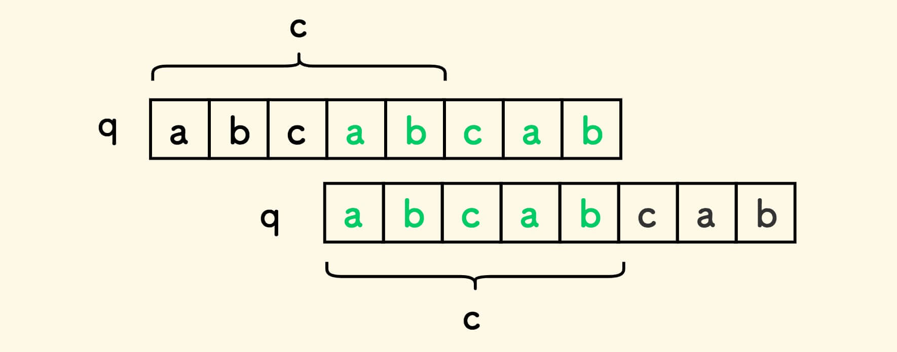

以下的一些心得体会参考或部分引用了如下资料：

    “春水煎茶”个人博客：[https://writings.sh/post/algorithm-repeated-string-pattern](https://leetcode.cn/link/?target=https%3A%2F%2Fwritings.sh%2Fpost%2Falgorithm-repeated-string-pattern "https://writings.sh/post/algorithm-repeated-string-pattern")

    “代码随想录”文章及视频资料：[代码随想录 (programmercarl.com)](https://www.programmercarl.com/0028.%E5%AE%9E%E7%8E%B0strStr.html#%E7%AE%97%E6%B3%95%E5%85%AC%E5%BC%80%E8%AF%BE "代码随想录 (programmercarl.com)")

    leetcode题解：ACM 选手图解 LeetCode 重复的子字符串 | 编程文青李狗蛋

以下是我比较推荐的一些KMP算法入门题：

    leetcode28题：[力扣 LeetCode](https://leetcode.cn/problems/find-the-index-of-the-first-occurrence-in-a-string/ "力扣 LeetCode")

    leetcode459题：[力扣（LeetCode）官网 - 全球极客挚爱的技术成长平台](https://leetcode.cn/problems/repeated-substring-pattern/ "力扣（LeetCode）官网 - 全球极客挚爱的技术成长平台")。

    洛谷P3375：[P3375 【模板】KMP - 洛谷 | 计算机科学教育新生态 (luogu.com.cn)](https://www.luogu.com.cn/problem/P3375 "P3375 【模板】KMP - 洛谷 | 计算机科学教育新生态 (luogu.com.cn)")

    洛谷P4391：[P4391 [BOI2009] Radio Transmission 无线传输 - 洛谷 | 计算机科学教育新生态 (luogu.com.cn)](https://www.luogu.com.cn/problem/P4391 "P4391 [BOI2009] Radio Transmission 无线传输 - 洛谷 | 计算机科学教育新生态 (luogu.com.cn)")

在洛谷题单上还有其他相关KMP例题。

对上面资料进行一定总结归纳可知，解决周期字符串问题的主要方法有两种：

**1.移动匹配/双倍字符串**

**2.KMP方法**

下面就直入正题地讨论这两种方法.

## 一.移动匹配/双倍字符串

比起 **移动匹配** ，**双倍字符串**这个名字或许更加形象。

假设有一个字符串s，我们需要判断它是否有多个重复子串构成，只需要设字符串ss=s+s，也就是用两个s串首尾拼接成一个大字符串ss，如果它由多个重复字串构成，那么ss一定也可以由多个相同地重复字串构成（当然了，ss一定是由s这个重复子串构成的）。

上面提到了，ss一定由s这个重复字串构成，为了防止这样的情况发生，我们去掉ss的第一个字符和最后一个字符，如果ss中还能由m个s `构成一个除了首尾s之外的额外的s，不就是说明这个s从头到尾都是重复的子串s`组成的吗。

同样的，想象一下，s串由m个子串s `构成，两个s串由2m个子串s`构成，那么ss中间部分一定会有m个连续子串s `构成一个s，所以如果s由重复子串构成，就一定可以在ss里面找到m个连续的s`组成一个s，也就是ss里面一定至少包含一个不位于首尾的s。

这样就证明了其充分性和必要性。

具体的推导可以参考“春水煎茶”大佬的博客，当然也可以看卡哥的代码随想录视频。

所以我们可以得到一个结论：**如果字符串在其掐头去尾的双倍字符串中，它就是周期串 。**

接下来就可以尝试解决力扣上的459号题了。

下面给出我个人实现的代码：

```cpp
class Solution {
public:
    bool repeatedSubstringPattern(string s) {
        string t=s+s;
        t.erase(t.begin());
        t.erase(t.end()-1);
        if(t.find(s)!=string::npos)return true;
        return false;
    }
};
```

时间16ms，空间11.9mb，还行。

## 二.KMP方法——最大公共前后缀的推论。

这才是这份总结的重点。

我们以leetcode459题为基础，进一步解决洛谷的P4391。弄懂了这两题，也就差不多对前缀表和next数组有了比较系统深入的了解了。

以下总结都是基于已经了解了最基本的kmp算法的前提。

首先给出leetcode459题的可运行代码：

```cpp
class Solution {
public:
    void getnext(const string& s,int* next){
        int j=-1;
        next[0]=-1;
        for(int i=1;i<s.size();i++){
            while(j>=0&&s[i]!=s[j+1])j=next[j];
            if(s[i]==s[j+1])j++;
            next[i]=j;
        }
    }

    bool repeatedSubstringPattern(string s) {
        if(s.size()==1)return false;
        int next[s.size()];
        getnext(s,next);
        int border=0;
        for(auto c:next){
            if(c+1>border)border=c+1;
        }  
        if(next[s.size()-1]!=-1&&s.size() % (s.size() - (next[s.size() - 1] + 1))==0)return true;
        else return false;
    }
};
```


### 1.奇怪的结论

首先定义一个函数来生成一个模式串的next数组，这是比较显然的，最晦涩难懂的莫过于最后的那个奇怪的公式：

```cpp
s.size() % (s.size() - (next[s.size() - 1] + 1)) ==0
```


事实上，这是一个结论：

`命题A<strong>“</strong><strong>s</strong>`** 是周期串”** 命题B**“`len(s)` 是 `len(q)-len(c)` 的倍数”**

这个结论的严谨证明可以参考春水煎茶大佬的博客，里面由图像和文字的描述。这里我简单说明一下我自己的一些理解。

### 2.next数组是怎么回事

首先我们要理解next数组到底是怎么一回事：

这里先分享一篇我觉得不错讲KMP的博客[The Knuth-Morris-Pratt Algorithm in my own words - jBoxer (jakeboxer.com)](http://jakeboxer.com/blog/2009/12/13/the-knuth-morris-pratt-algorithm-in-my-own-words/ "The Knuth-Morris-Pratt Algorithm in my own words - jBoxer (jakeboxer.com)")

首先next数组的出现是一个从问题出发的解决方案。在KMP算法中，为了解决当模式串高度重复时，暴力算法逐个匹配效率的下的问题，我们需要模式串指针的正确回溯，也就是需要模式串指针回溯到他之前重复过一次的位置。也就是在已经遍历到的位置之前，找到一个一模一样的串，从那个串的最后重新匹配。

按上面给出的代码中getnext函数，可以知道得到next数组的伪代码形式写成：

**while（当前位置和前一个位置的后缀的结尾接不上去的时候 且 j>= 0）：**

**去前一个位置的后缀相对应一模一样的前缀里面找，那个一模一样的前缀也能划分成一个前缀和后缀，在这个前缀的前缀里面找。**

**如果前缀的前缀的下一个字符和当前位置的字符一样，说明（前缀的前缀+下一个字符）和（后缀的后缀+当前位置的字符）一模一样，找到所谓的j了，也就是当前位置的最大公共字符串。**

**如果找不到就去前缀的前缀的前缀里面找一直细分下去，直到前缀不能划分成有前后缀的字符串了（即j=-1）**

我们来看一段KMP算法的模板：

    这是生成next数组

```
        int j=-1;
        next[0]=j;
        for(int i=1;i<s.size();i++){
            while(j>=0&&s[j+1]!=s[i])j=next[j];
            if(s[j+1]==s[i])j++;
            next[i]=j;
        }
```


    这是使用next数组匹配

```
        int j=-1;
        for(int i=0;i<haystack.size();i++){
            while(j>=0&&haystack[i]!=needle[j+1])j=next[j];
            if(haystack[i]==needle[j+1])j++;
            if(j==needle.size()-1)return i-needle.size()+1;
        }
        return -1;
```


两者是不是高度相似？事实上就是如此，KMP算法就是先遍历一遍模式串，通过寻找相同的前后缀在next数组里面标记重复的位置来生成一个next数组；再遍历一遍文本串，通过next数组来查找相同的子串。

所以next数组就是一组对 **重复前缀位置（也就是回溯位置）** 的记录，只是考虑到后续使用而进行了一定的变形，比如-1，右移之类的操作。

也即：**重复模式串一定有内容不全为-1的next数组。**

### 3.用next数组的思想来理解周期字符串

那么不难发现，当一个字符串是周期字符串的时候，它一定会有内容不全为-1的next数组。但是我们此时并不需要用它来匹配，此时我们去掉它的第一个重复子串S.1得到后一段，再去掉它的最后一个重复子串S.n，得到开头一段，就会长成下图的两个q的样子：



（图片来源）[https://writings.sh/assets/images/posts/algorithm-repeated-string-pattern/repeated-string-pattern-kmp-4.jpegyz](https://writings.sh/assets/images/posts/algorithm-repeated-string-pattern/repeated-string-pattern-kmp-4.jpeg "https://writings.sh/assets/images/posts/algorithm-repeated-string-pattern/repeated-string-pattern-kmp-4.jpegyz")

两个前后缀一定是错开，并且中间对应相同的，那么他们各自分别剩出来的部分就是我们取出来的**重复子串**了。

并且由于我们取出来的子串它本身是没有更小的重复子串（公共前后缀）的，也就是说这个子串的next数组里面的所有元素都是-1，所以他没有上面所说的 **前缀的前缀里面找到的公共前后缀。** 因此它一定同时也是 **最小重复子串。** 这样就证明了那个长相诡异的式子。

严谨的充分必要性推导可以参考：[周期字符串问题（两种方法） | 春水煎茶 - 王超的个人博客 (writings.sh)](https://writings.sh/post/algorithm-repeated-string-pattern#kmp-%E6%96%B9%E6%B3%95 "周期字符串问题（两种方法） | 春水煎茶 - 王超的个人博客 (writings.sh)")

**所以所谓的周期字符串的最小重复子串，也就是把周期串作为模式串寻找它的next数组里全是-1的部分，全是-1则说明子串本身不重复，那么自然这个周期串就是由它组成的了。**
