最近看了许多和操作系统以及C语言优化、编译器优化方面的文章，于是便产生了一个有趣的念头：

Linux上一个可执行的 Hello World ELF文件，到底可以有多小？

如果你是一个被臃肿程序（点名某支付应用和某IM应用）折磨很久的人，(也许)这篇文章能带给你一些心理上的慰藉。

不过，出于我的小镇做题家思维，我更希望在文章中融入一些科普性质的ELF文件格式、汇编语言程序、Linux操作系统内部原理的知识分享，如果这让你非常失望的话，抱歉...

事先声明，本文的所有优化和代码，适用于Intel x86_64架构下的Kubuntu 操作系统，内核版本=6.0.11-28，汇编器采用NASM。

## 不带脑子，先写出来

当然，优化的前提是已经有了现成的代码，我们不可能对着空气一顿输出。干脆发挥一下自己的主观能动性，write a shit first!

```c
#include <stdio.h>    
int main()            
{                     
  printf("Hello World!\n"); 
  return 0;           
}                     

```

这大概是我们使用C语言能够写出来的最短的Hello World了，但是这根本就不是ELF文件啊，小小文本文件，机器可读不出来。

所以接下来为了尽可能让可执行文件的字节数更少，编译和链接的选项就很关键了！

出于对照实验的需要，我们来看看最直白的编译方式得到的输出文件，使用命令 `gcc -o chello chello.c`进行编译：

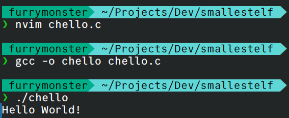

程序正常运行，我们来看看具体的可执行文件的大小：

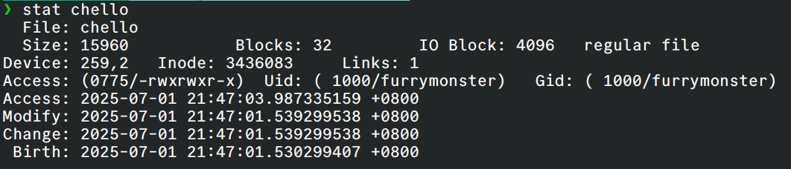

好吧...看来我们距离最小的ELF文件还有很远，这个ELF文件的字节数高达15960 Bytes。你可能会觉得疑惑：哪怕是把整个C语言文本换成x86汇编，也不见得会有这么长啊？！

这个时候，聪明如你也许马上想到了，为了运行C程序，这是**Linux的libc.so动态库**发力了，赶快看看elf头，使用命令 `readelf -d chello`或者 `ldd chello`：

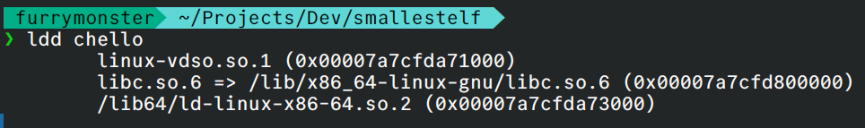

## 先去掉符号表 ！

ummm，为了优化掉libc库，我们需要一些更加精进的知识，在此之前，我们还要先做一件事：优化掉调试符号表！

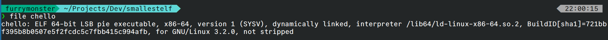

使用 `file chello`我们就会发现，最后的一段显示not stripped，也就是未去除静态符号表。

:::tip

在程序编译成可执行文件后，这个文件中会有一个表专门来保存函数名，变量名，段名和代码或者数据的对应关系，这个表就是**符号表**。

符号表在链接时起着按符号寻址的作用，但**在运行的时候就没有什么作用**了，因此这个表即使去掉之后，也并不会影响程序的运行。

但是如果是动态链接的函数，比如用到了 `libc`的 `printf`函数，那么这个 `printf`符号如果去掉了，在运行的时候就没法找到这函数了，所以这个符号就不能在去符号表的时候被去掉。

所以ELF文件里有两张符号表，一张叫符号表（`.symtab`），另一张叫动态符号表(`.dynsym`)。

:::

静态符号表经过链接后，在运行时就失去了作用，我们使用 `strip -s chello`将它去除：

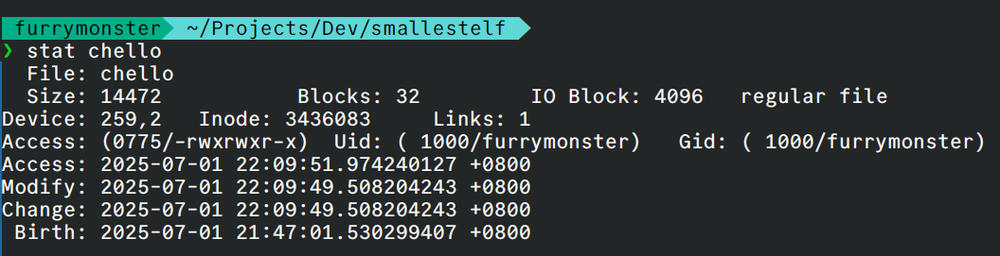

很好！接下来采用更严格的编译器优化策略。

## 从编译器入手

通过添加-s标记去掉符号表，添加-O3进行优化，我们得到：

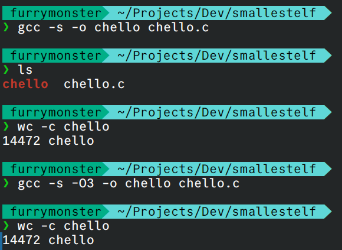

尽管字节数好像没什么很大的变化，至少我们把整个优化流程全部优化到gcc上了，也算一种进步。

是时候使用系统调用了。

## syscall怎么样？

使用 <unistd.h> 提供 write 和 _exit 的声明。去掉 stdio.h 和 printf，减少依赖，用write来替代printf，用exit来优化掉return

```c
#include <unistd.h>                
int main() {                       
    write(1, "Hello, World!\n", 14); 
    _exit(0);              
}                                  

```

然而，编译后的结果看起来并没有很大的改善。

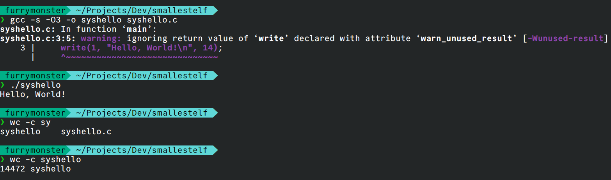

看来纯C编程和编译器选项上的优化已经走到了尽头，现在，让我们再深入些。

## 暴力！嵌入汇编代码

纯C的写法已经难以满足我们的需求，我们选择将write这个包装函数以及main函数彻底换掉，省去初始化的过程，以满足我们想给gcc 加上一个-nostdlib 的 tag的愿望。

* 使用 _start 代替 main，因为 _start 是 ELF 文件的默认入口点，省去 libc 的初始化（如 __libc_start_main）。
* 直接内联汇编调用 write 和 exit 系统调用。
* 定义字符串 msg 为全局常量，存储在数据段。

优化后的代码如下：

```c
#define SYSCALL_WRITE 1
#define SYSCALL_EXIT  60

void _start() {
    asm volatile (
        "mov $1, %%rax\n"          // 系统调用号：write = 1
        "mov $1, %%rdi\n"          // fd = 1 (stdout)
        "lea msg(%%rip), %%rsi\n"  // 使用 RIP 相对寻址加载 msg 地址，这是PIE标准做法
        "mov $14, %%rdx\n"         // count = 14
        "syscall\n"                // 调用 write
        "mov $60, %%rax\n"         // 系统调用号：exit = 60
        "mov $0, %%rdi\n"          // 退出码 = 0
        "syscall"                  // 调用 exit
        :
        :
        : "rax", "rdi", "rsi", "rdx"
    );
}

const char msg[] = "Hello, World!\n";
```

使用-nostdlib选项编译：

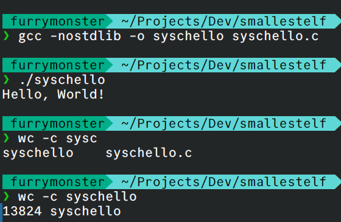

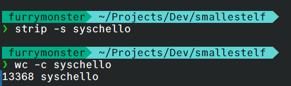

又是一个巨大的进步！

现在，光是嵌入一小段的汇编代码，已经不足以完成这项艰巨的任务，那么，现在让我们开始使用完完全全的NASM汇编！

## 试试 NASM 汇编

先按照C语言写出来nasm汇编：

```shell
section .text
global _start

_start:
    mov rax, 1          ; 系统调用号：write = 1
    mov rdi, 1          ; fd = 1 (stdout)
    mov rsi, msg        ; buf = 字符串地址
    mov rdx, 14         ; count = 14
    syscall             ; 调用 write

    mov rax, 60         ; 系统调用号：exit = 60
    mov rdi, 0          ; 退出码 = 0
    syscall             ; 调用 exit

section .rodata
msg:
    db 'Hello, World!', 10  ; 字符串，10 是换行符
```

好的，接下来我们可以抛弃gcc，直接转换汇编代码，对于每一个步骤，我们都选取最佳的优化选项：

* nasm -f elf64：生成 64 位 ELF 对象文件。
* ld -s：剥离符号表，进一步减小文件大小。

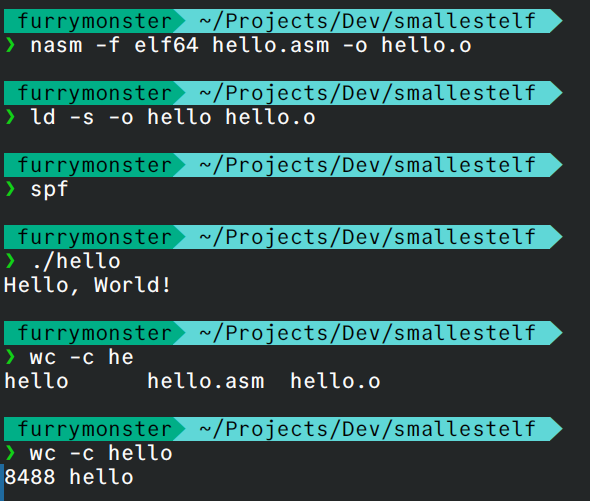

优化掉的字节数高达5000，这是一个巨大的进步。

## Take a break

OK，现在让我们停下优化的脚步，因为接下来，似乎除了直接编写机器码，已经找不到更加直接的优化方式了（当然，我没有考虑RISCV这样的精简指令集）。

从完全的GCC编译C语言，到使用NASM生成对象并链接到elf格式上，我们到底**优化掉了哪些字节**？为什么优化掉这些字节之后，仍然可以正常输出结果？搞清楚这些问题，我们才能知道机器码中还剩下哪些内容可以被剔除，这是我们接下来优化的关键。

一个典型的 ELF 可执行文件包含以下部分：

1. **ELF Header** （e_hdr）：文件开头，描述文件类型、架构、入口点等信息（固定 64 字节在 x86-64 上）。
2. **Program Header Table** （程序头表）：描述加载到内存的段（Segment），如代码段、数据段等，每个程序头约 56 字节（x86-64）。
3. **Section Header Table** （节表）：描述文件中的节（Section），如 .text（代码）、.data（数据）、.symtab（符号表）、.strtab（字符串表）等，每个节头约 64 字节。
4. **Sections** ：实际的代码、数据、符号表等内容。
5. **Dynamic Section** （.dynamic）：动态链接信息，包含动态链接器路径、依赖库等（动态链接程序需要）。
6. **Other Metadata** ：如 .rela.text（重定位表）、.note（注释）、.eh_frame（异常处理帧）等。

第一步的elf结果是整个优化的基准，我们在编译时也没有采用任何优化策略，保留了所有的标准ELF部分。

第二第三步，不用说也知道，除了去掉了.symtab，我们基本没有做到任何实质性的优化。

第四步和第五步中，我们移除 libc，使用了系统调用，这一步是我们一个小小的进步，被移除的部分主要是：

1. Dynamic Section（.dynamic）及其程序头（PT_DYNAMIC）
2. PLT 和 GOT（.plt, .got, .got.plt）
3. .eh_frame 和其他调试相关节
4. .init 和 .fini 节

此时我们还剩下：

* **ELF Header** ：必需，定义文件格式。
* **Program Header** ：至少一个 PT_LOAD，用于加载代码和数据。
* **Section Header** ：仍包含 .text、.rodata、.symtab、.strtab、.rela.text（重定位表，可能因 -no-pie 减少）。
* **Sections** ：1. .text：内联汇编代码。2. .rodata：存储 "Hello, World!\n"。3. .symtab 和 .strtab：符号表，包含 msg 和 _start 的符号。4. .rela.text：重定位表（可能因绝对寻址减少）。

第六步，我们采用了完全的NASM汇编进行重写，一方面剥离了符号表（.symtab）、字符串表（.strtab）和其他调试相关节（如 .rela.text），另一方面NASM 和 ld -s 仅生成必要节（.text, .rodata），移除 .comment、.note 等。于是我们剩下的ELF文件内容还剩：

* **ELF Header** ：必需，64 字节。
* **Program Header** ：至少一个 PT_LOAD（56 字节），加载 .text 和 .rodata。
* **Section Header** ：仅保留 .text 和 .rodata 的节头（每节 64 字节）。
* **Sections** ：1. .text：极简的汇编代码（约 20 字节）。2. .rodata：字符串 "Hello, World!\n"（14 字节）。

```shell
❯ readelf -a syschello
ELF Header:
  Magic:   7f 45 4c 46 02 01 01 00 00 00 00 00 00 00 00 00 
  Class:                             ELF64
  Data:                              2's complement, little endian
  Version:                           1 (current)
  OS/ABI:                            UNIX - System V
  ABI Version:                       0
  Type:                              DYN (Position-Independent Executable file)
  Machine:                           Advanced Micro Devices X86-64
  Version:                           0x1
  Entry point address:               0x1000
  Start of program headers:          64 (bytes into file)
  Start of section headers:          12472 (bytes into file)
  Flags:                             0x0
  Size of this header:               64 (bytes)
  Size of program headers:           56 (bytes)
  Number of program headers:         13
  Size of section headers:           64 (bytes)
  Number of section headers:         14
  Section header string table index: 13

Section Headers:
  [Nr] Name              Type             Address           Offset
       Size              EntSize          Flags  Link  Info  Align
  [ 0]                   NULL             0000000000000000  00000000
       0000000000000000  0000000000000000           0     0     0
  [ 1] .interp           PROGBITS         0000000000000318  00000318
       000000000000001c  0000000000000000   A       0     0     1
  [ 2] .note.gnu.pr[...] NOTE             0000000000000338  00000338
       0000000000000020  0000000000000000   A       0     0     8
  [ 3] .note.gnu.bu[...] NOTE             0000000000000358  00000358
       0000000000000024  0000000000000000   A       0     0     4
  [ 4] .gnu.hash         GNU_HASH         0000000000000380  00000380
       000000000000001c  0000000000000000   A       5     0     8
  [ 5] .dynsym           DYNSYM           00000000000003a0  000003a0
       0000000000000018  0000000000000018   A       6     1     8
  [ 6] .dynstr           STRTAB           00000000000003b8  000003b8
       0000000000000001  0000000000000000   A       0     0     1
  [ 7] .text             PROGBITS         0000000000001000  00001000
       0000000000000039  0000000000000000  AX       0     0     1
  [ 8] .rodata           PROGBITS         0000000000002000  00002000
       000000000000000f  0000000000000000   A       0     0     8
  [ 9] .eh_frame_hdr     PROGBITS         0000000000002010  00002010
       0000000000000014  0000000000000000   A       0     0     4
  [10] .eh_frame         PROGBITS         0000000000002028  00002028
       0000000000000038  0000000000000000   A       0     0     8
  [11] .dynamic          DYNAMIC          0000000000003f20  00002f20
       00000000000000e0  0000000000000010  WA       6     0     8
  [12] .comment          PROGBITS         0000000000000000  00003000
       000000000000002b  0000000000000001  MS       0     0     1
  [13] .shstrtab         STRTAB           0000000000000000  0000302b
       000000000000008b  0000000000000000           0     0     1
Key to Flags:
  W (write), A (alloc), X (execute), M (merge), S (strings), I (info),
  L (link order), O (extra OS processing required), G (group), T (TLS),
  C (compressed), x (unknown), o (OS specific), E (exclude),
  D (mbind), l (large), p (processor specific)

There are no section groups in this file.

Program Headers:
  Type           Offset             VirtAddr           PhysAddr
                 FileSiz            MemSiz              Flags  Align
  PHDR           0x0000000000000040 0x0000000000000040 0x0000000000000040
                 0x00000000000002d8 0x00000000000002d8  R      0x8
  INTERP         0x0000000000000318 0x0000000000000318 0x0000000000000318
                 0x000000000000001c 0x000000000000001c  R      0x1
      [Requesting program interpreter: /lib64/ld-linux-x86-64.so.2]
  LOAD           0x0000000000000000 0x0000000000000000 0x0000000000000000
                 0x00000000000003b9 0x00000000000003b9  R      0x1000
  LOAD           0x0000000000001000 0x0000000000001000 0x0000000000001000
                 0x0000000000000039 0x0000000000000039  R E    0x1000
  LOAD           0x0000000000002000 0x0000000000002000 0x0000000000002000
                 0x0000000000000060 0x0000000000000060  R      0x1000
  LOAD           0x0000000000002f20 0x0000000000003f20 0x0000000000003f20
                 0x00000000000000e0 0x00000000000000e0  RW     0x1000
  DYNAMIC        0x0000000000002f20 0x0000000000003f20 0x0000000000003f20
                 0x00000000000000e0 0x00000000000000e0  RW     0x8
  NOTE           0x0000000000000338 0x0000000000000338 0x0000000000000338
                 0x0000000000000020 0x0000000000000020  R      0x8
  NOTE           0x0000000000000358 0x0000000000000358 0x0000000000000358
                 0x0000000000000024 0x0000000000000024  R      0x4
  GNU_PROPERTY   0x0000000000000338 0x0000000000000338 0x0000000000000338
                 0x0000000000000020 0x0000000000000020  R      0x8
  GNU_EH_FRAME   0x0000000000002010 0x0000000000002010 0x0000000000002010
                 0x0000000000000014 0x0000000000000014  R      0x4
  GNU_STACK      0x0000000000000000 0x0000000000000000 0x0000000000000000
                 0x0000000000000000 0x0000000000000000  RW     0x10
  GNU_RELRO      0x0000000000002f20 0x0000000000003f20 0x0000000000003f20
                 0x00000000000000e0 0x00000000000000e0  R      0x1

 Section to Segment mapping:
  Segment Sections...
   00   
   01     .interp 
   02     .interp .note.gnu.property .note.gnu.build-id .gnu.hash .dynsym .dynstr 
   03     .text 
   04     .rodata .eh_frame_hdr .eh_frame 
   05     .dynamic 
   06     .dynamic 
   07     .note.gnu.property 
   08     .note.gnu.build-id 
   09     .note.gnu.property 
   10     .eh_frame_hdr 
   11   
   12     .dynamic 

Dynamic section at offset 0x2f20 contains 9 entries:
  Tag        Type                         Name/Value
 0x000000006ffffef5 (GNU_HASH)           0x380
 0x0000000000000005 (STRTAB)             0x3b8
 0x0000000000000006 (SYMTAB)             0x3a0
 0x000000000000000a (STRSZ)              1 (bytes)
 0x000000000000000b (SYMENT)             24 (bytes)
 0x0000000000000015 (DEBUG)              0x0
 0x000000000000001e (FLAGS)              BIND_NOW
 0x000000006ffffffb (FLAGS_1)            Flags: NOW PIE
 0x0000000000000000 (NULL)               0x0

There are no relocations in this file.
No processor specific unwind information to decode

Symbol table '.dynsym' contains 1 entry:
   Num:    Value          Size Type    Bind   Vis      Ndx Name
     0: 0000000000000000     0 NOTYPE  LOCAL  DEFAULT  UND 

No version information found in this file.

Displaying notes found in: .note.gnu.property
  Owner                Data size        Description
  GNU                  0x00000010       NT_GNU_PROPERTY_TYPE_0
      Properties: x86 feature: IBT, SHSTK

Displaying notes found in: .note.gnu.build-id
  Owner                Data size        Description
  GNU                  0x00000014       NT_GNU_BUILD_ID (unique build ID bitstring)
    Build ID: ba66437e29d52e115efffa1de9d76a2c6250bbe4


```

所以接下来，我们将会对ELF文件进行终极简化！

* 合并代码和数据段，减少段数量。
* 移除节表（section headers），因为动态链接器和内核加载主要依赖程序头。
* 手动调整 ELF 头和程序头，压缩元数据。

Just do it !

## 极致精简化的ELF文件

为了最小化我们的ELF，我们需要的不再是编写正确的汇编代码，而是想个办法直接自己编写ELF格式对应的汇编结构。

经过我无数寻找，终于找到了这篇文章：

[A Whirlwind Tutorial on Creating Really Teensy ELF Executables for Linux](https://www.muppetlabs.com/~breadbox/software/tiny/teensy.html)

除此之外，这个Reddit上的讨论，也为我扩展了不少视野：

[Smallest x86 ELF Hello World](https://www.reddit.com/r/programming/comments/t32i0/smallest_x86_elf_hello_world/)

照葫芦画瓢写成这样的：

```shell
BITS 64
org 0x08048000  ; ELF 文件的基地址

; ELF 头部
ehdr:                                   ; ELF 头部结构
    db 0x7F, "ELF", 2, 1, 1, 0         ; e_ident
    times 8 db 0                       ; 填充
    dw 2                               ; e_type = 可执行文件
    dw 62                              ; e_machine = x86-64
    dd 1                               ; e_version
    dq _start                          ; e_entry = 程序入口
    dq phdr - $$                       ; e_phoff = 程序头偏移
    dq 0                               ; e_shoff = 无节表
    dd 0                               ; e_flags
    dw ehdrsize                        ; e_ehsize
    dw phdrsize                        ; e_phentsize
    dw 1                               ; e_phnum = 1 个程序头
    dw 0, 0, 0                         ; 无节表相关字段
ehdrsize equ $ - ehdr

; 程序头
phdr:                                   ; 程序头结构
    dd 1                               ; p_type = PT_LOAD
    dd 5                               ; p_flags = 可读+可执行
    dq 0                               ; p_offset
    dq $$                              ; p_vaddr = 基地址
    dq $$                              ; p_paddr
    dq filesize                        ; p_filesz
    dq filesize                        ; p_memsz
    dq 0x1000                          ; p_align

phdrsize equ $ - phdr

; 代码和数据
_start:
    mov eax, 1                         ; write 系统调用
    mov edi, 1                         ; fd = 1 (stdout)
    mov rsi, msg                       ; buf = 字符串
    mov edx, msglen                    ; count
    syscall

    mov eax, 60                        ; exit 系统调用
    xor edi, edi                       ; 退出码 = 0
    syscall

msg:
    db 'Hello, World!', 10
msglen equ $ - msg

filesize equ $ - $$
```

接下来，绕过对象文件的生成，我们直接使用汇编生成二进制文件：

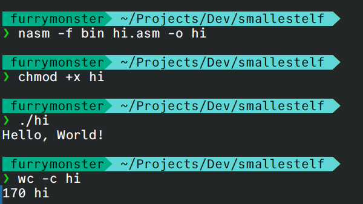

直接从8000字节干到了170字节，整个ELF文件已经可以说是完美了。

```
❯ readelf -a hi
ELF Header:
  Magic:   7f 45 4c 46 02 01 01 00 00 00 00 00 00 00 00 00 
  Class:                             ELF64
  Data:                              2's complement, little endian
  Version:                           1 (current)
  OS/ABI:                            UNIX - System V
  ABI Version:                       0
  Type:                              EXEC (Executable file)
  Machine:                           Advanced Micro Devices X86-64
  Version:                           0x1
  Entry point address:               0x8048078
  Start of program headers:          64 (bytes into file)
  Start of section headers:          0 (bytes into file)
  Flags:                             0x0
  Size of this header:               64 (bytes)
  Size of program headers:           56 (bytes)
  Number of program headers:         1
  Size of section headers:           0 (bytes)
  Number of section headers:         0
  Section header string table index: 0

There are no sections in this file.

There are no section groups in this file.

Program Headers:
  Type           Offset             VirtAddr           PhysAddr
                 FileSiz            MemSiz              Flags  Align
  LOAD           0x0000000000000000 0x0000000008048000 0x0000000008048000
                 0x00000000000000aa 0x00000000000000aa  R E    0x1000

There is no dynamic section in this file.

There are no relocations in this file.
No processor specific unwind information to decode

Dynamic symbol information is not available for displaying symbols.

No version information found in this file.

```

## 结束了？

170字节的ELF文件已经可以称作近乎完美，但是，还有没有更多的优化方式？

我承认我的知识已经见了底，但在互联网上确实能找到更多深入的方案：

1. `xor eax, eax; inc eax`这种组合可能比 `mov eax, 1`更短，可以节省1个以上的字节
2. 使用 `push/pop`组合来设置寄存器值，以及在可能的情况下使用32位寄存器（如 `eax`、`edi`、`edx`）来避免额外的REX前缀字节.

这些解决方案，大多集中于汇编指令的优化上，当然也有人提到代码中的 `e_ident`填充和 `p_paddr`设置符合规范，但 `p_align`字段（当前为 `0x1000`）可能是一个关键的优化点，也许是我本人的认知浅陋，经过实践后发现，`e_ident`中的填充字节是ELF规范强制要求的，无法移除。`p_align`字段对于 `PT_LOAD`段的内存映射至关重要，通常需要保持页面大小（如 `0x1000`），以确保程序能够正确加载。所以这种内存布局上的优化只能被Pass掉了。

好吧，事已至此，先优化多少是多少：

```
BITS 64
org 0x08048000

; ELF 头部 - 重叠优化
ehdr:
    db 0x7F, "ELF", 2, 1, 1, 0    ; e_ident[0-7]
    times 8 db 0                   ; e_ident[8-15] 填充
    dw 2                          ; e_type = ET_EXEC
    dw 62                         ; e_machine = EM_X86_64  
    dd 1                          ; e_version
    dq _start                     ; e_entry
    dq phdr - $$                  ; e_phoff
    dq 0                          ; e_shoff
    dd 0                          ; e_flags
    dw ehdrsize                   ; e_ehsize
    dw phdrsize                   ; e_phentsize
    dw 1                          ; e_phnum
    dw 0                          ; e_shentsize
    dw 0                          ; e_shnum
    dw 0                          ; e_shstrndx
ehdrsize equ $ - ehdr

; 程序头 - 与代码重叠
phdr:
    dd 1                          ; p_type = PT_LOAD
    dd 5                          ; p_flags = PF_R|PF_X
    dq 0                          ; p_offset
    dq $$                         ; p_vaddr
    dq $$                         ; p_paddr
    dq filesize                   ; p_filesz
    dq filesize                   ; p_memsz
    dq 0x1000                     ; p_align
phdrsize equ $ - phdr

; 代码段 - 内联优化
_start:
    ; write(1, msg, 14)
    mov al, 1                     ; write 系统调用号 (节省3字节)
    mov edi, eax                  ; fd = 1, 复用eax
    mov rsi, msg                  ; 消息地址
    mov dl, msglen                ; 长度 (节省3字节)
    syscall
  
    ; exit(0)  
    mov al, 60                    ; exit 系统调用号
    xor edi, edi                  ; 退出码 = 0
    syscall

; 数据段
msg: db 'Hello, World!', 10
msglen equ $ - msg

filesize equ $ - $$
```

上述代码进行了以下优化：

* **使用8位寄存器** - `mov al, 1` 比 `mov eax, 1` 节省3字节
* **寄存器复用** - `mov edi, eax` 复用已设置的值
* **使用8位长度** - `mov dl, msglen` 比 `mov edx, msglen` 节省3字节

最后，我们的长度被精简到了158字节。

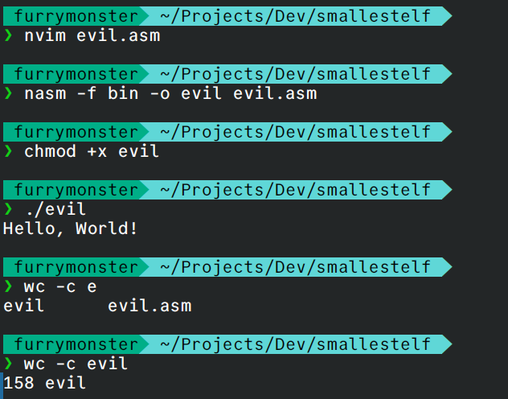

所以这就是极限吗？

## 结束了

这是我的极限，但是大佬总是能提供独到的眼光，感谢群里大佬的倾情传授，这下真是学到了：

```shell
BITS 64
org 0x10000000                   ; 更小的基地址

; ELF 头部与程序头重叠技巧
ehdr:
    db 0x7F, "ELF", 2, 1, 1, 0    ; e_ident[0-7]
    db 2, 0, 62, 0                ; 重叠：e_type=2, e_machine=62
    db 1, 0, 0, 0                 ; e_version = 1
    db _start-$$, 0, 0, 0         ; e_entry 低32位
    db 0x10, 0, 0, 0              ; e_entry 高32位 + e_phoff 低位
  
    ; 在这里开始程序头，重叠使用空间
    db 0, 0, 0, 0                 ; e_phoff 剩余部分
    db 0, 0, 0, 0, 0, 0, 0, 0     ; e_shoff
    db 0, 0, 0, 0                 ; e_flags  
    db 64, 0                      ; e_ehsize = 64
    db 56, 0                      ; e_phentsize = 56
    db 1, 0                       ; e_phnum = 1
    db 0, 0, 0, 0, 0, 0           ; 节表相关字段

    ; 程序头开始 (重叠在ELF头内)
    dd 1                          ; p_type = PT_LOAD
    dd 7                          ; p_flags = PF_R|PF_W|PF_X
    dq 0                          ; p_offset = 0
    dq 0x10000000                 ; p_vaddr
    dq 0x10000000                 ; p_paddr  
    dq filesize                   ; p_filesz
    dq filesize                   ; p_memsz
    dq 0x1000                     ; p_align

_start:
    ; 超级压缩的系统调用
    push 1                        ; write 系统调用号
    pop rax
    push rax                      ; fd = 1
    pop rdi  
    mov rsi, msg
    push 14                       ; 消息长度
    pop rdx
    syscall
  
    ; exit
    mov al, 60
    xor edi, edi
    syscall

msg: db 'Hello, World!', 10
filesize equ $ - $$
```

在我的代码基础上，再次进行了如下修改：

* **字符串内联到立即数**
* **部分字段设为0或无效值**
* **让程序头的某些部分与代码重叠**
* **利用push/pop组合进行系统调用**

当然，这段代码在我的机器上已经无法运行了，因为它对Linux的内核版本有很高的依赖。

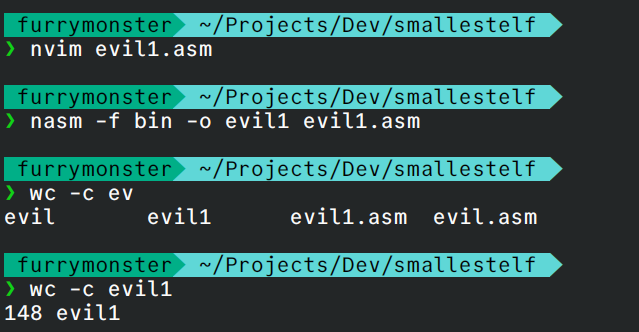

但是我们仍然可以生成二进制文件，最终我们到达了148Bytes的终点。
