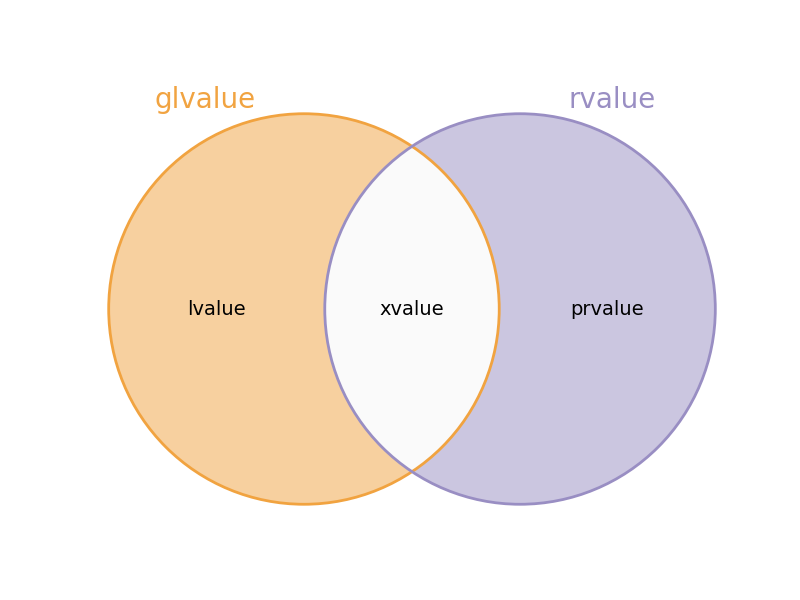
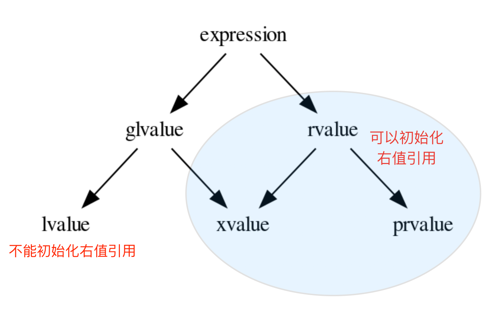
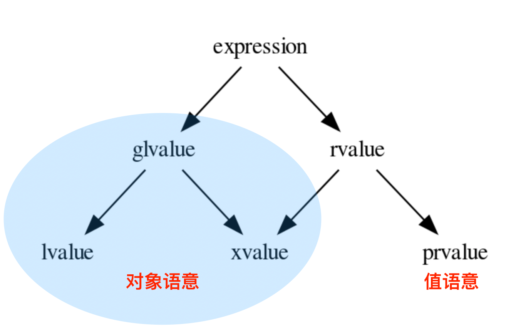
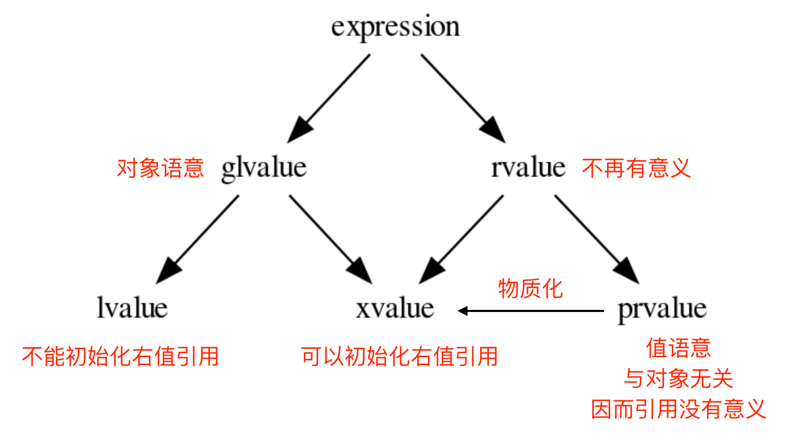

今天看自己博客复习C++的时候，突然发现之前现代C++的部分好像缺了点东西，这几天就打算一边复习一边抽空把博客补齐，杜绝弃坑！

## 引用

首先我们来回顾一下C++中的 **&**，引用。引用是 C 所没有的概念。而这个概念，比它表面看起来要复杂一些。

### 值与对象

为了理解引用，我们先来说说什么是**左值**和**右值**。

简而言之，**左值** 是一种 **对象** ，而不是 **值** 。其关键区别在于，是否明确在内存中有其可访问的位置。 即，其是否存在一个可访问的地址。如果有，那么它就是一个 **对象** ，也就是一个 **左值** ，否则，它就只是 一个 **值** ，即 **右值** 。

比如：你不可能对整数 `10` 取地址，因而这个表达式是一个 **右值** 。但是如果你定义了一个变量：

```cpp
int a = 10;
```

变量 `a` 则代表一个 **对象** ，即 **左值** 。如果我们再进一步，表达式 `a + 1` 则是一个右值表达式，因为你无法对这个表达式取地址。

任何可以取地址的表达式，背后都必然存在一个 **对象** ，因而也必然属于 **左值** 。而如果我们把对象地址看作其 **身份证** ( Identifier ）， 那么我们也可以换句话说：任何有 **身份证** 的表达式，都属于 **左值**；否则，肯定属于 **右值** 。

### 引用是对象的别名

所以，按照我们在传统C++教科书上所表述的：**引用** 是 **对象** 的 **别名** ，也就是指你没有创建任何 **新事物** ，而只是对 **已存在事物** 赋予了另外一个名字。比如：

```cpp
using Int = int;
```

你并没有创建一个叫做 `Int` 的新类型，而只是对已存在类型 `int` 赋予了另外一个名字。再比如：

```cpp
template <typename T>
using ArrayType = Array<T, 10>;
```

你并没有创建一个签名为 `ArrayType<T>` 的新模版，而只是对已存在模版 `Array<T,N>` 进行部分实例化后得到的模版，赋予了一个新名字。

因而，**引用** 作为 **对象别名** ，并没有创建任何 **新对象** （包括引用自身），而仅仅是给已存在对象赋予了一个新名字。

### 引用的空间

正是因为其 **别名** 语义， C++ 没有规定 **引用** 的尺寸（事实上，从 **别名** 语义的角度，它本身不需要内存，因而也就没有尺寸而言）。

因而，如果你试图通过 `sizeof` 去获取一个 **引用** 的大小，是不可能的。你只能得到它所引用的对象的大小（由于别名语义）。

```cpp
struct Foo {
  std::size_t a;
  std::size_t b;
};

Foo foo;
Foo& ref = foo;

static_assert(sizeof(ref) == sizeof(Foo));
```

也正是由于其 **别名语义** ，当你试图对一个引用取地址时，你得到的是对象的地址。比如，在上面的例子中， `&ref` 与 `&foo` 得到的结果是一样的。

因而，当你定义一个指针时，指针自身就是一个 **对象** (左值)；它本身有自己明确的存储，并可以取自己的地址，可以通过 `sizeof` 获取自己的尺寸。

但是 **引用** ，本身不是一个像指针那样的额外对象，而是一个对象的别名， **你对引用进行的任何操作，都是其所绑定对象的操作** 。

在上面的例子中，`ref`与 `foo` 没有任何差别，都是对象的一个名字而已。它们本身都代表一个对象，都是一个左值表达式。

而下面的例子中，`ref_to_obj` 与 `ref_to_ptr` 则是天差地别。

```cpp
struct Foo {
  std::size_t a;
  std::size_t b;
};

Foo* ptr = new Foo();
Foo& ref_to_obj = *ptr;
Foo*& ref_to_ptr = ptr;

static_assert(sizeof(ptr)!=sizeof(ref_to_obj));
static_assert(sizeof(ptr)==sizeof(ref_to_ptr));
static_assert(sizeof(ref_to_ptr)!=sizeof(ref_to_obj));
```

因而，在不必要时，编译器完全不需要为引用分配任何内存。

但是，当你需要在一个数据结构中保存一个引用，或者需要传递一个引用时，你事实上是在存储或传递对象的 **身份** （即地址）。

虽然这并不意味着 `sizeof(T&)` 就是引用的大小（从语义上，引用自身非对象，因而无大小，`sizeof(T&) == sizeof(T)` ），但对象的地址的确 需要对应的空间来存储。

```cpp
struct Bar {
   Foo& foo;
};

// still, reference keeps its semantics.
static_assert(sizeof(Bar::foo) == sizeof(Foo));

// but its storage size is identical to a pointer
static_assert(sizeof(Bar) == sizeof(void*));

// interesting!!!
static_assert(sizeof(Bar) < sizeof(Bar::foo));
```

这里体现了C++的一大特点：尽管C++是较为底层的语言，与操作系统/计算机体系强相关，但是我们并不能处处都用数据结构与算法的实际模型来理解。C++的行为是建立在C++标准上的一种抽象模型。

### 受限的指针

在传递或需要存储时，一个引用的事实空间开销与指针无异。因而，在这些场景下，它经常被看作一个受限的指针：

> 1. 一个引用必须初始化。这是因为其 **对象别名** 语义，因而没有 **绑定** 到任何对象的引用，从语义上就不成立。
> 2. 由于必须通过初始化将引用绑定到某一个对象，因而从语义上，不存在 **空引用** 的概念。这样的语义，对于我们的接口设计，有着很好的帮助： 如果一个参数，从约束上就不可能是空，那么就不要使用指针，而使用引用。这不仅可以让被调用方避免不必要的空指针判断；更重要的是准确的约束表达。
>    不过，需要特别注意的是：虽然 **空引用** 从概念上是不存在的，但从事实上是可构造的。比如： `T& ref = *(T*)nullptr` 。
>    因而，在项目中，任何时候，需要从指针转为引用时，都需要确保指针的非空性。
>    另外，**空引用** 本身这个概念就是不符合语义的，因为引用只是一个对象的别名。上面的表达式，事实上站在对象角度同样可以构造: `T obj = *(T*)nullptr` 。 正如我们将指针所指向的对象赋值（或者初始化）给另一个对象一样，我们都必须确保指针的非空性。
> 3. 像所有的左值一样，引用可以绑定到一个抽象类型，或者不完备类型（而右值是不可能的）。从这一点上，指针和引用具有相同的性质。因而，在传递参数时，决定 使用指针，还是引用，仅仅受是否允许为空的设计约束。
> 4. 一个引用不可能从一个对象，绑定到 **另外** 一个对象。原因很简单，依然由于其 **对象别名** 语义。它本身就代表它所绑定的对象，重新绑定另外一个对象，从概念上不通。
>    而引用的 **不可更换性** ，导致任何存在引用类型非静态成员的对象，都不可能直接实现 **拷贝/移动赋值** 函数。 因而，标准库中，需要存储数据的，比如 **容器** ， `tuple` , `pair` , `optional` 等等结构，都不允许 存储 **引用** 。
>    这就会导致，当一个对象需要选择是通过 **指针** 还是 **引用** 来作为数据成员时，除了 **非空性** 之外，相对于参数传递，还多了一个约束： **可修改性** 。 而这两个约束并不必然是一致的，甚至可以是冲突的。
>    比如，一个类的设计约束是，它必须引用另外一个对象（非空性），但是随后可以修改为引用另外一个对象。这种情况下， 使用指针就是唯一的选择。但代价是，必须通过其它手段来保证 **非空性** 约束。

:::tip

对于上述第四点，所谓的"引用的忠贞不渝性"，我们举一个例子，假设开发一个 UI 框架，有一个 `Inspector`（检查器）类，它必须始终盯着一个 `Button`（按钮）看，用来显示按钮的属性，而这样一个组件，需要满足：

* **约束 A（非空性）：** 检查器不能没有观察对象，否则界面会崩溃。
* **约束 B（可修改性）：** 用户点击不同的按钮时，检查器要能切换观察目标。

引用方案：

```cpp
class Inspector {
    Button& target; // 必须在构造函数初始化
public:
    Inspector(Button& b) : target(b) {}
  
    // 无法实现：target 不能重新绑定
    void switchTarget(Button& new_b) {
        // target = new_b; // 错误！这会调用 Button 的赋值运算符，改变原按钮的内容，而不是改变指向
    }
};
```

由于 `target` 是引用，`Inspector` 变成了“不可赋值”的，无法将其存入 `std::vector` 或进行重新赋值。

指针方案：

```cpp
class Inspector {
    Button* target; 
public:
    Inspector(Button* b) : target(b) {
        if (!b) throw std::invalid_argument("Target cannot be null");
    }
  
    void switchTarget(Button* new_b) {
        if (!new_b) return; // 必须手动检查非空
        target = new_b;     // 允许切换
    }
};
```

指针解决了切换问题，但它带来了“语义上的虚假”：在类内部的任何地方，都要注意 `target` 是否可能被不小心设为 `nullptr`。

现代C++的解决方案中，为了解决这个冲突，通过标准库提供了一个折中方案：`std::reference_wrapper`。它在语义上像引用（不能为空），但在物理上像指针（可以重新绑定，可以存入容器）。

```cpp
#include <functional>
#include <vector>

struct Button { string name; };

class Inspector {
    // 包装引用：既保证不为空，又允许重新绑定
    std::reference_wrapper<Button> target; 

public:
    Inspector(Button& b) : target(b) {}

    void switchTarget(Button& new_b) {
        target = new_b; // 合法！内部存储的指针被更新了
    }

    void print() {
        // 使用 .get() 获取原对象的引用
        printf("Watching: %s\n", target.get().name.c_str());
    }
};

int main() {
    Button btn1{"Save"}, btn2{"Cancel"};
  
    Inspector insp(btn1);
    insp.switchTarget(btn2); // 灵活切换
  
    // 甚至可以放进容器，这是普通引用做不到的
    std::vector<Inspector> list;
    list.push_back(insp); 
}
```

这种设计权衡在大型系统（如游戏引擎的组件系统、编译器后端的操作数建模）中非常常见。

:::

## 右值引用

### 缺失的非常量右值引用

在 C++11 之前，表达式分类为 **左值表达式** 和 **右值表达式** ，简称 **左值** 和 **右值** 。**左值** 都对应着一个明确的对象；从而也都必然可以通过 `&` 进行取地址操作。
而 **右值** 表达式虽然肯定都不能进行取地址操作，但在有些场景下，也会隐含着创建一个 **临时对象** 的语意。

比如 `Foo(10)` ，在 C++98 的年代，其语意是：以 `10` 来构造一个 `Foo` 类型的临时对象。而这个表达式属于 **右值** 。

而引用，从 constness 的角度，可以分为： **non-const reference** 和 **const reference** 。

因而， **constness** 和 **引用** 的 **对象类别** 组合在一起，一共能产生四种类型的引用：

1. **const     lvalue reference**
2. **non-const lvalue reference**
3. **const     rvalue reference**
4. **non-const rvalue reference**

在 C++11 之前，通过符合 `&` 和 `const` 的两种组合，可以覆盖三种场景：

1. `Foo&`

* **non-const lvalue reference**
  比如： `Foo foo(10); Foo& ref = foo;`

2. `const Foo&`

* **const lvalue reference**
  比如： `Foo foo(10); const Foo& ref = foo;`
* **const rvalue reference**
  比如： `const Foo& ref = Foo(10);`

但对于 **non-const rvalue reference** 无法表达。

好在那时候并没有**移动语意**的支持，因而对于 **non-const rvalue reference** 的需求也并不强烈。

### 移动语义

C++11 之前，只有 `copy` 语意，这对于极度关注性能的语言而言是一个重大的缺失。那时候程序员为了避免性能损失，只好采取规避的方式。比如:

```cpp
std::string str = s1;
s += s2;
```

这种写法就可以规避不必要的拷贝。而更加直观的写法：

```cpp
std::string str = s1 + s2;
```

则必须忍受一个 `s1 + s2` 所导致的中间 **临时对象** 到 str 的拷贝开销。即便那个中间临时对象随着表达式的结束，会被销毁（更糟的是，销毁所伴随的资源释放，也是一种性能开销）。

对于 `move` 语意的急迫需求，到了 C++11 终于被引入。其直接的驱动力很简单：在构造或者赋值时，如果等号右侧是一个中间临时对象，应直接将其占用的资源直接 `move` 过来（对方就没有了）。

但问题是，如何让一个构造函数，或者赋值操作重载函数能够识别出来这是一个临时变量？

在 `C++11` 之前，拷贝构造和赋值重载的原型如下：

```cpp
struct Foo {
   Foo(const Foo&);
   Foo& operator=(const Foo&);
};
```

参数类型都是 `const &` ，它可以匹配到三种情况：

1. **non-const lvalue reference**
2. **const lvalue reference**
3. **const rvalue reference**

对于 **non-const rvalue reference** 是无能为力的。 另外，即便是能捕捉 **const rvalue reference** ，
比如： `foo = Foo(10);` ，但其 `const` 修饰也保证了其资源不可能被 `move` 走。

因而，能够被 `move` 走资源的，恰恰是之前缺失的那种引用类型： **non-const rvalue reference** 。

这时候，就需要有一种表示法，明确识别出那是一种 **non-const rvalue reference** ，最后定下来的表示法是 `T&&` 。
这样，就可以这样来定义不同方式的构造和赋值操作：

```cpp
struct Foo {
   Foo(const Foo&);   // copy ctor
   Foo(Foo&&);        // move ctor

   Foo& operator=(const Foo&); // copy assignment
   Foo& operator=(Foo&&);      // move assignment
};
```

通过这样的方式，让 `Foo foo = Foo(10)` 或 `foo = Foo(10)` 这样的表达式，都可以匹配到 `move` 语意的版本。

与此同时，让 `Foo foo = foo1` 或 `foo = foo1` 这样的表达式，依然使用 `copy` 语意的版本。

### 右值引用变量

引入了 **右值引用** 之后，就有一系列的问题(或者说是law，定律)需要明确。

首先，在不存在重载的情况下：

1. **左值** 是否可以匹配到 **右值引用类型参数** ？
   比如：

```cpp
struct non_copyable {
   non_copyable(non_copyable&&);
};
```

答案显然是 **NO** ，否则，一个左值就会被 `move ctor` 将其资源偷走，而这很明显不是我们所期望的；

2. **右值** 是否可以匹配到 **左值引用类型参数** ？
   比如：

```cpp
struct non_movable {
   non_movable(const non_movable&);
};

struct non_movable2 {
   non_movable2(non_movable&);
};
```

答案是看情况。

> * 至少在 C++11 之前， 一个右值，就可以被类型为 `const T&` 类型的参数匹配。
>   说人话就是历史包袱，**常量右值引用**和**非常量右值引用**已经在C++11以前被 `const T&`(常量左值引用)处理了，保留历史痕迹，所以可行；
> * 但一个右值，不能被 `T&` 类型的参数匹配；毕竟这种属于**可以修改**的承诺。
>   而修改一个调用后即消失的 **临时对象** 上，没有任何意义，反而会导致程序员犯下潜在的错误，因而还是禁止了最好。
>   说人话就是，**非常量右值引用**能否匹配**非常量左值引用**，根本不重要，因为右值很快就被清除了，但是如果保留的话，编译器不报错，大家就都会写出垃圾代码。

这就遗留下来一种情况：

3. 一个 **non-const rvalue reference** 类型的变量，是否允许匹配 **non-const lvalue reference** 类型的参数？（注意，这里的重点是"变量"是否允许匹配，而不是"非常量右值引用"是否匹配，可能有些绕）

比如：

```cpp
void f(Foo& foo) { foo.a *= 10; }

Foo&& ref = Foo{10};

f(ref); // 是否允许

int b = ref.a + 10;
```

没有任何理由不允许这样的匹配。毕竟，自从变量 `ref` 被初始化后，其性质上和 **左值引用** 一样，都是引用了一个已经存在的对象。

例子中，经过 `f(ref)` 对 `ref` 所引用的对象内容进行修改之后，还会基于其内容进行进一步的处理。这都是非常合理的需求。

并且，`ref` 所引用的对象的生命周期，和 `ref` 一样长，不用担心在使用 `ref` 期间，对象已经不存在的问题。

这就导致了一个看起来很矛盾的现象：

```cpp
void f(Foo& foo) { foo.a *= 10; }

Foo&& ref = Foo{10};
f(ref);     // OK

f(Foo{10}); // 不允许
```

先将一个 **临时对象** 初始化给一个 **右值引用** ，再传递给函数 `f` ，与直接构造一个 **临时对象** 传递给 `f` ，一个是允许的，一个是禁止的。

这背后的差异究竟意味这什么？

一个类型为 **右值引用** 的变量，一旦被初始化之后，临时对象的生命将被扩展，会在其被创建的 scope 内始终有效。因而，`Foo&& foo = Foo{10}`，从语意上相当于：

```cpp
{
   Foo __temp_obj{10};
   Foo& ref = __temp_obj;

   // 各种对ref的操作
}
// 离开scope, __temp_obj被销毁
```

因而，看似 `foo` 被定义的类型为 **右值引用** ，但这 **仅仅约束它的初始化** ：只能从一个 **右值** 进行初始化。但一旦初始化完成，它就和一个 **左值引用** 再也没有任何差别：都是一个已存在对象的 **标识** 。

函数参数也没有任何特别之处，它就是一个普通的变量。无非是其可访问范围被限定在函数内部。调用一个函数时，传递实参的过程，就是一个对参数（变量）进行初始化的过程，而初始化的细节与一个普通变量没有任何差别。

```cpp
void stupid(Foo&& foo) {
   foo.a += 10;   // 在函数体内，foo的性质与一个左值引用毫无差别
   // blah ...
}

stupid(Foo{10});  // 在执行函数体之前，进行参数初始化: Foo&& foo = Foo{10}
```

而临时对象 `Foo{10}` 的生命周期，会比参数变量 `foo` 更长。所以将 `foo` 看作 **左值引用** 随意访问，是没有任何风险的。也就是说它除了容易让程序员做出一些匪夷所思的行为（例如修改右值引用然后退出函数后发现被销毁了）之外，并不会影响函数之外数据的安全性。

所以，任何一个类型为 **右值引用** 的变量，一旦初始化完成，性质上就变成和一个 **左值引用** 毫无差别。这样的语意，对于程序员的使用是最为合理的。

我们再看下面的例子：

```cpp
std::string&& ref = std::string("abc");

std::string obj = ref; // move? 还是 copy?

std::string s = ref + "cde"; // 是否可以接着假设ref所引用的对象是合法的？
```

既然在完成初始化之后，一个 **右值引用类型** 的变量，就变成了 **左值引用** ，按照这个语意，
当然就只能选择 `copy` 构造。这样的选择，也让后面对于 `ref` 的继续使用是安全合理的，
这其实也在帮助程序员编写安全的代码。

毕竟，只有在调用 `move constructor` 那一刻，传入的是真正的临时变量，也就是说 `move constructor` 调用结束后，临时变量也就不再存在，无从访问的情况下，自动选择 `move constructor` 才是确定安全的。

经过之前讨论，我们知道这样的设计决策是最合理的，但矛盾和张力依然存在：毕竟，变量 `ref` 的类型是 **右值引用** ，而 `move constructor` 的参数类型也是 **右值引用** ，为什么它们不是最匹配的，反而是匹配了 `copy constructor` ？

另外， `move constructor` 自动匹配真正的临时对象，毫无疑问是合理的（也是我们的初衷），但我们如何区分一个临时对象和一个类型为 **右值引用** 的变量？

这个并不难。因为 `C++` 早就规定了，产生临时变量的表达式是 **右值** ，而任何变量都是一个对象的标识，因而都是 **左值** ，哪怕变量类型是 **右值引用** 。

因而，**右值** 选择 `move constructor` ， **左值** 选择 `copy constructor` 。

更准确的说，所谓选择 `move constructor` ，其实是因为 **右值** 匹配的是 `move constructor` 参数，其类型是一个 **右值引用** 。我们知道，函数参数也是变量，而一个类型为 **右值引用** 的变量，只能由 **右值** 来初始化：

```cpp
Foo   foo{10};
Foo&& ref = foo; // 不合法，右值引用只能由右值初始化

Foo&& ref1 = Foo{10};
Foo&& ref2 = ref1; // 不合法，ref1是个左值
```

因而，做为类型为 **右值引用** 的函数参数，唯一能匹配的就是 **右值** 。这也是 `move constructor` 能精确识别临时变量的原因。

:::important

1. 对于任何类型为 **右值引用** 的变量（当然也包括函数参数），只能由 **右值** 来初始化；
2. 一旦初始化完成， **右值引用** 类型的变量，其性质与一个 **左值引用** 再也没有任何差别。

:::

### 速亡值/将亡值

我们现在已经明确了，只有右值临时对象可以初始化右值引用变量，从而也只有右值临时变量能够匹配参数类型为 **右值引用** 的函数，包括 `move` 构造函数。

这中间依然有一个重要的缺口：如果程序员就是想把一个左值 `move` 给另外一个对象，该怎么办？

最简单的选择是通过 `static_cast` 进行类型转换：

```
Foo   foo{10};
Foo&& ref = Foo{10};

Foo obj1 = static_cast<Foo&&>(foo); // move 构造
Foo obj2 = static_cast<Foo&&>(ref); // move 构造
```

我们之前说过，只有 **右值** ，才可以用来初始化一个 **右值引用** 类型的变量，因而也只有 **右值** 才能匹配 `move` 构造。所以， `static_cast<Foo&&>(foo)` 表达式，肯定是一个 **右值** 。

但同时，它返回的类型又非常明确的是一个 **引用** ，而这一点又不符合 **右值** 的定义。因为，所有的右值，都必须是一个 **具体类型** ，不能是不完备类型，也不能是抽象类型，但 **引用** ，无论左值引用，还是右值引用，都可以是不完备类型的引用或抽象类型的引用。这是 **左值** 才有的特征。

对于这种既有左值特征，又和右值临时对象一样，可以用来初始化右值引用类型的变量的表达式，只能将其归为新的类别。C++11 给这个新类别命名为 **速亡值** (eXpiring value，简称 xvalue)。 而将原来的 **右值** ，重新命名为 **纯右值** 。而 **速亡值** 和 **纯右值** 合在一起，称为 **右值** ，其代表的含义是，所有可以直接用来初始化 **右值引用类型变量** 的表达式。

同时，由于 **速亡值** 又具备左值特征：可以是不完备类型，可以是抽象类型，可以进行运行时多态。所以，**速亡值** 又和 **左值** 一起被归类为 **泛左值** （generalized lvalue, 简称glvalue)。





除了 `static_cast<T&&>(expr)` 这样的表达式之外，任何返回值为 **右值引用** 类型的函数调用表达式也属于 **速亡值** 。从而让用户可以实现任意复杂的逻辑，然后通过返回值为 **右值引用** 的方式，直接初始化一个右值引用类型的变量。以此来达到匹配 `move` 构造， `move` 赋值函数，以及任何其它参数类型为 **右值引用** 的函数的目的。

C++ 标准对其的定义为：

> xvalue:an xvalue (an “eXpiring” value) is a glvalue that denotes an object or bit-field whose resources can be reused.

意思就是，这类表达式表明了自己可以被赋值给一个类型为 **右值引用** 的变量，当然自然也就可以被 `move` 构造和 `move` 赋值操作自然匹配，从而返回的引用所引用的对象可以通过 `move` 而被重用。

所以，速亡值未必真的会速亡（expiring），它只是能用来初始化右值引用类型的变量而已。只有用到 `move` 场景下，它才会真的导致所引用对象的失效。

最后，速亡表达式存在着一个异常场景，那就是函数类型的右值引用。因为函数地址被 `move` 本身毫无意义。所以，对于返回值为 **函数类型右值引用** 的函数调用，或者 `static_cast<FunctionType&&>(expr)` 的表达式，其类别为 **左值** ，而不是 **速亡值** 。

:::important

* 类型为 **右值引用** 的变量，只能由 **右值** 表达式初始化；
* **右值** 包括 **纯右值** 和 **速亡值** ，其中 **速亡值** 的类型是 **右值引用** ；
* 类型为 **右值引用** 的变量，是一个 **左值** ，因而不能赋值给其它类型为 **右值引用** 的变量，
  当然也不能匹配参数类型为 **右值引用** 的函数。

:::

## 值与对象

在理解 Modern C++ 的各种令人眼花缭乱的特性之前，必须先搞清楚两个基本概念：**对象** （ object ）和 **值** （ value ）。 这是理解很多特性的基础。

### 值

简单说， **值** 是一个纯粹的数学抽象概念，比如数字 `10` ，或者字符 `'a'` , 或者布尔值 `false` ，等等。它们完全不需要依赖于计算机或者内存而存在，就只是一个纯粹的值：不需要存储到内存，当然也就不可修改。注意，这与存储在内存中，但 immutable 完全不是一个语意。

那么 `1+2` 呢？这是一个表达式，但这个表达式的求值结果也是一个 **值** 。因而，这是一个值类别的表达式 。
而数字 `10` 同样是一个表达式，其求值的结果毫无疑问也是一个 **值** ——它自身。
因而，在这个角度， `1+2` 和数字 `10` ，从性质上没有任何区别，都是 **值** 类别的表达式。

### 对象

**对象** 是一个在内存中占据了一定空间的有类型的东西。因而，它必然是与计算机内存这个物理上具体存在的设备关联在一起的一个物质。

因而，每一个对象都必然有一个 **标识** （ Identifier ），从而你可以知道这个对象在内存中唯一的起始位置。否则，对象是一个与内存关联在一起的物质就无从谈起。

所以 `int i` 就定义了一个对象，系统必然会在内存中为其分配一段 `sizeof(int)` 大小的空间，而 `i` 就是这个对象的标识。

既然对象与内存有关联，并且有自己区别于其它对象的唯一起始内存地址，那么任何对象都必然可以被引用。引用做为一个对象的别名，当然也是对象的一种 **标识** 。

所以，区分 **对象** 和 **值** 的方法非常简单：是否有 **标识** ，或可否被 **引用** （毕竟引用就是一种标识）。只有做为具体内存物质的对象才可能被引用；而值，做为一种抽象概念， 引用无从谈起。

### 值与对象的关系

那么 **值** 和 **对象** 之间是什么关系？

很简单， **值** 用来初始化 **对象** 。比如： `bool b = true` ,其语意是：用值 `true` 初始化对象 `b`；类似的，`int i = 1 + 2`  表示用值 `1+2` 的计算结果值，初始化对象 `i` 。 **对象** 表示内存中的一段有类型的空间， **值** 这则是个空间里的内容。 用 **值** 来初始化 **对象** 的过程，是一个将值加载到空间的隐喻。

### 纯右值

所有的 **值** 语意的表达式，都归类为 **纯右值** （ pure right value ，简称 prvalue ）。在 C++11 之前，它们被称做 **右值** 。

规范对于纯右值的定义如下：

> A prvalue is an expression whose evaluation initializes an object or a bit-field,
> or computes the value of an operand of an operator, as specified by the context in which it appears,
> or an expression that has type cv void.

其存在的唯一的目的，是为了初始化 **对象** 。单独写一个 **纯右值** 表达式的语句，比如： `1+2;`，或者 `true && (1 == 2);` ，这样的表达式被称做 `弃值表达式` 。从语意上，它们仍然会初始化一个临时对象，而临时对象也是泛左值。后面我们会进行解释。

而既然是一个 **值** ，就必须是某种具体类型的值，而不可能是某种 **不完备类型** 。当然也不可能是一个 **抽象类型** （包含有纯虚函数的类）的值，即便其基类是某种抽象类型，但它自身必然是一个具体类型，因而对其任何 `virtual` 函数的调用，都是对其具体类型所对应的函数实现的调用。

同时，你不可能对一个值进行取地址操作（语意上就不通），也不可能引用它。

### 泛左值

与 **纯右值** 对应的是 **泛左值** （ glvalue ）。整个表达式的世界被分为这两大类别。前者全部是 **值** 语意，后者全部是 **对象** 语意。

规范对于泛左值的定义如下：

> A glvalue is an expression whose evaluation determines the identity of an object, bit-field, or function.

从这个定义我们可以看出，泛左值表达式的求值结果是一个对象的标识。



#### 左值

左值很容易辨别：任何可以对其通过符号 `&` 取地址的表达式，都属于 **左值** 。因而，任何变量（包括常量），无论是全局的，还是类成员的，还是函数参数，还是函数名字，都肯定属于左值。

另外，所有返回值是左值引用的函数调用表达式（包括用户自定义的重载操作符），以及 `static_cast<T&>(expr)` 都必然也属于左值。毕竟，没有内存中的对象，哪里来的引用？而引用无非是对象的一个别名标识罢了。

剩下的就是系统的一些 builtin 操作符的定义，比如对一个指针求引用操作： `*p` ，或者 `++i` （ `i++` 却是一个 **右值** ）。

其中，最为特殊的是字符串字面常量，比如： `"abcd"` ，这是一个左值对象。这有点违背直觉，但由于 C/C++ 中字符串并不是一个 builtin 基本类型。这些字符串字面常量都会在内存中得以存储。

需要注意的是，这两种情况下，无论是变量 `i` ，还是函数参数 `r` ，它们都是一个 **左值** ，虽然它们的类型是 **右值引用** 。我们之前谈到过，任何变量，无论其属于什么类型，都必然是一个左值。变量的名字，就是对应对象的标识。

#### 速亡值

速亡值是所有返回类型为 **右值引用** 的非左值表达式。这包括返回值类型为 **右值引用** 的函数调用表达式，`static_cast<T&&>(expr)` 表达式。

其所引用的对象，从理论上同样也是可以取其地址的。其目的是为了初始化类型为 **右值引用** 类型的变量。借此，也可以匹配参数类型为右值引用的函数。一旦允许取其地址，程序的其它部分将无从判断，一个地址来自于速亡值对象，还是来自于左值对象，从而让速亡值的存在失去了本来的意义。因而，对其取地址操作被强行禁止。

#### 对象？值？

上面给的那些与值有关的例子，简单而直观，不难理解它们是数学意义上的值。我们来看一个不那么直观的例子：在 `Foo` 是一个 `class` 的情况下， `Foo{10}` 是一个对象还是一个值？

在 C++17 之前，这个表达式的语意是一个 **临时对象** 。

非常有说服力的例子是： `Foo&& foo = Foo{10}`  或者 `const Foo& foo = Foo{10}` 。这这两个初始化表达式里，毫无疑问 `Foo{10}` 是一个对象，因为它可以被引用，无论是一个右值引用 `Foo&&` ，还是一个左值引用 `const Foo&`，能被引用的必然是 `对象` 。

但后来人们发现，将其定义为对象语意，在一些场景下会带来不必要的麻烦：

比如： `Foo foo = Foo{10}` 的语意是：构造一个临时对象，然后 `copy/move` 给左边的对象 `foo` 。

注意，只要 `Foo{10}` 被定义为 **对象** ，那么 `copy/move` 语意也就变得不可避免，这就要求 `class Foo` 必须要隐式或显式的提供 `public copy/move constructor` 。即便编译器肯定会将对 `copy/move constructor` 的调用给优化掉，但这是到优化阶段的事，而语意检查发生在优化之前。如果 `class Foo` 没有 `public copy/move constructor` ，语意检查阶段就会失败。

这就给一些设计带来了麻烦，比如，程序员不希望 `class Foo` 可以被 `copy/move` ，所有 `Foo` 实例的创建都必须通过一个工厂函数，比如： `Foo makeFoo()` 来创建；并且程序员也知道 `copy/move constructor` 的调用必然会被任何像样的编译器给优化掉，但就是过不了那该死的对实际运行毫无影响的语意检查那一关。

于是，到了 C++17 ，对于类似于 `Foo{10}` 表达式的语意进行了重新定义，它们不再是一个 **对象** 语意，而只是一个 **值** 。即 `Foo{10}` 与内存临时对象再无任何关系，它就是一个 **值** ：其估值结果，是对构造函数 `Foo(int)` 进行调用所产生的 **值** 。而这个 **值** ，通过等号表达式，赋值给左边的 **对象** ，正如 `int i = 10` 所做的那样。从语意上，不再有对象间的 `copy/move` ，
而是直接将构造函数调用表达式作用于等号左边的 **对象** ，从而完成用 **值** 初始化 **对象** 的过程。因而， `Foo foo = Foo{10}` ，与 `Foo foo{10}` ，在 C++17 之后，从语意上（而不是编译器优化上）完全等价。

一旦将其当作 **值** 语意，很多表达式的理解上也不再一样。比如： `Foo foo = Foo{Foo{Foo{10}}}` ，如果 `Foo foo = Foo{10}` 与 `Foo foo{10}` 完全等价，那么就可以进行下列等价转换：

```cpp
    Foo foo = Foo{Foo{Foo{10}}}
<=> Foo foo{Foo{Foo{10}}
<=> Foo foo = Foo{Foo{10}}
<=> Foo Foo{Foo{10}}
<=> Foo foo = Foo{10}
<=> Foo foo{10}
```

注意，这是一个自然的语意推论，而不是编译器优化的结果。

自然，对于 `Foo makeFoo()` 这样的函数，其调用表达式 `makeFoo()` ，在 C++17 下也是 **值** 。
而不像之前定义的那样：返回一个临时对象，然后在 `Foo foo = makeFoo()` 表示式里， `copy/move` 给等号左侧的对象 `Foo` 。虽然 C/C++ 编译器很早就有 `RVO/NRVO` 优化技术；但同样，那是优化阶段的事，而不是语意分析阶段如何理解这个表达式语意的问题。

#### 纯右值物质化

我们再回到前面的问题： `Foo&& foo = Foo{10}` 表达了什么语意？毕竟，按照我们之前的讨论，等号右边是一个 **值** ，而左边是一个对于对象的 **引用** 。而 **引用** 只能引用一个对象，引用一个 **值** 是逻辑上是讲不通的。

这中间隐含着一个过程： **纯右值物质化** 。即将一个 **纯右值** ，赋值给一个 **临时对象** ，其标识是一个无名字的 **右值引用** ，即 **速亡值** 。然后再将等号左边的 **引用** 绑定到这个 **速亡值** 对象上。

**纯右值物质化** 的过程还发生在其它场景。

比如， `Foo{10}` 是一个 **纯右值** ，但如果我们试图访问其非静态成员，比如： `Foo{10}.m` ，此时就必需要将这个纯右值物质化，转化成 **速亡值** 。毕竟，对于任何非静态成员的访问，都需要对象的 **地址** ，与成员变量所代表的 **偏移** 两部分配合。没有对象的存在，仅靠偏移量访问其成员，根本不可能。

还有数组的订阅场景。比如:

```cpp
using Array = char [10];

Array{};    // 纯右值
Array{}[0]; // 速亡值
```

另外， `static_cast<T>(expr)` 是一个 **直接初始化** 表达式，
即，中间存在一个隐含的 `T` 类型的未命名临时变量，通过 `expr` 进行初始化。如果 `expr` 是一个 **纯右值** ，而 `T` 是一个 **右值引用** 类型，则这个过程也是一个纯右值 **物质化** 的过程。

而之前提到的 弃值表达式 ，也会有一个 **纯右值物质化** 的过程。这样的表达式的存在主要是为了利用其副作用。如果编译器发现其并不存在副作用，往往会将其优化掉。但这是优化阶段的职责。在语意分析阶段，统统是 **纯右值物质化** 语意。

在 C++17 之前的规范定义中，将 **纯右值** 和 **速亡值** 合在一起，称为 **右值** 。代表它们可以被一个 **右值引用类型的变量** 绑定（即初始化一个右值引用类型的变量）。因而，在进行重载匹配时， **右值** 会优先匹配 **右值引用类型的参数** 。比如：

```cpp
void func(Foo&&);       // #1
void func(const Foo&);  // #2

Foo&& f();


func(Foo{10}); // #1
func(f());     // #1

Foo foo{10};
func(foo);     // #2

Foo&& foo1 = Foo{10};
func(foo1);    // #2
```

到了 C++17 ，从匹配行为上没有变化，但语意上却有了变化。最终导致匹配右值引用版本的不是 **纯右值** 类别，而是 **速亡值** 。因为 **纯右值** 会首先进行 **物质化** ，得到一个 **速亡值** 。最终是用 **速亡值** 初始化了函数的对应参数。

一个 **纯右值** ，永远也无法匹配到 `move` 构造函数。 因为 `Foo foo = Foo{10}` 与 `Foo foo{10}` 等价。这不需要将 **纯右值** 进行 **物质化** ，得到一个 **速亡值** ，然后匹配到 `move` 构造函数的过程。

只有 **速亡值** ，才能匹配到 `move` 构造。比如： `Foo foo = std::move(Foo{10})` 将会导致 `move` 构造的调用。

另外，一个表达式是 **速亡值** ，并不代表其所引用的对象一定是一个从 **纯右值** **物质化** 得到的临时对象。而是两种可能都存在。比如，如果 `foo` 是一个 **左值** ， `std::move(foo)` 这个 **速亡值** 所引用的对象就是一个 **左值** ；而 `std::move(Foo{10})` 则毫无疑问引用的是一个 **物质化** 后的到的临时对象。



:::note

* 所有的表达式都可以归类为 **纯右值** 和 **泛左值** ；
* 所有的 **纯右值** 都是 **值** 的概念；所有的 **泛左值** 都是 **对象** 的概念；
* **左值** 可以求地址，**速亡值** 不可以求地址；
* **纯右值** 在需要临时对象存在的场景下，会通过 **物质化** ，转化成 **速亡值** 。
* **泛左值** 可以是抽象类型和不完备类型，可以进行多态调用；**纯右值** 只能是具体类型，无法进行多态调用。
* 用 **纯右值** 构造一个 **左值** 对象时，是 **直接构造** 语意；
  用 **速亡值** 构造一个 **左值** 对象时，是 **拷贝/移动构造** 语意。

:::
