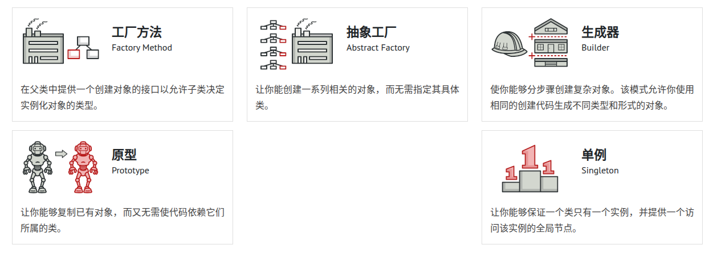
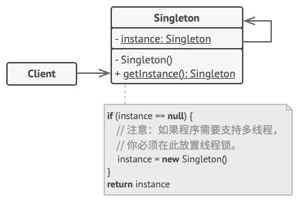
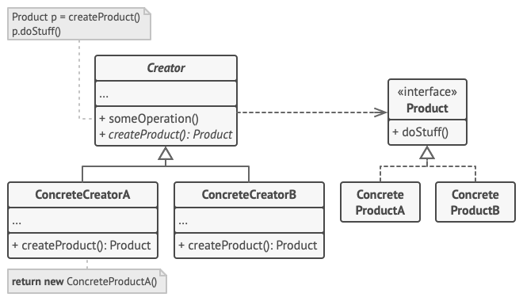
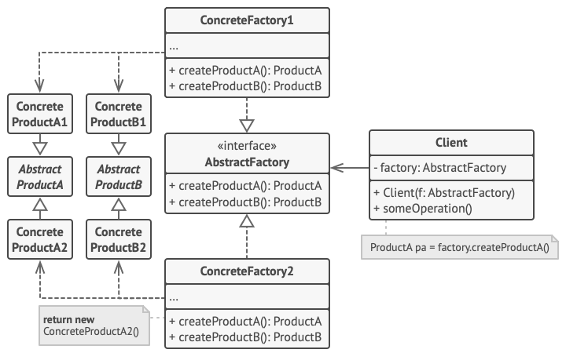
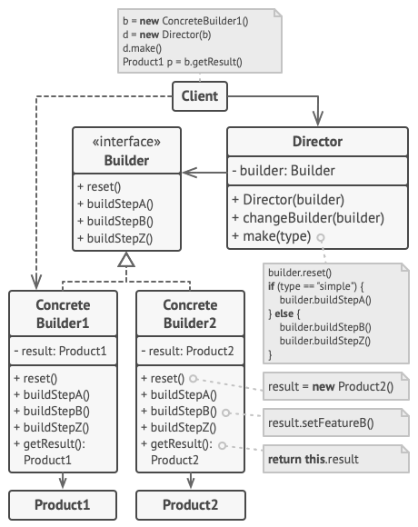
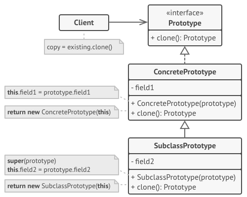

## 前言

早在很久之前就学过设计模式，不过非常不幸，在初次接触设计模式之后，便陷入了Reddit上的讨论所提到的"设计模式陷阱"当中：

> 如果你只有一把铁锤， 那么任何东西看上去都像是钉子。

初次领略到单例等等的代码之美，便开始尝试使用设计模式来重构所有代码，最后便是全局单例满天飞，创建一个实例要经过无数个工厂和装饰器，最后代码冗长到自己都无法写下去。

设计模式，乃至软件工程，确实是学术界和工业界的一道难以达成完美共识的鸿沟，这个问题常常会给初学模式的人们带来困扰： 在学习了某个模式后， 他们会在所有地方使用该模式，即便是在较为简单的代码也能胜任的地方也是如此，也就是我们常说的**过度设计**。

不过即便如此，设计模式的一些OOP的思想仍然值得学习，尤其是单例模式、装饰器模式等较为经典的模式，可以是ECS等架构的工程基础。

这篇文章，先来说说**创建型模式**。



## 单例模式

### 1. 定义

**单例**模式是一种创建型设计模式， 让你能够保证一个类只有一个实例， 并提供一个访问该实例的全局节点。



单例模式存在的目的无非三个：

- 控制实例数量，节省系统资源
- 提供全局唯一的实例访问，降低耦合
- 可以实现懒加载，进一步节省资源

网上的教程经常分为什么"饿汉式"和"懒汉式"，个人认为没有必要，无非前者全局自动初始化，后者提供了懒加载罢了。

### 2. **实现方式**

单例模式通常通过以下方式实现：

* **私有构造函数** ：防止外部直接实例化。
* **静态实例** ：类内部维护唯一实例。
* **静态方法** ：提供全局访问点。

```csharp
// 常规
public sealed class Singleton
{
    // 静态实例，类加载时初始化
    private static readonly Singleton Instance = new Singleton();
  
    // 私有构造函数，防止外部实例化
    private Singleton() { }
  
    // 全局访问点
    public static Singleton GetInstance()
    {
        return Instance;
    }
}

// 懒加载
public sealed class Singleton
{
    private static Singleton _instance;
  
    private Singleton() { }
  
    public static Singleton GetInstance()
    {
        if (_instance == null)
        {
            _instance = new Singleton();
        }
        return _instance;
    }
}


// 单锁懒加载
public sealed class Singleton
{
    private static Singleton _instance;
    private static readonly object _lock = new object();
  
    private Singleton() { }
  
    public static Singleton GetInstance()
    {
        lock (_lock)
        {
            if (_instance == null)
            {
                _instance = new Singleton();
            }
            return _instance;
        }
    }
}

// 双锁懒加载
public sealed class Singleton
{
    private static volatile Singleton _instance;
    private static readonly object _lock = new object();
  
    private Singleton() { }
  
    public static Singleton GetInstance()
    {
        if (_instance == null)
        {
            lock (_lock)
            {
                if (_instance == null)
                {
                    _instance = new Singleton();
                }
            }
        }
        return _instance;
    }
}

// Csharp最佳实践
public sealed class Singleton
{
    private static readonly Lazy<Singleton> _instance = new Lazy<Singleton>(() => new Singleton());
  
    private Singleton() { }
  
    public static Singleton GetInstance()
    {
        return _instance.Value;
    }
}
```

CSharp代码中，推荐使用 Lazy，兼顾线程安全、延迟加载和代码简洁。同时在Unity中，对Monobehaviour创建的Manager等组件实例也有必要采取单例进行控制，这里可以参考本人常用的实现方式：

```csharp
using UnityEngine;

public class MonoBehaviourSingleton<T> : MonoBehaviour where T : MonoBehaviourSingleton<T>
{
    private static T _instance;
    private static readonly object _lock = new object(); // 线程锁
    private static bool _applicationIsQuitting = false; // 标记是否退出游戏

    public static T Instance
    {
        get
        {
            if (_applicationIsQuitting)
            {
                // 退出游戏时，返回null,同时打印日志，防止出现
                // 【退出游戏瞬间的访问空引用，又没有错误日志打印】 的情况
                Debug.LogWarning($"[MonoSingleton] Instance '{typeof(T)}' already destroyed on application quit. Won't create again - returning null.");
                return null;
            }

            // 锁定线程，防止多线程访问
            lock (_lock)
            {
                // 上锁后，再次判断_instance是否为空，防止多线程访问时，_instance已经被其他线程设置为空
                if (_instance == null)
                {
                    // 如果_instance为空，则尝试查找该脚本的实例
                    _instance = FindObjectOfType<T>();

                    if (FindObjectsOfType<T>().Length > 1)
                    {
                        Debug.LogError($"[MonoSingleton] Something went really wrong - there should never be more than 1 singleton! Reopening the scene might fix it.");
                        return _instance;
                    }

                    // 如果找不到该脚本的实例
                    // 则创建一个新的GameObject，添加该脚本的组件
                    if (_instance == null)
                    {
                        var singleton = new GameObject();
                        _instance = singleton.AddComponent<T>();
                        singleton.name = typeof(T).ToString();
#if UNITY_EDITOR
                        Debug.Log($"[MonoSingleton] An instance of {typeof(T)} is needed in the scene, so '{singleton}' was created with DontDestroyOnLoad.");
#endif
                    }
                    else
                    {
#if UNITY_EDITOR
                        Debug.Log($"[MonoSingleton] Using instance already created: {_instance.gameObject.name}");
#endif
                    }
                }

                return _instance;
            }
        }
    }

    protected virtual void Awake()
    {
        if (_instance == null)
        {
            // 如果_instance引用为空，则指向该实例
            _instance = this as T;
        }
        else if (_instance != this)
        {
            // 如果_instance引用有问题，摧毁当前实例，不进行覆盖
            Debug.LogWarning($"[MonoSingleton] Multiple instances of {typeof(T)} found. Destroying this one.");
            Destroy(this.gameObject);
        }
    }

    protected virtual void OnDestroy()
    {
        // 当游戏退出时，将_instance置为null
        // 防止其他脚本访问已经销毁的对象，而又没有错误日志打印
        if (_instance == this)
        {
            _instance = null;
#if UNITY_EDITOR
            Debug.Log($"[MonoSingleton] Destroying {typeof(T)} Singleton.");
#endif
        }
    }

    private void OnApplicationQuit()
    {
        _applicationIsQuitting = true;
    }
}
```

对于普通单例，本人也优化了一套更适合Unity开发的实现：

```csharp
using System;

/// <summary>
/// 懒加载常规单例
/// </summary>
/// <typeparam name="T"> 需要变成单例的类 </typeparam>
public class Singleton<T> where T : class, new()
{
    // 使用Lazy<T>来实现单例
    // Lazy<T>是一个懒加载的泛型类，只有在第一次访问Instance属性时才会创建实例，并且保证线程安全
    private static readonly Lazy<T> _instance = new Lazy<T>(() => new T());

    public static T Instance => _instance.Value;

    protected Singleton()
    {
        if (_instance.IsValueCreated)
        {
            throw new Exception($"{typeof(T)} is a singleton! " +
                                "You should not create a new instance!" +
                                $" Use {typeof(T)}.Instance instead."
                                );
        }
    }
}
```

### 3. **Unity 特定注意事项**

* **DontDestroyOnLoad** ：单例 GameObject 需调用 DontDestroyOnLoad 以在场景切换时保留。确保仅在首次创建时调用，避免重复调用导致内存泄漏。
* **场景切换** ：场景加载可能导致 FindObjectOfType 失败，需在 Instance 属性中动态创建。可监听场景加载事件（SceneManager.sceneLoaded）以重新初始化单例引用。
* **销毁问题** ：Unity 的 Destroy 不会立即销毁对象，可能导致短暂的多个实例共存，需在 Awake 或 Start 中处理。
* **序列化** ：如果单例保存数据（如玩家进度），需考虑序列化（如 JSON 或 PlayerPrefs）。
* **编辑器中调试** ：在 Unity 编辑器中，单例可能因脚本重新编译而丢失引用，需在 OnEnable 或 Awake 中重新赋值。
* **性能** ：FindObjectOfType 性能开销较大，尽量缓存实例。避免在 Update 等高频方法中反复访问 Instance。

### 4. Unity最佳实践

* **场景持久化** ：使用 `DontDestroyOnLoad`保持单例跨场景存在
* **懒加载** ：第一次访问时初始化
* **线程安全** ：Unity主线程操作，通常不需要复杂线程安全
* **接口约束** ：通过接口访问单例功能，减少耦合

### 5. 应用场景

* 游戏状态管理
* 资源管理器
* 音频管理器
* 全局事件系统

## 工厂方法模式

### 1. 定义

工厂方法模式（Factory Method Pattern）是一种创建型设计模式，用于创建对象但不直接实例化具体类，而是通过定义一个创建对象的接口，让子类决定实例化哪个类。

结合 Prefab 和 MonoBehaviour 的工厂方法，可以适配 Unity 的动态创建需求。



工厂方法模式的目的很简单：

- 创建者和产品解耦
- 提高产品的可扩展性，允许子类选择具体实现
- 单一职责，产品创建代码独立出来，Unity中可以借此实现动态加载

### 2. 实现方式

#### **核心思想**

* 定义一个抽象工厂类或接口，声明工厂方法（如 Create）。
* 具体工厂类继承抽象工厂，实现具体对象的创建。
* 客户端通过工厂接口调用创建方法，无需知道具体实现。

#### **结构**

* **Product** ：抽象产品接口或基类（如 IEnemy）。
* **ConcreteProduct** ：具体产品类（如 Goblin、Dragon）。
* **Creator** ：抽象工厂类，声明工厂方法（如 CreateEnemy）。
* **ConcreteCreator** ：具体工厂类，实现工厂方法（如 GoblinFactory、DragonFactory）。

这里本人没有写过直接通过泛型提供的接口，我们用一段业务代码来理一理：

```csharp
using UnityEngine;

// 抽象产品接口
public interface IEnemy
{
    void Attack();
}

// 具体产品：哥布林
public class Goblin : MonoBehaviour, IEnemy
{
    public void Attack()
    {
        Debug.Log("Goblin attacks with a club!");
    }
}

// 具体产品：龙
public class Dragon : MonoBehaviour, IEnemy
{
    public void Attack()
    {
        Debug.Log("Dragon breathes fire!");
    }
}

// 抽象工厂
public abstract class EnemyFactory : MonoBehaviour
{
    public abstract IEnemy CreateEnemy(Vector3 position);
}

// 具体工厂：哥布林工厂
public class GoblinFactory : EnemyFactory
{
    public override IEnemy CreateEnemy(Vector3 position)
    {
        GameObject goblinObject = new GameObject("Goblin");
        goblinObject.transform.position = position;
        IEnemy goblin = goblinObject.AddComponent<Goblin>();
        return goblin;
    }
}

// 具体工厂：龙工厂
public class DragonFactory : EnemyFactory
{
    public override IEnemy CreateEnemy(Vector3 position)
    {
        GameObject dragonObject = new GameObject("Dragon");
        dragonObject.transform.position = position;
        IEnemy dragon = dragonObject.AddComponent<Dragon>();
        return dragon;
    }
}

// 客户端代码：游戏管理器
public class GameManager : MonoBehaviour
{
    private static GameManager _instance;

    public static GameManager Instance
    {
        get
        {
            if (_instance == null)
            {
                _instance = FindObjectOfType<GameManager>();
                if (_instance == null)
                {
                    GameObject singletonObject = new GameObject(nameof(GameManager));
                    _instance = singletonObject.AddComponent<GameManager>();
                    DontDestroyOnLoad(singletonObject);
                }
            }
            return _instance;
        }
    }

    private void Awake()
    {
        if (_instance != null && _instance != this)
        {
            Destroy(gameObject);
            return;
        }
        _instance = this;
        DontDestroyOnLoad(gameObject);
    }

    public void SpawnEnemy(EnemyFactory factory, Vector3 position)
    {
        IEnemy enemy = factory.CreateEnemy(position);
        enemy.Attack();
    }
}
```

### 3. 最佳实践：

* **ScriptableObject工厂** ：创建可配置的工厂资产
* **对象池集成** ：避免频繁实例化销毁
* **参数化工厂** ：支持不同创建参数
* **异步加载** ：使用Addressables异步加载资源

### 4. 应用场景：

* 动态敌人生成
* UI元素创建
* 技能特效生成
* 道具系统

## 抽象工厂模式

### 1. 定义

抽象工厂模式（Abstract Factory Pattern）是一种创建型设计模式，提供一个接口，用于创建一系列相关或相互依赖的对象，而无需指定具体类。

而在 Unity 中，抽象工厂模式特别适合管理复杂对象的创建（如一组相关的 GameObject、组件或资源），例如创建不同主题的 UI 元素、不同类型的敌人及其武器等。



 **目的** ：

* 将一组相关对象的创建逻辑封装，保持一致性。
* 支持动态切换产品族（如切换游戏主题或关卡风格）。
* 在 Unity 中，适合批量创建相关 GameObject 或组件（如敌人 + 武器、UI 面板 + 按钮）。

### 2. 实现方式

#### **核心思想**

* 定义一个抽象工厂接口或类，声明创建一组相关产品的方法。
* 具体工厂类实现这些方法，创建具体产品。
* 客户端通过抽象工厂接口调用创建方法，无需知道具体产品类。

#### **结构**

* **AbstractProduct** ：抽象产品接口（如 IEnemy、IWeapon）。
* **ConcreteProduct** ：具体产品类（如 Goblin、Sword）。
* **AbstractFactory** ：抽象工厂接口，声明创建产品族的方法（如 CreateEnemy、CreateWeapon）。
* **ConcreteFactory** ：具体工厂类，实现创建特定产品族（如 ForestFactory 创建森林主题的敌人和武器）。
* **Client** ：使用抽象工厂接口创建产品族。

这里我们用抽象工厂对之前的工厂方法进行优化：

```csharp
using UnityEngine;

// 抽象产品接口：敌人
public interface IEnemy
{
    void Attack();
}

// 抽象产品接口：武器
public interface IWeapon
{
    void Use();
}

// 具体产品：森林主题的哥布林
public class ForestGoblin : MonoBehaviour, IEnemy
{
    public void Attack()
    {
        Debug.Log("Forest Goblin attacks with a wooden club!");
    }
}

// 具体产品：森林主题的弓
public class ForestBow : MonoBehaviour, IWeapon
{
    public void Use()
    {
        Debug.Log("Forest Bow shoots an arrow!");
    }
}

// 具体产品：沙漠主题的蝎子
public class DesertScorpion : MonoBehaviour, IEnemy
{
    public void Attack()
    {
        Debug.Log("Desert Scorpion stings with its tail!");
    }
}

// 具体产品：沙漠主题的匕首
public class DesertDagger : MonoBehaviour, IWeapon
{
    public void Use()
    {
        Debug.Log("Desert Dagger slashes swiftly!");
    }
}

// 抽象工厂接口
public interface IEntityFactory
{
    IEnemy CreateEnemy(Vector3 position);
    IWeapon CreateWeapon(Vector3 position);
}

// 具体工厂：森林主题工厂
public class ForestFactory : MonoBehaviour, IEntityFactory
{
    [SerializeField] private GameObject goblinPrefab; // 可在 Inspector 中分配 Prefab
    [SerializeField] private GameObject bowPrefab;

    public IEnemy CreateEnemy(Vector3 position)
    {
        GameObject enemyObject = goblinPrefab ? Instantiate(goblinPrefab, position, Quaternion.identity) : new GameObject("ForestGoblin");
        return enemyObject.AddComponent<ForestGoblin>();
    }

    public IWeapon CreateWeapon(Vector3 position)
    {
        GameObject weaponObject = bowPrefab ? Instantiate(bowPrefab, position, Quaternion.identity) : new GameObject("ForestBow");
        return weaponObject.AddComponent<ForestBow>();
    }
}

// 具体工厂：沙漠主题工厂
public class DesertFactory : MonoBehaviour, IEntityFactory
{
    [SerializeField] private GameObject scorpionPrefab; // 可在 Inspector 中分配 Prefab
    [SerializeField] private GameObject daggerPrefab;

    public IEnemy CreateEnemy(Vector3 position)
    {
        GameObject enemyObject = scorpionPrefab ? Instantiate(scorpionPrefab, position, Quaternion.identity) : new GameObject("DesertScorpion");
        return enemyObject.AddComponent<DesertScorpion>();
    }

    public IWeapon CreateWeapon(Vector3 position)
    {
        GameObject weaponObject = daggerPrefab ? Instantiate(daggerPrefab, position, Quaternion.identity) : new GameObject("DesertDagger");
        return weaponObject.AddComponent<DesertDagger>();
    }
}

// 客户端代码：游戏管理器（结合单例模式）
public class GameManager : MonoBehaviour
{
    private static GameManager _instance;

    public static GameManager Instance
    {
        get
        {
            if (_instance == null)
            {
                _instance = FindObjectOfType<GameManager>();
                if (_instance == null)
                {
                    GameObject singletonObject = new GameObject(nameof(GameManager));
                    _instance = singletonObject.AddComponent<GameManager>();
                    DontDestroyOnLoad(singletonObject);
                }
            }
            return _instance;
        }
    }

    private void Awake()
    {
        if (_instance != null && _instance != this)
        {
            Destroy(gameObject);
            return;
        }
        _instance = this;
        DontDestroyOnLoad(gameObject);
    }

    public void SpawnEntity(IEntityFactory factory, Vector3 enemyPosition, Vector3 weaponPosition)
    {
        IEnemy enemy = factory.CreateEnemy(enemyPosition);
        IWeapon weapon = factory.CreateWeapon(weaponPosition);
        enemy.Attack();
        weapon.Use();
    }
}
```

### 3. **与工厂方法模式的区别**

* **工厂方法模式** ：关注单一产品类型的创建（如只创建敌人），每个工厂负责一种产品。
* **抽象工厂模式** ：关注一组相关产品的创建（如敌人 + 武器），每个工厂创建整个产品族。

### 4. 最佳实践：

* **ScriptableObject实现** ：编辑器可配置
* **主题切换** ：运行时动态更换工厂
* **资源预加载** ：提前加载所需资源
* **组合模式** ：创建复杂对象结构

### 5. 应用场景：

* 关卡主题系统（森林/沙漠/雪地）
* 角色套装（武器+护甲+技能）
* UI皮肤系统
* 多平台适配

## 建造者模式

### 1. 定义

建造者模式（Builder Pattern）是一种创建型设计模式，通过分步构建复杂对象，将对象的构造过程与其最终表示分离，由建造者负责构造步骤，导演者（Director）控制构建流程。

在 Unity 中，建造者模式特别适合创建复杂的 GameObject 或组件（如角色、场景对象、UI 面板），因为它允许灵活配置对象的属性，同时保持代码清晰和可维护。



优点：

1. **分离构建与表示** ：将对象的构建过程与其表示分离
2. **精细控制构建过程** ：可以精确控制复杂对象的创建步骤
3. **复用构建过程** ：相同的构建过程可以创建不同的产品
4. **更好的封装性** ：客户端不需要知道产品内部细节

### 2. 实现方式

#### **核心思想**

* 定义一个建造者接口或抽象类，声明构建步骤（如设置属性、添加组件）。
* 具体建造者实现这些步骤，创建具体对象。
* 可选的导演者（Director）控制构建顺序，客户端通过导演者或直接调用建造者创建对象。
* 最终返回产品（在 Unity 中通常是 GameObject 或组件）。

#### **结构**

* **Product** ：最终生成的对象（如 GameObject 类型的玩家角色）。
* **Builder** ：抽象建造者接口，定义构建步骤（如 SetHealth、AddWeapon）。
* **ConcreteBuilder** ：具体建造者，实现构建步骤（如 PlayerBuilder）。
* **Director** （可选）：控制构建流程，调用建造者方法。
* **Client** ：使用建造者或导演者创建对象。

我们以UI系统为例：

```csharp
// UI窗口产品
public class UIWindow
{
    public GameObject Root { get; set; }
    public Text Title { get; set; }
    public Button CloseButton { get; set; }
    public Image Background { get; set; }
    // 其他UI元素...
}

// UI建造者
public interface IUIWindowBuilder
{
    void CreateRoot();
    void AddTitle(string title);
    void AddCloseButton();
    void AddBackground(Sprite sprite);
    UIWindow GetResult();
}

// 具体实现
public class StandardWindowBuilder : IUIWindowBuilder
{
    private UIWindow window = new UIWindow();
  
    public void CreateRoot()
    {
        window.Root = new GameObject("Window");
        var rectTransform = window.Root.AddComponent<RectTransform>();
        // 设置rectTransform属性...
    }
  
    public void AddTitle(string title)
    {
        GameObject titleObj = new GameObject("Title");
        titleObj.transform.SetParent(window.Root.transform);
        window.Title = titleObj.AddComponent<Text>();
        window.Title.text = title;
        // 设置文本样式...
    }
  
    // 其他方法实现...
  
    public UIWindow GetResult()
    {
        return window;
    }
}

// 使用
UIWindow CreateStandardWindow()
{
    IUIWindowBuilder builder = new StandardWindowBuilder();
    builder.CreateRoot();
    builder.AddTitle("Options");
    builder.AddCloseButton();
    builder.AddBackground(Resources.Load<Sprite>("window_bg"));
    return builder.GetResult();
}
```

### 3. 面向Unity的优化

除了最基础的调用，builder一般在实践过程中会和链式调用结合：

```csharp
public class CharacterBuilder
{
    private Character character;
  
    public CharacterBuilder WithName(string name)
    {
        character.Name = name;
        return this;
    }
  
    public CharacterBuilder WithHealth(int health)
    {
        character.Health = health;
        return this;
    }
  
    public Character Build()
    {
        return character;
    }
}

// 使用
Character hero = new CharacterBuilder()
    .WithName("Hero")
    .WithHealth(100)
    .Build();
```

一个很经典的例子就是DOTween插件中的Sequence设置，采用闭包和建造者模式实现了函数式编程。

除了链式调用，于ScriptableObject结合，也是一个常用的扩展点：

```csharp
// 角色类型配置
[CreateAssetMenu(fileName = "CharacterType", menuName = "Builders/Character Type")]
public class CharacterType : ScriptableObject
{
    public string typeName;
    public GameObject prefab;
    public int healthModifier;
    public float speedModifier;
    public Weapon[] availableWeapons;
    public Armor[] availableArmors;
}

// 角色外观配置
[CreateAssetMenu(fileName = "CharacterAppearance", menuName = "Builders/Character Appearance")]
public class CharacterAppearance : ScriptableObject
{
    public Color primaryColor;
    public Color secondaryColor;
    public Sprite portrait;
    public RuntimeAnimatorController animatorController;
}

// 高级建造者
public class AdvancedCharacterBuilder
{
    private CharacterType typeConfig;
    private CharacterAppearance appearanceConfig;
    private Character character = new Character();
  
    public AdvancedCharacterBuilder WithType(CharacterType type)
    {
        this.typeConfig = type;
        return this;
    }
  
    public AdvancedCharacterBuilder WithAppearance(CharacterAppearance appearance)
    {
        this.appearanceConfig = appearance;
        return this;
    }
  
    public AdvancedCharacterBuilder WithWeaponIndex(int index)
    {
        if (typeConfig != null && typeConfig.availableWeapons.Length > index)
        {
            character.Weapon = typeConfig.availableWeapons[index];
        }
        return this;
    }
  
    public Character Build()
    {
        if (typeConfig == null) throw new System.Exception("Character type config is required");
    
        // 创建游戏对象
        character.GameObject = Object.Instantiate(typeConfig.prefab);
        character.GameObject.name = typeConfig.typeName;
    
        // 设置属性
        character.Health = 100 + typeConfig.healthModifier;
        character.Speed = 3f + typeConfig.speedModifier;
    
        // 应用外观
        if (appearanceConfig != null)
        {
            var renderer = character.GameObject.GetComponent<SpriteRenderer>();
            if (renderer != null) renderer.color = appearanceConfig.primaryColor;
        
            var animator = character.GameObject.GetComponent<Animator>();
            if (animator != null) animator.runtimeAnimatorController = appearanceConfig.animatorController;
        }
    
        // 设置默认装备
        if (character.Weapon == null && typeConfig.availableWeapons.Length > 0)
        {
            character.Weapon = typeConfig.availableWeapons[0];
        }
    
        return character;
    }
}

// 使用示例
public class CharacterManager : MonoBehaviour
{
    public CharacterType warriorType;
    public CharacterAppearance redAppearance;
  
    void CreateWarrior()
    {
        var warrior = new AdvancedCharacterBuilder()
            .WithType(warriorType)
            .WithAppearance(redAppearance)
            .WithWeaponIndex(1)
            .Build();
    }
}
```

### 4. 最佳实践：

* **链式调用** ：流畅接口设计
* **配置分离** ：使用ScriptableObject存储构建参数
* **步骤验证** ：确保构建过程完整性
* **导演类** ：封装常用构建流程

### 5. 应用场景：

* 复杂角色创建
* 关卡配置
* 粒子系统组合
* 对话系统构建

## 原型模式

### 1. 定义

原型模式（Prototype Pattern）是一种创建型设计模式，通过复制现有对象（原型）来创建新对象，而无需直接使用构造函数或复杂初始化逻辑。

在 Unity 中，原型模式特别适合快速创建相似 GameObject 或组件的副本（如敌人、道具、场景对象），利用 Unity 的 Instantiate 方法实现高效克隆。当然除此之外，CSharp本身也提供了IClonnable接口，用来实现遵循原型模式的深浅拷贝。



 **目的** ：

* 避免重复的初始化逻辑或构造函数调用。
* 支持动态创建相似对象，适合运行时复制。

### 2. 实现方式

#### **核心思想**

* 定义一个原型接口或抽象类，声明克隆方法（如 Clone）。
* 具体原型类实现克隆逻辑，通常通过 Unity 的 Instantiate 复制 GameObject 或组件。
* 客户端通过调用克隆方法获取新对象，并可自定义配置。

#### **结构**

* **Prototype** ：抽象原型接口或类，声明克隆方法（如 ICloneable 或自定义 Clone）。
* **ConcretePrototype** ：具体原型类，实现克隆逻辑（如 EnemyPrototype）。
* **Client** ：使用原型对象调用克隆方法创建新对象。

Unity的Prefab系统本身就是原型模式的完美实现：

```csharp
public class PrefabSpawner : MonoBehaviour
{
    public GameObject enemyPrefab;  // 这是我们的原型
  
    void SpawnEnemy()
    {
        // 克隆prefab创建新实例
        GameObject newEnemy = Instantiate(enemyPrefab);
        newEnemy.transform.position = Random.insideUnitSphere * 5f;
    }
}
```

借此我们可以实现一个敌人生成系统：

```csharp
public class EnemySpawner : MonoBehaviour
{
    [System.Serializable]
    public class EnemyPrototype
    {
        public GameObject prefab;
        public int minHealth;
        public int maxHealth;
        public float minSpeed;
        public float maxSpeed;
    }
  
    public EnemyPrototype[] enemyPrototypes;
  
    public void SpawnRandomEnemy()
    {
        EnemyPrototype prototype = enemyPrototypes[Random.Range(0, enemyPrototypes.Length)];
        GameObject enemy = Instantiate(prototype.prefab, transform.position, Quaternion.identity);
    
        Enemy enemyScript = enemy.GetComponent<Enemy>();
        enemyScript.health = Random.Range(prototype.minHealth, prototype.maxHealth);
        enemyScript.speed = Random.Range(prototype.minSpeed, prototype.maxSpeed);
    }
}
```

当然，除了最基本的克隆，我们偶尔还会使用注册表来管理原型：

```csharp
public class PrototypeRegistry : MonoBehaviour
{
    private static PrototypeRegistry _instance;
    public static PrototypeRegistry Instance => _instance;
  
    [SerializeField] private List<EnemyPrototype> enemyPrototypes = new List<EnemyPrototype>();
    private Dictionary<string, EnemyPrototype> enemyPrototypeDict = new Dictionary<string, EnemyPrototype>();
  
    void Awake()
    {
        _instance = this;
    
        foreach (var prototype in enemyPrototypes)
        {
            enemyPrototypeDict.Add(prototype.name, prototype);
        }
    }
  
    public GameObject SpawnEnemy(string prototypeName, Vector3 position)
    {
        if (enemyPrototypeDict.TryGetValue(prototypeName, out EnemyPrototype prototype))
        {
            GameObject enemy = prototype.CreateInstance();
            enemy.transform.position = position;
            return enemy;
        }
        return null;
    }
  
    // 编辑器方法，用于注册新原型
    #if UNITY_EDITOR
    public void RegisterNewPrototype(EnemyPrototype prototype)
    {
        if (!enemyPrototypes.Contains(prototype))
        {
            enemyPrototypes.Add(prototype);
            enemyPrototypeDict.Add(prototype.name, prototype);
        }
    }
    #endif
}
```

## 3. 深浅拷贝

原型模式本身其实衍生出了一个很重要的概念：深拷贝和浅拷贝。

### 浅拷贝

浅拷贝只复制对象的顶层结构，对于引用类型的成员变量，只复制引用而不复制引用的对象。

C#提供了MemberwiseClone的通用方法，直接调用即可：

```csharp
public class CharacterStats
{
    public string name;
    public int level;
    public float health;
  
    // 浅拷贝方法
    public CharacterStats ShallowCopy()
    {
        return (CharacterStats)this.MemberwiseClone();
    }
}

// 使用示例
CharacterStats original = new CharacterStats();
original.name = "Hero";
original.level = 10;
original.health = 100f;

CharacterStats copy = original.ShallowCopy();
```

而对于Unity组件，手动实现一套浅拷贝也不是很难：

```csharp
public class Enemy : MonoBehaviour
{
    public int damage;
    public float attackSpeed;
  
    public Enemy ShallowCopy()
    {
        Enemy copy = new GameObject("Enemy_Copy").AddComponent<Enemy>();
        copy.damage = this.damage;
        copy.attackSpeed = this.attackSpeed;
        return copy;
    }
}
```

### 深拷贝

深拷贝会复制对象及其所有引用的对象，在新的内存中创建一个完全独立的副本。

最经典的深拷贝无非序列化，对于所有语言都是通用的实现逻辑：

```csharp
using System.Runtime.Serialization.Formatters.Binary;
using System.IO;

public static class ObjectCopier
{
    // 通用的深拷贝方法（要求类标记为[Serializable]）
    public static T DeepCopy<T>(T obj)
    {
        if (!typeof(T).IsSerializable)
        {
            throw new ArgumentException("The type must be serializable.", nameof(obj));
        }
    
        if (ReferenceEquals(obj, null))
        {
            return default(T);
        }
    
        BinaryFormatter formatter = new BinaryFormatter();
        using (MemoryStream stream = new MemoryStream())
        {
            formatter.Serialize(stream, obj);
            stream.Seek(0, SeekOrigin.Begin);
            return (T)formatter.Deserialize(stream);
        }
    }
}

// 使用示例（类必须标记为[Serializable]）
[Serializable]
public class PlayerData
{
    public string playerName;
    public int score;
    public List<string> inventory;
}

PlayerData original = new PlayerData();
// 初始化original...
PlayerData copy = ObjectCopier.DeepCopy(original);
```

在CSharp中，也可以通过实现ICloneable接口手动实现深拷贝

```csharp
public class GameItem : ICloneable
{
    public string itemName;
    public Sprite icon;
    public List<ItemEffect> effects;
  
    // 浅拷贝实现
    public object Clone()
    {
        return this.MemberwiseClone();
    }
  
    // 深拷贝实现
    public GameItem DeepClone()
    {
        GameItem clone = (GameItem)this.MemberwiseClone();
        clone.effects = new List<ItemEffect>();
        foreach (var effect in this.effects)
        {
            clone.effects.Add(effect.DeepClone()); // 假设ItemEffect实现了深拷贝
        }
        return clone;
    }
}
```

Unity中实现深拷贝时，要注意：

**Unity对象生命周期** ：

* 不能直接深拷贝UnityEngine.Object派生类（如GameObject、Component）
* 需要使用Instantiate来创建Unity对象的新实例

**循环引用问题** ：

* 深拷贝时要处理可能的循环引用
* 可以使用序列化方式或维护一个已拷贝对象字典

**性能考虑** ：

* 深拷贝可能很耗性能，特别是对复杂对象
* 对于频繁拷贝的对象，考虑使用对象池

**ScriptableObject的特殊性** ：

* ScriptableObject.CreateInstance()用于创建新实例
* 需要手动复制所有需要共享的字段

**预制体(Prefab)的处理** ：

* 使用PrefabUtility.InstantiatePrefab来保持预制体连接
* 普通Instantiate会创建独立的实例

为了考虑这些复杂的内容，我们一般会封装一份拷贝工具，本人曾用过类似下面的实现，通过泛型和反射实现完整的深拷贝：

```csharp
using System.Collections.Generic;
using System.Reflection;

public static class DeepCopyUtility
{
    private static Dictionary<object, object> _copiedObjects = new Dictionary<object, object>();
  
    public static T DeepCopy<T>(T original) where T : class
    {
        _copiedObjects.Clear();
        return InternalCopy(original) as T;
    }
  
    private static object InternalCopy(object original)
    {
        if (original == null) return null;
    
        // 处理UnityEngine.Object派生类
        if (original is UnityEngine.Object unityObj)
        {
            // 对于Unity对象，我们使用Instantiate创建新实例
            if (unityObj is GameObject gameObj)
            {
                return GameObject.Instantiate(gameObj);
            }
            else if (unityObj is Component component)
            {
                GameObject copiedGameObject = GameObject.Instantiate(component.gameObject);
                return copiedGameObject.GetComponent(component.GetType());
            }
            // 其他Unity对象可能需要特殊处理
            return unityObj; // 默认返回原对象（不是真正的深拷贝）
        }
    
        // 检查是否已经拷贝过该对象
        if (_copiedObjects.TryGetValue(original, out object copied))
        {
            return copied;
        }
    
        Type type = original.GetType();
    
        // 处理字符串和值类型
        if (type.IsPrimitive || type.IsEnum || type == typeof(string))
        {
            return original;
        }
    
        // 处理数组
        if (type.IsArray)
        {
            Type elementType = type.GetElementType();
            Array originalArray = original as Array;
            Array copiedArray = Array.CreateInstance(elementType, originalArray.Length);
            _copiedObjects.Add(original, copiedArray);
        
            for (int i = 0; i < originalArray.Length; i++)
            {
                copiedArray.SetValue(InternalCopy(originalArray.GetValue(i)), i);
            }
        
            return copiedArray;
        }
    
        // 处理委托
        if (type.IsSubclassOf(typeof(Delegate)))
        {
            // 不拷贝委托，直接返回原对象
            return original;
        }
    
        // 创建新实例
        object copy = Activator.CreateInstance(type);
        _copiedObjects.Add(original, copy);
    
        // 复制字段
        FieldInfo[] fields = type.GetFields(BindingFlags.Public | BindingFlags.NonPublic | BindingFlags.Instance);
        foreach (FieldInfo field in fields)
        {
            // 跳过只读字段
            if (field.IsInitOnly) continue;
        
            object fieldValue = field.GetValue(original);
            field.SetValue(copy, InternalCopy(fieldValue));
        }
    
        return copy;
    }
}
```

一个典型的应用场景就是卡牌类游戏的卡牌复制：

```csharp
[System.Serializable]
public class CardData
{
    public string cardName;
    public int attack;
    public int health;
    public Sprite artwork;
    public List<CardEffect> effects;
  
    // 浅拷贝
    public CardData ShallowCopy()
    {
        return (CardData)this.MemberwiseClone();
    }
  
    // 深拷贝
    public CardData DeepCopy()
    {
        CardData copy = ShallowCopy();
        copy.effects = new List<CardEffect>();
        foreach (var effect in effects)
        {
            copy.effects.Add(effect.DeepCopy()); // 假设CardEffect实现了深拷贝
        }
        return copy;
    }
}

// 在Unity中使用
public class Card : MonoBehaviour
{
    public CardData data;
  
    public Card CreateCopy()
    {
        GameObject cardCopyObj = Instantiate(this.gameObject);
        Card cardCopy = cardCopyObj.GetComponent<Card>();
        cardCopy.data = data.DeepCopy(); // 使用深拷贝
        return cardCopy;
    }
}
```

在Unity中实现深拷贝和浅拷贝时，最重要的是要理解哪些对象需要真正独立复制，哪些可以共享引用。

对于Unity引擎对象（GameObject、Component等），通常需要使用Instantiate来创建新实例(如果确认其在场景中实例化的情况下)，而对于自定义数据类，则可以使用序列化或其他深拷贝技术。

### 4. 最佳实践：

* **Prefab利用** ：Unity原生支持原型模式
* **ScriptableObject原型** ：数据驱动设计
* **变体支持** ：克隆时添加随机变化
* **原型注册表** ：集中管理所有原型

### 5. 应用场景：

* 敌人生成系统
* 道具复制
* 地形生成
* 技能效果模板

## 对象池模式

严格来讲，市面上常见23种设计模式介绍中，并不会提到对象池的模式，然而这种模式在游戏开发方面应用广泛，也是不得不提的一种关键创建型设计模式。

### 1. 定义

对象池模式（Object Pool Pattern）维护一个对象池，存储一组预先创建的可重用对象，客户端从池中获取对象使用，用完后归还给池，而不是销毁。

在 Unity 中，对象池模式特别适合优化性能，因为 Unity 中 GameObject 的实例化（Instantiate）和销毁（Destroy）操作开销较大，尤其在需要频繁生成对象（如子弹、敌人、粒子效果）的场景。

 **目的** ：

* 减少 Instantiate 和 Destroy 的性能开销。
* 提高运行时效率，适合频繁创建/销毁对象的场景。
* 在 Unity 中，优化内存管理和帧率，特别适合子弹、敌人、特效等。

### 2. 实现方式

#### **核心思想**

* 创建一个对象池，预先实例化一组 GameObject 或组件。
* 提供方法从池中获取可用对象（激活）或归还对象（禁用）。
* 若池中无可用对象，可动态扩展池大小。
* 客户端通过池接口获取和归还对象，无需直接操作 Instantiate 或 Destroy。

#### **结构**

* **PooledObject** ：池化的对象，通常是 GameObject 或组件（如 Bullet）。
* **ObjectPool** ：管理对象池，负责初始化、获取、归还对象。
* **Client** ：使用对象池获取和归还对象。

给出一个常规的代码实现：

```csharp
public class ProjectilePool : MonoBehaviour
{
    public GameObject projectilePrefab;
    public int poolSize = 20;
  
    private Queue<GameObject> pool = new Queue<GameObject>();
  
    void Start()
    {
        for (int i = 0; i < poolSize; i++)
        {
            GameObject projectile = Instantiate(projectilePrefab);
            projectile.SetActive(false);
            pool.Enqueue(projectile);
        }
    }
  
    public GameObject GetProjectile(Vector3 position)
    {
        if (pool.Count == 0)
        {
            // 池空了，创建新实例
            GameObject newProjectile = Instantiate(projectilePrefab);
            pool.Enqueue(newProjectile);
        }
    
        GameObject projectile = pool.Dequeue();
        projectile.transform.position = position;
        projectile.SetActive(true);
        return projectile;
    }
  
    public void ReturnProjectile(GameObject projectile)
    {
        projectile.SetActive(false);
        pool.Enqueue(projectile);
    }
}
```

代码很简洁，但是实际工程中的对象池会用到很多优化方案。

### 3. 最佳实践：

* **通用池实现** ：创建泛型对象池
* **预热机制** ：场景加载时初始化对象
* **容量管理** ：动态调整池大小
* **回收策略** ：自动回收超时对象

### 4. 应用场景：

* 子弹管理系统
* 特效复用
* NPC生成
* UI元素回收

## 总结

我们写一个所有创建型模式的大杂烩，作为总结：

```csharp
// 1. 单例管理全局角色系统
public class CharacterSystem : Singleton<CharacterSystem>
{
    // 2. 工厂创建角色
    public Character CreateCharacter(CharacterFactory factory, CharacterConfig config)
    {
        return factory.Create(config);
    }
}

// 3. 抽象工厂接口
public interface CharacterFactory
{
    Character Create(CharacterConfig config);
}

// 4. 具体工厂 - 英雄角色
public class HeroFactory : CharacterFactory
{
    public Character Create(CharacterConfig config)
    {
        // 5. 使用建造者构建复杂角色
        return new CharacterBuilder(config)
            .WithClass(CharacterClass.Hero)
            .WithDefaultSkills()
            .Build();
    }
}

// 6. 角色配置（原型）
[CreateAssetMenu(menuName = "Characters/Config")]
public class CharacterConfig : ScriptableObject
{
    public GameObject basePrefab;
    public int baseHealth;
    public Skill[] defaultSkills;
  
    // 7. 原型克隆方法
    public Character Clone()
    {
        Character clone = Instantiate(basePrefab).GetComponent<Character>();
        clone.Initialize(this);
        return clone;
    }
}

// 8. 对象池管理角色实例
public class CharacterPool : GenericObjectPool<Character>
{
    protected override Character CreatePooledItem()
    {
        return CharacterSystem.Instance.CreateCharacter(
            new HeroFactory(), 
            Resources.Load<CharacterConfig>("HeroConfig"));
    }
}
```

在Unity中，创建型设计模式可以遵循如下的实践方案（但是谨记，不要把方案当作教条）

**ScriptableObject驱动设计** ：

* 将配置数据与逻辑分离
* 创建可重用的数据资产
* 支持热重载和实时调整

**预制件(Prefab)作为基础原型** ：

* 充分利用Unity原生原型系统
* 支持嵌套预制件和变体
* 结合Addressables实现动态加载

**组合使用模式** ：

* 工厂+对象池：高效管理实例
* 建造者+原型：灵活创建复杂对象
* 抽象工厂+策略：支持运行时切换实现

**性能优化** ：

* 避免频繁Instantiate/Destroy
* 使用对象池管理高频创建对象
* 异步加载大型资源

**架构设计** ：

* 依赖注入控制对象创建
* 事件系统解耦对象间依赖
* ECS架构与创建型模式结合

**编辑器扩展** ：

* 为工厂创建自定义编辑器
* 可视化建造者配置界面
* 原型管理器工具

**平台适配** ：

* 使用抽象工厂处理平台差异
* 针对不同平台配置不同原型
* 移动端优化：减少运行时创建

当然，没有"最好"的模式，只有"最适合"当前场景的模式。实践中应根据具体需求灵活选择和组合不同的设计模式。写代码还是先实现功能再进行优化最为高效。

| 场景         | 推荐模式         | 原因               |
| ------------ | ---------------- | ------------------ |
| 全局访问点   | 单例             | 提供统一访问入口   |
| 简单对象创建 | 工厂方法         | 封装创建逻辑       |
| 相关对象族   | 抽象工厂         | 创建整套相关对象   |
| 复杂对象构建 | 建造者           | 分步骤构建复杂对象 |
| 高效对象复用 | 原型+对象池      | 减少实例化开销     |
| 配置驱动创建 | ScriptableObject | 数据与逻辑分离     |
