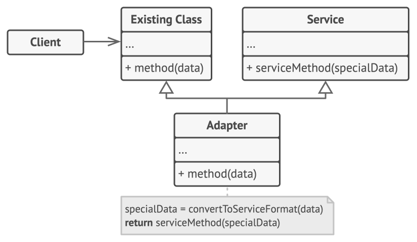
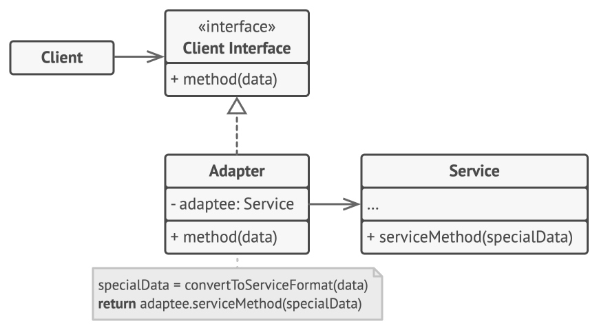
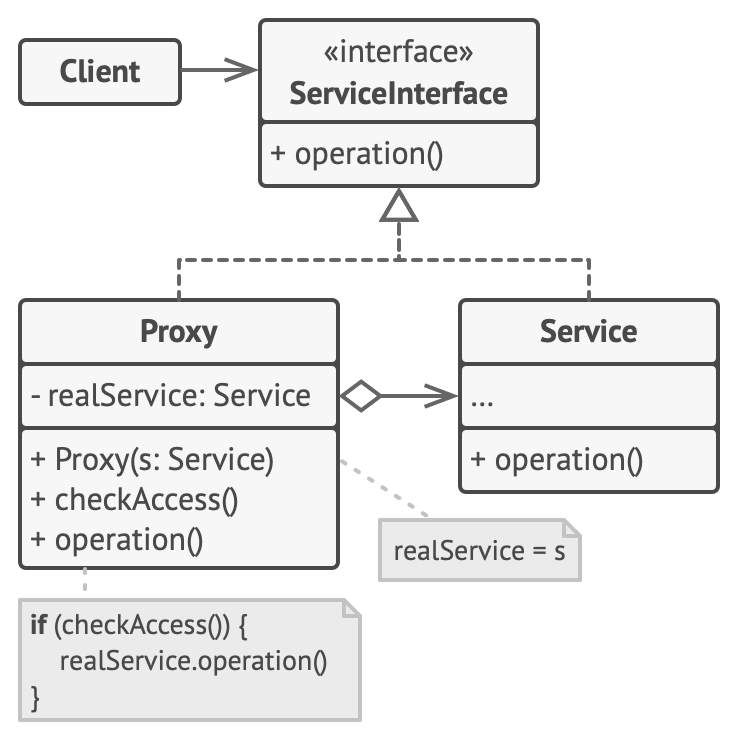
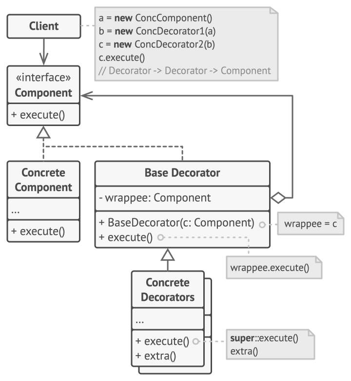
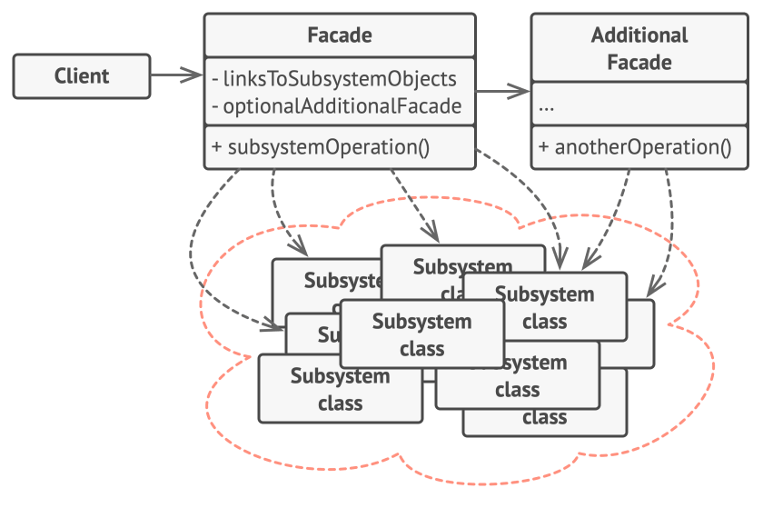
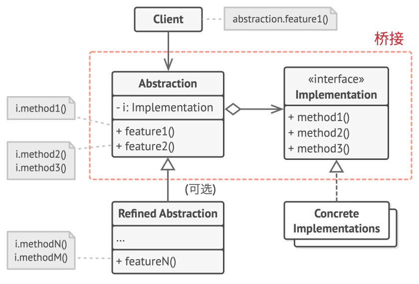
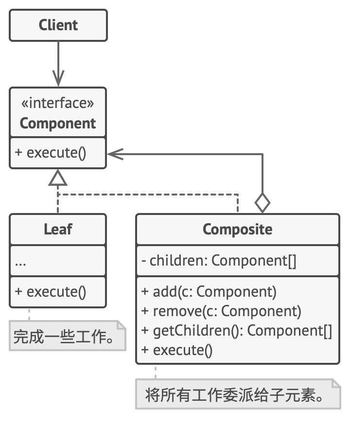
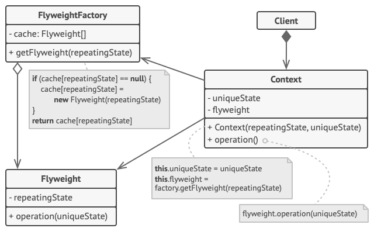

上篇博客说完了创建型设计模式，今天我们来说说**结构型设计模式**。尽管在分类上习惯区分创建型、结构型、行为型设计模式，但是工业应用上，更多只是利用不同设计模式背后的代码思想，甚至在23种设计模式中，部分模式背后的思想大同小异：例如，我们有时候会把工厂方法模式当作模板方法模式的一种特殊形式。

真正值得学习使用的是设计模式对于代码组织和逻辑的一种模式化表达。之前在Reddit上看过一个讨论：所谓的设计模式、UML建模，乃至整个软件工程，重点都在于把架构和设计用一种形象的方法教给外行；学术上的设计模式，根本就不是服务于工业应用的。

此话不假，割裂的设计和教条式的理论本就与千变万化的工业发展背道而驰，我们可以把组合模式、装饰模式、外观模式综合成一个行为树插件，最终目的还是让这个插件更好地服务于策划，更便于上层的建设。

废话说的有点多了，还是尽快进入正题。

## 适配器模式

适配器模式(Adapter Pattern)是一种结构型设计模式，它允许不兼容的接口之间进行协作。在Unity开发中，适配器模式非常有用，特别是在整合不同系统、第三方库或处理平台差异时。

### 基本概念

适配器模式主要分为两种类型：

1. **类适配器** ：通过继承来实现适配
   
2. **对象适配器** ：通过组合来实现适配
   

在C#和Unity中，我们通常使用对象适配器，因为它更灵活且符合组合优于继承的原则。

### 简单应用

平时写代码，用的最多的适配器，应该就是来整合Unity本身乱七八糟的模块，举个例子，

像这样把Resource和Addressable整合到一起：

```csharp
// 目标接口
public interface IResourceLoader 
{
    T Load<T>(string path) where T : Object;
    Task<T> LoadAsync<T>(string path) where T : Object;
}

// Resources适配器
public class ResourcesLoaderAdapter : IResourceLoader 
{
    public T Load<T>(string path) where T : Object => Resources.Load<T>(path);
  
    public async Task<T> LoadAsync<T>(string path) where T : Object 
    {
        var request = Resources.LoadAsync<T>(path);
        while (!request.isDone) await Task.Yield();
        return (T)request.asset;
    }
}

// Addressables适配器
public class AddressablesLoaderAdapter : IResourceLoader 
{
    public T Load<T>(string path) where T : Object 
    {
        // Addressables同步加载需要特殊处理
        return Addressables.LoadAssetAsync<T>(path).WaitForCompletion();
    }
  
    public async Task<T> LoadAsync<T>(string path) where T : Object 
    {
        return await Addressables.LoadAssetAsync<T>(path).Task;
    }
}
```

或者是同时把一个成就数据通过Steam / Epic / 其他平台的API发送出去：

```csharp
// 目标接口
public interface IAnalyticsService 
{
    void TrackEvent(string eventName, Dictionary<string, object> data);
}

// Firebase适配器
public class FirebaseAnalyticsAdapter : IAnalyticsService 
{
    public void TrackEvent(string eventName, Dictionary<string, object> data) 
    {
        // 将数据转换为Firebase需要的格式并发送
    }
}

// Unity Analytics适配器
public class UnityAnalyticsAdapter : IAnalyticsService 
{
    public void TrackEvent(string eventName, Dictionary<string, object> data) 
    {
        Analytics.CustomEvent(eventName, data);
    }
}
```

### 高级技巧

在处理多种服务、平台或系统集成时，结合网上的博客，我也总结了一些比较高级的技巧：

结合适配器来进行依赖注入

```csharp
public class PlayerController : MonoBehaviour 
{
    [SerializeField] private InputAdapterFactory inputFactory;
    private IInputHandler input;
  
    private void Awake() 
    {
        input = inputFactory.CreateInputHandler();
    }
  
    private void Update() 
    {
        float moveX = input.GetHorizontal();
        // 使用输入控制角色...
    }
}
```

结合 Scriptable Object的适配器工厂，在Editor中配置不同环境使用，无需修改代码。大致实现：

```csharp
[CreateAssetMenu(menuName = "Adapters/Input Adapter Factory")]
public class InputAdapterFactory : ScriptableObject 
{
    [SerializeField] private bool useNewInputSystem;
  
    public IInputHandler CreateInputHandler() 
    {
        return useNewInputSystem ? 
            new NewInputSystemAdapter() : 
            new UnityInputAdapter();
    }
}
```

## 代理模式

**代理模式**是一种结构型设计模式， 让你能够提供对象的替代品或其占位符。 代理控制着对于原对象的访问， 并允许在将请求提交给对象前后进行一些处理。

形象点说，Spring中的AOP就是一个非常好的代理模式实现。



### 基本概念

代理模式主要分为几种类型：

1. **虚拟代理** ：延迟昂贵对象的创建，类似懒加载
2. **保护代理** ：控制对原始对象的访问权限
3. **远程代理** ：为位于不同地址空间的对象提供本地代表
4. **智能引用代理** ：在访问对象时执行额外操作（如引用计数、懒加载等）

### 简单应用

其他几种代理都不难理解，我们来看一个远程代理的例子，下面是一个网络服务的代理：

```csharp
// 抽象主题
public interface ILeaderboardService
{
    Task<List<ScoreEntry>> GetTopScores(int count);
    Task SubmitScore(string playerId, int score);
}

// 真实主题（实际网络服务）
public class RemoteLeaderboardService : ILeaderboardService
{
    public async Task<List<ScoreEntry>> GetTopScores(int count)
    {
        // 实际网络请求
        Debug.Log("从服务器获取排行榜数据...");
        await Task.Delay(1000); // 模拟网络延迟
        return new List<ScoreEntry>(); // 返回实际数据
    }
  
    public async Task SubmitScore(string playerId, int score)
    {
        Debug.Log("向服务器提交分数...");
        await Task.Delay(500); // 模拟网络延迟
    }
}

// 代理类（可能添加缓存功能）
public class LeaderboardServiceProxy : ILeaderboardService
{
    private ILeaderboardService realService;
    private List<ScoreEntry> cachedScores;
    private DateTime lastFetchTime;
  
    public LeaderboardServiceProxy(ILeaderboardService realService)
    {
        this.realService = realService;
    }
  
    public async Task<List<ScoreEntry>> GetTopScores(int count)
    {
        // 如果缓存未过期（比如5分钟内），使用缓存
        if(cachedScores != null && (DateTime.Now - lastFetchTime).TotalMinutes < 5)
        {
            Debug.Log("从缓存获取排行榜数据");
            return cachedScores.Take(count).ToList();
        }
    
        // 否则从真实服务获取
        cachedScores = await realService.GetTopScores(count);
        lastFetchTime = DateTime.Now;
        return cachedScores;
    }
  
    public Task SubmitScore(string playerId, int score)
    {
        // 提交分数时使缓存失效
        cachedScores = null;
        return realService.SubmitScore(playerId, score);
    }
}
```

我去，这个叫什么代理的玩意，不就是在Service Plus Pro Max里面塞了一个Service吗，说白了就是在不改变基本服务的情况下，加上更多的额外功能。

没错，就是这么个玩意，平时我们说的网络服务鉴权，其实也是这么个逻辑：

```csharp
// 抽象主题
public interface IAdminCommands
{
    void BanPlayer(string playerId);
    void KickPlayer(string playerId);
    void AddAdmin(string playerId);
}

// 真实主题
public class RealAdminCommands : IAdminCommands
{
    public void BanPlayer(string playerId) => Debug.Log($"已封禁玩家 {playerId}");
    public void KickPlayer(string playerId) => Debug.Log($"已踢出玩家 {playerId}");
    public void AddAdmin(string playerId) => Debug.Log($"已添加管理员 {playerId}");
}

// 代理类（权限检查）
public class AdminCommandsProxy : IAdminCommands
{
    private IAdminCommands realCommands;
    private string currentUserId;
  
    public AdminCommandsProxy(IAdminCommands realCommands, string currentUserId)
    {
        this.realCommands = realCommands;
        this.currentUserId = currentUserId;
    }
  
    public void BanPlayer(string playerId)
    {
        if(CheckPermission("ban"))
        {
            realCommands.BanPlayer(playerId);
        }
        else
        {
            Debug.LogError($"用户 {currentUserId} 无封禁权限");
        }
    }
  
    public void KickPlayer(string playerId)
    {
        if(CheckPermission("kick"))
        {
            realCommands.KickPlayer(playerId);
        }
        else
        {
            Debug.LogError($"用户 {currentUserId} 无踢出权限");
        }
    }
  
    public void AddAdmin(string playerId)
    {
        if(CheckPermission("admin"))
        {
            realCommands.AddAdmin(playerId);
        }
        else
        {
            Debug.LogError($"用户 {currentUserId} 无管理员添加权限");
        }
    }
  
    private bool CheckPermission(string action)
    {
        // 实际项目中这里会查询用户权限
        // 简化示例：假设只有特定用户有权限
        return currentUserId == "admin123";
    }
}
```

### 高级技巧

看到这里，所谓的代理确实不算什么过于困难的东西了，所以在这之上也很难有非常优美的高级技巧，不过我还是在网上找了一个来凑数：

用代理实现缓存：

```csharp
public class SaveSystemProxy : ISaveSystem
{
    private ISaveSystem realSaveSystem;
    private Dictionary<string, object> cache = new Dictionary<string, object>();
  
    public SaveSystemProxy(ISaveSystem realSaveSystem)
    {
        this.realSaveSystem = realSaveSystem;
    }
  
    public void Save(string key, object data)
    {
        cache[key] = data;
        realSaveSystem.Save(key, data);
    }
  
    public T Load<T>(string key)
    {
        if(cache.ContainsKey(key))
        {
            return (T)cache[key];
        }
    
        var data = realSaveSystem.Load<T>(key);
        cache[key] = data;
        return data;
    }
}
```

## 装饰器模式

装饰器模式是一种结构型设计模式，它允许向一个现有的对象添加新的功能，同时又不改变其结构。这种模式创建了一个装饰类，用来包装原有的类，并在保持类方法签名完整性的前提下，提供了额外的功能。



ummm，看起来和代理差不多？其实结构上确实差不多，只是意图上有一些区别罢了。代理一般会管理被代理者的生命周期，而装饰器只能算插在装饰者身上的一个插件，即使没有装饰器，可以插上去，也可以拔下来。

### 核心概念

装饰器模式包含以下主要角色：

1. **组件接口（Component）** ：定义对象接口，可以动态地添加职责
2. **具体组件（Concrete Component）** ：定义具体的对象
3. **装饰器基类（Decorator）** ：持有一个组件对象的引用，并实现组件接口
4. **具体装饰器（Concrete Decorator）** ：向组件添加具体职责

### 简单应用

装饰器的应用，经常使用ECS架构的大家应该不会陌生：这不就是把组件插到实体上吗？！

于是便有了这样的应用，当然，不局限在ECS架构上。

角色武装系统：

```csharp
// 组件接口
public interface ICharacter
{
    string GetDescription();
    float GetAttackPower();
    float GetDefensePower();
}

// 具体组件
public class BasicCharacter : ICharacter
{
    public string GetDescription() => "基础角色";
    public float GetAttackPower() => 10f;
    public float GetDefensePower() => 5f;
}

// 装饰器基类
public abstract class CharacterDecorator : ICharacter
{
    protected ICharacter decoratedCharacter;
  
    public CharacterDecorator(ICharacter character)
    {
        decoratedCharacter = character;
    }
  
    public virtual string GetDescription() => decoratedCharacter.GetDescription();
    public virtual float GetAttackPower() => decoratedCharacter.GetAttackPower();
    public virtual float GetDefensePower() => decoratedCharacter.GetDefensePower();
}

// 具体装饰器 - 武器
public class WeaponDecorator : CharacterDecorator
{
    private float attackBonus;
  
    public WeaponDecorator(ICharacter character, float bonus) : base(character)
    {
        attackBonus = bonus;
    }
  
    public override string GetDescription() => 
        decoratedCharacter.GetDescription() + " + 武器(攻击+" + attackBonus + ")";
  
    public override float GetAttackPower() => 
        decoratedCharacter.GetAttackPower() + attackBonus;
}

// 具体装饰器 - 护甲
public class ArmorDecorator : CharacterDecorator
{
    private float defenseBonus;
  
    public ArmorDecorator(ICharacter character, float bonus) : base(character)
    {
        defenseBonus = bonus;
    }
  
    public override string GetDescription() => 
        decoratedCharacter.GetDescription() + " + 护甲(防御+" + defenseBonus + ")";
  
    public override float GetDefensePower() => 
        decoratedCharacter.GetDefensePower() + defenseBonus;
}

// 使用示例
public class EquipmentSystem : MonoBehaviour
{
    void Start()
    {
        ICharacter character = new BasicCharacter();
        Debug.Log(character.GetDescription() + 
                 " 攻击力:" + character.GetAttackPower() + 
                 " 防御力:" + character.GetDefensePower());
    
        // 添加武器
        character = new WeaponDecorator(character, 15f);
        Debug.Log(character.GetDescription() + 
                 " 攻击力:" + character.GetAttackPower() + 
                 " 防御力:" + character.GetDefensePower());
    
        // 添加护甲
        character = new ArmorDecorator(character, 10f);
        Debug.Log(character.GetDescription() + 
                 " 攻击力:" + character.GetAttackPower() + 
                 " 防御力:" + character.GetDefensePower());
    }
}
```

### 高级技巧

这方面的高级技巧，可就不少了，例如权限控制：

```csharp
public class PermissionDecorator : IAdminCommand
{
    private IAdminCommand wrappedCommand;
    private UserPermissions permissions;
  
    public PermissionDecorator(IAdminCommand command, UserPermissions perms)
    {
        wrappedCommand = command;
        permissions = perms;
    }
  
    public void ExecuteAdminCommand()
    {
        if(permissions.HasAdminAccess)
            wrappedCommand.ExecuteAdminCommand();
        else
            Debug.LogError("权限不足");
    }
}
```

插一个缓存：

```csharp
public class CachingDecorator : IDataService
{
    private IDataService wrappedService;
    private Dictionary<string, object> cache = new Dictionary<string, object>();
  
    public CachingDecorator(IDataService service)
    {
        wrappedService = service;
    }
  
    public T GetData<T>(string key)
    {
        if(cache.ContainsKey(key))
            return (T)cache[key];
    
        var data = wrappedService.GetData<T>(key);
        cache[key] = data;
        return data;
    }
}
```

插一个Logger：

```csharp
public class LoggingDecorator : IGameService
{
    private IGameService wrappedService;
  
    public LoggingDecorator(IGameService service)
    {
        wrappedService = service;
    }
  
    public void PerformAction()
    {
        Debug.Log("Action started at: " + DateTime.Now);
        wrappedService.PerformAction();
        Debug.Log("Action completed at: " + DateTime.Now);
    }
}
```

总而言之，只要足够熟练，装饰器模式是最适合在Unity中使用的设计模式，也是最有Unity味的设计模式。

## 外观模式

外观模式是一种结构型设计模式，它为复杂的子系统提供了一个简化的接口。这个其实说的玄幻，但是做的简单。



QFramework等框架的架构设计里的 Manager of Managers 就是一种变异的外观模式，我们之前提到的原型模式里的Director，也可以算作一种外观模式。

### 核心概念

外观模式包含两个主要角色：

1. **外观类（Facade）** ：提供简化的接口，将客户端请求委派给适当的子系统对象
2. **子系统类（Subsystem Classes）** ：实现子系统的功能，处理外观类指派的工作

### 简单应用

最简单的应用就是实现一个Manager of managers

```csharp
// 子系统 - 音频系统
public class AudioSystem
{
    public void PlaySound(string soundName) 
        => Debug.Log($"播放音效: {soundName}");
  
    public void StopSound(string soundName) 
        => Debug.Log($"停止音效: {soundName}");
  
    public void SetVolume(float volume) 
        => Debug.Log($"设置音量: {volume}");
}

// 子系统 - 特效系统
public class VFXSystem
{
    public void PlayEffect(string effectName, Vector3 position) 
        => Debug.Log($"在{position}播放特效: {effectName}");
  
    public void StopEffect(string effectName) 
        => Debug.Log($"停止特效: {effectName}");
}

// 子系统 - 场景管理系统
public class SceneSystem
{
    public void LoadScene(string sceneName) 
        => Debug.Log($"加载场景: {sceneName}");
  
    public void UnloadScene(string sceneName) 
        => Debug.Log($"卸载场景: {sceneName}");
}

// 外观类 - 游戏引擎
public class GameEngineFacade
{
    private AudioSystem audioSystem;
    private VFXSystem vfxSystem;
    private SceneSystem sceneSystem;
  
    public GameEngineFacade()
    {
        audioSystem = new AudioSystem();
        vfxSystem = new VFXSystem();
        sceneSystem = new SceneSystem();
    }
  
    // 简化的接口方法
    public void StartGame()
    {
        audioSystem.PlaySound("BackgroundMusic");
        audioSystem.SetVolume(0.7f);
        sceneSystem.LoadScene("MainLevel");
        Debug.Log("游戏开始!");
    }
  
    public void EndGame()
    {
        audioSystem.StopSound("BackgroundMusic");
        vfxSystem.PlayEffect("Explosion", Vector3.zero);
        sceneSystem.UnloadScene("MainLevel");
        Debug.Log("游戏结束!");
    }
  
    public void PlayPlayerEffect(Vector3 position)
    {
        audioSystem.PlaySound("PlayerJump");
        vfxSystem.PlayEffect("JumpDust", position);
    }
}

// 使用示例
public class GameManager : MonoBehaviour
{
    private GameEngineFacade gameEngine;
  
    void Start()
    {
        gameEngine = new GameEngineFacade();
        gameEngine.StartGame();
    }
  
    void Update()
    {
        if(Input.GetKeyDown(KeyCode.Space))
        {
            gameEngine.PlayPlayerEffect(transform.position);
        }
  
        if(Input.GetKeyDown(KeyCode.Escape))
        {
            gameEngine.EndGame();
        }
    }
}
```

除了managers ，Manager of Services ，一切子系统，都可以用一个外观来包装：

```csharp
// 子系统 - 广告服务
public class AdService
{
    public void ShowBannerAd() => Debug.Log("显示横幅广告");
    public void ShowInterstitialAd() => Debug.Log("显示插页广告");
    public void ShowRewardedAd(Action<bool> callback) 
    {
        Debug.Log("显示激励广告");
        callback(true); // 模拟用户看完广告
    }
}

// 子系统 - 分析服务
public class AnalyticsService
{
    public void TrackEvent(string eventName, Dictionary<string, object> parameters)
        => Debug.Log($"追踪事件: {eventName} - {string.Join(",", parameters)}");
}

// 子系统 - 成就系统
public class AchievementService
{
    public void UnlockAchievement(string achievementId)
        => Debug.Log($"解锁成就: {achievementId}");
}

// 外观类 - 游戏服务管理器
public class GameServicesFacade
{
    private AdService adService;
    private AnalyticsService analyticsService;
    private AchievementService achievementService;
  
    public GameServicesFacade()
    {
        adService = new AdService();
        analyticsService = new AnalyticsService();
        achievementService = new AchievementService();
    }
  
    // 简化的游戏服务接口
    public void ShowAd(AdType type, Action<bool> callback = null)
    {
        switch(type)
        {
            case AdType.Banner:
                adService.ShowBannerAd();
                break;
            case AdType.Interstitial:
                adService.ShowInterstitialAd();
                break;
            case AdType.Rewarded:
                adService.ShowRewardedAd(callback);
                break;
        }
    
        analyticsService.TrackEvent("AdShown", new Dictionary<string, object>
        {
            {"adType", type.ToString()}
        });
    }
  
    public void TrackPlayerProgress(int level, int score)
    {
        analyticsService.TrackEvent("PlayerProgress", new Dictionary<string, object>
        {
            {"level", level},
            {"score", score}
        });
    
        if(level >= 10)
        {
            achievementService.UnlockAchievement("Level10");
        }
    }
}

public enum AdType { Banner, Interstitial, Rewarded }

// 使用示例
public class GameServicesExample : MonoBehaviour
{
    private GameServicesFacade gameServices;
  
    void Start()
    {
        gameServices = new GameServicesFacade();
    
        // 显示广告
        gameServices.ShowAd(AdType.Rewarded, (success) => 
        {
            if(success) Debug.Log("奖励玩家");
        });
    
        // 追踪进度
        gameServices.TrackPlayerProgress(12, 4500);
    }
}
```

### 高级技巧

不难看出来，和装饰器模式一样，外观模式也是一种十分迎合游戏开发的设计模式，具体实现的时候只需要注意这些点就够了：

* 将相关功能组织到同一子系统中
* 每个子系统应该有明确的职责边界

尤其是第二点，一旦子系统的边界不够明确，后面继续拓展功能的时候，就有的你难受的了。

本人平时也研究了一些比较进阶的外观模式设计（其实研究的时候并不知道自己在研究外观模式，主要还是为自己的游戏优化架构），例如：

从分层状态机的设计里想出来的层次外观：

```csharp
// 高层外观
public class GameApplication
{
    private GameEngineFacade engine;
    private SaveManagerFacade saveManager;
    private GameServicesFacade services;
  
    public void Initialize()
    {
        engine = new GameEngineFacade();
        saveManager = new SaveManagerFacade();
        services = new GameServicesFacade();
    }
}

// 低层外观
public class GraphicsFacade
{
    private ShaderSystem shaderSystem;
    private LightingSystem lightingSystem;
    private PostProcessingSystem postProcessing;
  
    public void SetGraphicsQuality(QualityLevel level)
    {
        // 配置各个图形子系统
    }
}
```


## 桥接模式

桥接模式是一种结构型设计模式，它将抽象部分与其实现部分分离，使它们可以独立变化。这种模式通过提供抽象层和实现层之间的桥接结构，避免使用继承导致的类爆炸问题，特别适用于需要在多个维度上扩展的系统。



简单点说，这个模式存在的意义就是把M*N问题转化成了M+N的问题，从而降低了实现的难度，具体它对可读性之类的影响，我只能说见仁见智。

### 核心概念

桥接模式包含四个关键角色：

1. **抽象（Abstraction）** ：定义高层控制逻辑，维护对实现对象的引用
2. **扩展抽象（Refined Abstraction）** ：扩展抽象类，提供更精确的控制
3. **实现者（Implementor）** ：定义实现类的接口
4. **具体实现者（Concrete Implementor）** ：实现Implementor接口的具体类

### 简单应用

一个最经典的桥接模式就是编译器的前后端设计，原本的编译器为了让一个ABC语言适配abc架构的机器，需要3*3 = 9 种编译工具链。区分了前后端之后，ABC语言都被编译成IL中间语言，IL再被编译到abc机器的指令码，总共3+3 = 6种编译工具链就够了。

Unity里，这样的设计一般只会在大厂接触巨型项目的时候才会见到了，举个例子：

跨平台输入系统（端游、手游、手柄全互通）：

```csharp
// 实现者接口 - 输入设备
public interface IInputDevice
{
    Vector2 GetMovement();
    bool GetJump();
    bool GetFire();
}

// 具体实现者 - 键盘鼠标输入
public class KeyboardMouseInput : IInputDevice
{
    public Vector2 GetMovement() => new Vector2(
        Input.GetAxis("Horizontal"),
        Input.GetAxis("Vertical")
    );
  
    public bool GetJump() => Input.GetKeyDown(KeyCode.Space);
    public bool GetFire() => Input.GetMouseButtonDown(0);
}

// 具体实现者 - 游戏手柄输入
public class GamepadInput : IInputDevice
{
    public Vector2 GetMovement() => new Vector2(
        Input.GetAxis("GamepadHorizontal"),
        Input.GetAxis("GamepadVertical")
    );
  
    public bool GetJump() => Input.GetButtonDown("GamepadJump");
    public bool GetFire() => Input.GetButtonDown("GamepadFire");
}

// 具体实现者 - 触摸屏输入
public class TouchInput : IInputDevice
{
    public Vector2 GetMovement()
    {
        // 简化实现
        if (Input.touchCount > 0)
        {
            Touch touch = Input.GetTouch(0);
            return new Vector2(touch.deltaPosition.x, touch.deltaPosition.y);
        }
        return Vector2.zero;
    }
  
    public bool GetJump() => Input.touchCount >= 2;
    public bool GetFire() => Input.GetMouseButtonDown(0); // 触摸屏也使用鼠标事件
}

// 抽象 - 输入处理器
public abstract class InputHandler
{
    protected IInputDevice inputDevice;
  
    protected InputHandler(IInputDevice inputDevice)
    {
        this.inputDevice = inputDevice;
    }
  
    public abstract void ProcessInput();
}

// 扩展抽象 - 玩家角色输入
public class PlayerInputHandler : InputHandler
{
    private CharacterController character;
  
    public PlayerInputHandler(IInputDevice inputDevice, CharacterController character) 
        : base(inputDevice)
    {
        this.character = character;
    }
  
    public override void ProcessInput()
    {
        Vector2 movement = inputDevice.GetMovement();
        character.Move(new Vector3(movement.x, 0, movement.y));
    
        if(inputDevice.GetJump())
        {
            character.Jump();
        }
    
        if(inputDevice.GetFire())
        {
            character.Fire();
        }
    }
}

// 扩展抽象 - 摄像机输入
public class CameraInputHandler : InputHandler
{
    private CameraController camera;
  
    public CameraInputHandler(IInputDevice inputDevice, CameraController camera) 
        : base(inputDevice)
    {
        this.camera = camera;
    }
  
    public override void ProcessInput()
    {
        Vector2 movement = inputDevice.GetMovement();
        camera.Rotate(movement.x, movement.y);
    }
}

// 使用示例
public class InputSystem : MonoBehaviour
{
    [SerializeField] private CharacterController player;
    [SerializeField] private CameraController camera;
  
    private InputHandler playerInput;
    private InputHandler cameraInput;
  
    void Start()
    {
        // 根据平台选择输入设备
        IInputDevice inputDevice = GetInputDeviceForPlatform();
    
        playerInput = new PlayerInputHandler(inputDevice, player);
        cameraInput = new CameraInputHandler(inputDevice, camera);
    }
  
    void Update()
    {
        playerInput.ProcessInput();
        cameraInput.ProcessInput();
    }
  
    private IInputDevice GetInputDeviceForPlatform()
    {
        switch(Application.platform)
        {
            case RuntimePlatform.WindowsPlayer:
            case RuntimePlatform.OSXPlayer:
            case RuntimePlatform.LinuxPlayer:
                return new KeyboardMouseInput();
            
            case RuntimePlatform.PS4:
            case RuntimePlatform.XboxOne:
                return new GamepadInput();
            
            case RuntimePlatform.Android:
            case RuntimePlatform.IPhonePlayer:
                return new TouchInput();
            
            default:
                return new KeyboardMouseInput();
        }
    }
}
```

除此之外，对于持久化系统、渲染API等等大型系统，都可以用桥接模式来避免类数量爆炸的问题。

### 高级技巧

桥接是一种经典的分层技巧，既然分了一层，当然也可以分更多层咯，下面是一个简单的层次桥接：

```csharp
// 第一级桥接：渲染API
public interface IRenderAPI { /* ... */ }

// 第二级桥接：材质系统
public interface IMaterialSystem
{
    void ApplyMaterial(Material material, IRenderAPI renderAPI);
}

// 图形对象同时使用两个桥接
public class GraphicsObject
{
    private IRenderAPI renderAPI;
    private IMaterialSystem materialSystem;
  
    public GraphicsObject(IRenderAPI renderAPI, IMaterialSystem materialSystem)
    {
        this.renderAPI = renderAPI;
        this.materialSystem = materialSystem;
    }
  
    public void Render(Mesh mesh, Material material)
    {
        materialSystem.ApplyMaterial(material, renderAPI);
        renderAPI.RenderMesh(mesh);
    }
}
```

## 组合模式

**组合模式**， 你可以使用它将对象组合成树状结构， 并且能像使用独立对象一样使用它们。

当然，只有在应用的核心模型能用树状结构表示时， 在应用中使用组合模式才有价值。



### 核心概念

组合模式的关键点是让单个对象（Leaf）和组合对象（Composite）共享相同的接口，从而使客户端代码无需关心对象的具体类型：

* **Component（组件）** ：定义了叶子节点和组合节点的公共接口或基类，通常是一个抽象类或接口。
* **Leaf（叶子节点）** ：表示树结构中的基本元素，没有子节点。
* **Composite（组合节点）** ：包含子节点的容器，可以包含其他Composite或Leaf节点。
* **Client（客户端）** ：通过Component接口操作对象，无需区分Leaf还是Composite。

在Unity中，组合模式天然契合GameObject-Component体系，因为GameObject本身可以看作Composite（包含多个子GameObject和Component），而Component可以看作Leaf。

### 简单应用

最经典的，莫过于Unity的树形UI系统（当然前端UI似乎都是这样的设计...）

```csharp
using UnityEngine;
using System.Collections.Generic;

// 抽象接口（Component）
public abstract class UIComponent
{
    protected string name;
    public UIComponent(string name) => this.name = name;

    public abstract void Show();
    public abstract void Hide();
    public abstract void Add(UIComponent component);
    public abstract void Remove(UIComponent component);
}

// 叶子节点（Leaf）
public class UIElement : UIComponent
{
    public UIElement(string name) : base(name) { }

    public override void Show()
    {
        Debug.Log($"Showing UI Element: {name}");
        // 实际逻辑：激活GameObject或设置UI状态
    }

    public override void Hide()
    {
        Debug.Log($"Hiding UI Element: {name}");
        // 实际逻辑：隐藏GameObject或设置UI状态
    }

    public override void Add(UIComponent component)
    {
        Debug.LogWarning("Cannot add to a leaf node.");
    }

    public override void Remove(UIComponent component)
    {
        Debug.LogWarning("Cannot remove from a leaf node.");
    }
}

// 组合节点（Composite）
public class UIPanel : UIComponent
{
    private List<UIComponent> children = new List<UIComponent>();

    public UIPanel(string name) : base(name) { }

    public override void Show()
    {
        Debug.Log($"Showing UI Panel: {name}");
        foreach (var child in children)
        {
            child.Show();
        }
    }

    public override void Hide()
    {
        Debug.Log($"Hiding UI Panel: {name}");
        foreach (var child in children)
        {
            child.Hide();
        }
    }

    public override void Add(UIComponent component)
    {
        children.Add(component);
    }

    public override void Remove(UIComponent component)
    {
        children.Remove(component);
    }
}

// 使用示例
public class UIManager : MonoBehaviour
{
    void Start()
    {
        // 创建UI树
        UIComponent mainPanel = new UIPanel("MainPanel");
        UIComponent button1 = new UIElement("Button1");
        UIComponent button2 = new UIElement("Button2");
        UIComponent subPanel = new UIPanel("SubPanel");
        UIComponent subButton = new UIElement("SubButton");

        // 构建树结构
        mainPanel.Add(button1);
        mainPanel.Add(button2);
        mainPanel.Add(subPanel);
        subPanel.Add(subButton);

        // 操作整个UI树
        mainPanel.Show(); // 显示MainPanel及其所有子节点
        mainPanel.Hide(); // 隐藏MainPanel及其所有子节点
    }
}
```

### 高级技巧

组合模式的树形结构，天生适合数据持久化，也就非常适合设计一些可视化插件：

```csharp
[System.Serializable]
public class UIComponentData
{
    public string name;
    public bool isComposite;
    public List<UIComponentData> children = new List<UIComponentData>();
}

public class UIComponentSerializer : MonoBehaviour
{
    public void SaveToJson(UIComponent root, string path)
    {
        UIComponentData data = SerializeComponent(root);
        string json = JsonUtility.ToJson(data, true);
        System.IO.File.WriteAllText(path, json);
    }

    private UIComponentData SerializeComponent(UIComponent component)
    {
        UIComponentData data = new UIComponentData
        {
            name = component.ToString(),
            isComposite = component is UIPanel
        };

        if (component is UIPanel panel)
        {
            foreach (var child in panel.Children) // 假设Children是公开的属性
            {
                data.children.Add(SerializeComponent(child));
            }
        }
        return data;
    }
}
```

有了可视化插件，当然就少不了可视化的设计和编程，类似撤销等功能也就更容易实现，这里有些偏题了，后续可能会写一篇行为树的可视化设计，这里只做简单说明：

```csharp
public class UIPanel : UIComponent
{
    private List<UIComponent> children = new List<UIComponent>();
    private Stack<(UIComponent, Action)> undoStack = new Stack<(UIComponent, Action)>();

    public override void Add(UIComponent component)
    {
        if (component == null || children.Contains(component))
        {
            Debug.LogError("Invalid component or already added.");
            return;
        }
        children.Add(component);
        undoStack.Push((component, () => children.Remove(component)));
    }

    public void UndoLastAdd()
    {
        if (undoStack.Count > 0)
        {
            var (component, action) = undoStack.Pop();
            action();
            Debug.Log($"Undid adding {component}");
        }
    }
}
```

## 享元模式

**享元模式**是一种结构型设计模式， 它摒弃了在每个对象中保存所有数据的方式， 通过共享多个对象所共有的相同状态， 让你能在有限的内存容量中载入更多对象。



享元模式真是一个失败的命名...当时学习的时候，一直觉得这个设计模式有一种熟悉的陌生感，后来在其他地方看到了享元模式的一个英文别称Cache pattern瞬间明白了。

这个东西也可以叫做**缓存模式**，这样说应该就直白了吧。

### 核心概念

享元模式的核心思想是将对象的**内在状态**（Intrinsic State）和**外在状态**（Extrinsic State）分开，通过共享内在状态来减少内存占用。

* **内在状态** ：对象的共享部分，通常是不可变的，存储在享元对象中（如纹理、模型、配置数据）。
* **外在状态** ：对象的非共享部分，通常由客户端维护（如位置、旋转、当前状态）。
* **享元工厂（Flyweight Factory）** ：负责创建和管理共享的享元对象，通常使用字典或池来存储已创建的对象。
* **客户端（Client）** ：使用享元对象，并传递外在状态来定制行为。

在Unity中，享元模式特别适合优化大量重复对象的场景，比如粒子系统、子弹、敌人、UI图标等。

### 简单应用

演示一个简陋的子弹系统：

```csharp
using UnityEngine;
using System.Collections.Generic;

// 享元类（共享内在状态）
public class BulletFlyweight
{
    public readonly string Type; // 内在状态：子弹类型
    public readonly GameObject Prefab; // 内在状态：共享的预制体
    public readonly float Speed; // 内在状态：共享的速度配置

    public BulletFlyweight(string type, GameObject prefab, float speed)
    {
        Type = type;
        Prefab = prefab;
        Speed = speed;
    }
}

// 享元工厂
public class BulletFlyweightFactory
{
    private Dictionary<string, BulletFlyweight> flyweights = new Dictionary<string, BulletFlyweight>();

    public BulletFlyweight GetFlyweight(string type)
    {
        if (!flyweights.ContainsKey(type))
        {
            // 模拟加载预制体和配置
            GameObject prefab = Resources.Load<GameObject>($"Bullets/{type}");
            float speed = type == "Normal" ? 10f : 15f; // 模拟配置
            flyweights[type] = new BulletFlyweight(type, prefab, speed);
        }
        return flyweights[type];
    }
}

// 子弹实例（管理外在状态）
public class Bullet
{
    private BulletFlyweight flyweight;
    private Vector3 position; // 外在状态
    private Vector3 direction; // 外在状态

    public Bullet(BulletFlyweight flyweight, Vector3 position, Vector3 direction)
    {
        this.flyweight = flyweight;
        this.position = position;
        this.direction = direction;
    }

    public void Update()
    {
        // 使用共享的内在状态更新外在状态
        position += direction * flyweight.Speed * Time.deltaTime;
        // 假设有一个GameObject实例来显示
        Debug.Log($"Bullet {flyweight.Type} at {position}");
    }
}

// 使用示例
public class BulletManager : MonoBehaviour
{
    private BulletFlyweightFactory factory = new BulletFlyweightFactory();
    private List<Bullet> bullets = new List<Bullet>();

    void Start()
    {
        // 创建不同类型的子弹
        BulletFlyweight normalBullet = factory.GetFlyweight("Normal");
        BulletFlyweight fastBullet = factory.GetFlyweight("Fast");

        bullets.Add(new Bullet(normalBullet, Vector3.zero, Vector3.right));
        bullets.Add(new Bullet(fastBullet, Vector3.zero, Vector3.up));
    }

    void Update()
    {
        foreach (var bullet in bullets)
        {
            bullet.Update();
        }
    }
}
```

### 高级技巧

缓存本身的实现和决策就已经足够高级了，这里简单说一下ECS+缓存的性能优化：

```csharp
using Unity.Entities;

public struct BulletSharedData : ISharedComponentData
{
    public GameObject Prefab;
    public float Speed;
}

public struct BulletData : IComponentData
{
    public Vector3 Position;
    public Vector3 Direction;
}

public class BulletSystem : SystemBase
{
    protected override void OnUpdate()
    {
        Entities.ForEach((ref BulletData bullet, in BulletSharedData shared) =>
        {
            bullet.Position += bullet.Direction * shared.Speed * Time.DeltaTime;
        }).ScheduleParallel();
    }
}
```

这段代码，将内在状态存储为SharedComponentData，所有同类型Entity共享一份数据。而外在状态存储为普通IComponentData，每个Entity独立维护。同时，使用System处理共享数据的逻辑更新。理论上，可以管理超过1w以上的物体实例，具体的ECS和Jobs我也没有测试过，只是个人拙见。

## 总结

懒得写字了，看图吧。

| 设计模式         | 定义                                             | Unity中的应用场景                            | 最佳实践                                      |
| ---------------- | ------------------------------------------------ | -------------------------------------------- | --------------------------------------------- |
| **适配器** | 将一个类的接口转换为客户端期望的另一个接口       | 整合第三方库、适配旧系统                     | 保持单一职责、使用接口、避免过度适配          |
| **装饰者** | 动态为对象附加额外职责，提供比继承更灵活的扩展   | 动态扩展GameObject功能（如武器效果）、UI增强 | 保持接口一致、避免过多装饰、结合Unity组件系统 |
| **外观**   | 为子系统提供统一接口，简化客户端使用             | 管理复杂子系统（如音频、UI）、游戏管理器     | 单一入口、避免臃肿、结合事件系统              |
| **组合**   | 将对象组织成树形结构，统一处理单个对象和组合对象 | 管理GameObject层级、复杂UI布局               | 统一接口、利用Unity层级系统、避免过度嵌套     |
| **代理**   | 通过代理对象控制对另一对象的访问                 | 延迟加载资源、网络同步对象                   | 明确职责、结合异步加载、用于日志和调试        |
| **享元**   | 通过共享对象减少内存使用，适用于大量相似对象     | 管理子弹、粒子效果、对象池                   | 分离内在和外在状态、结合对象池、谨慎使用      |
| **桥接**   | 将抽象与实现分离，使两者可独立变化               | 多平台渲染、输入系统分离                     | 定义清晰接口、避免过度抽象、结合依赖注入      |

当然，最后还是得提醒一句，不要过度设计！
