偷了点懒，今天本来打算三天过完设计模式的，还是推迟了一天啊。

今天快速解决掉行为型设计模式吧，算是把设计模式这个坑填上了！

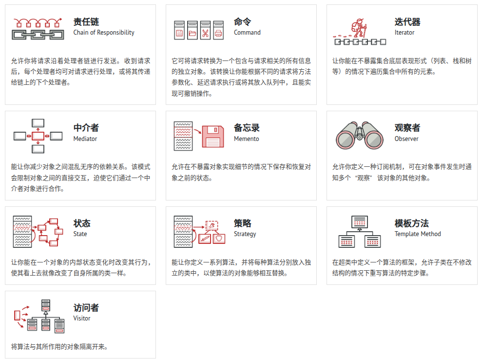

## 观察者模式

观察者模式(Observer Pattern)在Unity中是一种非常常用的设计模式，它定义了对象之间的一对多依赖关系，当一个对象(被观察者/Subject)状态发生改变时，所有依赖它的对象(观察者/Observers)都会自动收到通知并更新。

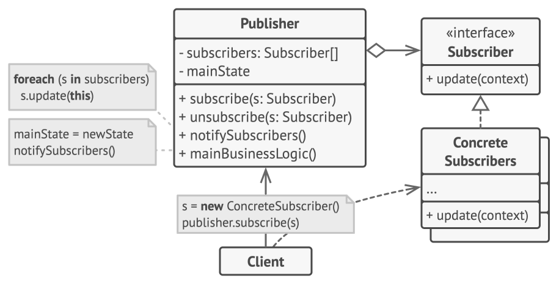

C#的事件委托机制，就是我们可以使用到的最适合C#本身的观察模式的实现，平时要用的时候直接回顾一下就可以了。当然，如果你热衷于造轮子，自己动手实现也不算麻烦。

### 核心组件

1. **Subject(被观察者)** ：维护观察者列表，提供添加/删除观察者的方法，并在状态变化时通知观察者
2. **Observer(观察者)** ：定义更新接口，用于接收Subject的通知
3. **ConcreteSubject(具体被观察者)** ：实现Subject，存储状态并在状态改变时通知观察者
4. **ConcreteObserver(具体观察者)** ：实现Observer接口，维护对ConcreteSubject的引用

### 典型应用场景

1. UI系统响应游戏事件
2. 成就系统跟踪玩家行为
3. 游戏状态管理(如暂停、游戏结束)
4. 事件驱动的游戏逻辑
5. 音频系统响应游戏事件

### 注意事项

1. **内存泄漏** ：记得在OnDestroy或OnDisable中取消订阅事件
2. **性能考虑** ：大量频繁的事件通知可能影响性能
3. **调试难度** ：事件驱动的代码流程可能难以跟踪

### 实际应用

举个例子看看：

```csharp
// 被观察者
public class GameEventManager : MonoBehaviour
{
    public delegate void GameEvent();
    public static event GameEvent OnPlayerDeath;
  
    public static void TriggerPlayerDeath()
    {
        if(OnPlayerDeath != null)
        {
            OnPlayerDeath();
        }
    }
}

// 观察者
public class AchievementSystem : MonoBehaviour
{
    void OnEnable()
    {
        GameEventManager.OnPlayerDeath += OnPlayerDeath;
    }
  
    void OnDisable()
    {
        GameEventManager.OnPlayerDeath -= OnPlayerDeath;
    }
  
    void OnPlayerDeath()
    {
        Debug.Log("Achievement Unlocked: First Death");
    }
}
```

当然了，在Unity中，UnityEvent或许是更好的选择：

```csharp
using UnityEngine.Events;

public class PlayerHealth : MonoBehaviour
{
    public UnityEvent OnDeath;
  
    public void TakeDamage(int damage)
    {
        currentHealth -= damage;
        if(currentHealth <= 0)
        {
            OnDeath.Invoke();
        }
    }
}

// 在Inspector中拖拽添加响应方法
```

或者如前文所说，自己实现：

```csharp
public interface IGameObserver
{
    void OnGameEvent(string eventType);
}

public class GameSubject : MonoBehaviour
{
    private List<IGameObserver> observers = new List<IGameObserver>();
  
    public void AddObserver(IGameObserver observer)
    {
        observers.Add(observer);
    }
  
    public void RemoveObserver(IGameObserver observer)
    {
        observers.Remove(observer);
    }
  
    public void NotifyObservers(string eventType)
    {
        foreach(var observer in observers)
        {
            observer.OnGameEvent(eventType);
        }
    }
}

public class UIObserver : MonoBehaviour, IGameObserver
{
    void Start()
    {
        FindObjectOfType<GameSubject>().AddObserver(this);
    }
  
    public void OnGameEvent(string eventType)
    {
        if(eventType == "ScoreUpdate")
        {
            UpdateScoreUI();
        }
    }
}
```

## 策略模式

策略模式(Strategy Pattern)是一种行为型设计模式，它定义了一系列算法，并将每个算法封装起来，使它们可以相互替换。策略模式让算法的变化独立于使用算法的客户。

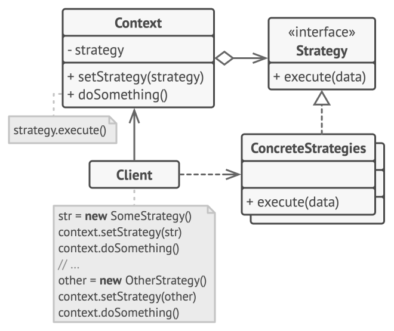

这么个玩意看起来复杂，真正用的时候，给函数调用/类实例 传一个函数指针就够了。

### 核心组件

1. **策略接口(IStrategy)** ：定义所有支持的算法的公共接口
2. **具体策略(ConcreteStrategy)** ：实现策略接口的具体算法类
3. **上下文(Context)** ：持有一个策略对象的引用，并通过策略接口与之交互

### 典型应用场景

1. **角色移动系统** ：行走、奔跑、飞行、游泳等不同移动方式
2. **AI行为** ：不同的敌人AI策略
3. **攻击系统** ：不同的武器攻击策略
4. **游戏难度系统** ：不同难度级别的策略
5. **存档系统** ：不同的数据存储策略(本地、云存储等)

### 注意事项

1. **策略对象数量** ：如果策略过多，可能会导致类爆炸
2. **策略间通信** ：策略之间可能需要共享数据，需设计好通信机制
3. **性能考虑** ：频繁创建销毁策略对象可能影响性能，可考虑对象池（感觉什么都可以用池优化啊喂）

### 实际应用

首先，这个本身就类似函数指针思想的设计模式，当然要用C#的委托来实现一遍试试：

```csharp
public class PlayerMovementDelegate : MonoBehaviour
{
    public delegate void MovementDelegate(Transform transform);
    public MovementDelegate moveStrategy;
  
    void Update()
    {
        if(moveStrategy != null)
        {
            moveStrategy(transform);
        }
    }
  
    void Start()
    {
        // 设置不同策略
        if(isFlying)
        {
            moveStrategy = t => t.Translate(Vector3.up * 3f * Time.deltaTime);
        }
        else
        {
            moveStrategy = t => t.Translate(Vector3.forward * 2f * Time.deltaTime);
        }
    }
}
```

写爽了，当然我们也不能太过依赖语言特性，把C#当Java写，可以用接口来实现：

```csharp
// 策略接口
public interface IMovementStrategy
{
    void Move(Transform transform);
}

// 具体策略
public class WalkStrategy : IMovementStrategy
{
    public void Move(Transform transform)
    {
        transform.Translate(Vector3.forward * 2f * Time.deltaTime);
    }
}

public class RunStrategy : IMovementStrategy
{
    public void Move(Transform transform)
    {
        transform.Translate(Vector3.forward * 5f * Time.deltaTime);
    }
}

public class FlyStrategy : IMovementStrategy
{
    public void Move(Transform transform)
    {
        transform.Translate(Vector3.up * 3f * Time.deltaTime);
    }
}

// 上下文
public class PlayerMovement : MonoBehaviour
{
    private IMovementStrategy _currentStrategy;
  
    public void SetStrategy(IMovementStrategy strategy)
    {
        _currentStrategy = strategy;
    }
  
    void Update()
    {
        if(_currentStrategy != null)
        {
            _currentStrategy.Move(transform);
        }
    }
}

// 使用示例
void Start()
{
    var movement = GetComponent<PlayerMovement>();
  
    if(Input.GetKey(KeyCode.LeftShift))
        movement.SetStrategy(new RunStrategy());
    else
        movement.SetStrategy(new WalkStrategy());
    
    if(Input.GetKey(KeyCode.Space))
        movement.SetStrategy(new FlyStrategy());
}
```

Unity的SO也是个好东西：

```csharp
// 策略基类
public abstract class MovementStrategy : ScriptableObject
{
    public abstract void Move(Transform transform);
}

// 具体策略
[CreateAssetMenu(menuName = "Strategies/Walk")]
public class WalkStrategySO : MovementStrategy
{
    public float speed = 2f;
  
    public override void Move(Transform transform)
    {
        transform.Translate(Vector3.forward * speed * Time.deltaTime);
    }
}

// 上下文
public class PlayerMovementSO : MonoBehaviour
{
    public MovementStrategy currentStrategy;
  
    void Update()
    {
        if(currentStrategy != null)
        {
            currentStrategy.Move(transform);
        }
    }
}
```

## 命令模式

命令模式(Command Pattern)是一种行为设计模式，它将请求或操作封装为对象，从而使你可以参数化客户端对象，将请求排队、记录请求日志，以及支持可撤销的操作。

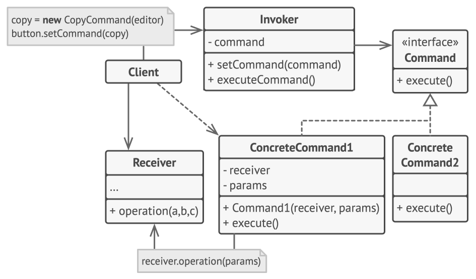

这样单独来看命令模式，显然是看不出来个所以然的。众所周知，微软的咖哩味代码是非常喜欢玩一套又一套的设计模式，果然，CQRS这个东西用来理解【命令:查询:请求】这样的架构是非常有效的，在[这里](https://learn.microsoft.com/zh-cn/azure/architecture/patterns/cqrs)可以详细看看简单的设计模式怎么合体成更复杂的架构的。

### 核心组件

1. **Command(命令接口)** ：声明执行操作的接口
2. **ConcreteCommand(具体命令)** ：实现Command接口，绑定接收者和动作
3. **Invoker(调用者)** ：要求命令执行请求
4. **Receiver(接收者)** ：知道如何执行与请求相关的操作

### 典型应用场景

1. **输入处理系统** ：将玩家输入转换为命令对象
2. **撤销/重做功能** ：编辑器工具、游戏机制
3. **AI行为队列** ：AI决策和行为执行分离
4. **网络消息处理** ：将网络消息封装为命令
5. **关卡序列** ：关卡事件和动画序列控制
6. **回放系统** ：记录和重放玩家操作

### 注意事项

1. **内存开销** ：每个命令都是一个对象，大量使用可能增加内存压力
2. **性能考虑** ：简单操作封装为命令可能带来不必要的开销
3. **撤销实现** ：不是所有操作都容易撤销，需要仔细设计
4. **命令生命周期** ：长期存在的命令需要注意资源管理

### 实际应用

来写一个简单的命令模式:

```csharp
// 命令接口
public interface ICommand
{
    void Execute();
    void Undo();
}

// 具体命令
public class MoveCommand : ICommand
{
    private Transform _target;
    private Vector3 _direction;
    private float _distance;
  
    public MoveCommand(Transform target, Vector3 direction, float distance)
    {
        _target = target;
        _direction = direction;
        _distance = distance;
    }
  
    public void Execute()
    {
        _target.position += _direction * _distance;
    }
  
    public void Undo()
    {
        _target.position -= _direction * _distance;
    }
}

// 调用者
public class InputHandler : MonoBehaviour
{
    public Transform player;
    private Stack<ICommand> _commandHistory = new Stack<ICommand>();
  
    void Update()
    {
        if(Input.GetKeyDown(KeyCode.W))
        {
            ICommand command = new MoveCommand(player, Vector3.forward, 1f);
            command.Execute();
            _commandHistory.Push(command);
        }
        else if(Input.GetKeyDown(KeyCode.Z) && _commandHistory.Count > 0)
        {
            ICommand command = _commandHistory.Pop();
            command.Undo();
        }
    }
}
```

我早就说SO是个好东西了：

```csharp
// 命令基类
public abstract class CommandSO : ScriptableObject
{
    public abstract void Execute(GameObject target);
    public abstract void Undo(GameObject target);
}

// 具体命令
[CreateAssetMenu(menuName = "Commands/Move")]
public class MoveCommandSO : CommandSO
{
    public Vector3 direction;
    public float distance;
  
    public override void Execute(GameObject target)
    {
        target.transform.position += direction * distance;
    }
  
    public override void Undo(GameObject target)
    {
        target.transform.position -= direction * distance;
    }
}

// 使用示例
public class CommandUser : MonoBehaviour
{
    public CommandSO currentCommand;
  
    public void ExecuteCommand()
    {
        currentCommand.Execute(gameObject);
    }
}
```

除了最基础的实现，命令也可以用池来优化内存布局，同时，命令队列可以用来把多个命令打包成一个宏命令：

```csharp
public class CommandManager : MonoBehaviour
{
    private Queue<ICommand> _commandQueue = new Queue<ICommand>();
  
    public void AddCommand(ICommand command)
    {
        _commandQueue.Enqueue(command);
    }
  
    void Update()
    {
        if(_commandQueue.Count > 0)
        {
            ICommand command = _commandQueue.Dequeue();
            command.Execute();
        }
    }
}

// 使用示例
public class JumpCommand : ICommand
{
    private Rigidbody _rb;
    private float _jumpForce;
  
    public JumpCommand(Rigidbody rb, float jumpForce)
    {
        _rb = rb;
        _jumpForce = jumpForce;
    }
  
    public void Execute()
    {
        _rb.AddForce(Vector3.up * _jumpForce, ForceMode.Impulse);
    }
  
    public void Undo()
    {
        // 跳跃撤销通常比较复杂，这里简化为无操作
    }
}
```

## 中介模式

中介模式是一种行为设计模式，它通过引入一个中介对象来封装一组对象之间的交互，从而降低对象之间的直接耦合，使它们可以独立地改变交互方式。

这个名字也起的很诡异，如果我说它还有另一个名字：中间件模式。简单了解过后端开发应该就恍然大悟了。

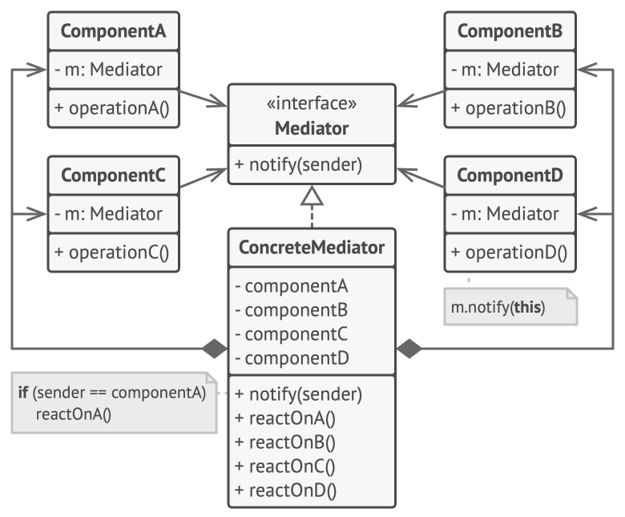

### 核心组件

1. **Mediator（中介者接口）** ：定义各个同事对象通信的接口
2. **ConcreteMediator（具体中介者）** ：实现中介者接口，协调各同事对象
3. **Colleague（同事类）** ：知道其中介者对象，通信时通过中介者转发

### 典型应用场景

1. **UI系统交互** ：多个UI元素之间的复杂交互
2. **游戏子系统通信** ：玩家、敌人、得分系统等之间的通信
3. **关卡管理** ：协调关卡中的各种元素和行为
4. **多人游戏** ：处理玩家之间的交互和同步
5. **AI系统** ：协调多个AI实体的行为决策

### 注意事项

1. **中介者可能变得复杂** ：随着系统增长，中介者可能变成"上帝对象"
2. **性能考虑** ：频繁的消息转发可能影响性能
3. **调试难度** ：间接通信可能使调试更困难
4. **合理划分职责** ：不是所有通信都需通过中介者，简单交互可直接处理

### 实际应用

基本的中介模式：

```csharp
// 中介者接口
public interface IGameMediator
{
    void Notify(object sender, string eventType);
}

// 具体中介者
public class GameController : MonoBehaviour, IGameMediator
{
    [SerializeField] private Player player;
    [SerializeField] private EnemySpawner spawner;
    [SerializeField] private UIManager ui;
  
    private void Awake()
    {
        player.SetMediator(this);
        spawner.SetMediator(this);
        ui.SetMediator(this);
    }
  
    public void Notify(object sender, string eventType)
    {
        if(sender is Player && eventType == "PlayerDied")
        {
            spawner.StopSpawning();
            ui.ShowGameOver();
        }
        else if(sender is EnemySpawner && eventType == "BossSpawned")
        {
            ui.ShowBossWarning();
        }
    }
}

// 基础同事类
public abstract class MonoBehaviourColleague : MonoBehaviour
{
    protected IGameMediator mediator;
  
    public void SetMediator(IGameMediator mediator)
    {
        this.mediator = mediator;
    }
}

// 具体同事类 - 玩家
public class Player : MonoBehaviourColleague
{
    public void Die()
    {
        mediator.Notify(this, "PlayerDied");
        gameObject.SetActive(false);
    }
}

// 具体同事类 - 敌人生成器
public class EnemySpawner : MonoBehaviourColleague
{
    public void SpawnBoss()
    {
        mediator.Notify(this, "BossSpawned");
        // 生成Boss逻辑
    }
}
```

当然，我们也可以用分层的思想来设计，或者加一个优先级：

```csharp
public class PriorityMediator : MonoBehaviour
{
    private Dictionary<string, List<Action<object>>> eventHandlers = 
        new Dictionary<string, List<Action<object>>>();
  
    public void Subscribe(string eventType, Action<object> handler, int priority = 0)
    {
        if(!eventHandlers.ContainsKey(eventType))
        {
            eventHandlers[eventType] = new List<Action<object>>();
        }
    
        eventHandlers[eventType].Insert(priority, handler);
    }
  
    public void Publish(string eventType, object data = null)
    {
        if(eventHandlers.TryGetValue(eventType, out var handlers))
        {
            foreach(var handler in handlers)
            {
                handler(data);
            }
        }
    }
}
```

## 备忘录模式

备忘录模式是一种行为设计模式，用于在不破坏封装性的前提下捕获并存储对象的内部状态，以便在需要时恢复到该状态。它常用于实现撤销/重做功能、保存游戏状态或历史记录。

当然这个模式有三种主要的实现手段：

1. 基于嵌套类的实现
   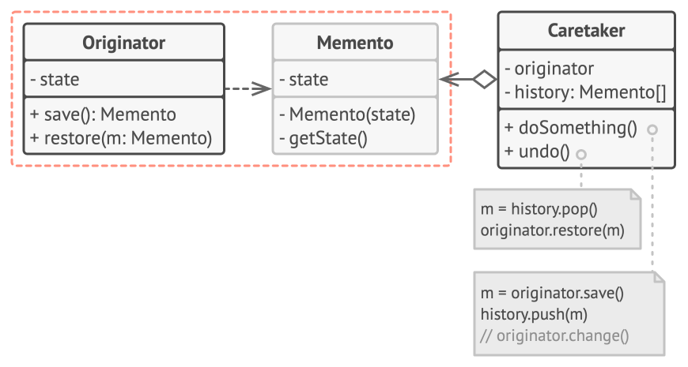
2. 基于中间接口的实现
   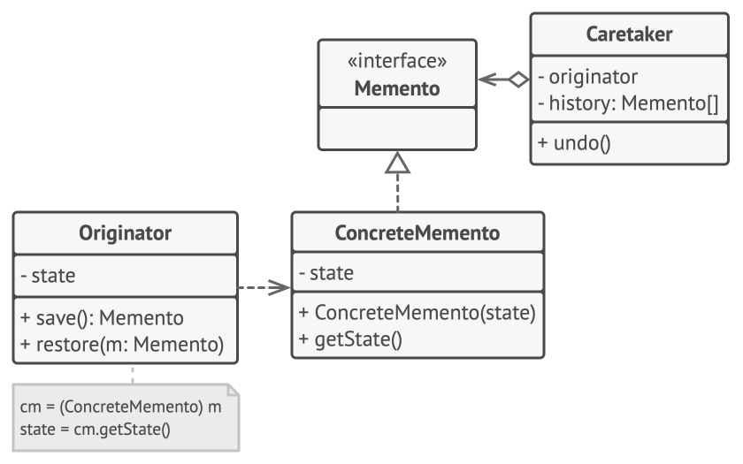
3. 严格封装的实现
   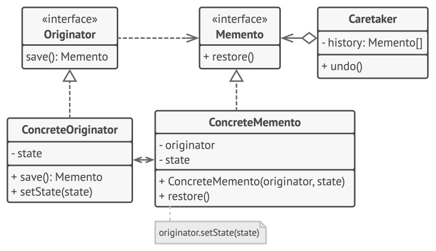

其实仔细观察就会发现，这个东西不就是前端经常用的状态存储吗...

### 核心组件

1. **Originator（发起者）** ：需要保存和恢复状态的对象，负责创建和使用备忘录。
2. **Memento（备忘录）** ：存储发起者状态的对象，通常只允许发起者访问其内部数据。
3. **Caretaker（管理者）** ：负责保存和传递备忘录，但不修改其内容。

### 典型应用场景

1. **游戏存档/读档** ：保存玩家进度（如位置、属性、库存）。
2. **撤销/重做功能** ：在关卡编辑器或游戏中支持操作回滚。
3. **时间倒流机制** ：实现游戏中的时间回溯效果。
4. **状态快照** ：记录AI或物理系统的状态以便恢复。
5. **多人游戏同步** ：保存玩家状态以同步客户端。

### 注意事项

1. **内存管理** ：大量备忘录可能占用内存，需限制历史记录数量。
2. **状态一致性** ：确保恢复状态时不会破坏游戏逻辑（如物理状态）。
3. **序列化问题** ：复杂对象的序列化可能需要额外处理。
4. **性能开销** ：频繁保存状态可能影响性能，需优化保存频率。

### 实际应用

先手写一个基础实现：

```csharp
// 备忘录类
public class Memento
{
    public Vector3 Position { get; private set; }
    public Quaternion Rotation { get; private set; }
    public float Health { get; private set; }

    public Memento(Vector3 position, Quaternion rotation, float health)
    {
        Position = position;
        Rotation = rotation;
        Health = health;
    }
}

// 发起者 - 玩家
public class Player : MonoBehaviour
{
    private Vector3 position;
    private Quaternion rotation;
    private float health;

    public Memento SaveState()
    {
        return new Memento(transform.position, transform.rotation, health);
    }

    public void RestoreState(Memento memento)
    {
        transform.position = memento.Position;
        transform.rotation = memento.Rotation;
        health = memento.Health;
    }

    // 示例：更新状态
    public void TakeDamage(float damage)
    {
        health -= damage;
    }
}

// 管理者 - 游戏管理器
public class GameManager : MonoBehaviour
{
    private Stack<Memento> mementoStack = new Stack<Memento>();
    [SerializeField] private Player player;

    public void SavePlayerState()
    {
        mementoStack.Push(player.SaveState());
    }

    public void Undo()
    {
        if (mementoStack.Count > 0)
        {
            player.RestoreState(mementoStack.Pop());
        }
    }
}
```

这么一个备忘录肯定不够用，给它加一个序列化的接口未免过于简单，我们来给他加一个时间戳的功能：

```csharp
public class TimedMemento
{
    public Memento State { get; private set; }
    public float Timestamp { get; private set; }

    public TimedMemento(Memento state, float timestamp)
    {
        State = state;
        Timestamp = timestamp;
    }
}

public class TimeRewindManager : MonoBehaviour
{
    [SerializeField] private Player player;
    private List<TimedMemento> history = new List<TimedMemento>();
    private float recordInterval = 0.5f;
    private float lastRecordTime;

    private void Update()
    {
        if (Time.time - lastRecordTime >= recordInterval)
        {
            history.Add(new TimedMemento(player.SaveState(), Time.time));
            lastRecordTime = Time.time;
        }
    }

    public void RewindTo(float targetTime)
    {
        TimedMemento target = history.FindLast(m => m.Timestamp <= targetTime);
        if (target != null)
        {
            player.RestoreState(target.State);
        }
    }
}
```

增量模式永远是最空间友好的设计，我们来试试增量备忘录：

```csharp
public class DeltaMemento
{
    public Vector3? PositionDelta { get; private set; }
    public float? HealthDelta { get; private set; }

    public DeltaMemento(Vector3? posDelta, float? hpDelta)
    {
        PositionDelta = posDelta;
        HealthDelta = hpDelta;
    }
}

public class PlayerDelta : MonoBehaviour
{
    private Vector3 lastPosition;
    private float lastHealth;

    public DeltaMemento SaveDelta()
    {
        Vector3? posDelta = transform.position != lastPosition ? transform.position - lastPosition : null;
        float? hpDelta = health != lastHealth ? health - lastHealth : null;
        lastPosition = transform.position;
        lastHealth = health;
        return new DeltaMemento(posDelta, hpDelta);
    }

    public void RestoreDelta(DeltaMemento memento)
    {
        if (memento.PositionDelta.HasValue)
        {
            transform.position -= memento.PositionDelta.Value;
            lastPosition = transform.position;
        }
        if (memento.HealthDelta.HasValue)
        {
            health -= memento.HealthDelta.Value;
            lastHealth = health;
        }
    }
}
```

## 模板方法模式

模板方法模式是一种行为设计模式，它定义了一个操作的算法骨架，将某些步骤的具体实现延迟到子类中。这种模式允许子类在不改变算法结构的情况下重定义某些步骤的行为。在Unity中，模板方法模式常用于规范化一类行为，同时允许具体实现灵活变化。

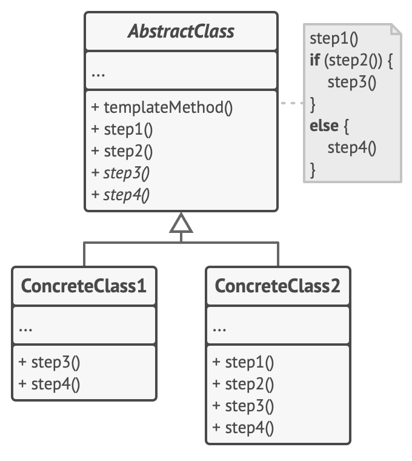

### 核心组件

1. **Abstract Class（抽象类）** ：定义模板方法（算法骨架）和抽象的步骤方法，子类需实现这些抽象方法。
2. **Concrete Class（具体类）** ：继承抽象类，实现具体的步骤逻辑。

### 典型应用场景

1. **AI行为框架** ：定义通用的AI决策流程，具体行为由子类实现（如巡逻、追击）。
2. **动画流程** ：规范化动画播放流程（如淡入、播放、淡出）。
3. **UI管理** ：统一UI显示或隐藏的流程，具体内容由子类定义。
4. **关卡初始化** ：定义关卡加载的通用步骤，具体关卡自定义细节。
5. **能力系统** ：规范技能释放流程（如冷却、执行、结束效果）。

### 注意事项

1. **过度抽象化** ：避免模板方法过于复杂，导致子类实现困难。
2. **灵活性限制** ：模板方法固定了算法结构，可能限制某些特殊需求。
3. **维护成本** ：如果算法骨架频繁变化，可能需要修改多个子类。
4. **性能考虑** ：大量虚方法调用可能影响性能(巨大的虚表)，需权衡使用场景。

### 实际应用

基本实现：

```csharp
// 抽象类 - 角色行为
public abstract class CharacterBehaviour : MonoBehaviour
{
    // 模板方法，定义算法骨架
    public void PerformAction()
    {
        Initialize();
        ExecuteAction();
        FinalizeAction();
    }

    // 固定步骤，子类不可重写
    private void Initialize()
    {
        // 通用的初始化逻辑，例如检查状态
        Debug.Log($"{name} is initializing action.");
    }

    // 抽象步骤，子类必须实现
    protected abstract void ExecuteAction();

    // 可选步骤，子类可选择性重写
    protected virtual void FinalizeAction()
    {
        Debug.Log($"{name} is finalizing action.");
    }
}

// 具体类 - 玩家
public class PlayerBehaviour : CharacterBehaviour
{
    protected override void ExecuteAction()
    {
        Debug.Log("Player is attacking with sword.");
        // 玩家特定的攻击逻辑
    }

    protected override void FinalizeAction()
    {
        Debug.Log("Player is recovering from attack.");
        // 玩家特定的结束逻辑
    }
}

// 具体类 - 敌人
public class EnemyBehaviour : CharacterBehaviour
{
    protected override void ExecuteAction()
    {
        Debug.Log("Enemy is casting spell.");
        // 敌人特定的魔法攻击逻辑
    }
}
```

模板方法本身并不复杂，而且如果被用作模板的方法是构造方法，他就变成了我们熟悉的工厂方法模式。

当然，还有很多比较高级的技巧，例如钩子方法：

```csharp
public abstract class Ability : MonoBehaviour
{
    public void Execute()
    {
        if (CanExecute())
        {
            PreExecute();
            PerformAbility();
            PostExecute();
        }
    }

    protected virtual bool CanExecute() => true; // 钩子方法，子类可覆盖
    protected abstract void PerformAbility();
    protected virtual void PreExecute() { }
    protected virtual void PostExecute() { }
}

public class FireballAbility : Ability
{
    protected override bool CanExecute()
    {
        return mana >= 10; // 检查魔法值
    }

    protected override void PerformAbility()
    {
        Debug.Log("Casting fireball!");
        // 发射火球逻辑
    }

    protected override void PreExecute()
    {
        Debug.Log("Preparing fireball cast.");
        // 播放准备动画
    }
}
```

动态步骤：

```csharp
public abstract class Weapon : MonoBehaviour
{
    public enum AttackType { Melee, Ranged }

    public void Attack(AttackType type)
    {
        PrepareAttack();
        switch (type)
        {
            case AttackType.Melee:
                PerformMeleeAttack();
                break;
            case AttackType.Ranged:
                PerformRangedAttack();
                break;
        }
        FinishAttack();
    }

    protected virtual void PrepareAttack() { }
    protected abstract void PerformMeleeAttack();
    protected abstract void PerformRangedAttack();
    protected virtual void FinishAttack() { }
}

public class Sword : Weapon
{
    protected override void PerformMeleeAttack()
    {
        Debug.Log("Swinging sword!");
    }

    protected override void PerformRangedAttack()
    {
        Debug.Log("Sword cannot perform ranged attack!");
    }
}
```

## 迭代器模式

迭代器模式是一种行为设计模式，它提供一种方法顺序访问一个聚合对象中的各个元素，而又不暴露该对象的内部表示。

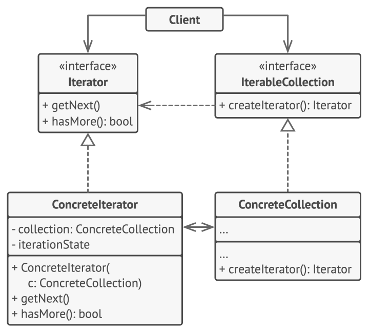

迭代器相比大家用的够多了，这里就不过多叙述。

### 核心组件

1. **Iterator（迭代器接口）** ：定义访问和遍历元素的接口
2. **ConcreteIterator（具体迭代器）** ：实现迭代器接口，跟踪当前遍历位置
3. **Aggregate（聚合接口）** ：定义创建迭代器对象的接口
4. **ConcreteAggregate（具体聚合）** ：实现聚合接口，返回具体迭代器实例

### 典型应用场景

1. **游戏对象集合遍历** ：敌人、物品、技能等集合的遍历
2. **存档系统** ：序列化和反序列化游戏数据
3. **AI决策** ：遍历可能的行动选项
4. **关卡生成** ：遍历生成规则和模板
5. **资源管理** ：遍历加载的资源
6. **UI系统** ：遍历UI元素进行批量操作

### 注意事项

1. **性能考虑** ：复杂迭代器可能带来性能开销
2. **修改集合** ：遍历过程中修改集合可能导致异常
3. **资源管理** ：IEnumerator可能需要手动释放（IDisposable）
4. **过度设计** ：简单集合直接使用foreach可能更合适

### 实际应用

C#内置迭代：

```csharp
// 自定义集合类
public class ItemInventory : IEnumerable<Item>
{
    private Item[] items;
  
    public ItemInventory(params Item[] items)
    {
        this.items = items;
    }
  
    public IEnumerator<Item> GetEnumerator()
    {
        for(int i = 0; i < items.Length; i++)
        {
            yield return items[i];
        }
    }
  
    IEnumerator IEnumerable.GetEnumerator()
    {
        return GetEnumerator();
    }
}

// 使用示例
void ProcessInventory()
{
    ItemInventory inventory = new ItemInventory(item1, item2, item3);
  
    foreach(Item item in inventory)
    {
        // 处理每个物品
    }
}
```

当然，最重要的地方其实是数据结构，迭代只是一个工具，除了基本的应用，工具的拓展也是很重要的，例如过滤迭代器：

```csharp
public class FilterIterator<T> : IIterator<T>
{
    private IIterator<T> iterator;
    private Predicate<T> predicate;
    private T current;
  
    public FilterIterator(IIterator<T> iterator, Predicate<T> predicate)
    {
        this.iterator = iterator;
        this.predicate = predicate;
    }
  
    public bool HasNext()
    {
        while(iterator.HasNext())
        {
            current = iterator.Next();
            if(predicate(current))
            {
                return true;
            }
        }
        return false;
    }
  
    public T Next()
    {
        return current;
    }
  
    public void Reset()
    {
        iterator.Reset();
    }
}

// 使用示例：只遍历血量低于50%的敌人
var baseIterator = enemyCollection.CreateIterator();
var filterIterator = new FilterIterator<Enemy>(baseIterator, e => e.Health < e.MaxHealth * 0.5f);
```

复合迭代器：

```csharp
public class CompositeIterator : IIterator<GameObject>
{
    private Stack<IIterator<GameObject>> stack = new Stack<IIterator<GameObject>>();
  
    public CompositeIterator(IIterator<GameObject> iterator)
    {
        stack.Push(iterator);
    }
  
    public bool HasNext()
    {
        if(stack.Count == 0) return false;
    
        var iterator = stack.Peek();
        if(!iterator.HasNext())
        {
            stack.Pop();
            return HasNext();
        }
        return true;
    }
  
    public GameObject Next()
    {
        if(!HasNext()) return null;
    
        var iterator = stack.Peek();
        var component = iterator.Next();
    
        if(component.transform.childCount > 0)
        {
            stack.Push(new TransformIterator(component.transform));
        }
    
        return component;
    }
}

public class TransformIterator : IIterator<GameObject>
{
    private Transform parent;
    private int currentIndex = 0;
  
    public TransformIterator(Transform parent)
    {
        this.parent = parent;
    }
  
    public bool HasNext()
    {
        return currentIndex < parent.childCount;
    }
  
    public GameObject Next()
    {
        return parent.GetChild(currentIndex++).gameObject;
    }
}
```

## 状态模式

状态模式是一种行为设计模式，它允许对象在内部状态改变时改变其行为，使其看起来像是更改了对象的类。状态模式通过将每个状态封装为单独的类来管理复杂的状态转换逻辑，特别适合需要根据状态执行不同行为的场景。在Unity中，状态模式常用于AI、角色行为或游戏系统管理。

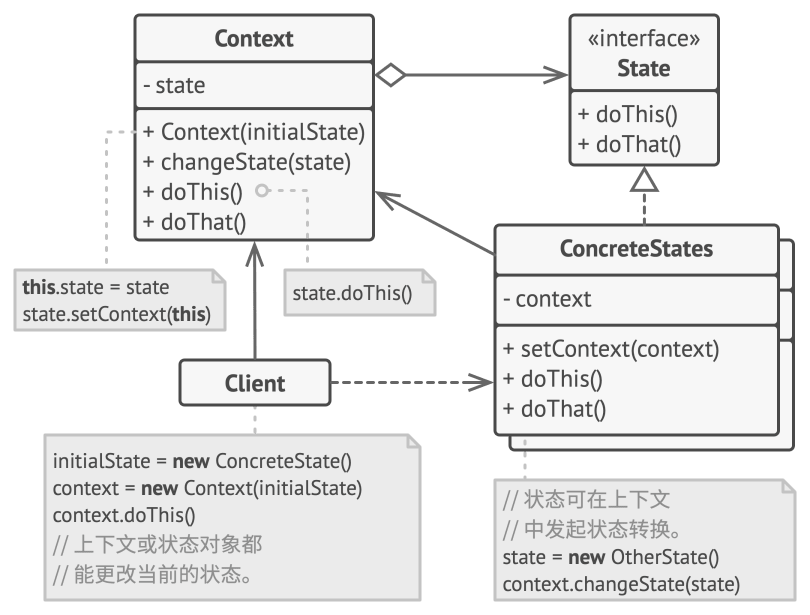

### 核心组件

1. **Context（上下文）** ：持有当前状态并提供接口供客户端调用。
2. **State（状态接口/抽象类）** ：定义状态的行为接口。
3. **Concrete State（具体状态）** ：实现特定状态下的行为。

### 典型应用场景

1. **AI行为** ：管理敌人AI的状态（如巡逻、追击、攻击、逃跑）。
2. **角色控制器** ：处理玩家状态（如闲置、跑步、跳跃、攻击）。
3. **游戏流程** ：控制游戏状态（如菜单、游戏中、暂停、结束）。
4. **动画管理** ：根据状态驱动动画状态机。
5. **UI交互** ：管理UI面板的状态（如打开、关闭、过渡）。

### 注意事项

1. **状态爆炸** ：状态过多可能导致类数量激增，需合理规划状态。
2. **转换复杂性** ：复杂的状态转换逻辑可能使调试困难，建议使用状态图辅助设计。
3. **性能开销** ：频繁的状态切换可能影响性能，需优化切换频率。
4. **状态依赖** ：避免状态之间直接依赖，保持状态独立性。

### 实际应用

最熟悉的，莫过于AI状态机了：

```csharp
// 状态接口
public interface IEnemyState
{
    void Handle(EnemyAI context);
}

// 上下文 - 敌人AI
public class EnemyAI : MonoBehaviour
{
    private IEnemyState currentState;
    [SerializeField] private Transform player;
    [SerializeField] private float detectionRange = 10f;

    private void Start()
    {
        SetState(new PatrolState());
    }

    private void Update()
    {
        currentState?.Handle(this);
    }

    public void SetState(IEnemyState newState)
    {
        currentState = newState;
    }

    public bool IsPlayerInRange()
    {
        return Vector3.Distance(transform.position, player.position) <= detectionRange;
    }

    public void MoveTo(Vector3 position)
    {
        // 移动逻辑
        Debug.Log($"Moving to {position}");
    }
}

// 具体状态 - 巡逻
public class PatrolState : IEnemyState
{
    public void Handle(EnemyAI context)
    {
        // 巡逻逻辑
        Debug.Log("Patrolling...");
        if (context.IsPlayerInRange())
        {
            context.SetState(new ChaseState());
        }
    }
}

// 具体状态 - 追击
public class ChaseState : IEnemyState
{
    public void Handle(EnemyAI context)
    {
        Debug.Log("Chasing player!");
        // 追击玩家逻辑
        context.MoveTo(context.player.position);
        if (!context.IsPlayerInRange())
        {
            context.SetState(new PatrolState());
        }
    }
}
```

加一个优先级也是可以的：

```csharp
public class PriorityStateMachine : MonoBehaviour
{
    private Dictionary<int, ICharacterState> states = new Dictionary<int, ICharacterState>();
    private int currentPriority = -1;

    public void AddState(int priority, ICharacterState state)
    {
        states[priority] = state;
    }

    public void TryTransition(int priority, Character context)
    {
        if (priority > currentPriority)
        {
            if (states.TryGetValue(currentPriority, out var oldState))
            {
                oldState.Exit(context);
            }
            states[priority].Enter(context);
            currentPriority = priority;
        }
    }

    private void Update()
    {
        if (states.TryGetValue(currentPriority, out var state))
        {
            state.Update(this.GetComponent<Character>());
        }
    }
}
```

## 责任链模式

责任链模式是一种行为设计模式，它通过将请求沿着一条处理链传递，直到某个处理者能够处理该请求为止。这种模式允许多个对象有机会处理请求，避免了请求发送者和接收者之间的直接耦合。在Unity中，责任链模式常用于处理事件、输入或复杂逻辑的分发。

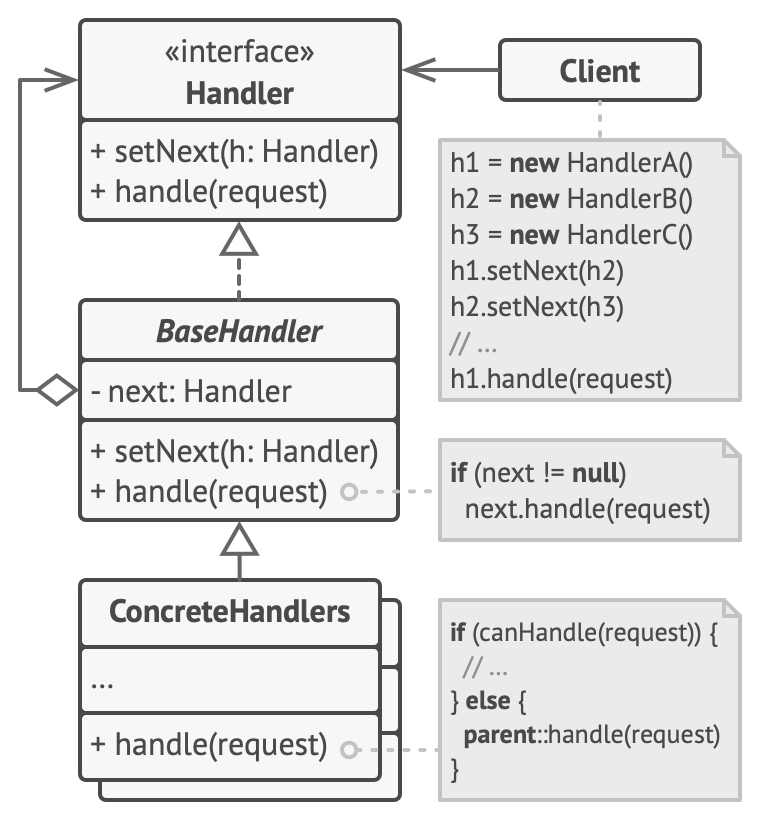

### 核心组件

1. **Handler（处理者接口/抽象类）** ：定义处理请求的接口和指向下一个处理者的引用。
2. **Concrete Handler（具体处理者）** ：实现具体的处理逻辑，并决定是否将请求传递给下一个处理者。
3. **Client（客户端）** ：发起请求并将其发送到责任链的起点。

### 典型应用场景

1. **输入处理**：处理键盘、鼠标或触摸输入，分配给不同系统。
2. **事件分发**：游戏事件（如敌人死亡、关卡完成）分发到相关系统。
3. **UI交互**：处理UI点击事件，逐层传递直到被处理。
4. **AI决策**：AI行为请求按优先级分发到不同决策模块。
5. **日志系统**：按级别或类型分发日志消息到不同处理器。

### 注意事项

1. **链的长度**：过长的责任链可能导致性能问题，需优化处理者数量。
2. **未处理请求**：确保有默认处理或警告机制，避免请求被忽略。
3. **循环引用**：避免责任链中出现循环引用，需仔细设计链结构。
4. **调试复杂性**：责任链可能使事件流难以跟踪，建议记录日志。

### 实际应用

```csharp
// 处理者接口
public interface IEventHandler
{
    IEventHandler Next { get; set; }
    bool HandleEvent(string eventType, object data);
}

// 抽象处理者
public abstract class BaseEventHandler : MonoBehaviour, IEventHandler
{
    public IEventHandler Next { get; set; }

    public virtual bool HandleEvent(string eventType, object data)
    {
        // 如果当前处理者无法处理，传递给下一个
        return Next != null && Next.HandleEvent(eventType, data);
    }
}

// 具体处理者 - UI事件
public class UIEventHandler : BaseEventHandler
{
    public override bool HandleEvent(string eventType, object data)
    {
        if (eventType == "ShowUI")
        {
            Debug.Log("Showing UI: " + data);
            return true;
        }
        return base.HandleEvent(eventType, data);
    }
}

// 具体处理者 - 玩家事件
public class PlayerEventHandler : BaseEventHandler
{
    public override bool HandleEvent(string eventType, object data)
    {
        if (eventType == "PlayerHit")
        {
            Debug.Log("Player takes damage: " + data);
            return true;
        }
        return base.HandleEvent(eventType, data);
    }
}

// 客户端 - 事件分发器
public class EventDispatcher : MonoBehaviour
{
    [SerializeField] private BaseEventHandler firstHandler;

    private void Start()
    {
        // 设置责任链
        UIEventHandler uiHandler = gameObject.AddComponent<UIEventHandler>();
        PlayerEventHandler playerHandler = gameObject.AddComponent<PlayerEventHandler>();
        uiHandler.Next = playerHandler;
        firstHandler = uiHandler;
    }

    public void DispatchEvent(string eventType, object data)
    {
        if (!firstHandler.HandleEvent(eventType, data))
        {
            Debug.LogWarning("No handler processed the event: " + eventType);
        }
    }
}
```

异步责任链：

```csharp
public interface IAsyncHandler
{
    IAsyncHandler Next { get; set; }
    System.Threading.Tasks.Task<bool> HandleAsync(string eventType, object data);
}

public abstract class BaseAsyncHandler : MonoBehaviour, IAsyncHandler
{
    public IAsyncHandler Next { get; set; }

    public virtual async System.Threading.Tasks.Task<bool> HandleAsync(string eventType, object data)
    {
        if (Next != null)
        {
            return await Next.HandleAsync(eventType, data);
        }
        return false;
    }
}

public class AsyncTaskHandler : BaseAsyncHandler
{
    public override async System.Threading.Tasks.Task<bool> HandleAsync(string eventType, object data)
    {
        if (eventType == "AsyncTask")
        {
            Debug.Log("Processing async task: " + data);
            await System.Threading.Tasks.Task.Delay(1000); // 模拟异步操作
            return true;
        }
        return await base.HandleAsync(eventType, data);
    }
}

public class AsyncEventDispatcher : MonoBehaviour
{
    [SerializeField] private BaseAsyncHandler firstHandler;

    public async System.Threading.Tasks.Task DispatchAsync(string eventType, object data)
    {
        if (!await firstHandler.HandleAsync(eventType, data))
        {
            Debug.LogWarning("No handler processed async event: " + eventType);
        }
    }
}
```

## 解释器模式

解释器模式是一种行为设计模式，用于为语言的文法定义表示，并提供一个解释器来处理该文法中的表达式。它通常用于解析和执行特定领域的语言或规则。在Unity中，解释器模式可以用于处理自定义脚本、规则系统或游戏逻辑的动态解析。

不过话说回来，这个模式好像有的书里面有，有的书里面没有，让人挺迷惑的。

### 核心组件

1. **Abstract Expression（抽象表达式）** ：定义解释方法的接口，声明所有具体表达式的公共操作。
2. **Terminal Expression（终结符表达式）** ：实现文法中的终结符（基本元素）对应的解释操作。
3. **Nonterminal Expression（非终结符表达式）** ：实现文法中的非终结符（复合元素）对应的解释操作，通常包含其他表达式的引用。
4. **Context（上下文）** ：包含解释器需要的全局信息，供表达式使用。
5. **Client（客户端）** ：构建抽象语法树（AST）并调用解释操作。

### 典型应用场景

1. **脚本系统** ：解析简单的脚本语言以控制游戏对象行为。
2. **关卡逻辑** ：通过配置文件定义关卡规则或触发器逻辑。
3. **AI行为树** ：解释行为树的节点逻辑。
4. **命令系统** ：处理玩家输入的命令（如控制台命令）。
5. **动画触发器** ：根据条件解析动画播放规则。

### 注意事项

1. **性能开销** ：解释器模式可能因频繁解析而影响性能，需优化表达式树。
2. **复杂性** ：文法过于复杂可能导致表达式类激增，需简化设计。
3. **调试困难** ：动态解析的逻辑可能难以跟踪，建议添加详细日志。
4. **适用场景** ：解释器模式适合小型、特定领域的语言，不适合复杂脚本引擎。

### 实际应用

基本的文法分析：

```csharp
// 上下文
public class GameContext
{
    public Dictionary<string, float> variables = new Dictionary<string, float>();
    public GameObject target;

    public GameContext(GameObject target)
    {
        this.target = target;
    }
}

// 抽象表达式
public interface IExpression
{
    void Interpret(GameContext context);
}

// 终结符表达式 - 设置变量
public class SetVariableExpression : IExpression
{
    private string variableName;
    private float value;

    public SetVariableExpression(string variableName, float value)
    {
        this.variableName = variableName;
        this.value = value;
    }

    public void Interpret(GameContext context)
    {
        context.variables[variableName] = value;
        Debug.Log($"Set {variableName} to {value}");
    }
}

// 非终结符表达式 - 移动物体
public class MoveExpression : IExpression
{
    private IExpression positionX;
    private IExpression positionY;
    private IExpression positionZ;

    public MoveExpression(IExpression x, IExpression y, IExpression z)
    {
        positionX = x;
        positionY = y;
        positionZ = z;
    }

    public void Interpret(GameContext context)
    {
        positionX.Interpret(context);
        positionY.Interpret(context);
        positionZ.Interpret(context);

        float x = context.variables.GetValueOrDefault("x");
        float y = context.variables.GetValueOrDefault("y");
        float z = context.variables.GetValueOrDefault("z");

        context.target.transform.position = new Vector3(x, y, z);
        Debug.Log($"Moved {context.target.name} to ({x}, {y}, {z})");
    }
}

// 客户端 - 命令解析器
public class CommandInterpreter : MonoBehaviour
{
    [SerializeField] private GameObject targetObject;

    private void Start()
    {
        GameContext context = new GameContext(targetObject);

        // 构建表达式树：移动物体到(5, 0, 5)
        IExpression moveCommand = new MoveExpression(
            new SetVariableExpression("x", 5f),
            new SetVariableExpression("y", 0f),
            new SetVariableExpression("z", 5f)
        );

        // 执行解释
        moveCommand.Interpret(context);
    }
}
```

SO是个好东西 x3:

```csharp
// 上下文
public class ScriptableContext
{
    public Dictionary<string, object> variables = new Dictionary<string, object>();
    public GameObject target;

    public ScriptableContext(GameObject target)
    {
        this.target = target;
    }
}

// 抽象表达式（ScriptableObject）
[CreateAssetMenu(menuName = "Expressions/BaseExpression")]
public abstract class ExpressionSO : ScriptableObject
{
    public abstract void Interpret(ScriptableContext context);
}

// 终结符表达式 - 设置速度
[CreateAssetMenu(menuName = "Expressions/SetSpeedExpression")]
public class SetSpeedExpressionSO : ExpressionSO
{
    public float speed;

    public override void Interpret(ScriptableContext context)
    {
        context.variables["speed"] = speed;
        Debug.Log($"Set speed to {speed}");
    }
}

// 非终结符表达式 - 移动
[CreateAssetMenu(menuName = "Expressions/MoveExpression")]
public class MoveExpressionSO : ExpressionSO
{
    public ExpressionSO speedExpression;

    public override void Interpret(ScriptableContext context)
    {
        speedExpression.Interpret(context);
        float speed = (float)context.variables.GetValueOrDefault("speed", 0f);
        context.target.transform.Translate(Vector3.forward * speed * Time.deltaTime);
        Debug.Log($"Moving {context.target.name} with speed {speed}");
    }
}

// 客户端 - 脚本解析器
public class ScriptParser : MonoBehaviour
{
    [SerializeField] private GameObject targetObject;
    [SerializeField] private ExpressionSO moveCommand;

    private void Update()
    {
        ScriptableContext context = new ScriptableContext(targetObject);
        moveCommand.Interpret(context);
    }
}
```

来写个编程语言！（其实只是	DSL）

```csharp
public class CommandParser : MonoBehaviour
{
    [SerializeField] private GameObject targetObject;

    private void Start()
    {
        GameContext context = new GameContext(targetObject);
        string command = "move 5 0 5"; // 示例命令

        IExpression expression = ParseCommand(command);
        expression?.Interpret(context);
    }

    private IExpression ParseCommand(string command)
    {
        string[] parts = command.Split(' ');
        if (parts[0] == "move" && parts.Length == 4)
        {
            float x = float.Parse(parts[1]);
            float y = float.Parse(parts[2]);
            float z = float.Parse(parts[3]);
            return new MoveExpression(
                new SetVariableExpression("x", x),
                new SetVariableExpression("y", y),
                new SetVariableExpression("z", z)
            );
        }
        return null;
    }
}
```

## 访问者模式

访问者模式是一种行为设计模式，它允许你将算法与对象结构分离，在不修改现有对象结构的情况下定义新的操作。

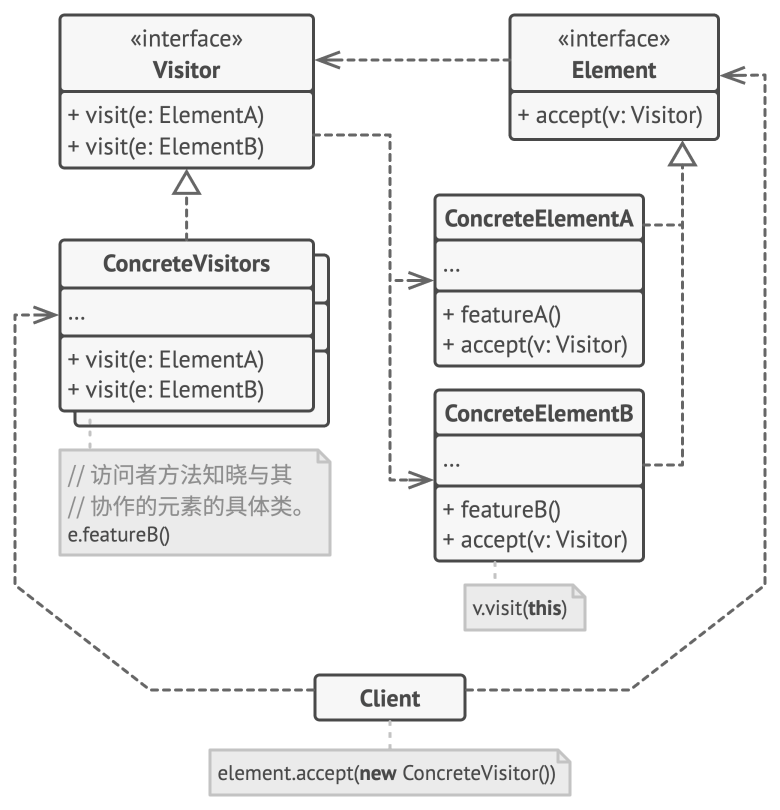

也就是所谓的"见人说人话，见鬼说鬼话"。

### 核心组件

1. **Visitor（访问者接口）** ：声明一组访问方法，每个方法对应一个具体元素类
2. **ConcreteVisitor（具体访问者）** ：实现访问者接口的各个操作
3. **Element（元素接口）** ：声明接受访问者的方法
4. **ConcreteElement（具体元素）** ：实现接受方法，调用访问者的对应方法
5. **ObjectStructure（对象结构）** ：维护元素集合，提供遍历接口

### 典型应用场景

1. **存档系统** ：遍历游戏对象并保存状态
2. **伤害计算** ：对不同实体应用不同伤害逻辑
3. **AI行为** ：对游戏世界中的实体进行不同分析
4. **编辑器工具** ：对场景对象执行批量操作
5. **渲染系统** ：对不同对象应用不同渲染策略
6. **成就系统** ：检查游戏对象状态解锁成就

### 注意事项

1. **破坏封装** ：访问者可能需要访问元素内部状态
2. **元素接口变更** ：添加新元素类型需要修改所有访问者
3. **性能考虑** ：频繁使用访问者可能带来性能开销
4. **适用场景** ：适合稳定的元素结构和频繁变更的操作

### 实际应用

```csharp
// 元素接口
public interface IGameElement
{
    void Accept(IGameVisitor visitor);
}

// 具体元素 - 敌人
public class Enemy : MonoBehaviour, IGameElement
{
    public int Health = 100;
    public int Damage = 10;
  
    public void Accept(IGameVisitor visitor)
    {
        visitor.VisitEnemy(this);
    }
}

// 具体元素 - 物品
public class Item : MonoBehaviour, IGameElement
{
    public string ItemName;
    public int Value;
  
    public void Accept(IGameVisitor visitor)
    {
        visitor.VisitItem(this);
    }
}

// 访问者接口
public interface IGameVisitor
{
    void VisitEnemy(Enemy enemy);
    void VisitItem(Item item);
}

// 具体访问者 - 伤害计算
public class DamageVisitor : IGameVisitor
{
    public void VisitEnemy(Enemy enemy)
    {
        enemy.Health -= 20;
        Debug.Log($"对敌人造成20点伤害，剩余血量：{enemy.Health}");
    }
  
    public void VisitItem(Item item)
    {
        Debug.Log($"物品 {item.ItemName} 不受伤害影响");
    }
}

// 具体访问者 - 保存系统
public class SaveVisitor : IGameVisitor
{
    public void VisitEnemy(Enemy enemy)
    {
        PlayerPrefs.SetInt("EnemyHealth", enemy.Health);
    }
  
    public void VisitItem(Item item)
    {
        PlayerPrefs.SetString(item.ItemName, item.Value.ToString());
    }
}

// 使用示例
public class GameManager : MonoBehaviour
{
    private List<IGameElement> gameElements = new List<IGameElement>();
  
    void Start()
    {
        // 收集场景中的所有游戏元素
        gameElements.AddRange(FindObjectsOfType<Enemy>());
        gameElements.AddRange(FindObjectsOfType<Item>());
    
        // 应用伤害访问者
        ApplyVisitor(new DamageVisitor());
    
        // 应用保存访问者
        ApplyVisitor(new SaveVisitor());
    }
  
    void ApplyVisitor(IGameVisitor visitor)
    {
        foreach(var element in gameElements)
        {
            element.Accept(visitor);
        }
    }
}
```

不难看出来，这个东西其实就类似我们常说的批处理。用Component实现一个：

```csharp
public abstract class GameVisitorComponent : MonoBehaviour
{
    public abstract void Visit(GameObject gameObject);
}

public class ElementComponent : MonoBehaviour
{
    void OnTriggerEnter(Collider other)
    {
        var visitor = other.GetComponent<GameVisitorComponent>();
        if(visitor != null)
        {
            visitor.Visit(gameObject);
        }
    }
}

// 具体访问者组件
public class FreezeVisitor : GameVisitorComponent
{
    public override void Visit(GameObject gameObject)
    {
        var enemy = gameObject.GetComponent<Enemy>();
        if(enemy != null)
        {
            enemy.Freeze();
        }
    }
}
```

最简单的还是事件

```csharp
public class EventBasedVisitor : MonoBehaviour
{
    public UnityEvent<Enemy> OnVisitEnemy;
    public UnityEvent<Item> OnVisitItem;
  
    public void Accept(IGameElement element)
    {
        element.Accept(this);
    }
  
    public void VisitEnemy(Enemy enemy)
    {
        OnVisitEnemy.Invoke(enemy);
    }
  
    public void VisitItem(Item item)
    {
        OnVisitItem.Invoke(item);
    }
}

// 在Inspector中配置事件响应
```
