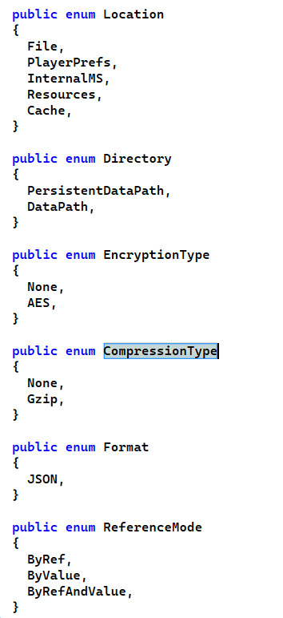
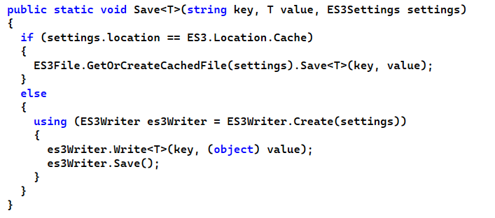

# 本地存储

## Player Prefs路径

Windows：
在【开始】页面输入Regedit查看注册表寻找 **HKEY_CURRENT_USER/Software/CompanyName/AppName**

Mac:
~/Library/Preferences/BundleId.plist

Android:
/data/data/AppName/shared_prefs/AppName.xml

iOS:
/Apps/AppName/Library/Preferences/AppName.plist

## Application.dataPath

项目目录的Assets文件夹

Windows & Mac:
./Assets

Android:
data/app/BundleId.apk

iOS:
/private/var/mobile/Containers/Bundle/Application/随机码/AppName.app/Data

## Application.streamingAssetsPath

流媒体文件夹(.mp4等)

Windows & Mac:
./Assets/StreamingAssets/

Android:
jar:file:///data/app/BundleId.apk/assets

iOS:
/private/var/mobile/Containers/Bundle/Application/随机码/AppName.app/Data/Raw

## Application.persistentDataPath

持久化路径，在用户文件夹里，不会因为删除游戏而删除该文件

Windows:
/Users/UserName/AppData/LocalLow/CompanyName/AppName

Mac:
/Users/UserName/Library/Application Support/AppName/

Android:
data/data/BundleId/files

iOS:
/var/mobile/Containers/Bundle/Application/随机码/Documents

## Application.temporaryCachePath

寄存文件夹，用于快速读写，按照操作系统策略不定时清空

Windows:
/Users/UserName/AppData/Local/Temp/CompanyName/AppName

Mac:
/var/folders/随机路径/CompanyName/AppName

Android:
/data/data/BundleId/cache

iOS: /var/mobile/Containers/Data/Application/随机码/Library/Caches

# 云端存储

反编译了一下EasySave的源代码：



不难发现，EasySave3采用的默认策略就是通过AES加密json文件，然后存储到对应的文件夹。

对于各种UnityEngine的类型，用特殊的数据结构来封装后存储

对于各种嵌套的数据，用序列化的属性标记再集中处理即可。

至于为什么EasySave会比PlayerPrefs更快，我觉得很大可能是因为这个：



ES3在大量存储这方面做了个优化，存储数据的时候用Cache进行缓存然后集中读写。当然这种加密过后地数据已经非常安全了，完全可以直接上传到云端，也不用担心有人乱传。

然而，最近在接入Steam平台云存档的时候偶然发现，为了防止游戏本体被破解之后，顺着steam的API来刷成就，可以在上传云存档的时候进行二次加密：

```csharp
    public static bool Save(int saveSlotID)
    {
      return SaveData(saveSlotID);

      static bool SaveData(int saveSlotID)
      {
        try
        {
          return PlatformConnector.Save(string.Format(SaveManager.SaveFileFormat, (object) saveSlotID), EncryptProvider.Encrypt(JsonConvert.SerializeObject((object) Singleton<DataRepositoryManager>.Instance.GetRepositoryDataToSave())));
        }
        catch (Exception ex)
        {
          CustomErrorException customErrorException = !(ex is CustomErrorException) ? new CustomErrorException(ex.Message, new CustomErrorData(ErrorCode.SaveFile_Save_Failed, ErrorSeverity.Error)) : throw ex;
          return false;
        }
      }
    }
```

然后就可以自己快乐地造轮子啦！

```csharp
// Rijndael算法
public static class EncryptProvider
  {
    private const string PrivateKey = "(H+MbQeThWmZq4t7";

    public static string Encrypt(string textToEncrypt, string key = null)
    {
      if (key == null || key.Length <= 0)
        key = "(H+MbQeThWmZq4t7";
      byte[] bytes = Encoding.UTF8.GetBytes(textToEncrypt);
      byte[] inArray = EncryptProvider.CreateRijndaelManaged().CreateEncryptor().TransformFinalBlock(bytes, 0, bytes.Length);
      return Convert.ToBase64String(inArray, 0, inArray.Length);
    }

    public static string Decrypt(string textToDecrypt, string key = null)
    {
      if (key == null || key.Length <= 0)
        key = "(H+MbQeThWmZq4t7";
      byte[] inputBuffer = Convert.FromBase64String(textToDecrypt);
      return Encoding.UTF8.GetString(EncryptProvider.CreateRijndaelManaged().CreateDecryptor().TransformFinalBlock(inputBuffer, 0, inputBuffer.Length));
    }

    private static RijndaelManaged CreateRijndaelManaged()
    {
      byte[] bytes = Encoding.UTF8.GetBytes("(H+MbQeThWmZq4t7");
      RijndaelManaged rijndaelManaged = new RijndaelManaged();
      byte[] numArray = new byte[16];
      byte[] destinationArray = numArray;
      Array.Copy((Array) bytes, 0, (Array) destinationArray, 0, 16);
      rijndaelManaged.Key = numArray;
      rijndaelManaged.Mode = CipherMode.ECB;
      rijndaelManaged.Padding = PaddingMode.PKCS7;
      return rijndaelManaged;
    }
  }
```

就这样喵~
