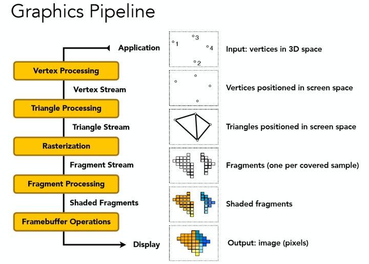

## GPU阶段(几何阶段、光栅化阶段、像素阶段)

GPU渲染管线由许多步骤组成，比如 **顶点处理** **、** **图元装配及光栅化** **、** **片元处理** **、输出合并**等。

### 顶点处理

**顶点着色器（Vertex Shader）**

顶点着色器的处理单位是顶点，也就是说，输入进来的 **每个顶点都会调用一次顶点着色器** **。**它主要执行**坐标转换**和**逐顶点着色**的任务。

 坐标转换是将顶点坐标从模型空间转换到齐次裁剪空间中 ，它是通过MVP(Model、View、Projection)转换得到的。

> ·Model 矩阵 ： 用于施加世界变换，将一个“快递盒子”里的模型拿出来，摆到场景中。
>
> ·View 矩阵：处于对裁剪的考虑，将整个世界进行移动（所以才要对每个顶点施加变换），永远保证**相机/观察视**口位于原点。
>
> ·Projection 矩阵：一般我们会使用类似绘画创作的透视作图来渲染一幅画面，Projection矩阵用于将整个相机录入的空间（视图空间）“拍”到相机的一个二维平面上（正交投影）。但是为了考虑透视，我们的整个观察的区间并不是四棱柱，而是一个类似棱台的形状，此时需要把较远的一段压扁，变成一个四棱柱，再“拍”到二维上（透视投影）。

逐顶点着色，也叫高洛德着色(Gouraud Shading)，得到的光照结果比较不自然，所以一般是在片元着色器中进行光照计算（使用Phong着色）。
