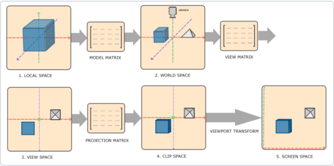
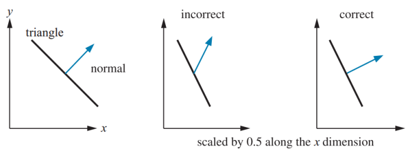
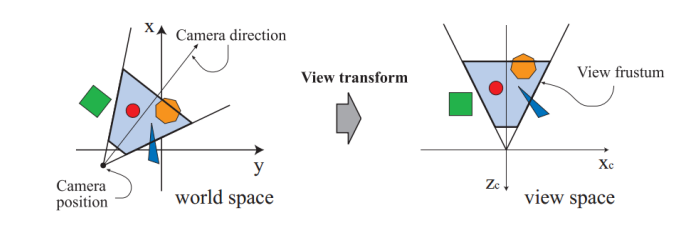
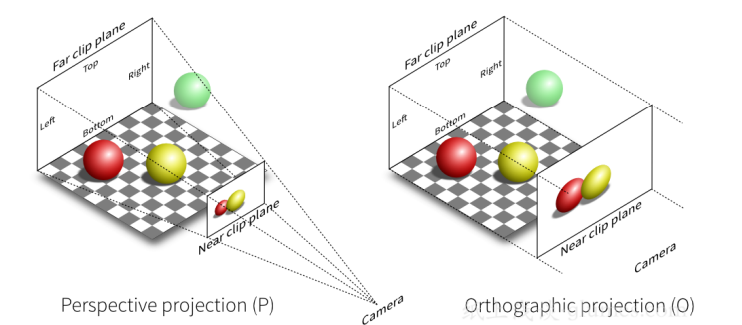
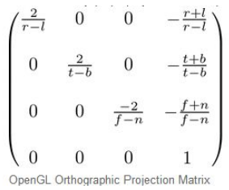
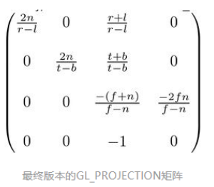

今天我们接着来说说GPU的几个阶段。

## GPU阶段(几何阶段、光栅化阶段、像素阶段)

GPU渲染管线由许多步骤组成，比如 **顶点处理** **、** **图元装配及光栅化** **、** **片元处理** **、输出合并**等。


### 顶点处理

#### 顶点着色器（Vertex Shader）

顶点着色器的处理单位是顶点，也就是说，输入进来的 **每个顶点都会调用一次顶点着色器** **。**它主要执行**坐标转换**和**逐顶点着色**的任务。

 坐标转换是将顶点坐标从模型空间转换到齐次裁剪空间中 ，它是通过MVP(Model、View、Projection)转换得到的。

> ·Model 矩阵 ： 用于施加世界变换，将一个“快递盒子”里的模型拿出来，摆到场景中。
>
> ·View 矩阵：处于对裁剪的考虑，将整个世界进行移动（所以才要对每个顶点施加变换），永远保证**相机/观察视**口位于原点。
>
> ·Projection 矩阵：一般我们会使用类似绘画创作的透视作图来渲染一幅画面，Projection矩阵用于将整个相机录入的空间（视图空间）“拍”到相机的一个二维平面上（正交投影）。但是为了考虑透视，我们的整个观察的区间并不是四棱柱，而是一个类似棱台的形状，此时需要把较远的一段压扁，变成一个四棱柱，再“拍”到二维上（透视投影）。

咱们先来看看理论：

我们从建模工具得到的是物体的局部坐标(Local Coordinate)，就好像把手办装到一个快递盒子；局部坐标通过模型矩阵Model变换到世界坐标(World Coordinate)，把手办从盒子里拿出来，摆放到场景中；世界坐标通过观察矩阵View变换到观察坐标(View Coordinate)；观察坐标经过投影矩阵Projection变换到裁剪坐标(Clip Coordinate)；裁剪坐标经过透射除法(Perspective Division)得到标准设备空间(Normalized Device Coordinates，NDC)；NDC坐标通过视口变换(Viewport Transformation)变换到窗口坐标进行显示。



光照计算一般都是在世界空间进行的，所以输入的顶点坐标需要通过乘以模型矩阵变换到世界空间。如果物体变换有非均匀缩放，那么在变换法线时就要注意了。我们不能简单的通过乘以模型矩阵来将法线变换到世界空间。下图展示了法线变换可能产生的问题。如果只是存在平移变换(Translation)我们无需对法线进行变换；如果只存在平移和旋转变换(Rotation)我们只需要乘上渲染矩阵；如果存在非均匀缩放变换(Scaling)我们需要使用矩阵的逆的转置来变换法线。关于该过程的推导可以参考[OpenGL Normal VectorTransformation](v)这篇文章。



虚拟摄像机定义了我们的观察空间。世界空间和观察空间的关系如下所示，虚拟摄像机的位置是坐标的原点，观察方向沿着Z轴的负方向。我们可以通过摄像机的位置EyePosition、观察目标点FocusPosition和向上的方向向量UpDirection来构建观察矩阵。OpenGL和DIrectX都有对应的API。该方法的实现比较简单，只需要通过两次向量的叉乘就可以构建该矩阵。



介绍裁剪空间之前，我们需要先来看一个重要的概念：视椎体(Frustum)。视椎体可以通过
上下左右远近六个平面来定义。我们通过投影矩阵将物体从观察空间变换到裁剪空间，裁
剪空间是一个以原点为中心的立方体，不在该裁剪空间的图元都会被裁剪。根据投影方式
的不一样，我们可以定义不同的投影矩阵，常见的投影方法有：正交投影和透视投影。两
种不同投影对应的视椎体如下图所示。我们可以看到正交投影的视椎体是长方体，而透视
投影的视椎体是台体。我们可以通过近平面(Near)、远平面(Far)、垂直视场角(Vertical
Field of View， FOV)和屏幕纵横比(Aspect Ratio，也叫作屏幕宽高比)四个参数来定义视
椎体。



当然，代码是少不了的：

```cpp
// View 矩阵构造
Eigen::Matrix4f get_view_matrix(Eigen::Vector3f eye_pos)
{
    Eigen::Matrix4f view = Eigen::Matrix4f::Identity();

    Eigen::Matrix4f translate;
    translate << 1, 0, 0, -eye_pos[0], 0, 1, 0, -eye_pos[1], 0, 0, 1,
        -eye_pos[2], 0, 0, 0, 1;

    view = translate * view;

    return view;
}

// model矩阵构造
Eigen::Matrix4f get_model_matrix(float rotation_angle)
{
    Eigen::Matrix4f model = Eigen::Matrix4f::Identity();

    float angle = rotation_angle * MY_PI / 180.0f;
    Eigen::Matrix4f rotation;
    rotation << cos(angle), -sin(angle), 0, 0,
        sin(angle), cos(angle), 0, 0,
        0, 0, 1, 0,
        0, 0, 0, 1;

    model = rotation * model;
    return model;
}

// projection 矩阵构造（透视变换）
Eigen::Matrix4f get_projection_matrix(float eye_fov, float aspect_ratio,
                                      float zNear, float zFar)
{
    Eigen::Matrix4f projection = Eigen::Matrix4f::Identity();

    Eigen::Matrix4f persp_to_ortho, ortho_scale, ortho_translate;
    float t = tan(eye_fov / 2.0f * MY_PI / 180.0f) * zNear;
    float r = t * aspect_ratio;
    float l = -r;
    float b = -t;
    float n = zNear;
    float f = zFar;

    // 透视空间压缩到正交空间
    persp_to_ortho << n, 0, 0, 0,
        0, n, 0, 0,
        0, 0, f + n, -f * n,
        0, 0, 1, 0;

    // 正交变换放缩到[-1,1]的裁剪空间
    ortho_scale << 2 / (r - l), 0, 0, 0,
        0, 2 / (t - b), 0, 0,
        0, 0, 2 / (n - f), 0,
        0, 0, 0, 1;

    // 正交变换Cube移到原点
    ortho_translate << 1, 0, 0, -(r + l) / 2,
        0, 1, 0, -(t + b) / 2,
        0, 0, 1, -(n + f) / 2,
        0, 0, 0, 1;

    projection = ortho_scale * ortho_translate * persp_to_ortho * projection;

    return projection;
}
```

看不懂数学公式？没关系，接下来我会给出解释。

**正交投影：**

正交投影又叫平行投影。投影视椎体是一个长方体，物体在投影平面的大小与距离远近没有关系。在OpenGL中我们可以通过glm:ortho() 这个函数来创建一个正交投影矩阵。正交投影其实是使用如下所以的GL_PROJECTION矩阵进行变换。其中，变量r、l、t、b、n和f是视椎体的上下左右远近平面的边界变量。通过正交矩阵变换后，我们得到了裁剪空间。建筑蓝图绘制和计算机辅助设计需要使用到正交投影，因为这些行业要求投影后的物体尺寸及相互间的角度不变，以便施工或制造时物体比例大小正确。正交投影的示意图如前面右图所示。



**透视投影：**

根据我们的生活经验我们会发现这样的现象，离你越远的物体看起来越小，随着距离的增大，最终会消失在视野中，成为灭点。为了实现这种近大远小的效果，我们需要引入透视投影。在OpenGL中我们可以通过glm:perspective() 这个函数来创建一个透视投影矩阵。投影变换使用的是齐次坐标，因为在透视除法阶段需要将XYZ的值除以W分量来获取NDC坐标空间。透视除法可以实现近大远小的视觉效果，该过程由硬件自动执行。这也是正交变换和透视变换最主要的区别，我们在后面会进行具体讨论。下图所示的矩阵是透视投影矩阵，和正交投影一样都是用来进行坐标空间变换的。



至于逐顶点着色，也叫高洛德着色(Gouraud Shading)，得到的光照结果比较不自然，所以一般是在片元着色器中进行光照计算（使用Phong着色）。在此不作过多解释，后面集中阐述。

#### 曲面细分着色器
